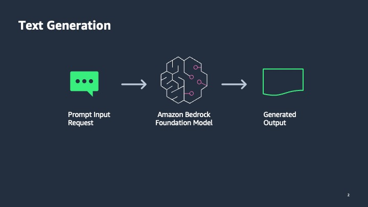

---
tags:
    - Use cases
    - API-Usage-Example
---
<!-- <h2> Invoke Bedrock model for text generation using zero-shot prompt</h2> -->

!!! tip inline end "[Open in github](https://github.com/aws-samples/amazon-bedrock-samples/blob/main//genai-use-cases/text-generation/how_to_work_with_text_generation_w_bedrock.ipynb){:target="_blank"}"

<h2>Overview</h2>

To demonstrate the text generation capability of Amazon Bedrock, we will explore the use of Boto3 client to communicate with Amazon Bedrock Converse API. We will demonstrate different configurations available as well as how simple input can lead to desired outputs.

<h2>Context</h2>

In this notebook we show you how to use a LLM to generate an email response to a customer who provided negative feedback on the quality of customer service that they received from the support engineer. 

We will use Bedrock's Amazon Titan Text large model using the Boto3 API. 

The prompt used in this example is called a zero-shot prompt because we are not providing any examples of text alongside their classification other than the prompt.

<h3>Pattern</h3>

We will simply provide the Amazon Bedrock API with an input consisting of a task, an instruction and an input for the model under the hood to generate an output without providing any additional example. The purpose here is to demonstrate how the powerful LLMs easily understand the task at hand and generate compelling outputs.



<h3>Use case</h3>

To demonstrate the generation capability of models in Amazon Bedrock, let's take the use case of email generation.

<h3>Implementation</h3>

To fulfill this use case, in this notebook we will show how to generate an email with a thank you note based on the customer's previous email.We will use the Amazon Titan Text Large model using the Amazon Bedrock API with Boto3 client.

<h2>Prerequisites</h2>

Before you can use Amazon Bedrock, you must carry out the following steps:

- Sign up for an AWS account (if you don't already have one) and IAM Role with the necessary permissions for Amazon Bedrock, see [AWS Account and IAM Role](https://docs.aws.amazon.com/bedrock/latest/userguide/getting-started.html#new-to-aws){:target="_blank"}.
- Request access to the foundation models (FM) that you want to use, see [Request access to FMs](https://docs.aws.amazon.com/bedrock/latest/userguide/getting-started.html#getting-started-model-access){:target="_blank"}. 

<h2>Setup</h2>

!!! info
    This notebook should work well with the Data Science 3.0 kernel (Python 3.10 runtime) in SageMaker Studio

Run the cells in this section to install the packages needed by this notebook.

```python
!pip3 install boto3 --quiet
```

```python
import json
import os
import sys

import boto3
import botocore


modelId = "amazon.titan-tg1-large"
region = 'us-east-1'

boto3_bedrock = boto3.client(
    service_name = 'bedrock-runtime',
    region_name = region,
    )
```


<h2>Generate text</h2>


Following on the use case explained above, let's prepare an input for the Amazon Bedrock service to generate an email.

```python
# create the prompt
prompt_data = """
Command: Write an email from Bob, Customer Service Manager, to the customer "John Doe" 
who provided negative feedback on the service provided by our customer support 
engineer
"""

```

Let's start by using the Amazon Titan Large model. The Amazon Titan family of models support a large context window of up to 32k tokens and accepts the following parameters:
- `messages`: Prompt to the LLM
- `inference_config`: These are the parameters that model will take into account while generating the output.


```python
# Base inference parameters.
inference_config = {
        "temperature": 0.1,
        "maxTokens": 4096,
        "topP": 0.95,
}


messages = [
        {
            "role": "user",
            "content": [{"text": prompt_data}]
        }
    ]
```

The Amazon Bedrock Converse API provides a consistent interface that works with all models that support messages. This allows you to write code once and use it with different models with an API .`converse`  accepts the following parameter in this example:
- `modelId`: This is the model ARN for the various foundation models available under Amazon Bedrock
- `inferenceConfig`: Inference parameters to pass to the model. Converse supports a base set of inference parameters.
- `messages`: A message consisting of the prompt 

Check [documentation](https://docs.aws.amazon.com/bedrock/latest/userguide/model-ids-arns.html) for Available text generation model Ids

<h3>Invoke the Amazon Titan Text language model</h3>

First, we explore how the model generates an output based on the prompt created earlier.

<h4>Complete Output Generation</h4>


```python

# Send the message.
try:
    response = boto3_bedrock.converse(
            modelId=modelId,
            messages=messages,
            inferenceConfig=inference_config,
    )
    outputText = response['output']['message']['content'][0]['text']
except botocore.exceptions.ClientError as error:
    
    if error.response['Error']['Code'] == 'AccessDeniedException':
           print(f"\x1b[41m{error.response['Error']['Message']}\
                \nTo troubeshoot this issue please refer to the following resources.\
                 \nhttps://docs.aws.amazon.com/IAM/latest/UserGuide/troubleshoot_access-denied.html\
                 \nhttps://docs.aws.amazon.com/bedrock/latest/userguide/security-iam.html\x1b[0m\n")
        
    else:
        raise error
```


```python
# The relevant portion of the response begins after the first newline character
# Below we print the response beginning after the first occurence of '\n'.

email = outputText[outputText.index('\n')+1:]
print(email)

```

<h4>Streaming Output Generation</h4>

Above is an example email generated by the Amazon Titan Large model by understanding the input request and using its inherent understanding of the different modalities. This request to the API is synchronous and waits for the entire output to be generated by the model.

Bedrock also supports that the output can be streamed as it is generated by the model in form of chunks. Below is an example of invoking the model with streaming option. `converse_stream` returns a `EventStream` which you can read from.

_You may want to enable scrolling on your output cell below:_ 


```python
output = []
try:
    response = boto3_bedrock.converse_stream(
            modelId=modelId,
            messages=messages,
            inferenceConfig=inference_config,
    )
    stream = response['stream']
    
    i = 1
    if stream:
        for event in stream:
            if 'contentBlockDelta' in event:
                streaming_text = event['contentBlockDelta']['delta']['text']
                output.append(event['contentBlockDelta']['delta']['text'])
                print(f'\t\t\x1b[31m**Chunk {i}**\x1b[0m\n{streaming_text}\n')
                i+=1
            
except botocore.exceptions.ClientError as error:
    
    if error.response['Error']['Code'] == 'AccessDeniedException':
           print(f"\x1b[41m{error.response['Error']['Message']}\
                \nTo troubeshoot this issue please refer to the following resources.\
                 \nhttps://docs.aws.amazon.com/IAM/latest/UserGuide/troubleshoot_access-denied.html\
                 \nhttps://docs.aws.amazon.com/bedrock/latest/userguide/security-iam.html\x1b[0m\n")
        
    else:
        raise error
```

The above helps to quickly get output of the model and let the service complete it as you read. This assists in use-cases where there are longer pieces of text that you request the model to generate. You can later combine all the chunks generated to form the complete output and use it for your use-case

<h2>Next Steps</h2>

You have now experimented with using `boto3` SDK which provides a vanilla exposure to Amazon Bedrock API. Using this API you have seen the use case of generating an email responding to a customer due to their negative feedback.


- Adapt this notebook to experiment with different models available through Amazon Bedrock such as Anthropic Claude and AI21 Labs Jurassic models.
- Change the prompts to your specific usecase and evaluate the output of different models.
- Play with the token length to understand the latency and responsiveness of the service.
- Apply different prompt engineering principles to get better outputs.

<h2>Cleanup</h2>

There is no clean up necessary for this notebook.
