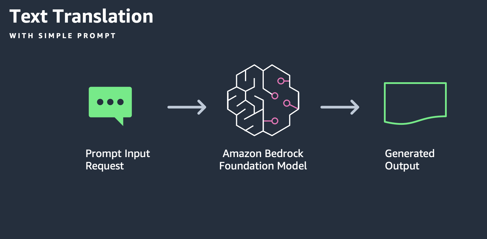

---
tags:
    - Use cases
    - API-Usage-Example
---
<!-- <h2> Invoke Bedrock model for text translation</h2> -->

!!! tip inline end "[Open in github](https://github.com/aws-samples/amazon-bedrock-samples/blob/main//genai-use-cases/text-generation/how_to_work_with_text_translation_w_bedrock.ipynb){:target="_blank"}"


<h2>Overview</h2>

To demonstrate the text translation capability of Amazon Bedrock, we will explore the use of Boto3 client to communicate with Amazon Bedrock Converse API. We will demonstrate different configurations available as well as how simple input can lead to desired outputs.


<h2>Context</h2>

In this notebook we demonstrate the use of Amazon Bedrock and Generative AI to translate text from a source to target language.


<h3>Pattern</h3>

We will simply provide the Amazon Bedrock API with an input consisting of a task, an instruction and an input for the model under the hood to generate translated output without providing any additional example. The purpose here is to demonstrate how the powerful LLMs easily understand the task at hand and generate compelling outputs.



<h3>Use case</h3>
To demonstrate the capability of translating text from a source to target language using models in Amazon Bedrock, let's consider the Multilingual Translation use case for seamless communication across languages in products, support, and content creation.

<h3> Persona</h3>
You are Bob, a Customer Service agent at AnyCompany, and some of your customers are not native English speakers. You would like to respond within chat, email, helpdesk, and ticketing applications to customers in their preferred language.
You need the help of an LLM to allow an English-speaking agent to communicate with customers across multiple languages.

<h3>Implementation</h3>
To fulfill this use case, in this notebook we will show how to translate text to a target language using the LLM model available in Amazon Bedrock using the Bedrock API with the Boto3 client.

<h2>Prerequisites</h2>

Before you can use Amazon Bedrock, you must carry out the following steps:

- Sign up for an AWS account (if you don't already have one) and IAM Role with the necessary permissions for Amazon Bedrock, see [AWS Account and IAM Role](https://docs.aws.amazon.com/bedrock/latest/userguide/getting-started.html#new-to-aws){:target="_blank"}.
- Request access to the foundation models (FM) that you want to use, see [Request access to FMs](https://docs.aws.amazon.com/bedrock/latest/userguide/getting-started.html#getting-started-model-access){:target="_blank"}. 

<h2>Setup</h2>

!!! info
    This notebook should work well with the Data Science 3.0 kernel (Python 3.10 runtime) in SageMaker Studio

Run the cells in this section to install the packages needed by this notebook.


```python
import json
import os
import sys

import boto3
import botocore

boto3_bedrock = boto3.client('bedrock-runtime')
#- use this for with profile
```

<h2>Translate text</h2>


Following on the use case explained above, let's prepare an input for  the Amazon Bedrock service translate text.


```python
# sample text
short_text = f"""Last week, I spoke about AI and regulation at the U.S. Capitol at an event that was attended by legislative and business leaders. I’m encouraged by the progress the open source community has made fending off regulations that would have stifled innovation. But opponents of open source are continuing to shift their arguments, with the latest worries centering on open source's impact on national security. I hope we’ll all keep protecting open source!

Based on my conversations with legislators, I’m encouraged by the progress the U.S. federal government has made getting a realistic grasp of AI’s risks. To be clear, guardrails are needed. But they should be applied to AI applications, not to general-purpose AI technology. """
```


<h3>Model specific prompts</h3>

While basic approach works, to achieve best results we recommend to customise your prompts for the particular model you will be using.
In this example we are using `anthropic.claude-3`, [prompt guide for which can be found here](https://docs.anthropic.com/claude/docs/introduction-to-prompt-design).

Here is the a more optimised prompt for Claude v3.


```python
#create the prompt to translate text
system_prompt = f"""    
    You are an expert linguist, specializing in translation from source language to target language.
    Steps:
    1. Carefully read and understand the meaning of the input text in the source language.
    2. Formulate a thoughtful and contextually appropriate response in the target language.
    3. Review the response to ensure it is accurate, fluent, and captures the intended meaning.

"""


prompt_template = """Respond to the given text  in the target language :{target_language} \n\n Text: {text}"""

prompt = prompt_template.format(target_language="French (fr)", text=short_text)


```


```python
# Base inference parameters.
inference_config = {
        "temperature": 0,
        "maxTokens": 4096,
        "topP": 0.5,
}

system_prompts = [
        {
            "text": system_prompt
        }
    ]
messages = [
        {
            "role": "user",
            "content": [{"text": prompt}]
        }
    ]
```


```python
MODEL_IDS = [
    "amazon.titan-tg1-large",
    "anthropic.claude-3-sonnet-20240229-v1:0"
]
```

The Amazon Bedrock Converse API provides a consistent interface that works with all models that support messages. This allows you to write code once and use it with different models with an API .`converse`  accepts the following parameter in this example:
- `modelId`: This is the model ARN for the various foundation models available under Amazon Bedrock
- `inferenceConfig`: Inference parameters to pass to the model. Converse supports a base set of inference parameters.
- `messages`: A message consisting of the prompt 

Check [documentation](https://docs.aws.amazon.com/bedrock/latest/userguide/model-ids-arns.html) for Available model Ids


```python
# Send the message.
response = boto3_bedrock.converse(
        modelId=MODEL_IDS[1],
        messages=messages,
        inferenceConfig=inference_config
)

response_body = response["output"]["message"]["content"][0]["text"]

print(f"Output text: {response_body}")
```

    Output text: Voici ma réponse en français (fr) :
    
    La semaine dernière, j'ai parlé de l'IA et de la réglementation au Capitole des États-Unis lors d'un événement auquel ont assisté des leaders législatifs et économiques. Je suis encouragé par les progrès réalisés par la communauté open source pour contrer les réglementations qui auraient étouffé l'innovation. Mais les opposants à l'open source continuent de faire évoluer leurs arguments, les dernières inquiétudes portant sur l'impact de l'open source sur la sécurité nationale. J'espère que nous continuerons tous à protéger l'open source !
    
    D'après mes conversations avec les législateurs, je suis encouragé par les progrès réalisés par le gouvernement fédéral américain pour avoir une compréhension réaliste des risques liés à l'IA. Pour être clair, des garde-fous sont nécessaires. Mais ils devraient s'appliquer aux applications d'IA, et non à la technologie d'IA à usage général.


<h2>Next Steps</h2>
You have now experimented with using `boto3` SDK which provides a vanilla exposure to Amazon Bedrock API. Using this API you have seen the use case of translating text to target language


- Adapt this notebook to experiment with different models available through Amazon Bedrock such as Anthropic Claude and AI21 Labs Jurassic models.
- Change the prompts to your specific usecase and evaluate the output of different models.
- Play with the token length to understand the latency and responsiveness of the service.
- Apply different prompt engineering principles to get better outputs.

<h2>Cleanup</h2>

There is no clean up necessary for this notebook.
