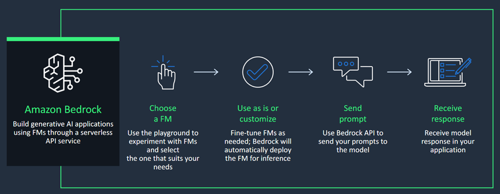
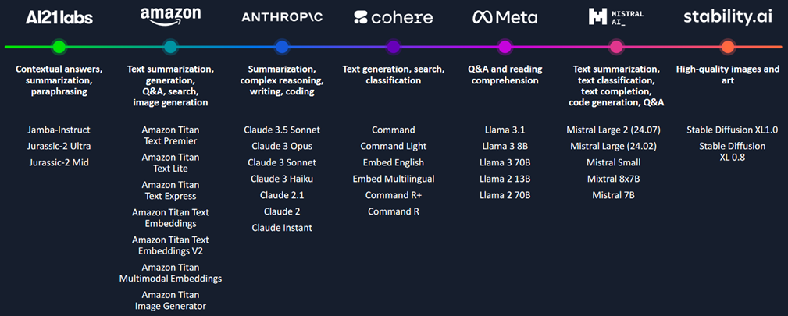

---
tags:
    - API-Usage-Example
---

<!-- <h2> How to work with Amazon Bedrock APIs - Getting Started </h2> -->

!!! tip inline end "[Open in github](https://github.com/aws-samples/amazon-bedrock-samples/tree/main/introduction-to-bedrock/bedrock_apis/01_invoke_api.ipynb){:target="_blank"}"

<h2>Overview</h2>

This notebook demonstrates how to get started with Amazon Bedrock. We will show you how to query different models from the Bedrock API call and how prompt engineering can help improving the results of your use case.

*The code presented here has been adapted from the [Amazon Bedrock Workshop Content](https://github.com/aws-samples/amazon-bedrock-workshop/tree/main){:target="_blank"}*

<h2>Context</h2>

Amazon Bedrock simplifies the process of building and scaling generative AI applications by providing access to high-performing foundation models (FMs) from leading AI companies through a single API.




Amazon Bedrock supports foundation models (FMs) from the following providers. For the updated list of FMs and respective documentation, see [Supported foundation models in Amazon Bedrock](https://docs.aws.amazon.com/bedrock/latest/userguide/models-supported.html){:target="_blank"}

To use a foundation model with the Amazon Bedrock API, you'll need its model ID. For a list for model IDs, see [Amazon Bedrock model IDs](https://docs.aws.amazon.com/bedrock/latest/userguide/model-ids.html){:target="_blank"}.



<h2>Prerequisites</h2>

Before you can use Amazon Bedrock, you must carry out the following steps:

- Sign up for an AWS account (if you don't already have one) and IAM Role with the necessary permissions for Amazon Bedrock, see [AWS Account and IAM Role](https://docs.aws.amazon.com/bedrock/latest/userguide/getting-started.html#new-to-aws){:target="_blank"}.
- Request access to the foundation models (FM) that you want to use, see [Request access to FMs](https://docs.aws.amazon.com/bedrock/latest/userguide/getting-started.html#getting-started-model-access){:target="_blank"}. 
    
    We have used below Foundation Models in our examples in this Notebook in `us-east-1` (N. Virginia) region.
    
| Provider Name | Foundation Model Name | Model Id |
| ------- | ------------- | ------------- |
| AI21 Labs | Jamba-Instruct | ai21.jamba-instruct-v1:0 |
| Amazon | Nova Lite | amazon.nova-lite-v1:0 |
| Anthropic | Claude 3.5 Sonnet  | anthropic.claude-3-5-sonnet-20240620-v1:0 |
| Cohere | Command | cohere.command-text-v14 |
| Meta | Llama 3 8B Instruct | meta.llama3-8b-instruct-v1:0 |
| Mistral AI | Mixtral 8X7B Instruct | mistral.mixtral-8x7b-instruct-v0:1 |
| Stability AI | Stable Diffusion XL | stability.stable-diffusion-xl-v1 |


<h2>Setup</h2>

!!! info
    This notebook should work well with the Data Science 3.0 kernel (Python 3.10 runtime) in SageMaker Studio

Run the cells in this section to install the packages needed by this notebook. 

```python
%pip install --no-build-isolation --force-reinstall \
    "boto3>=1.28.57" \
    "awscli>=1.29.57" \
    "botocore>=1.31.57"
```

<h2>Notebook/Code with comments</h2>

<h3>Create the boto3 client</h3>

Interaction with the Bedrock API is done via the AWS SDK. We will be using AWS SDK for Python: [boto3](https://boto3.amazonaws.com/v1/documentation/api/latest/index.html){:target="_blank"} for this notebook.

You can refer [Amazon Bedrock API references](https://docs.aws.amazon.com/bedrock/latest/APIReference/welcome.html#sdk){:target="_blank"} for each SDK.

<h4>Use different clients</h4>

- `bedrock` – Contains control plane APIs for managing, training, and deploying models. For more information, see [Amazon Bedrock Actions](https://docs.aws.amazon.com/bedrock/latest/APIReference/API_Operations_Amazon_Bedrock.html){:target="_blank"} and [Amazon Bedrock Data Types](https://docs.aws.amazon.com/bedrock/latest/APIReference/API_Types_Amazon_Bedrock.html){:target="_blank"}.
- `bedrock-runtime` – Contains data plane APIs for making inference requests for models hosted in Amazon Bedrock. For more information, see [Amazon Bedrock Runtime Actions](https://docs.aws.amazon.com/bedrock/latest/APIReference/API_Operations_Amazon_Bedrock_Runtime.html){:target="_blank"} and [Amazon Bedrock Runtime Data Types](https://docs.aws.amazon.com/bedrock/latest/APIReference/API_Types_Amazon_Bedrock_Runtime.html){:target="_blank"}.


In case of boto3, Control pane APIs such as [ListFoundationModels](https://docs.aws.amazon.com/bedrock/latest/APIReference/API_ListFoundationModels.html){:target="_blank"}, are supported by Amazon Bedrock client and data plane APIs such as [`InvokeModel`](https://docs.aws.amazon.com/bedrock/latest/APIReference/API_runtime_InvokeModel.html){:target="_blank"} and [`InvokeModelWithResponseStream`](https://docs.aws.amazon.com/bedrock/latest/APIReference/API_runtime_InvokeModelWithResponseStream.html){:target="_blank"} are supported by Amazon Bedrock Runtime client.

The `get_bedrock_client()` method accepts `runtime` (default=True) parameter to return either `bedrock` or `bedrock-runtime` client.

<h4>Use the default credential chain</h4>

If you are running this notebook from [Amazon Sagemaker Studio](https://aws.amazon.com/sagemaker/studio/){:target="_blank"} and your Sagemaker Studio [execution role](https://docs.aws.amazon.com/sagemaker/latest/dg/sagemaker-roles.html){:target="_blank"} has permissions to access Bedrock, then you can just run the cells below as-is. This is also the case if you are running these notebooks from a computer whose default AWS credentials have access to Bedrock.

<h4>Use a different AWS Region</h4>

If you're running this notebook from your own computer or a SageMaker notebook in a different AWS Region from where Bedrock is set up, you can un-comment the `os.environ['AWS_DEFAULT_REGION']` line below and specify the region to use.

<h4>Use a specific profile</h4>

In case you're running this notebook from your own computer where you have setup the AWS CLI with multiple profiles, and the profile which has access to Bedrock is not the default one, you can un-comment the `os.environ['AWS_PROFILE']` line below and specify the profile to use.

<h4>Use a different role</h4>

In case you or your company has setup a specific, separate [IAM Role](https://docs.aws.amazon.com/IAM/latest/UserGuide/id_roles.html){:target="_blank"} to access Bedrock, you can specify it by un-commenting the `os.environ['BEDROCK_ASSUME_ROLE']` line below. Ensure that your current user or role have permissions to [assume](https://docs.aws.amazon.com/STS/latest/APIReference/API_AssumeRole.html){:target="_blank"} such role.


```python
"""Helper utilities for working with Amazon Bedrock from Python notebooks"""
# Python Built-Ins:
import os
from typing import Optional
import sys
import json

# External Dependencies:
import boto3
from botocore.config import Config
import botocore

def get_bedrock_client(
    assumed_role: Optional[str] = None,
    region: Optional[str] = None,
    runtime: Optional[bool] = True,
):
    """Create a boto3 client for Amazon Bedrock, with optional configuration overrides

    Parameters
    ----------
    assumed_role :
        Optional ARN of an AWS IAM role to assume for calling the Bedrock service. If not
        specified, the current active credentials will be used.
    region :
        Optional name of the AWS Region in which the service should be called (e.g. "us-east-2").
        If not specified, AWS_REGION or AWS_DEFAULT_REGION environment variable will be used.
    runtime :
        Optional choice of getting different client to perform operations with the Amazon Bedrock service.
    """
    if region is None:
        target_region = os.environ.get("AWS_REGION", os.environ.get("AWS_DEFAULT_REGION"))
    else:
        target_region = region

    print(f"Create new client\n  Using region: {target_region}")
    session_kwargs = {"region_name": target_region}
    client_kwargs = {**session_kwargs}

    profile_name = os.environ.get("AWS_PROFILE")
    if profile_name:
        print(f"  Using profile: {profile_name}")
        session_kwargs["profile_name"] = profile_name

    retry_config = Config(
        region_name=target_region,
        retries={
            "max_attempts": 10,
            "mode": "standard",
        },
    )
    session = boto3.Session(**session_kwargs)

    if assumed_role:
        print(f"  Using role: {assumed_role}", end='')
        sts = session.client("sts")
        response = sts.assume_role(
            RoleArn=str(assumed_role),
            RoleSessionName="langchain-llm-1"
        )
        print(" ... successful!")
        client_kwargs["aws_access_key_id"] = response["Credentials"]["AccessKeyId"]
        client_kwargs["aws_secret_access_key"] = response["Credentials"]["SecretAccessKey"]
        client_kwargs["aws_session_token"] = response["Credentials"]["SessionToken"]

    if runtime:
        service_name='bedrock-runtime'
    else:
        service_name='bedrock'

    bedrock_client = session.client(
        service_name=service_name,
        config=retry_config,
        **client_kwargs
    )

    print("boto3 Bedrock client successfully created!")
    print(bedrock_client._endpoint)
    return bedrock_client
```


```python
module_path = ".."
sys.path.append(os.path.abspath(module_path))


# ---- ⚠️ Un-comment and edit the below lines as needed for your AWS setup ⚠️ ----

os.environ["AWS_DEFAULT_REGION"] = "us-east-1"
# os.environ["AWS_PROFILE"] = "<YOUR_PROFILE>"
# os.environ["BEDROCK_ASSUME_ROLE"] = "<YOUR_ROLE_ARN>"  # E.g. "arn:aws:..."


boto3_bedrock = get_bedrock_client(
    assumed_role=os.environ.get("BEDROCK_ASSUME_ROLE", None),
    region=os.environ.get("AWS_DEFAULT_REGION", None),
    runtime=False
)
```

<h4>Validate the connection</h4>

We can check the client works by trying out the `list_foundation_models()` method, which will tell us all the models available for us to use 


```python
boto3_bedrock.list_foundation_models()
```

<h3>`InvokeModel` body and output</h3>

The `invoke_model()` method of the Amazon Bedrock runtime client (`InvokeModel` API) will be the primary method we use for most of our Text Generation and Processing tasks - whichever model we're using.

Although the method is shared, the format of input and output varies depending on the foundation model used, see [Inference parameters for foundation models](https://docs.aws.amazon.com/bedrock/latest/userguide/model-parameters.html){:target="_blank"}

<h3> Common inference parameter definitions </h3>

<h4> Randomness and Diversity </h4>

Foundation models support the following parameters to control randomness and diversity in the 
response.

**Temperature** – Large language models use probability to construct the words in a sequence. For any 
given next word, there is a probability distribution of options for the next word in the sequence. When 
you set the temperature closer to zero, the model tends to select the higher-probability words. When 
you set the temperature further away from zero, the model may select a lower-probability word.

In technical terms, the temperature modulates the probability density function for the next tokens, 
implementing the temperature sampling technique. This parameter can deepen or flatten the density 
function curve. A lower value results in a steeper curve with more deterministic responses, and a higher 
value results in a flatter curve with more random responses.

**Top K** – Temperature defines the probability distribution of potential words, and Top K defines the cut 
off where the model no longer selects the words. For example, if K=50, the model selects from 50 of the 
most probable words that could be next in a given sequence. This reduces the probability that an unusual 
word gets selected next in a sequence.
In technical terms, Top K is the number of the highest-probability vocabulary tokens to keep for Top-
K-filtering - This limits the distribution of probable tokens, so the model chooses one of the highest-
probability tokens.

**Top P** – Top P defines a cut off based on the sum of probabilities of the potential choices. If you set Top 
P below 1.0, the model considers the most probable options and ignores less probable ones. Top P is 
similar to Top K, but instead of capping the number of choices, it caps choices based on the sum of their 
probabilities.
For the example prompt "I hear the hoof beats of ," you may want the model to provide "horses," 
"zebras" or "unicorns" as the next word. If you set the temperature to its maximum, without capping 
Top K or Top P, you increase the probability of getting unusual results such as "unicorns." If you set the 
temperature to 0, you increase the probability of "horses." If you set a high temperature and set Top K or 
Top P to the maximum, you increase the probability of "horses" or "zebras," and decrease the probability 
of "unicorns."

<h4> Length </h4>

The following parameters control the length of the generated response.

**Response length** – Configures the minimum and maximum number of tokens to use in the generated 
response.

**Length penalty** – Length penalty optimizes the model to be more concise in its output by penalizing 
longer responses. Length penalty differs from response length as the response length is a hard cut off for 
the minimum or maximum response length.

In technical terms, the length penalty penalizes the model exponentially for lengthy responses. 0.0 
means no penalty. Set a value less than 0.0 for the model to generate longer sequences, or set a value 
greater than 0.0 for the model to produce shorter sequences.

<h4> Repetitions </h4>

The following parameters help control repetition in the generated response.

**Repetition penalty (presence penalty)** – Prevents repetitions of the same words (tokens) in responses. 
1.0 means no penalty. Greater than 1.0 decreases repetition.


<h3> Try out the models </h3>

With some theory out of the way, let's see the models in action! Run the cells below to see basic, synchronous example invocations for each model:


```python
bedrock_runtime = get_bedrock_client(
    assumed_role=os.environ.get("BEDROCK_ASSUME_ROLE", None),
    region=os.environ.get("AWS_DEFAULT_REGION", None)
)

def invoke_model(body, model_id, accept, content_type):
    """
    Invokes Amazon bedrock model to run an inference
    using the input provided in the request body.
    
    Args:
        body (dict): The invokation body to send to bedrock
        model_id (str): the model to query
        accept (str): input accept type
        content_type (str): content type
    Returns:
        Inference response from the model.
    """

    try:
        response = bedrock_runtime.invoke_model(
            body=json.dumps(body), 
            modelId=model_id, 
            accept=accept, 
            contentType=content_type
        )

        return response

    except Exception as e:
        print(f"Couldn't invoke {model_id}")
        raise e
```

<h4>AI21 Labs Jamba </h4>


```python
# If you'd like to try your own prompt, edit this parameter!
prompt_data = """Command: Write me a blog about making strong business decisions as a leader.

Blog:
"""

body={"messages": [
            {
                "role": "user", 
                "content": prompt_data 
            }
         ],
        "max_tokens": 200,
    }

modelId = "ai21.jamba-instruct-v1:0"  # change this to use a different version from the model provider
accept = "application/json"
contentType = "application/json"

response = invoke_model(body, modelId, accept, contentType)
response_body = json.loads(response.get("body").read())

print(response_body.get("choices")[0].get("message").get("content"))
```

<h4> Amazon Nova </h4>


```python
# If you'd like to try your own prompt, edit this parameter!
prompt_data = """Command: Write me a blog about making strong business decisions as a leader.

Blog:
"""

# Define one or more messages using the "user" and "assistant" roles.
message_list = [{"role": "user", "content": [{"text": prompt_data}]}]

# Configure the inference parameters.
inf_params = {"max_new_tokens": 250, "top_p": 0.9, "top_k": 20, "temperature": 0.7}

body = {
    "schemaVersion": "messages-v1",
    "messages": message_list,
    "inferenceConfig": inf_params,
}

modelId = "amazon.nova-lite-v1:0"
accept = "application/json"
contentType = "application/json"

response = invoke_model(body, modelId, accept, contentType)
response_body = json.loads(response.get("body").read())

print(response_body.get("output").get("message").get("content")[0].get("text"))
```

<h4> Anthropic Claude </h4>


```python
# If you'd like to try your own prompt, edit this parameter!
prompt_data = """Human: Write me a blog about making strong business decisions as a leader.

Assistant:
"""

messages = [{"role": "user", "content": prompt_data}]

body={
        "anthropic_version": "bedrock-2023-05-31",
        "max_tokens": 250,
        "messages": messages
    }

modelId = "anthropic.claude-3-5-sonnet-20240620-v1:0"  # change this to use a different version from the model provider
accept = "application/json"
contentType = "application/json"

response = invoke_model(body, modelId, accept, contentType)
response_body = json.loads(response.get("body").read())

print(response_body.get("content")[0].get("text"))
```

<h4> Cohere </h4>


```python
# If you'd like to try your own prompt, edit this parameter!
prompt_data = """Command: Write me a blog about making strong business decisions as a leader.

Blog:
"""

body = {
    "prompt": prompt_data,
    "max_tokens": 200,
}

modelId = "cohere.command-text-v14" 
accept = "application/json"
contentType = "application/json"

response = invoke_model(body, modelId, accept, contentType)

response_body = json.loads(response.get('body').read())

print(response_body.get("generations")[0].get("text"))
```

<h4> Meta Llama </h4>


```python
# If you'd like to try your own prompt, edit this parameter!
prompt_data = """<s>[INST] <<SYS>>
You are a helpful, respectful and honest assistant. Always answer as helpfully as possible, while being safe.  Your answers should not include any harmful, unethical, racist, sexist, toxic, dangerous, or illegal content. Please ensure that your responses are socially unbiased and positive in nature.
If a question does not make any sense, or is not factually coherent, explain why instead of answering something not correct. If you don't know the answer to a question, please don't share false information.
<</SYS>>

Write me a blog about making strong business decisions as a leader. [/INST]"""

body = {
    "prompt": prompt_data,
    "temperature": 0.5,
    "top_p": 0.9,
    "max_gen_len": 512,
}

modelId = "meta.llama3-8b-instruct-v1:0"
accept = "application/json"
contentType = "application/json"

response = invoke_model(body, modelId, accept, contentType)
response_body = json.loads(response.get("body").read())

print(response_body["generation"])
```

<h4> Mistral Models </h4>


```python
# If you'd like to try your own prompt, edit this parameter!
prompt_data = """<s>[INST] <<SYS>>
You are a helpful, respectful and honest assistant. Always answer as helpfully as possible, while being safe.  Your answers should not include any harmful, unethical, racist, sexist, toxic, dangerous, or illegal content. Please ensure that your responses are socially unbiased and positive in nature.
If a question does not make any sense, or is not factually coherent, explain why instead of answering something not correct. If you don't know the answer to a question, please don't share false information.
<</SYS>>

Write me a blog about making strong business decisions as a leader. [/INST]"""

body = {
    "prompt": prompt_data,
    'max_tokens': 500,
	'top_p': 0.9,
	'temperature': 0.2
}

modelId = 'mistral.mixtral-8x7b-instruct-v0:1'
accept = 'application/json'
contentType = 'application/json'

response = invoke_model(body, modelId, accept, contentType)

response_body = json.loads(response.get("body").read())
print(response_body.get('outputs')[0].get('text'))
```

<h4> Stability Stable Diffusion XL </h4>


```python
# If you'd like to try your own prompt, edit this parameter!
prompt_data = "a landscape with trees"

body = {
    "text_prompts": [{"text": prompt_data}],
    "cfg_scale": 10,
    "seed": 20,
    "steps": 50
}
modelId = "stability.stable-diffusion-xl-v1"
accept = "application/json"
contentType = "application/json"


response = invoke_model(body, modelId, accept, contentType)
response_body = json.loads(response.get("body").read())

print(response_body["result"])
print(f'{response_body.get("artifacts")[0].get("base64")[0:80]}...')
```

!!! note
    The output is a [base64 encoded](https://docs.python.org/3/library/base64.html){:target="_blank"} string of the image data. You can use any image processing library (such as [Pillow](https://pillow.readthedocs.io/en/stable/){:target="_blank"}) to decode the image as in the example below:


```python
import base64
import io
from PIL import Image

base_64_img_str = response_body.get("artifacts")[0].get("base64")
image = Image.open(io.BytesIO(base64.decodebytes(bytes(base_64_img_str, "utf-8"))))
image
```

<h3> Generate streaming output </h3>

For large language models, it can take noticeable time to generate long output sequences. Rather than waiting for the entire response to be available, latency-sensitive applications may like to **stream** the response to users.

Run the code below to see how you can achieve this with Bedrock's `invoke_model_with_response_stream()` method - returning the response body in separate chunks.


```python
from IPython.display import clear_output, display, display_markdown, Markdown
from datetime import datetime

# If you'd like to try your own prompt, edit this parameter!
prompt_data = """Command: Write me a blog about making strong business decisions as a leader.

Blog:
"""

# Define one or more messages using the "user" and "assistant" roles.
message_list = [{"role": "user", "content": [{"text": prompt_data}]}]

# Configure the inference parameters.
inf_params = {"max_new_tokens": 250, "top_p": 0.9, "top_k": 20, "temperature": 0.7}

body = json.dumps({
    "schemaVersion": "messages-v1",
    "messages": message_list,
    "inferenceConfig": inf_params,
})

modelId = "amazon.nova-lite-v1:0"  # (Change this, and the request body, to try different models)
accept = "application/json"
contentType = "application/json"

start_time = datetime.now()

response = bedrock_runtime.invoke_model_with_response_stream(
    body=body, modelId=modelId, accept=accept, contentType=contentType
)
chunk_count = 0
time_to_first_token = None

# Process the response stream
stream = response.get("body")
if stream:
    for event in stream:
        chunk = event.get("chunk")
        if chunk:
            # Print the response chunk
            chunk_json = json.loads(chunk.get("bytes").decode())
            # Pretty print JSON
            # print(json.dumps(chunk_json, indent=2, ensure_ascii=False))
            content_block_delta = chunk_json.get("contentBlockDelta")
            if content_block_delta:
                if time_to_first_token is None:
                    time_to_first_token = datetime.now() - start_time
                    print(f"Time to first token: {time_to_first_token}")

                chunk_count += 1
                current_time = datetime.now().strftime("%Y-%m-%d %H:%M:%S:%f")
                # print(f"{current_time} - ", end="")
                print(content_block_delta.get("delta").get("text"), end="")
    print(f"Total chunks: {chunk_count}")
else:
    print("No response stream received.")
```

<h3> Prompt Engineering</h3> 

Prompt engineering is the practice of optimizing the quality and performance of your foundation model's response to your request. Prompt engineering may involve:

    Word choice
    Phrasing
    Providing examples (few-shot learning)
    Use of line breaks and content separators
    Following established formats that align with how the model was trained
    Use of stop sequences to help the model know when it should stop generating text

Communicating clearly

The art of prompt engineering is the art of communication. Large language models have been trained on a massive amount of written and transcribed human content. So just like when communicating with people, it's critical to communicate clearly with the models. Throughout these labs, you will see examples of varying levels of detail and clarity.


```python
prompt_data = """Human: Write an email from Bob, Customer Service Manager, 
to the customer "John Doe" that provided negative feedback on the service 
provided by our customer support engineer.

Assistant:
"""
messages = [{"role": "user", "content": prompt_data}]

body={
        "anthropic_version": "bedrock-2023-05-31",
        "max_tokens": 500,
        "messages": messages
    }

modelId = "anthropic.claude-3-5-sonnet-20240620-v1:0"  # change this to use a different version from the model provider
accept = "application/json"
contentType = "application/json"

response = invoke_model(body, modelId, accept, contentType)
response_body = json.loads(response.get("body").read())

print(response_body.get("content")[0].get("text"))
```


```python
prompt_data = """Human: Write an email from Bob, Customer Service Manager, 
to the customer "John Doe" that provided negative feedback on the service 
provided by our customer support engineer. Here is the feedback provided.
<customer_feedback>
Hello Bob,
     I am very disappointed with the recent experience I had when I called your customer support and spoke with Anna Bhasin.
     I was expecting an immediate call back but it took three days for us to get a call back.
     The first suggestion to fix the problem was incorrect. Ultimately the problem was fixed after three days.
     We are very unhappy with the response provided and may consider taking our business elsewhere.
</customer_feedback>

Assistant:
"""
messages = [{"role": "user", "content": prompt_data}]

body={
        "anthropic_version": "bedrock-2023-05-31",
        "max_tokens": 500,
        "messages": messages
    }

modelId = "anthropic.claude-3-5-sonnet-20240620-v1:0"  # change this to use a different version from the model provider
accept = "application/json"
contentType = "application/json"

response = invoke_model(body, modelId, accept, contentType)
response_body = json.loads(response.get("body").read())

print(response_body.get("content")[0].get("text"))
```

<h2>Next steps</h2>

Now that we have seen how to use Amazon Bedrock APIs, you can learn

- How to use [Amazon Bedrock Guardrails](02_guardrails_api.md)
- How to use [Amazon Bedrock Knowledge Bases](03_knowledgebases_api.md)
- How to use [Amazon Bedrock Agents](04_agents_api.md)
- Hot to use [Converse API in Amazon Bedrock - Getting Started](../converse_api/01_converse_api.md)

<h2>Clean up</h2>

This notebook does not require any cleanup or additional deletion of resources.
