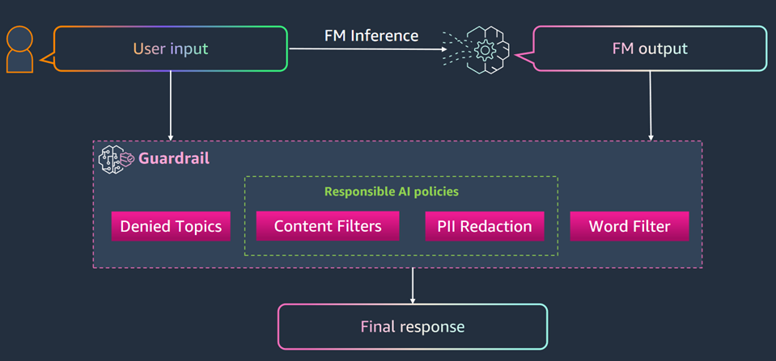

---
tags:
    - Responsible-AI/Guardrails
    - API-Usage-Example
---

<!-- <h2> How to work with Amazon Bedrock Guardrails</h2> -->

!!! tip inline end "[Open in github](https://github.com/aws-samples/amazon-bedrock-samples/tree/main/introduction-to-bedrock/bedrock_apis/02_guardrails_api.ipynb){:target="_blank"}"

<h2> Overview </h2>

This notebook demonstrates using Amazon Bedrock Guardrails by creating, updating and testing the Guardrail Policy config using Amazon Bedrock APIs. Guardrail evaluates user inputs and FM responses based on use case specific policies, and provides an additional layer of safeguards regardless of the underlying FM. Guardrails can be applied across all large language models (LLMs) on Amazon Bedrock, including fine-tuned models. Customers can create multiple guardrails, each configured with a different combination of controls, and use these guardrails across different applications and use cases. 

<h2> Context </h2>

Guardrails can be used to implement safeguards for your generative AI applications that are customized to your use cases and aligned with your responsible AI policies. Guardrails allows you to configure the following policies in a guardrail to avoid undesirable and harmful content and remove sensitive information for privacy protection.

- **Content filters** – Adjust filter strengths to block input prompts or model responses containing harmful content.
- **Denied topics** – Define a set of topics that are undesirable in the context of your application. These topics will be blocked if detected in user queries or model responses.
- **Word filters** – Configure filters to block undesirable words, phrases, and profanity. Such words can include offensive terms, competitor names etc.
- **Sensitive information filters** – Block or mask sensitive information such as personally identifiable information (PII) or custom regex in user inputs and model responses.
- **Contextual grounding check** – Detect and filter hallucinations in model responses based on grounding in a source and relevance to the user query.

For more information on publicly available capabilities:

- [Documentation](https://docs.aws.amazon.com/bedrock/latest/userguide/guardrails.html){:target="_blank"}
- [Guardrail Policies](https://docs.aws.amazon.com/bedrock/latest/userguide/guardrails-components.html){:target="_blank"}
- [Pricing](https://aws.amazon.com/bedrock/pricing/){:target="_blank"}
- [WebPage](https://aws.amazon.com/bedrock/guardrails/){:target="_blank"}

<h3> Architecture </h3>



<h2> Prerequisites </h2>

- Amazon Bedrock basic setup has been completed, see `Prerequisites` section under [Amazon Bedrock APIs - Getting Started](01_invoke_api.md)
- Amazon Bedrock access to below given Foundation Model used in this notebook, in `us-east-1` (N. Virginia) region.

| Provider Name | Foundation Model Name | Model Id |
| ------- | ------------- | ------------- |
| Anthropic | Claude 3 Haiku  | anthropic.claude-3-haiku-20240307-v1:0 |


<h2> Setup </h2>

!!! info
    This notebook should work well with the Data Science 3.0 kernel (Python 3.10 runtime) in SageMaker Studio


```python
#Start by installing the dependencies to ensure we have a recent version
!pip install --upgrade --force-reinstall boto3
import boto3
print(boto3.__version__)
```

<h2>Notebook/Code with comments</h2>

<h3> Creating a Guardrail </h3>

We will use `create_guardrail` API to create an example Guardrail `fiduciary-advice` by setting up the configurations, defining topics to deny, providing filters to handle harmful and sensitive content, and writing messages for when prompts and user responses are blocked. 


```python
region = 'us-east-1'
print('Using region: ', region)

client = boto3.client(
    service_name = 'bedrock',
    region_name = region,
    )

create_response = client.create_guardrail(
    name='fiduciary-advice',
    description='Prevents the our model from providing fiduciary advice.',
    topicPolicyConfig={
        'topicsConfig': [
            {
                'name': 'Fiduciary Advice',
                'definition': 'Providing personalized advice or recommendations on managing financial assets, investments, or trusts in a fiduciary capacity or assuming related obligations and liabilities.',
                'examples': [
                    'What stocks should I invest in for my retirement?',
                    'Is it a good idea to put my money in a mutual fund?',
                    'How should I allocate my 401(k) investments?',
                    'What type of trust fund should I set up for my children?',
                    'Should I hire a financial advisor to manage my investments?'
                ],
                'type': 'DENY'
            }
        ]
    },
    contentPolicyConfig={
        'filtersConfig': [
            {
                'type': 'SEXUAL',
                'inputStrength': 'HIGH',
                'outputStrength': 'HIGH'
            },
            {
                'type': 'VIOLENCE',
                'inputStrength': 'HIGH',
                'outputStrength': 'HIGH'
            },
            {
                'type': 'HATE',
                'inputStrength': 'HIGH',
                'outputStrength': 'HIGH'
            },
            {
                'type': 'INSULTS',
                'inputStrength': 'HIGH',
                'outputStrength': 'HIGH'
            },
            {
                'type': 'MISCONDUCT',
                'inputStrength': 'HIGH',
                'outputStrength': 'HIGH'
            },
            {
                'type': 'PROMPT_ATTACK',
                'inputStrength': 'HIGH',
                'outputStrength': 'NONE'
            }
        ]
    },
    wordPolicyConfig={
        'wordsConfig': [
            {'text': 'fiduciary advice'},
            {'text': 'investment recommendations'},
            {'text': 'stock picks'},
            {'text': 'financial planning guidance'},
            {'text': 'portfolio allocation advice'},
            {'text': 'retirement fund suggestions'},
            {'text': 'wealth management tips'},
            {'text': 'trust fund setup'},
            {'text': 'investment strategy'},
            {'text': 'financial advisor recommendations'}
        ],
        'managedWordListsConfig': [
            {'type': 'PROFANITY'}
        ]
    },
    sensitiveInformationPolicyConfig={
        'piiEntitiesConfig': [
            {'type': 'EMAIL', 'action': 'ANONYMIZE'},
            {'type': 'PHONE', 'action': 'ANONYMIZE'},
            {'type': 'NAME', 'action': 'ANONYMIZE'},
            {'type': 'US_SOCIAL_SECURITY_NUMBER', 'action': 'BLOCK'},
            {'type': 'US_BANK_ACCOUNT_NUMBER', 'action': 'BLOCK'},
            {'type': 'CREDIT_DEBIT_CARD_NUMBER', 'action': 'BLOCK'}
        ],
        'regexesConfig': [
            {
                'name': 'Account Number',
                'description': 'Matches account numbers in the format XXXXXX1234',
                'pattern': r'\b\d{6}\d{4}\b',
                'action': 'ANONYMIZE'
            }
        ]
    },
    contextualGroundingPolicyConfig={
        'filtersConfig': [
            {
                'type': 'GROUNDING',
                'threshold': 0.75
            },
            {
                'type': 'RELEVANCE',
                'threshold': 0.75
            }
        ]
    },
    blockedInputMessaging="""I can provide general info about Acme Financial's products and services, but can't fully address your request here. For personalized help or detailed questions, please contact our customer service team directly. For security reasons, avoid sharing sensitive information through this channel. If you have a general product question, feel free to ask without including personal details. """,
    blockedOutputsMessaging="""I can provide general info about Acme Financial's products and services, but can't fully address your request here. For personalized help or detailed questions, please contact our customer service team directly. For security reasons, avoid sharing sensitive information through this channel. If you have a general product question, feel free to ask without including personal details. """,
    tags=[
        {'key': 'purpose', 'value': 'fiduciary-advice-prevention'},
        {'key': 'environment', 'value': 'production'}
    ]
)

print(create_response)
```

<h3> Getting a Guardrail, creating a version and listing all the versions and Drafts </h3>

- The `working draft` is a version of the guardrail that you can continually edit and iterate upon until you reach a satisfactory configuration for your use case. 
- A version of the guardrail acts as a snapshot of the configurations of the `working draft` when you create the version. You can use versions to streamline guardrails deployment to production applications every time you make modifications to your guardrails.


```python
#This will provide all the data about the DRAFT version we have

get_response = client.get_guardrail(
    guardrailIdentifier=create_response['guardrailId'],
    guardrailVersion='DRAFT'
)

```


```python
# Now let's create a version for our Guardrail 

version_response = client.create_guardrail_version(
    guardrailIdentifier=create_response['guardrailId'],
    description='Version of Guardrail'
)
```


```python
# To list the DRAFT version of all your guardrails, don’t specify the guardrailIdentifier field. To list all versions of a guardrail, specify the ARN of the guardrail in the guardrailIdentifier field.

list_guardrails_response = client.list_guardrails(
    guardrailIdentifier=create_response['guardrailArn'],
    maxResults=5)

print(list_guardrails_response)
```

<h3> Updating a Guardrail  </h3>


Let's update the Guardrail using `update_guardrail` API by modifing one of our content filters (`HATE` to `MEDIUM`).


```python
# Updating the Guardrail by providing another adjusting our Content Filter strength 

response = client.update_guardrail(
    guardrailIdentifier=create_response['guardrailArn'],
    name='fiduciary-advice',
    description='Prevents the our model from providing fiduciary advice.',
    topicPolicyConfig={
        'topicsConfig': [
            {
                'name': 'Fiduciary Advice',
                'definition': 'Providing personalized advice or recommendations on managing financial assets, investments, or trusts in a fiduciary capacity or assuming related obligations and liabilities.',
                'examples': [
                    'What stocks should I invest in for my retirement?',
                    'Is it a good idea to put my money in a mutual fund?',
                    'How should I allocate my 401(k) investments?',
                    'What type of trust fund should I set up for my children?',
                    'Should I hire a financial advisor to manage my investments?'
                ],
                'type': 'DENY'
            }
        ]
    },
    contentPolicyConfig={
        'filtersConfig': [
            {
                'type': 'SEXUAL',
                'inputStrength': 'HIGH',
                'outputStrength': 'HIGH'
            },
            {
                'type': 'VIOLENCE',
                'inputStrength': 'HIGH',
                'outputStrength': 'HIGH'
            },
            {
                'type': 'HATE',
                'inputStrength': 'MEDIUM',
                'outputStrength': 'MEDIUM'
            },
            {
                'type': 'INSULTS',
                'inputStrength': 'HIGH',
                'outputStrength': 'HIGH'
            },
            {
                'type': 'MISCONDUCT',
                'inputStrength': 'HIGH',
                'outputStrength': 'HIGH'
            },
            {
                'type': 'PROMPT_ATTACK',
                'inputStrength': 'HIGH',
                'outputStrength': 'NONE'
            }
        ]
    },
    wordPolicyConfig={
        'wordsConfig': [
            {'text': 'fiduciary advice'},
            {'text': 'investment recommendations'},
            {'text': 'stock picks'},
            {'text': 'financial planning guidance'},
            {'text': 'portfolio allocation advice'},
            {'text': 'retirement fund suggestions'},
            {'text': 'wealth management tips'},
            {'text': 'trust fund setup'},
            {'text': 'investment strategy'},
            {'text': 'financial advisor recommendations'}
        ],
        'managedWordListsConfig': [
            {'type': 'PROFANITY'}
        ]
    },
    sensitiveInformationPolicyConfig={
        'piiEntitiesConfig': [
            {'type': 'EMAIL', 'action': 'ANONYMIZE'},
            {'type': 'PHONE', 'action': 'ANONYMIZE'},
            {'type': 'NAME', 'action': 'ANONYMIZE'},
            {'type': 'US_SOCIAL_SECURITY_NUMBER', 'action': 'BLOCK'},
            {'type': 'US_BANK_ACCOUNT_NUMBER', 'action': 'BLOCK'},
            {'type': 'CREDIT_DEBIT_CARD_NUMBER', 'action': 'BLOCK'}
        ],
        'regexesConfig': [
            {
                'name': 'Account Number',
                'description': 'Matches account numbers in the format XXXXXX1234',
                'pattern': r'\b\d{6}\d{4}\b',
                'action': 'ANONYMIZE'
            }
        ]
    },
    contextualGroundingPolicyConfig={
        'filtersConfig': [
            {
                'type': 'GROUNDING',
                'threshold': 0.75
            },
            {
                'type': 'RELEVANCE',
                'threshold': 0.75
            }
        ]
    },
    blockedInputMessaging="""I can provide general info about Acme Financial's products and services, but can't fully address your request here. For personalized help or detailed questions, please contact our customer service team directly. For security reasons, avoid sharing sensitive information through this channel. If you have a general product question, feel free to ask without including personal details. """,
    blockedOutputsMessaging="""I can provide general info about Acme Financial's products and services, but can't fully address your request here. For personalized help or detailed questions, please contact our customer service team directly. For security reasons, avoid sharing sensitive information through this channel. If you have a general product question, feel free to ask without including personal details. """,
)


```


```python
# Let's now get all of our updates 
get_response = client.get_guardrail(
    guardrailIdentifier=create_response['guardrailId'],
    guardrailVersion='DRAFT'
)
print(get_response)
```


```python
# Create a new Version from our updates 
version_response = client.create_guardrail_version(
    guardrailIdentifier=create_response['guardrailId'],
    description='Version of Guardrail that has a MEDIUM Hate Filter'
)
```


```python
# Get all of our Guardrails 
list_guardrails_response = client.list_guardrails(
    guardrailIdentifier=create_response['guardrailArn'],
    maxResults=5)

print(list_guardrails_response)
```

<h3> Testing our Guardrail  </h3>

We will test our Guardrails with Amazon Bedrock using `Anthropic Claude 3 Haiku` LLM Model and latest version of `fiduciary-advice` Guardrail configuration.


```python
#import the run-time client
import json
bedrock_runtime = boto3.client('bedrock-runtime', region_name = region)
```


```python
# Build our request to Bedrock, we will test our second version

payload = {
    "modelId": "anthropic.claude-3-haiku-20240307-v1:0",
    "contentType": "application/json",
    "accept": "application/json",
    "body": {
        "anthropic_version": "bedrock-2023-05-31",
        "max_tokens": 1000,
        "messages": [
            {
                "role": "user",
                "content": [
                    {
                        "type": "text",
                        "text": "How should I invest for my retirement? I want to be able to generate $5,000 a month"
                    }
                ]
            }
        ]
    }
}

# Convert the payload to bytes
body_bytes = json.dumps(payload['body']).encode('utf-8')

# Invoke the model
response = bedrock_runtime.invoke_model(
    body = body_bytes,
    contentType = payload['contentType'],
    accept = payload['accept'],
    modelId = payload['modelId'],
    guardrailIdentifier = create_response['guardrailId'], 
    guardrailVersion ="2", 
    trace = "ENABLED"
)

# Print the response
response_body = response['body'].read().decode('utf-8')
print(json.dumps(json.loads(response_body), indent=2))
```

<h2> Next steps </h2>

Now that we have seen how to use Amazon Bedrock Guardrails, you can learn

- How to use [Amazon Bedrock Knowledge Bases](03_knowledgebases_api.md)
- How to use [Amazon Bedrock Agents](04_agents_api.md)
- To further explore the capabilities of Amazon Bedrock Guardrails, refer [Responsible AI and Guardrails](https://github.com/aws-samples/amazon-bedrock-samples/tree/main/responsible_ai/){:target="_blank"}

<h2> Clean up </h2>

The next optional step is to delete Guardrail created in this notebook.


```python
guardrail_del_response = client.delete_guardrail(
    guardrailIdentifier=create_response['guardrailId']
)
```
