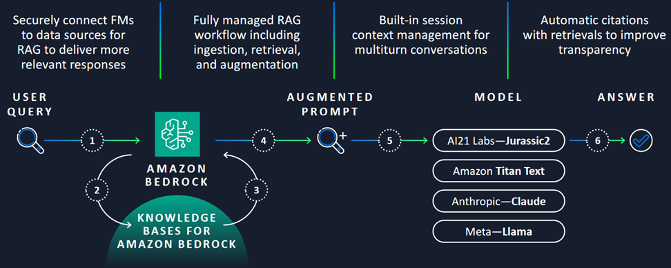

---
tags:
    - RAG/ Knowledge-Bases
    - API-Usage-Example
---

<!-- <h2> How to work with Amazon Bedrock Knowledge Bases</h2> -->

!!! tip inline end "[Open in github](https://github.com/aws-samples/amazon-bedrock-samples/tree/main/introduction-to-bedrock/bedrock_apis/03_knowledgebases_api.ipynb){:target="_blank"}"

<h2> Overview </h2>

This notebook demonstrates using Amazon Bedrock Knowledge Bases. It takes a use case of `chat with your document` capability, where you can securely ask questions on a single document, without the overhead of setting up a vector database or ingesting data, making it effortless for businesses to use their enterprise data. You only need to provide a relevant data file as input and choose your FM to get started.

For details around use cases and benefits, please refer to this [blogpost](https://aws.amazon.com/blogs/machine-learning/knowledge-bases-in-amazon-bedrock-now-simplifies-asking-questions-on-a-single-document/){:target="_blank"}.

<h2> Context </h2>

[Amazon Bedrock Knowledge Bases](https://docs.aws.amazon.com/bedrock/latest/userguide/knowledge-base.html){:target="_blank"} allows you to integrate proprietary information into your generative-AI applications. Using the Retrieval Augment Generation (RAG) technique, a knowledge base searches your data to find the most useful information and then uses it to answer natural language questions. Once set up, you can take advantage of a knowledge base in the following ways:

- Configure your RAG application to use the [RetrieveAndGenerate](https://docs.aws.amazon.com/bedrock/latest/APIReference/API_agent-runtime_RetrieveAndGenerate.html
){:target="_blank"} API to query your knowledge base and generate responses from the information it retrieves. You can also call the [Retrieve API](https://docs.aws.amazon.com/bedrock/latest/APIReference/API_agent-runtime_Retrieve.html){:target="_blank"} to query your knowledge base with information retrieved directly from the knowledge base.
- Associate your knowledge base with an agent (for more information, see [Amazon Bedrock Agents](https://docs.aws.amazon.com/bedrock/latest/userguide/agents.html){:target="_blank"}) to add RAG capability to the agent by helping it reason through the steps it can take to help end users.
- A knowledge base can be used not only to answer user queries, and analyze documents, but also to augment prompts provided to foundation models by providing context to the prompt. When answering user queries, the knowledge base retains conversation context. The knowledge base also grounds answers in citations so that users can find further information by looking up the exact text that a response is based on and also check that the response makes sense and is factually correct.

<h3> Architecture </h3>



<h2> Prerequisites </h2>

- Amazon Bedrock basic setup has been completed, see `Prerequisites` section under [Amazon Bedrock APIs - Getting Started](01_invoke_api.md)
- Amazon Bedrock access to below given Foundation Model used in this notebook in `us-east-1` (N. Virginia) region.

| Provider Name | Foundation Model Name | Model Id |
| ------- | ------------- | ------------- |
| Anthropic | Claude 3 Sonnet  | anthropic.claude-3-sonnet-20240229-v1:0 |


<h2> Setup </h2>

!!! info
    This notebook should work well with the Data Science 3.0 kernel (Python 3.10 runtime) in SageMaker Studio


```python
%pip install --upgrade pip
%pip install --upgrade boto3
%pip install --upgrade botocore
%pip install pypdf
```


```python
# restart kernel
from IPython.core.display import HTML
HTML("<script>Jupyter.notebook.kernel.restart()</script>")
```

Before we begin, lets check the boto3 version, make sure its equal to or greater than `1.34.94`


```python
import boto3
boto3.__version__
```

Initialize client for Amazon Bedrock for accessing the `RetrieveAndGenerate` API.


```python
import boto3
import pprint
from botocore.client import Config

pp = pprint.PrettyPrinter(indent=2)
region = "us-east-1"
bedrock_config = Config(connect_timeout=120, read_timeout=120, retries={'max_attempts': 0})

bedrock_agent_client = boto3.client("bedrock-agent-runtime",
                              region_name=region,
                              config=bedrock_config,
                                    )
model_id = "anthropic.claude-3-sonnet-20240229-v1:0"
```

For data, you can either upload the document you want to chat with or point to the Amazon Simple Storage Service (Amazon S3) bucket location that contains your file. We provide you with both options in the notebook. However in both cases, the supported file formats are PDF, MD (Markdown), TXT, DOCX, HTML, CSV, XLS, and XLSX. Make that the file size does not exceed 10 MB and contains no more than 20K tokens. A token is considered to be a unit of text, such as a word, sub-word, number, or symbol, that is processed as a single entity. Due to the preset ingestion token limit, it is recommended to use a file under 10MB. However, a text-heavy file, that is much smaller than 10MB, can potentially breach the token limit.

<h2>Notebook/Code with comments</h2>

<h3> Option 1 - Upload the document (default) </h3>

In our example, we will use a pdf file of Amazon Shareholder Letter for Year 2022.


```python
# load pdf
from pypdf import PdfReader
# creating a pdf reader object
file_name = "assets/2022-Shareholder-Letter.pdf" #path of the file on your local machine.
reader = PdfReader(file_name)
# printing number of pages in pdf file
print(len(reader.pages))
text = ""
page_count = 1
for page in reader.pages:
    text+= f"\npage_{str(page_count)}\n {page.extract_text()}"
print(text)
```

<h3> Option 2 - Point to S3 location of your file (Optional) </h3>

Make sure to replace the `bucket_name` and `prefix_file_name` to the location of your file, and you have required permissions to access the S3 file.


```python
bucket_name = "<replace with your bucket name>"
prefix_file_name = "<replace with the file name in your bucket>" #include prefixes if any alongwith the file name.
document_s3_uri = f's3://{bucket_name}/{prefix_file_name}'

```

<h3> RetreiveAndGenerate API for chatting with your document </h3>

The code in the below cell, defines a Python function called `retrieveAndGenerate` that takes two optional arguments: `input` (the input text) and `sourceType` (the type of source to use, defaulting to "S3"). It also sets a default value for the `model_id` parameter.

The function constructs an Amazon Resource Name (ARN) for the specified model using the `model_id` and the `REGION` variable.

If the `sourceType` is "S3", the function calls the `retrieve_and_generate` method of the `bedrock_agent_client` object, passing in the input text and a configuration for retrieving and generating from external sources. The configuration specifies that the source is an S3 location, and it provides the S3 URI of the document.

If the `sourceType` is not "S3", the function calls the same `retrieve_and_generate` method, but with a different configuration. In this case, the source is specified as byte content, which includes a file name, content type (application/pdf), and the actual text data.


```python
def retrieveAndGenerate(input, sourceType="S3", model_id = "anthropic.claude-3-sonnet-20240229-v1:0"):
    model_arn = f'arn:aws:bedrock:{region}::foundation-model/{model_id}'
    if sourceType=="S3":
        return bedrock_agent_client.retrieve_and_generate(
            input={
                'text': input
            },
            retrieveAndGenerateConfiguration={
                'type': 'EXTERNAL_SOURCES',
                'externalSourcesConfiguration': {
                    'modelArn': model_arn,
                    "sources": [
                        {
                            "sourceType": sourceType,
                            "s3Location": {
                                "uri": document_s3_uri
                            }
                        }
                    ]
                }
            }
        )
    else:
        return bedrock_agent_client.retrieve_and_generate(
            input={
                'text': input
            },
            retrieveAndGenerateConfiguration={
                'type': 'EXTERNAL_SOURCES',
                'externalSourcesConfiguration': {
                    'modelArn': model_arn,
                    "sources": [
                        {
                            "sourceType": sourceType,
                            "byteContent": {
                                "identifier": file_name,
                                "contentType": "application/pdf",
                                "data": text,
                                }
                        }
                    ]
                }
            }
        )
```

If you want to chat with the document by uploading the file use `sourceType` as `BYTE_CONTENT` and for pointing it to s3 bucket, use `sourceType` as `S3`.


```python
query = "Summarize the document"
response = retrieveAndGenerate(input=query, sourceType="BYTE_CONTENT")
generated_text = response['output']['text']
pp.pprint(generated_text)
```

<h3> Citations or source attributions </h3>

Lets retrieve the source attribution or citations for the above response.


```python
citations = response["citations"]
contexts = []
for citation in citations:
    retrievedReferences = citation["retrievedReferences"]
    for reference in retrievedReferences:
         contexts.append(reference["content"]["text"])

pp.pprint(contexts)
```

<h2> Next steps </h2>

Now that we have seen how to use Amazon Bedrock Knowledge Bases, you can learn

- How to use [Amazon Bedrock Agents](04_agents_api.md)
- How to use [Amazon Bedrock Guardrails](02_guardrails_api.md)
- To further explore the capabilities of Amazon Bedrock Knowledge Bases, refer [RAG and Knowledge Bases](https://github.com/aws-samples/amazon-bedrock-samples/tree/main/rag/knowledge-bases){:target="_blank"}


<h2>Clean up</h2>

This notebook does not require any cleanup or additional deletion of resources.
