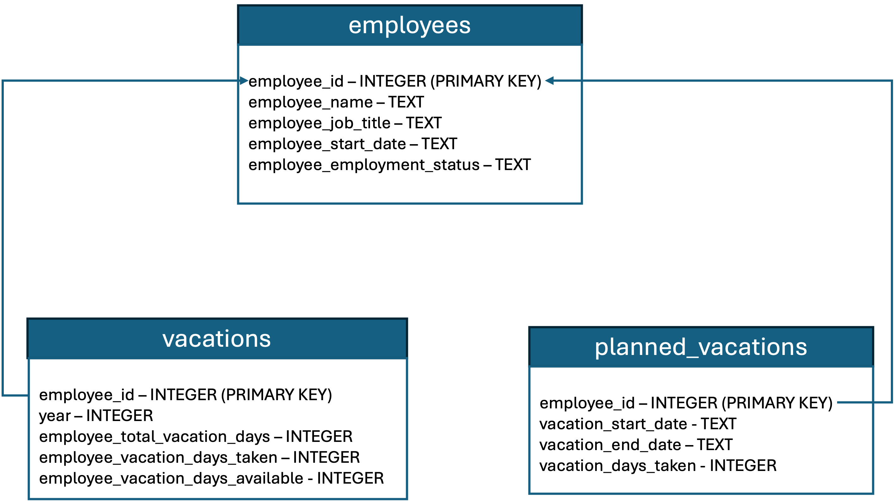

---
tags:
    - Agents/ Function Definition
    - API-Usage-Example
---

<!-- <h2> How to work with Amazon Bedrock Agents</h2> -->

!!! tip inline end "[Open in github](https://github.com/aws-samples/amazon-bedrock-samples/tree/main/introduction-to-bedrock/bedrock_apis/04_agents_api.ipynb){:target="_blank"}"

<h2> Overview </h2>

In this notebook, we will create an  Amazon Bedrock Agent using the function definition. We will use an HR agent as example. With this agent, you can check your available vacation days and request a new vacation leave. We will use an AWS Lambda function to define the logic that checks for the number of available vacation days and confirm new time off. 

For this example, we will manage employee data in an in-memory [SQLite](https://www.sqlite.org/){:target="_blank"} database and generate synthetic data for demonstrating the agent.

<h2> Context </h2>

[Amazon Bedrock Agents](https://aws.amazon.com/bedrock/agents/){:target="_blank"} helps you accelerate the development of GenAI applications by orchestrating multistep tasks. Agents uses the reasoning capability of foundation models (FMs) to break down user-requested tasks into steps. Amazon Bedrock Agents can perform the following tasks:
- Breakdown user requests into multiple smaller steps
- Collect additional information from a user through natural conversation
- Decide which APIs to call and provide the necessary parameters for calling the APIs
- Take actions to fulfill a customer's request calling provided APIs
- Augment performance and accuracy by querying integrated Knowledge Bases


An agent consists of the following components:

1. **Foundation model** – You choose a foundation model that the agent invokes to interpret user input and subsequent prompts in its orchestration process, and to generate responses and follow-up steps in its process
2. **Instructions** – You author instructions that describe what the agent is designed to do
   1. (Optional) With **Advanced Prompts** you can further customize instructions for the agent at every step of orchestration
   1. With customized **Lambda Parser** functions you can parse the output of each orchestration step

3. (Optional) **Action groups** – You define the actions that the agent should carry out by providing the available APIs with
   1. **Function Definition** where you specify functions and define parameters as JSON objects that will be associated to the action group invocation or,
   1. **API Schema** file that defines the APIs that the agent can invoke to carry out its tasks resources

   Additionally, you can define a Lambda function to execute API calls with the selected parameters

4. (Optional) **Knowledge bases** – Associate knowledge bases with an agent to allow it to retrieve context to augment response generation and input into orchestration steps


<h3> Architecture </h3>

The agent connects with an in-memory SQLite database that contains generated data about employee's available vacation days and planned time off. The architecture created is as following:


Where the vacation database has the following schema:



<h2> Prerequisites </h2>

- Amazon Bedrock basic setup has been completed, see `Prerequisites` section under [Amazon Bedrock APIs - Getting Started](01_invoke_api.md)
- Amazon Bedrock access to below given Foundation Model used in this notebook in `us-east-1` (N. Virginia) region.

| Provider Name | Foundation Model Name | Model Id |
| ------- | ------------- | ------------- |
| Anthropic | Claude 3 Sonnet  | anthropic.claude-3-sonnet-20240229-v1:0 |


<h2> Setup </h2>

!!! info
    This notebook should work well with the Data Science 3.0 kernel (Python 3.10 runtime) in SageMaker Studio

Before starting, let's update the botocore and boto3 packages to ensure we have the latest version


```python
!python3 -m pip install --upgrade -q botocore
!python3 -m pip install --upgrade -q boto3
!python3 -m pip install --upgrade -q awscli
```

Let's now check the boto3 version to ensure the correct version has been installed. Your version should be greater than or equal to 1.34.90.


```python
import boto3
import json
import time
import zipfile
from io import BytesIO
import uuid
import pprint
import logging
print(boto3.__version__)
```


```python
# setting logger
logging.basicConfig(format='[%(asctime)s] p%(process)s {%(filename)s:%(lineno)d} %(levelname)s - %(message)s', level=logging.INFO)
logger = logging.getLogger(__name__)
```

Let's now create the boto3 clients for the required AWS services


```python
region = "us-east-1"

# getting boto3 clients for required AWS services
sts_client = boto3.client('sts', region_name = region)
iam_client = boto3.client('iam', region_name = region)
lambda_client = boto3.client('lambda', region_name = region)
bedrock_agent_client = boto3.client('bedrock-agent', region_name = region)
bedrock_agent_runtime_client = boto3.client('bedrock-agent-runtime', region_name = region)
```

Next we can set some configuration variables for the agent and for the lambda function being created


```python
account_id = sts_client.get_caller_identity()["Account"]
region, account_id
```


```python
# configuration variables
suffix = f"{region}-{account_id}"
agent_name = "hr-assistant-function-def"
agent_bedrock_allow_policy_name = f"{agent_name}-ba-{suffix}"
agent_role_name = f'AmazonBedrockExecutionRoleForAgents_{agent_name}'
agent_foundation_model = "anthropic.claude-3-sonnet-20240229-v1:0"
agent_description = "Agent for providing HR assistance to manage vacation time"
agent_instruction = "You are an HR agent, helping employees understand HR policies and manage vacation time"
agent_action_group_name = "VacationsActionGroup"
agent_action_group_description = "Actions for getting the number of available vactions days for an employee and confirm new time off"
agent_alias_name = f"{agent_name}-alias"
lambda_function_role = f'{agent_name}-lambda-role-{suffix}'
lambda_function_name = f'{agent_name}-{suffix}'
```

<h2>Notebook/Code with comments</h2>

<h3> Creating Lambda Function </h3>

We will now create a lambda function that interacts with the SQLite file `employee_database.db`. To do so we will:
1. Create the `employee_database.db` file which contains the employee database with some generated data.
2. Create the `lambda_function.py` file which contains the logic for our lambda function
3. Create the IAM role for our Lambda function
4. Create the lambda function infrastructure with the required permissions


```python
# creating employee database to be used by lambda function
import sqlite3
import random
from datetime import date, timedelta

# Connect to the SQLite database (creates a new one if it doesn't exist)
conn = sqlite3.connect('employee_database.db')
c = conn.cursor()

# Create the employees table
c.execute('''CREATE TABLE IF NOT EXISTS employees
                (employee_id INTEGER PRIMARY KEY AUTOINCREMENT, employee_name TEXT, employee_job_title TEXT, employee_start_date TEXT, employee_employment_status TEXT)''')

# Create the vacations table
c.execute('''CREATE TABLE IF NOT EXISTS vacations
                (employee_id INTEGER, year INTEGER, employee_total_vacation_days INTEGER, employee_vacation_days_taken INTEGER, employee_vacation_days_available INTEGER, FOREIGN KEY(employee_id) REFERENCES employees(employee_id))''')

# Create the planned_vacations table
c.execute('''CREATE TABLE IF NOT EXISTS planned_vacations
                (employee_id INTEGER, vacation_start_date TEXT, vacation_end_date TEXT, vacation_days_taken INTEGER, FOREIGN KEY(employee_id) REFERENCES employees(employee_id))''')

# Generate some random data for 10 employees
employee_names = ['John Doe', 'Jane Smith', 'Bob Johnson', 'Alice Williams', 'Tom Brown', 'Emily Davis', 'Michael Wilson', 'Sarah Taylor', 'David Anderson', 'Jessica Thompson']
job_titles = ['Manager', 'Developer', 'Designer', 'Analyst', 'Accountant', 'Sales Representative']
employment_statuses = ['Active', 'Inactive']

for i in range(10):
    name = employee_names[i]
    job_title = random.choice(job_titles)
    start_date = date(2015 + random.randint(0, 7), random.randint(1, 12), random.randint(1, 28)).strftime('%Y-%m-%d')
    employment_status = random.choice(employment_statuses)
    c.execute("INSERT INTO employees (employee_name, employee_job_title, employee_start_date, employee_employment_status) VALUES (?, ?, ?, ?)", (name, job_title, start_date, employment_status))
    employee_id = c.lastrowid

    # Generate vacation data for the current employee
    for year in range(date.today().year, date.today().year - 3, -1):
        total_vacation_days = random.randint(10, 30)
        days_taken = random.randint(0, total_vacation_days)
        days_available = total_vacation_days - days_taken
        c.execute("INSERT INTO vacations (employee_id, year, employee_total_vacation_days, employee_vacation_days_taken, employee_vacation_days_available) VALUES (?, ?, ?, ?, ?)", (employee_id, year, total_vacation_days, days_taken, days_available))

        # Generate some planned vacations for the current employee and year
        num_planned_vacations = random.randint(0, 3)
        for _ in range(num_planned_vacations):
            start_date = date(year, random.randint(1, 12), random.randint(1, 28)).strftime('%Y-%m-%d')
            end_date = (date(int(start_date[:4]), int(start_date[5:7]), int(start_date[8:])) + timedelta(days=random.randint(1, 14))).strftime('%Y-%m-%d')
            days_taken = (date(int(end_date[:4]), int(end_date[5:7]), int(end_date[8:])) - date(int(start_date[:4]), int(start_date[5:7]), int(start_date[8:])))
            c.execute("INSERT INTO planned_vacations (employee_id, vacation_start_date, vacation_end_date, vacation_days_taken) VALUES (?, ?, ?, ?)", (employee_id, start_date, end_date, days_taken.days))

# Commit the changes and close the connection
conn.commit()
conn.close()
```

Let's now create our lambda function. It implements the functionality for `get_available_vacations_days` for a given employee_id and `book_vacations` for an employee giving a start and end date


```python
%%writefile lambda_function.py
import os
import json
import shutil
import sqlite3
from datetime import datetime

def get_available_vacations_days(employee_id):
    # Connect to the SQLite database
    conn = sqlite3.connect('/tmp/employee_database.db')
    c = conn.cursor()

    if employee_id:

        # Fetch the available vacation days for the employee
        c.execute("""
            SELECT employee_vacation_days_available
            FROM vacations
            WHERE employee_id = ?
            ORDER BY year DESC
            LIMIT 1
        """, (employee_id,))

        available_vacation_days = c.fetchone()

        if available_vacation_days:
            available_vacation_days = available_vacation_days[0]  # Unpack the tuple
            print(f"Available vacation days for employed_id {employee_id}: {available_vacation_days}")
            conn.close()
            return available_vacation_days
        else:
            return_msg = f"No vacation data found for employed_id {employee_id}"
            print(return_msg)
            return return_msg
            conn.close()
    else:
        raise Exception(f"No employeed id provided")

    # Close the database connection
    conn.close()
    
    
def reserve_vacation_time(employee_id, start_date, end_date):
    # Connect to the SQLite database

    conn = sqlite3.connect('/tmp/employee_database.db')
    c = conn.cursor()
    try:
        # Calculate the number of vacation days
        start_date = datetime.strptime(start_date, '%Y-%m-%d')
        end_date = datetime.strptime(end_date, '%Y-%m-%d')
        vacation_days = (end_date - start_date).days + 1

        # Get the current year
        current_year = start_date.year

        # Check if the employee exists
        c.execute("SELECT * FROM employees WHERE employee_id = ?", (employee_id,))
        employee = c.fetchone()
        if employee is None:
            return_msg = f"Employee with ID {employee_id} does not exist."
            print(return_msg)
            conn.close()
            return return_msg

        # Check if the vacation days are available for the employee in the current year
        c.execute("SELECT employee_vacation_days_available FROM vacations WHERE employee_id = ? AND year = ?", (employee_id, current_year))
        available_days = c.fetchone()
        if available_days is None or available_days[0] < vacation_days:
            return_msg = f"Employee with ID {employee_id} does not have enough vacation days available for the requested period."
            print(return_msg)
            conn.close()
            return return_msg

        # Insert the new vacation into the planned_vacations table
        c.execute("INSERT INTO planned_vacations (employee_id, vacation_start_date, vacation_end_date, vacation_days_taken) VALUES (?, ?, ?, ?)", (employee_id, start_date, end_date, vacation_days))

        # Update the vacations table with the new vacation days taken
        c.execute("UPDATE vacations SET employee_vacation_days_taken = employee_vacation_days_taken + ?, employee_vacation_days_available = employee_vacation_days_available - ? WHERE employee_id = ? AND year = ?", (vacation_days, vacation_days, employee_id, current_year))

        conn.commit()
        print(f"Vacation saved successfully for employee with ID {employee_id} from {start_date} to {end_date}.")
        # Close the database connection
        conn.close()
        return f"Vacation saved successfully for employee with ID {employee_id} from {start_date} to {end_date}."
    except Exception as e:
        raise Exception(f"Error occurred: {e}")
        conn.rollback()
        # Close the database connection
        conn.close()
        return f"Error occurred: {e}"
        

def lambda_handler(event, context):
    original_db_file = 'employee_database.db'
    target_db_file = '/tmp/employee_database.db'
    if not os.path.exists(target_db_file):
        shutil.copy2(original_db_file, target_db_file)
    
    agent = event['agent']
    actionGroup = event['actionGroup']
    function = event['function']
    parameters = event.get('parameters', [])
    responseBody =  {
        "TEXT": {
            "body": "Error, no function was called"
        }
    }


    
    if function == 'get_available_vacations_days':
        employee_id = None
        for param in parameters:
            if param["name"] == "employee_id":
                employee_id = param["value"]

        if not employee_id:
            raise Exception("Missing mandatory parameter: employee_id")
        vacation_days = get_available_vacations_days(employee_id)
        responseBody =  {
            'TEXT': {
                "body": f"available vacation days for employed_id {employee_id}: {vacation_days}"
            }
        }
    elif function == 'reserve_vacation_time':
        employee_id = None
        start_date = None
        end_date = None
        for param in parameters:
            if param["name"] == "employee_id":
                employee_id = param["value"]
            if param["name"] == "start_date":
                start_date = param["value"]
            if param["name"] == "end_date":
                end_date = param["value"]
            
        if not employee_id:
            raise Exception("Missing mandatory parameter: employee_id")
        if not start_date:
            raise Exception("Missing mandatory parameter: start_date")
        if not end_date:
            raise Exception("Missing mandatory parameter: end_date")
        
        completion_message = reserve_vacation_time(employee_id, start_date, end_date)
        responseBody =  {
            'TEXT': {
                "body": completion_message
            }
        }  
    action_response = {
        'actionGroup': actionGroup,
        'function': function,
        'functionResponse': {
            'responseBody': responseBody
        }

    }

    function_response = {'response': action_response, 'messageVersion': event['messageVersion']}
    print("Response: {}".format(function_response))

    return function_response

```

Next let's create the lambda IAM role and policy to invoke a Bedrock model


```python
# Create IAM Role for the Lambda function
try:
    assume_role_policy_document = {
        "Version": "2012-10-17",
        "Statement": [
            {
                "Effect": "Allow",
                "Action": "bedrock:InvokeModel",
                "Principal": {
                    "Service": "lambda.amazonaws.com"
                },
                "Action": "sts:AssumeRole"
            }
        ]
    }

    assume_role_policy_document_json = json.dumps(assume_role_policy_document)

    lambda_iam_role = iam_client.create_role(
        RoleName=lambda_function_role,
        AssumeRolePolicyDocument=assume_role_policy_document_json
    )

    # Pause to make sure role is created
    time.sleep(10)
except:
    lambda_iam_role = iam_client.get_role(RoleName=lambda_function_role)

iam_client.attach_role_policy(
    RoleName=lambda_function_role,
    PolicyArn='arn:aws:iam::aws:policy/service-role/AWSLambdaBasicExecutionRole'
)
```

We can now package the lambda function to a Zip file and create the lambda function using boto3


```python
# Package up the lambda function code
s = BytesIO()
z = zipfile.ZipFile(s, 'w')
z.write("lambda_function.py")
z.write("employee_database.db")
z.close()
zip_content = s.getvalue()

# Create Lambda Function
lambda_function = lambda_client.create_function(
    FunctionName=lambda_function_name,
    Runtime='python3.12',
    Timeout=180,
    Role=lambda_iam_role['Role']['Arn'],
    Code={'ZipFile': zip_content},
    Handler='lambda_function.lambda_handler'
)
```

<h3> Create Agent </h3>

We will now create the agent. To do so, we first need to create the agent policies that allow bedrock model invocation for a specific foundation model and the agent IAM role with the policy associated to it. 


```python
# Create IAM policies for agent
bedrock_agent_bedrock_allow_policy_statement = {
    "Version": "2012-10-17",
    "Statement": [
        {
            "Sid": "AmazonBedrockAgentBedrockFoundationModelPolicy",
            "Effect": "Allow",
            "Action": "bedrock:InvokeModel",
            "Resource": [
                f"arn:aws:bedrock:{region}::foundation-model/{agent_foundation_model}"
            ]
        }
    ]
}

bedrock_policy_json = json.dumps(bedrock_agent_bedrock_allow_policy_statement)

agent_bedrock_policy = iam_client.create_policy(
    PolicyName=agent_bedrock_allow_policy_name,
    PolicyDocument=bedrock_policy_json
)


```


```python
# Create IAM Role for the agent and attach IAM policies
assume_role_policy_document = {
    "Version": "2012-10-17",
    "Statement": [{
          "Effect": "Allow",
          "Principal": {
            "Service": "bedrock.amazonaws.com"
          },
          "Action": "sts:AssumeRole"
    }]
}

assume_role_policy_document_json = json.dumps(assume_role_policy_document)
agent_role = iam_client.create_role(
    RoleName=agent_role_name,
    AssumeRolePolicyDocument=assume_role_policy_document_json
)

# Pause to make sure role is created
time.sleep(10)
    
iam_client.attach_role_policy(
    RoleName=agent_role_name,
    PolicyArn=agent_bedrock_policy['Policy']['Arn']
)
```

<h3> Creating the agent </h3>

Once the needed IAM role is created, we can use the Bedrock Agent client to create a new agent. To do so we use the `create_agent` function. It requires an agent name, underlying foundation model and instructions. You can also provide an agent description. Note that the agent created is not yet prepared. Later, we will prepare and use the agent.


```python
response = bedrock_agent_client.create_agent(
    agentName=agent_name,
    agentResourceRoleArn=agent_role['Role']['Arn'],
    description=agent_description,
    idleSessionTTLInSeconds=1800,
    foundationModel=agent_foundation_model,
    instruction=agent_instruction,
)
response
```

Let's now store the agent id in a local variable to use it on subsequent steps.


```python
agent_id = response['agent']['agentId']
agent_id
```

<h3> Create Agent Action Group </h3>

We will now create an agent action group that uses the lambda function created earlier. The [`create_agent_action_group`](https://boto3.amazonaws.com/v1/documentation/api/latest/reference/services/bedrock-agent/client/create_agent_action_group.html){:target="_blank"} function provides this functionality. We will use `DRAFT` as the agent version since we haven't yet created an agent version or alias. To inform the agent about the action group capabilities, we provide an action group description.

In this example, we provide the Action Group functionality using a `functionSchema`. You can alternatively provide an `APISchema`. The notebook [02-create-agent-with-api-schema.ipynb](https://github.com/aws-samples/amazon-bedrock-samples/blob/main/agents-and-function-calling/bedrock-agents/features-examples/02-create-agent-with-api-schema/02-create-agent-with-api-schema.ipynb){:target="_blank"} provides an example of that approach.

To define the functions using a function schema, you need to provide the `name`, `description` and `parameters` for each function.


```python
agent_functions = [
    {
        'name': 'get_available_vacations_days',
        'description': 'get the number of vacations available for a certain employee',
        'parameters': {
            "employee_id": {
                "description": "the id of the employee to get the available vacations",
                "required": True,
                "type": "integer"
            }
        }
    },
    {
        'name': 'reserve_vacation_time',
        'description': 'reserve vacation time for a specific employee - you need all parameters to reserve vacation time',
        'parameters': {
            "employee_id": {
                "description": "the id of the employee for which time off will be reserved",
                "required": True,
                "type": "integer"
            },
            "start_date": {
                "description": "the start date for the vacation time",
                "required": True,
                "type": "string"
            },
            "end_date": {
                "description": "the end date for the vacation time",
                "required": True,
                "type": "string"
            }
        }
    },
]
```


```python
# Pause to make sure agent is created
time.sleep(30)
# Now, we can configure and create an action group here:
agent_action_group_response = bedrock_agent_client.create_agent_action_group(
    agentId=agent_id,
    agentVersion='DRAFT',
    actionGroupExecutor={
        'lambda': lambda_function['FunctionArn']
    },
    actionGroupName=agent_action_group_name,
    functionSchema={
        'functions': agent_functions
    },
    description=agent_action_group_description
)
```


```python
agent_action_group_response
```

<h3>Allowing Agent to invoke Action Group Lambda</h3>


Before using the action group, we need to allow the agent to invoke the lambda function associated with the action group. This is done via resource-based policy. Let's add the resource-based policy to the lambda function created


```python
# Create allow invoke permission on lambda
response = lambda_client.add_permission(
    FunctionName=lambda_function_name,
    StatementId='allow_bedrock',
    Action='lambda:InvokeFunction',
    Principal='bedrock.amazonaws.com',
    SourceArn=f"arn:aws:bedrock:{region}:{account_id}:agent/{agent_id}",
)

```


```python
response
```

<h3>Preparing Agent</h3>

Let's create a DRAFT version of the agent that can be used for internal testing.


```python
response = bedrock_agent_client.prepare_agent(
    agentId=agent_id
)
print(response)
```


```python
# Pause to make sure agent is prepared
time.sleep(30)

# Extract the agentAliasId from the response
agent_alias_id = "TSTALIASID"
```

<h3>Invoke Agent</h3>

Now that we've created the agent, let's use the `bedrock-agent-runtime` client to invoke this agent and perform some tasks.


```python
## create a random id for session initiator id
session_id:str = str(uuid.uuid1())
enable_trace:bool = False
end_session:bool = False

# invoke the agent API
agentResponse = bedrock_agent_runtime_client.invoke_agent(
    inputText="How much vacation does employee_id 1 have available?",
    agentId=agent_id,
    agentAliasId=agent_alias_id, 
    sessionId=session_id,
    enableTrace=enable_trace, 
    endSession= end_session
)

logger.info(pprint.pprint(agentResponse))
```


```python
%%time
event_stream = agentResponse['completion']
try:
    for event in event_stream:        
        if 'chunk' in event:
            data = event['chunk']['bytes']
            logger.info(f"Final answer ->\n{data.decode('utf8')}")
            agent_answer = data.decode('utf8')
            end_event_received = True
            # End event indicates that the request finished successfully
        elif 'trace' in event:
            logger.info(json.dumps(event['trace'], indent=2))
        else:
            raise Exception("unexpected event.", event)
except Exception as e:
    raise Exception("unexpected event.", e)
```


```python
# And here is the response if you just want to see agent's reply
print(agent_answer)
```


```python
agentResponse = bedrock_agent_runtime_client.invoke_agent(
    inputText="great. please reserve one day of time off, June 1 2024",
    agentId=agent_id,
    agentAliasId=agent_alias_id, 
    sessionId=session_id,
    enableTrace=enable_trace, 
    endSession= end_session
)

logger.info(pprint.pprint(agentResponse))
```


```python
%%time
event_stream = agentResponse['completion']
try:
    for event in event_stream:        
        if 'chunk' in event:
            data = event['chunk']['bytes']
            logger.info(f"Final answer ->\n{data.decode('utf8')}")
            agent_answer = data.decode('utf8')
            end_event_received = True
            # End event indicates that the request finished successfully
        elif 'trace' in event:
            logger.info(json.dumps(event['trace'], indent=2))
        else:
            raise Exception("unexpected event.", event)
except Exception as e:
    raise Exception("unexpected event.", e)
```


```python
agentResponse = bedrock_agent_runtime_client.invoke_agent(
    inputText="now let me take the last 3 months of the year off as vacation, from Oct 1 2024 through Dec 31 2024",
    agentId=agent_id,
    agentAliasId=agent_alias_id, 
    sessionId=session_id,
    enableTrace=enable_trace, 
    endSession= end_session
)

logger.info(pprint.pprint(agentResponse))
```


```python
%%time
event_stream = agentResponse['completion']
try:
    for event in event_stream:        
        if 'chunk' in event:
            data = event['chunk']['bytes']
            logger.info(f"Final answer ->\n{data.decode('utf8')}")
            agent_answer = data.decode('utf8')
            end_event_received = True
            # End event indicates that the request finished successfully
        elif 'trace' in event:
            logger.info(json.dumps(event['trace'], indent=2))
        else:
            raise Exception("unexpected event.", event)
except Exception as e:
    raise Exception("unexpected event.", e)
```


```python
def simple_agent_invoke(input_text, agent_id, agent_alias_id, session_id=None, enable_trace=False, end_session=False):
    agentResponse = bedrock_agent_runtime_client.invoke_agent(
        inputText=input_text,
        agentId=agent_id,
        agentAliasId=agent_alias_id, 
        sessionId=session_id,
        enableTrace=enable_trace, 
        endSession= end_session
    )
    logger.info(pprint.pprint(agentResponse))
    
    event_stream = agentResponse['completion']
    try:
        for event in event_stream:        
            if 'chunk' in event:
                data = event['chunk']['bytes']
                logger.info(f"Final answer ->\n{data.decode('utf8')}")
                agent_answer = data.decode('utf8')
                end_event_received = True
                # End event indicates that the request finished successfully
            elif 'trace' in event:
                logger.info(json.dumps(event['trace'], indent=2))
            else:
                raise Exception("unexpected event.", event)
    except Exception as e:
        raise Exception("unexpected event.", e)
```


```python
simple_agent_invoke("how much time off does employee 2 have?", agent_id, agent_alias_id, session_id)
```


```python
simple_agent_invoke("reserve July 30 2024 through August 4 2024 please", agent_id, agent_alias_id, session_id)
```


```python
simple_agent_invoke("how many days does employee 9 have?", agent_id, agent_alias_id, session_id, enable_trace=True)
```

<h2>Next Steps</h2>

Now that we have seen how to use Amazon Bedrock Agents, you can learn

- How to use [Amazon Bedrock Knowledge Bases](03_knowledgebases_api.md)
- How to use [Amazon Bedrock Guardrails](02_guardrails_api.md)
- To further explore the capabilities of Amazon Bedrock Agents, refer [Agents](https://github.com/aws-samples/amazon-bedrock-samples/tree/main/agents/){:target="_blank"}

<h2>Clean up</h2>

The next steps are optional and demonstrate how to delete our agent. To delete the agent we need to:

1. update the action group to disable it
2. delete agent action group
4. delete agent
5. delete lambda function
6. delete the created IAM roles and policies


```python
# This is not needed, you can delete agent successfully after deleting alias only
# Additionaly, you need to disable it first
action_group_id = agent_action_group_response['agentActionGroup']['actionGroupId']
action_group_name = agent_action_group_response['agentActionGroup']['actionGroupName']

response = bedrock_agent_client.update_agent_action_group(
    agentId=agent_id,
    agentVersion='DRAFT',
    actionGroupId= action_group_id,
    actionGroupName=action_group_name,
    actionGroupExecutor={
        'lambda': lambda_function['FunctionArn']
    },
    functionSchema={
        'functions': agent_functions
    },
    actionGroupState='DISABLED',
)

action_group_deletion = bedrock_agent_client.delete_agent_action_group(
    agentId=agent_id,
    agentVersion='DRAFT',
    actionGroupId= action_group_id
)
```


```python
agent_deletion = bedrock_agent_client.delete_agent(
    agentId=agent_id
)
```


```python
# Delete Lambda function
lambda_client.delete_function(
    FunctionName=lambda_function_name
)
```


```python
# Delete IAM Roles and policies

for policy in [agent_bedrock_allow_policy_name]:
    iam_client.detach_role_policy(RoleName=agent_role_name, PolicyArn=f'arn:aws:iam::{account_id}:policy/{policy}')
    
iam_client.detach_role_policy(RoleName=lambda_function_role, PolicyArn='arn:aws:iam::aws:policy/service-role/AWSLambdaBasicExecutionRole')

for role_name in [agent_role_name, lambda_function_role]:
    iam_client.delete_role(
        RoleName=role_name
    )

for policy in [agent_bedrock_policy]:
    iam_client.delete_policy(
        PolicyArn=policy['Policy']['Arn']
)

```
