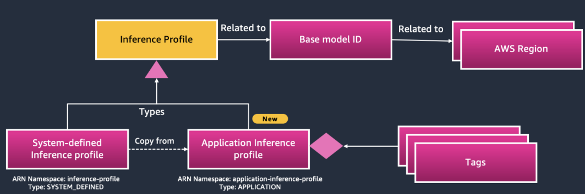

---
tags:
    - Bedrock/ Inference-Profiles
    - PoC-to-Prod
---

[Open in github](https://github.com/aws-samples/amazon-bedrock-samples/tree/main/poc-to-prod/inference-profiles/inference-profile-basics.ipynb)

<h1> Amazon Bedrock Application Inference Profiles </h1>

This notebook demonstrates how organizations can implement, test, validate, and operationalize Amazon Bedrock application inference profiles. The aim is to provide a comprehensive understanding of how to manage and utilize application inference profiles effectively.

<h2> Overview </h2>

Amazon Bedrock application inference profiles enable organizations to tag all Bedrock base foundation models with Cost Allocation Tags, making it possible to categorize usage by organizational taxonomies like cost centers, business units, teams, and applications. This scalable, programmatic approach to managing AI spend across multiple workloads reduces reliance on manual processes, lowers the risk of cost overruns, and ensures that critical applications receive priority. With enhanced visibility and control over AI-related expenses, organizations can optimize their GenAI investments and drive innovation more efficiently. This notebook demonstrates the creation of an application inference profile and its use in invoking models.

<h2> Architecture </h2>



The preceding architecture illustrates the configuration of Amazon Bedrock’s application inference profiles, which enable granular control over model usage and cost allocation. An application inference profile is associated with a specific model ID and AWS region, and can be created by copying a System-Defined Inference Profile template and adding custom tags for detailed tracking and management. While System-Defined Inference Profiles support cross-region inference, automatically routing requests across regions using a unified model identifier, these predefined profiles cannot be tagged, limiting visibility for managing costs and performance. To address this, Amazon Bedrock has introduced application inference profiles, a new capability that empowers organizations to optimize foundation model management across regions. With application inference profiles, organizations can create custom profiles with metadata tailored to tenants, such as teams, projects, and workloads, streamlining resource allocation and monitoring expenses across diverse AI applications.

<h2> Use case </h2>

This notebook contains implementation, test, and validation steps for various Amazon Bedrock application inference profile API functionalities, including:
- Create Inference Profile
- Get Inference Profile
- List Inference Profiles
- Invoke model with Inference Profile using Converse API
- Invoke model with Inference Profile using ConverseStream API
- Invoke model with Inference Profile using InvokeModel API
- Invoke model with Inference Profile using InvokeModelWithResponseStream API
- Tag Resource
- List Tags For Resource
- Untag Resource
- Cleanup

<h2> Prerequisites </h2>

1. Ensure an AWS account has been created: [Link](https://docs.aws.amazon.com/accounts/latest/reference/manage-acct-creating.html)
2. Ensure the user has permissions to access the correct models in Amazon Bedrock: [Link](https://docs.aws.amazon.com/bedrock/latest/userguide/model-access.html)
3. This Notebook was created in Amazon SageMaker in the us-west-2 region. If using this notebook in an outside environment ensure the AWS credentials are set correctly. If using in a different region, ensure the region variable is changed and that Amazon Bedrock application inference profiles are available in that region.

<h2> Notebook Code with Comments </h2>

<h3> Setting up the Bedrock clients </h3>

In the first cell, we import the necessary libraries and create a `boto3` client for Amazon Bedrock. 
We then call the `list_models` method to retrieve a list of available Amazon Bedrock base foundation models. This is the first step in understanding which models can be used for inference in your applications.


```python
# Import necessary libraries
import os
import json
import boto3

print(f"Boto3 Version: {boto3.__version__}")

# Get credentials and region information
session = boto3.Session()
credentials = session.get_credentials().get_frozen_credentials()
region = session.region_name

# Initialize Boto3 clients for Bedrock build time, runtime, agent, and agent runtime
bedrock = boto3.client(
    'bedrock',
    region_name=region
)
bedrock_runtime = boto3.client(
    'bedrock-runtime',
    region_name=region
)

# Create a Bedrock client
bedrock_client = boto3.client('bedrock')

# Define filter parameters
filter_params = {}
# {
#     'byProvider': 'your_provider_name',  # Replace with the desired model provider
#     'byCustomizationType': 'FINE_TUNING',  # Options: FINE_TUNING or CONTINUED_PRE_TRAINING
#     'byOutputModality': 'TEXT',  # Options: TEXT, IMAGE, or EMBEDDING
#     'byInferenceType': 'ON_DEMAND'  # Options: ON_DEMAND or PROVISIONED
# }

# Displaying the available models in Amazon Bedrock with filters
response = bedrock_client.list_foundation_models(**filter_params)
model_summaries = response.get('modelSummaries', [])

# Extract and print only the model ARNs
model_arns = [model['modelArn'] for model in model_summaries]
print(json.dumps(model_arns, indent=4))
```

<h3> Create Inference Profile </h3>
This cell calls the `create_inference_profile` method to create an application inference profile. By specifying a base foundation model ARN and custom tags, the application inference profile provides a way to organize and manage model configurations for the department's specific use case. The created inference profile ARN will be stored and can be used in place of default model IDs when making API calls to Bedrock, enabling more tailored interaction with the chosen model.


```python
def create_inference_profile(profile_name, model_arn, tags):
    """Create Inference Profile using base model ARN"""
    response = bedrock.create_inference_profile(
        inferenceProfileName=profile_name,
        description="test",
        modelSource={'copyFrom': model_arn},
        tags=tags
    )
    print("CreateInferenceProfile Response:", response['ResponseMetadata']['HTTPStatusCode']),
    print(f"{response}\n")
    return response

# Create Inference Profile
print("Testing CreateInferenceProfile...")
tags = [{'key': 'dept', 'value': 'claims'}]
base_model_arn = "arn:aws:bedrock:us-east-1::foundation-model/anthropic.claude-3-sonnet-20240229-v1:0"
claims_dept_claude_3_sonnet_profile = create_inference_profile("claims_dept_claude_3_sonnet_profile", base_model_arn, tags)

# Extracting the ARN and retrieving Inference Profile ID
claims_dept_claude_3_sonnet_profile_arn = claims_dept_claude_3_sonnet_profile['inferenceProfileArn']
```

<h3> Get Inference Profile </h3>
This cell retrieves metadata for the application inference profile created earlier by using its ARN. The `get_inference_profile` method takes the Inference Profile's ARN as input and calls the Bedrock API to fetch detailed metadata about the profile, such as configuration settings, model information, and associated tags. This retrieval allows you to verify and inspect the properties and setup of the profile, ensuring it meets the intended specifications.


```python
def get_inference_profile(inference_profile_arn):
    """Get Inference Profile by ARN"""
    response = bedrock.get_inference_profile(
        inferenceProfileIdentifier=inference_profile_arn
    )
    print("GetInferenceProfile Response:", response['ResponseMetadata']['HTTPStatusCode']),
    print(response)
    return response

print("Testing GetInferenceProfile...")
profile_response = get_inference_profile(claims_dept_claude_3_sonnet_profile_arn)
```

<h3> List Inference Profiles </h3>
This cell utilizes the `list_inference_profiles` method to retrieve and display all inference profiles filtered by type: `SYSTEM_DEFINED` or `APPLICATION`. The response provides an overview of each profile's details, allowing you to view all configured profiles and their metadata.


```python
def list_inference_profiles():
    """List Inference Profiles filtered by type"""
    response = bedrock.list_inference_profiles(
        typeEquals="APPLICATION"  # Filter for APPLICATION or SYSTEM_DEFINED
    )
    print("ListInferenceProfiles Response:", response['ResponseMetadata']['HTTPStatusCode'])
    print(response)
    return response

# List Inference Profiles
print("Testing LisInferenceProfiles...")
profile_list_response = list_inference_profiles()

```

<h3> Invoke model with the application inference profile using Converse API </h3>
The `Converse` API in Amazon Bedrock is a unified interface designed for engaging with large language models (LLMs), supporting features like chat history, automated prompt formatting specific to each model, and simplified model testing or swapping. This flexibility allows for easy substitution of Inference Profiles, regardless of the LLM powering them.

This cell uses the `parse_converse_response` function processes the response received from the Converse API. It extracts various components from the response, including -

- Role: The role of the message sender (e.g., user or model).
- Text Content: Any text messages in the response, compiled into a list.
- Images: Information about images, including format and byte data.
- Documents: Details of any documents returned, such as format, name, and byte data.
- Tool Usages and Results: Any tool usages or results included in the response.
- Guardrail Content: Information related to guardrails, if present.
- Stop Reason: The reason the conversation may have stopped.
- Usage and Metrics: Additional usage statistics and performance metrics.

The function returns a structured dictionary containing all extracted information, allowing for easy access to relevant data after conversing with the model.


```python
def parse_converse_response(response):
    """Parse Converse API response"""
    output = response.get('output', {})
    message = output.get('message', {})
    role = message.get('role')
    contents = message.get('content', [])

    # Extract the text content if available
    text_content = [item.get('text') for item in contents if 'text' in item]
    
    # Extract image data if available
    images = [
        {
            'format': item['image']['format'],
            'bytes': item['image']['source']['bytes']
        }
        for item in contents if 'image' in item
    ]

    # Extract document data if available
    documents = [
        {
            'format': item['document']['format'],
            'name': item['document']['name'],
            'bytes': item['document']['source']['bytes']
        }
        for item in contents if 'document' in item
    ]

    # Extract tool use and tool results if present
    tool_uses = [
        item.get('toolUse') for item in contents if 'toolUse' in item
    ]
    tool_results = [
        item.get('toolResult') for item in contents if 'toolResult' in item
    ]

    # Extract guardrail information if available
    guard_content = [
        item['guardContent'] for item in contents if 'guardContent' in item
    ]

    # Parse stop reason
    stop_reason = response.get('stopReason')

    # Parse token usage and metrics
    usage = response.get('usage', {})
    metrics = response.get('metrics', {})
    
    return {
        'role': role,
        'text_content': text_content,
        'images': images,
        'documents': documents,
        'tool_uses': tool_uses,
        'tool_results': tool_results,
        'guard_content': guard_content,
        'stop_reason': stop_reason,
        'usage': usage,
        'metrics': metrics
    }
```

<h3> Converse API </h3>
The `converse` method enables conversational interaction by sending a series of messages to the specified model and is equipped with the `parse_converse_response` function to format and extract relevant output data from the response.


```python
def converse(model_id, messages):
    """Use the Converse API to engage in a conversation with the specified model"""
    response = bedrock_runtime.converse(
        modelId=model_id,
        messages=messages,
        inferenceConfig={
            'maxTokens': 300,  # Specify max tokens if needed
        }
    )
    
    status_code = response.get('ResponseMetadata', {}).get('HTTPStatusCode')
    print("Converse Response:", status_code)
    parsed_response = parse_converse_response(response)
    print(parsed_response)
    return response
```

<h3> Converse test </h3>
This block demonstrates how to use the converse function in a practical test. A message list is created to structure the user input, specifying the role as `user` and including the `content` derived from the variable prompt.


```python
# Example of converse
print("\nTesting Converse...")
prompt = "\n\nHuman: Tell me about Amazon Bedrock.\n\nAssistant:"
messages = [{"role": "user", "content": [{"text": prompt}]}]
response = converse(claims_dept_claude_3_sonnet_profile_arn, messages)
```

<h3> Invoke model with Inference Profile using ConverseStream API </h3>
The `parse_converse_stream_response` function is designed to handle and interpret the responses from the `ConverseStream` API. It initializes an empty list to store parsed events and retrieves the event stream from the API response. The function checks if the stream is present; if not, it logs an appropriate message and returns an empty list. 

The function then iterates through each event, identifying the event type (such as messageStart, contentBlockStart, contentBlockDelta, contentBlockStop, messageStop, and metadata) and extracting relevant information for each type. Additionally, the function handles potential exceptions, logging pertinent details when encountered. The parsed events are collected into a list, which is returned for further processing.


```python
def parse_converse_stream_response(response):
    """Parse the ConverseStream API response"""
    parsed_events = []
    
    # Access the EventStream directly
    stream = response.get('stream')
    
    # Check if stream is valid
    if stream is None:
        print("No event stream found in the response.")
        return parsed_events
    
    # Iterate over each event in the EventStream
    for event in stream:
        print("Event:", event)
        event_type = event.get('eventType')
        event_data = event.get('eventData', {})
        parsed_event = {}
        
        if event_type == 'messageStart':
            parsed_event['type'] = 'messageStart'
            parsed_event['role'] = event_data.get('role')
        
        elif event_type == 'contentBlockStart':
            parsed_event['type'] = 'contentBlockStart'
            start_info = event_data.get('start', {})
            parsed_event['contentBlockIndex'] = event_data.get('contentBlockIndex')
            if 'toolUse' in start_info:
                parsed_event['toolUseId'] = start_info['toolUse'].get('toolUseId')
                parsed_event['toolName'] = start_info['toolUse'].get('name')

        elif event_type == 'contentBlockDelta':
            parsed_event['type'] = 'contentBlockDelta'
            parsed_event['contentBlockIndex'] = event_data.get('contentBlockIndex')
            delta = event_data.get('delta', {})
            parsed_event['text'] = delta.get('text')
            if 'toolUse' in delta:
                parsed_event['toolInput'] = delta['toolUse'].get('input')
        
        elif event_type == 'contentBlockStop':
            parsed_event['type'] = 'contentBlockStop'
            parsed_event['contentBlockIndex'] = event_data.get('contentBlockIndex')

        elif event_type == 'messageStop':
            parsed_event['type'] = 'messageStop'
            parsed_event['stopReason'] = event_data.get('stopReason')
            parsed_event['additionalModelResponseFields'] = event_data.get('additionalModelResponseFields')

        elif event_type == 'metadata':
            parsed_event['type'] = 'metadata'
            parsed_event['usage'] = event_data.get('usage', {})
            parsed_event['metrics'] = event_data.get('metrics', {})
            parsed_event['trace'] = event_data.get('trace', {})

        # Handle guardrail assessments and policies within metadata.trace.guardrail
        if event_type == 'metadata' and 'trace' in event_data:
            guardrail = event_data['trace'].get('guardrail', {})
            if 'inputAssessment' in guardrail:
                parsed_event['inputAssessment'] = guardrail['inputAssessment']
            if 'outputAssessments' in guardrail:
                parsed_event['outputAssessments'] = guardrail['outputAssessments']
        
        # Handle exceptions
        elif event_type in ['internalServerException', 'modelStreamErrorException', 
                            'validationException', 'throttlingException', 'serviceUnavailableException']:
            parsed_event['type'] = 'exception'
            parsed_event['exceptionType'] = event_type
            parsed_event['message'] = event_data.get('message')
            if event_type == 'modelStreamErrorException':
                parsed_event['originalStatusCode'] = event_data.get('originalStatusCode')
                parsed_event['originalMessage'] = event_data.get('originalMessage')

        # Add the parsed event to the list of events
        parsed_events.append(parsed_event)

    return parsed_events
```

<h3> ConverseStream API </h3>
The `converse_stream` method leverages the `ConverseStream` API to facilitate a real-time conversational interaction with a specified model. The function initiates a streaming response by sending user messages to the model, with a configuration to limit the maximum token usage.


```python
def converse_stream(model_id, messages):
    """Use the ConverseStream API to engage in a streaming response conversation with the specified model"""
    response = bedrock_runtime.converse_stream(
        modelId=model_id,
        messages=messages,
        inferenceConfig={
            'maxTokens': 300,
        }
    )
    status_code = response.get('ResponseMetadata', {}).get('HTTPStatusCode')
    print("ConverseStream Response:", status_code)
    parsed_response = parse_converse_stream_response(response)
    print(parsed_response)
    return response
```

<h3> ConverseStream test </h3>
This cell demonstrates a test of the `converse_stream` functionality by passing in the application inference profile ARN and the user messages. The output from this interaction will showcase how the model responds to the user's input in a streaming manner, allowing for a dynamic conversational experience. The results of the conversation will be displayed in the console, providing insights into the model's performance and response handling.


```python
# Example of converse stream
print("\nTesting ConverseStream...")
messages = [{"role": "user", "content": [{"text": prompt}]}]
response = converse_stream(claims_dept_claude_3_sonnet_profile_arn, messages)
```

<h3> Invoke model with Inference Profile using InvokeModel API </h3>
The `parse_converse_stream_response` function handles the response from the Amazon Bedrock `InvokeModel` API call. It checks if the response includes a body and, if so, processes the body stream to extract and decode the JSON content. The parsed output is returned as a Python dictionary, making it easier to work with the model's response data in subsequent code. If no body is found in the response, it prints a warning message.


```python
def parse_invoke_model_response(response):
    """Parse the InvokeModel API response"""
    
    # Check if the response contains a body
    if 'body' in response:
        # Read the body stream
        body_stream = response['body']
        body_content = body_stream.read()  # This reads the streaming body
        
        # Decode the bytes to a string
        body_str = body_content.decode('utf-8')
        
        # Parse the JSON string into a Python dictionary
        output = json.loads(body_str)
        
        return output
    else:
        print("No body found in the response.")
        return None
```

<h3> InvokeModel API </h3>
The `invoke_model` method utilizes the Amazon Bedrock `InvokeModel` API to run inference on a specified model using provided input data. This function takes in the model's ARN and the input body, converts the body to a JSON-encoded byte format, and sends it to the API. After invoking the model, it prints the HTTP status code and the full response for debugging purposes, before returning the response for further processing. 


```python
def invoke_model(model_id, body):
    """Use the InvokeModel API to invoke the specified model to run inference using the provided input"""
    body_bytes = json.dumps(body).encode('utf-8')
    response = bedrock_runtime.invoke_model(
        modelId=model_id,
        body=body_bytes
    )
    print("InvokeModel Response:", response['ResponseMetadata']['HTTPStatusCode'])
    print(response)
    return response
```

<h3> InvokeModel test </h3>
In this code block, an example invocation of the Bedrock model is demonstrated. It begins by defining a prompt and the corresponding input data. Next, it creates an inference profile using the specified base model ARN, which sets up the model for use. After retrieving the inference profile ARN, it calls the `invoke_model` function with the input data. Finally, it parses the model's response using the `parse_invoke_model_response` function, and if successful, prints the parsed output. This block showcases the complete workflow of setting up and invoking a model, along with handling the response.


```python
# Example of invoking model
print("Testing InvokeModel...")
prompt = "Tell me about Amazon Bedrock"
input_data = {
    "prompt": prompt
}

# Create Inference Profile
print("Testing CreateInferenceProfile...")
tags = [{'key': 'dept', 'value': 'claims'}]
base_model_arn = "arn:aws:bedrock:us-east-1::foundation-model/meta.llama3-70b-instruct-v1:0"
claims_dept_llama3_70b_profile = create_inference_profile("claims_dept_llama3_70b_profile", base_model_arn, tags)

# Extracting the ARN and retrieving Inference Profile ID
claims_dept_llama3_70b_profile_arn = claims_dept_llama3_70b_profile['inferenceProfileArn']

response = invoke_model(claims_dept_llama3_70b_profile_arn, input_data)
parsed_output = parse_invoke_model_response(response)

if parsed_output:
    print("Parsed Model Output:", parsed_output)
```

<h3> Invoke model with Inference Profile using InvokeModelWithResponseStream API </h3>
The `parse_invoke_model_with_stream` function is designed to process the response stream received from the `InvokeModelWithResponseStream` API. It checks for the presence of a 'body' in the response and iterates through the events within the EventStream. For each event that contains a 'chunk', it decodes the bytes and parses the JSON data, accumulating the results in a list. If no body is found in the response, it outputs a message indicating this. The function returns a list of parsed event data or `None` if the body is absent.


```python
def parse_invoke_model_with_stream(response):
    """Parse the response stream from the InvokeModelWithResponseStream API call"""
    output = []
    if 'body' in response:
        body_stream = response['body']
        
        # Iterate through the events in the EventStream
        for event in body_stream:
            # Each event is a dictionary, extract the data you need
            if 'chunk' in event:
                # Decode the chunk and parse it into JSON
                event_data = event['chunk']['bytes']
                output.append(json.loads(event_data.decode('utf-8'))) 
        
        return output
    else:
        print("No body found in the response.")
        return None
```

<h3> InvokeModelWithResponseStream API </h3>
In this code block, the `invoke_model_with_stream` method invokes a specified model using the `InvokeModelWithResponseStream` API. It takes a model ID and an input body. After invoking the model, it extracts the HTTP status code from the response metadata and prints it for reference, returning the entire response object for further processing.


```python
def invoke_model_with_stream(model_id, body):
    """Invoke the model with response stream using the specified model ID and input body"""
    # Ensure the body contains the correct prompt key
    body_bytes = json.dumps(body).encode('utf-8')
    response = bedrock_runtime.invoke_model_with_response_stream(
        modelId=model_id,
        body=body_bytes,
        contentType='application/json'
    )
    
    # Extracting the HTTP status code from the response
    status_code = response.get('ResponseMetadata', {}).get('HTTPStatusCode')
    print("InvokeModelWithResponseStream Response:", status_code)
    return response
```

<h3> InvokeModelWithResponseStream test </h3>
This block contains a simple test to demonstrate the functionality of the model invocation and response parsing. It initializes a prompt asking for information about Amazon Bedrock and creates an input data dictionary containing this prompt. The `invoke_model_with_stream` function is called with the specified model ID (e.g., `claims_dept_llama3_70b_profile_arn`) and the input data. The response from the model is then parsed using the `parse_invoke_model_with_stream` function.


```python
print("\nTesting InvokeModelWithResponseStream...")
prompt = "Tell me about Amazon Bedrock."
input_data = {"prompt": prompt}

# Example of invoking model with response stream
response = invoke_model_with_stream(claims_dept_llama3_70b_profile_arn, input_data)
parsed_output = parse_invoke_model_with_stream(response)

print("Parsed Model Output:", parsed_output)
```

<h3> Create Tag </h3>
The `tag_resource` method tags a specified resource in Amazon Bedrock. It takes a resource's ARN and a list of tags as input. In the provided example, two resources are tagged: one with the department tag "claims" and another with the department tag "underwriting." This tagging process helps in organizing and managing resources based on specific departments, enhancing resource identification and categorization within the Amazon Bedrock environment.


```python
def tag_resource(resource_arn, tags):
    """Tag a specified resource."""
    response = bedrock.tag_resource(
        resourceARN=resource_arn,
        tags=tags
    )
    status_code = response.get('ResponseMetadata', {}).get('HTTPStatusCode')
    print("TagResource Response:", status_code)
    print(f"{response}\n")
    return response

# Example of tagging resources
print("\nTesting TagResource...")
claims_tag = [{"key": "dept", "value": "claims"}]
claims_response = tag_resource(claims_dept_claude_3_sonnet_profile_arn, claims_tag)

underwriting_tag = [{"key": "dept", "value": "underwriting"}]
underwriting_response = tag_resource(claims_dept_llama3_70b_profile_arn, underwriting_tag)
```

<h3> List Tags </h3>
In this code block, the `list_tags_for_resource` method retrieves and displays the tags associated with a specified Bedrock resourc. The function takes the resource ARN as its parameter. The example demonstrates how to list tags for the previously tagged resource, providing insight into its metadata and organization.


```python
def list_tags(resource_arn):
    """List tags for a specified resource."""
    response = bedrock.list_tags_for_resource(
        resourceARN=resource_arn
    )
    status_code = response.get('ResponseMetadata', {}).get('HTTPStatusCode')
    print("ListTagsForResource Response:", status_code)
    print(f"{response}\n")
    return response

# Example of listing tags for a resource
print("\nTesting ListTagsForResource...")
claims_response = list_tags(claims_dept_claude_3_sonnet_profile_arn)
underwriting_response = list_tags(claims_dept_llama3_70b_profile_arn)
```

<h3> Remove Tag </h3>
This block calls the `untag_resource` method, which removes specified tags from a given resource in Amazon Bedrock. The function accepts a resource ARN and a list of tag keys to be removed. The provided example illustrates the untagging process for a resource by removing a tag associated with the department, demonstrating how to manage and modify resource tagging effectively.


```python
def untag_resource(resource_arn, tag_keys):
    """Untag a specified resource."""
    response = bedrock.untag_resource(
        resourceARN=resource_arn,
        tagKeys=tag_keys
    )
    status_code = response.get('ResponseMetadata', {}).get('HTTPStatusCode')
    print("UntagResource Response:", status_code)
    print(f"{response}\n")
    return response

# Example of untagging resources
print("\nTesting UntagResource...")
tag_keys = ["dept"]
untag_response = untag_resource(claims_dept_claude_3_sonnet_profile_arn, tag_keys)
claims_response = list_tags(claims_dept_claude_3_sonnet_profile_arn)
```

<h2> Clean up section </h2>
The `delete_inference_profile` function accepts a Bedrock ARN as an argument to delete the corresponding application inference profile. The function is called twice to delete all inference profiles that were created earlier in the notebook: `claims_dept_llama3_70b_profile_arn` and `claims_dept_claude_3_sonnet_profile_arn`. This cleanup process ensures that resources are properly decommissioned, helping maintain a tidy and organized environment by preventing unused resources.


```python
def delete_inference_profile(inference_profile_arn):
    """Delete a specified inference profile by its ARN."""
    response = bedrock.delete_inference_profile(
        inferenceProfileIdentifier=inference_profile_arn
    )
    print("DeleteInferenceProfile Response:", response['ResponseMetadata']['HTTPStatusCode'])
    print(response)
    return response
```


```python
# Initiating the deletion of inference profiles
print("Testing DeleteInferenceProfiles...")
delete_inference_profile(claims_dept_llama3_70b_profile_arn)
delete_inference_profile(claims_dept_claude_3_sonnet_profile_arn)
```

# END OF NOTEBOOK 
