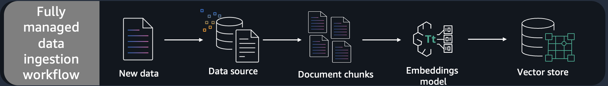

---
tags:
    - RAG/ Knowledge-Bases
    - RAG/ Data-Ingestion
    - Vector-DB/ OpenSearch
---

!!! tip inline end "[Open in github](https://github.com/aws-samples/amazon-bedrock-samples/tree/main/rag/knowledge-bases/features-examples/01-rag-concepts/01_create_ingest_documents_test_kb_multi_ds.ipynb){:target="_blank"}"

<h2>Knowledge Bases for Amazon Bedrock - End to end example using multiple data sources as data source(s)</h2>

This notebook provides sample code for building an empty OpenSearch Serverless (OSS) index,Knowledge bases for Amazon Bedrock and ingest documents into the index from various data sources (S3, Confluence, Sharepoint, Salesforce, and Web). Please note that you can add upto 5 data sources.


<h4>Notebook Walkthrough</h4>

A data pipeline that ingests documents (typically stored in multiple data sources) into a knowledge base i.e. a vector database such as Amazon OpenSearch Service Serverless (AOSS) so that it is available for lookup when a question is received.

- Load the documents into the knowledge base by connecting various data sources (S3, Confluence, Sharepoint, Salesforce, and Web). 
- Ingestion - Knowledge base will split them into smaller chunks (based on the strategy selected), generate embeddings and store it in the associated vectore store.

<!--  -->


<h4>Steps: </h4>
- Create Knowledge Base execution role with necessary policies for accessing data from various data sources (S3, Confluence, Sharepoint, Salesforce, and Web) and writing embeddings into OSS.
- Create an empty OpenSearch serverless index.
- Pre-requisite: 
    - For S3 , create s3 bucket (if not exists) and upload the data
    - for other data sources - Refer to the pre-requisites for corresponding [AWS documentation page](https://docs.aws.amazon.com/bedrock/latest/userguide/data-source-connectors.html)
- Create knowledge base
- Create data source(s) within knowledge base
- For each data source, start ingestion jobs using KB APIs which will read data from the data source, chunk it, convert chunks into embeddings using Amazon Titan Embeddings model and then store these embeddings in AOSS. All of this without having to build, deploy and manage the data pipeline.

Once the data is available in the Bedrock Knowledge Base then a question answering application can be built using the Knowledge Base APIs provided by Amazon Bedrock.


<h4>Pre-requisites</h4>
This notebook requires permissions to:
- create and delete Amazon IAM roles
- create, update and delete Amazon S3 buckets
- access Amazon Bedrock
- access to Amazon OpenSearch Serverless


If running the workshop in self-paced on SageMaker Studio, you should add the following managed policies to your role:
- IAMFullAccess
- AWSLambda_FullAccess
- AmazonS3FullAccess
- AmazonBedrockFullAccess
- Custom policy for Amazon OpenSearch Serverless such as:
```
{
    "Version": "2012-10-17",
    "Statement": [
        {
            "Effect": "Allow",
            "Action": "aoss:*",
            "Resource": "*"
        }
    ]
}
```
<div class="alert alert-block alert-info">
<b>Note:</b> Please make sure to enable `Anthropic Claude 3 Sonnet` and,  `Titan Text Embeddings V2` model access in Amazon Bedrock Console.
<br> -------------------------------------------------------------------------------------------------------------------------------------------------------   </br>
    
Please run the notebook cell by cell instead of using "Run All Cells" option.
</div>


<h2>Setup</h2>
Before running the rest of this notebook, you'll need to run the cells below to (ensure necessary libraries are installed and) connect to Bedrock.


```python
%pip install --force-reinstall -q -r ../requirements.txt
```


```python
<h2>restart kernel</h2>
from IPython.core.display import HTML
HTML("<script>Jupyter.notebook.kernel.restart()</script>")
```


```python
import warnings
warnings.filterwarnings('ignore')
```


```python
import json
import os
import boto3
from botocore.exceptions import ClientError
import pprint
from utility import create_bedrock_execution_role, create_bedrock_execution_role_multi_ds, create_oss_policy_attach_bedrock_execution_role, create_policies_in_oss, interactive_sleep
import random
from retrying import retry
suffix = random.randrange(200, 900)

sts_client = boto3.client('sts')
boto3_session = boto3.session.Session()
region_name = boto3_session.region_name

bedrock_agent_client = boto3.client('bedrock-agent', region_name=region_name)
bedrock_agent_runtime_client = boto3.client('bedrock-agent-runtime', region_name=region_name)

service = 'aoss'
s3_client = boto3.client('s3')
account_id = sts_client.get_caller_identity()["Account"]
s3_suffix = f"{region_name}-{account_id}"

```


```python
print(boto3.__version__)
```

<h3>Now you can add multiple and different data sources (S3, Confluence, Sharepoint, Salesforce, Web Crawler) to a Knowledge Base. For this notebook, we'll test Knowledge Base creation with multiple and different data sources.</h3>

Each data source may have different pre-requisites, please refer to the AWS documetation for more information.


```python
<h2>For this notebook, we'll create Knowledge Base with multiple data sources ( 1 S3 bucket, 1 confluence page, 1 Sharepoint site, 1 Salesforce site, 1 Web Crawler)</h2>

bucket_name = f'bedrock-kb-{s3_suffix}-1' # replace it with your first bucket name.

<h2>Below is a list of data sources including, 1 S3 buckets, 1 confluence, 1 Sharepoint, 1 Salesforce connectors</h2>
<h2>Please uncomment the data sources that you want to add and update the placeholder values accordingly.</h2>

data_sources=[
                {"type": "S3", "bucket_name": bucket_name}, 
                
                # {"type": "CONFLUENCE", "hostUrl": "https://example.atlassian.net", "authType": "BASIC",
                #  "credentialsSecretArn": f"arn:aws::secretsmanager:{region_name}:secret:<<your_secret_name>>"},

                # {"type": "SHAREPOINT", "tenantId": "888d0b57-69f1-4fb8-957f-e1f0bedf64de", "domain": "yourdomain",
                #   "authType": "OAUTH2_CLIENT_CREDENTIALS",
                #  "credentialsSecretArn": f"arn:aws::secretsmanager:{region_name}:secret:<<your_secret_name>>",
                #  "siteUrls": ["https://yourdomain.sharepoint.com/sites/mysite"]
                # },

                # {"type": "SALESFORCE", "hostUrl": "https://company.salesforce.com/", "authType": "OAUTH2_CLIENT_CREDENTIALS",
                #  "credentialsSecretArn": f"arn:aws::secretsmanager:{region_name}:secret:<<your_secret_name>>"
                # },

                # {"type": "WEB", "seedUrls": [{ "url": "https://www.examplesite.com"}],
                #  "inclusionFilters": ["https://www\.examplesite\.com/.*\.html"],
                #  "exclusionFilters": ["https://www\.examplesite\.com/contact-us\.html"]
                # }
            ]
                
pp = pprint.PrettyPrinter(indent=2)
```


```python
<h2>For S3 data source, check if S3 bucket exists, and if not create S3 bucket for knowledge base data source</h2>

for ds in [d for d in data_sources if d['type']== 'S3']:
    bucket_name = ds['bucket_name']
    try:
        s3_client.head_bucket(Bucket=bucket_name)
        print(f'Bucket {bucket_name} Exists')
    except ClientError as e:
        print(f'Creating bucket {bucket_name}')
        if region_name == "us-east-1":
               s3_client.create_bucket(
                    Bucket=bucket_name
                )
        else:
            s3_client.create_bucket(
                Bucket=bucket_name,
                CreateBucketConfiguration={'LocationConstraint': region_name}
            )
```

<h2>Create a vector store - OpenSearch Serverless index</h2>

<h3>Create OSS policies and collection</h3>
Firt of all we have to create a vector store. In this section we will use *Amazon OpenSerach serverless.*

Amazon OpenSearch Serverless is a serverless option in Amazon OpenSearch Service. As a developer, you can use OpenSearch Serverless to run petabyte-scale workloads without configuring, managing, and scaling OpenSearch clusters. You get the same interactive millisecond response times as OpenSearch Service with the simplicity of a serverless environment. Pay only for what you use by automatically scaling resources to provide the right amount of capacity for your application—without impacting data ingestion.


```python
import boto3
import time
vector_store_name = f'bedrock-sample-rag-{suffix}'
index_name = f"bedrock-sample-rag-index-{suffix}"
aoss_client = boto3_session.client('opensearchserverless')
bedrock_kb_execution_role = create_bedrock_execution_role_multi_ds(bucket_names=[d["bucket_name"] for d in data_sources if d['type']== 'S3'],
                                secrets_arns = [d["credentialsSecretArn"] for d in data_sources if d['type']== 'CONFLUENCE'or d['type']=='SHAREPOINT' or d['type']=='SALESFORCE'])
bedrock_kb_execution_role_arn = bedrock_kb_execution_role['Role']['Arn']
```


```python
bedrock_kb_execution_role_arn
```


```python
<h2>create security, network and data access policies within OSS</h2>
encryption_policy, network_policy, access_policy = create_policies_in_oss(vector_store_name=vector_store_name,
                       aoss_client=aoss_client,
                       bedrock_kb_execution_role_arn=bedrock_kb_execution_role_arn)
collection = aoss_client.create_collection(name=vector_store_name,type='VECTORSEARCH')
```


```python
pp.pprint(collection)
```


```python
<h2>Get the OpenSearch serverless collection URL</h2>
collection_id = collection['createCollectionDetail']['id']
host = collection_id + '.' + region_name + '.aoss.amazonaws.com'
print(host)
```


```python
import time
<h2>wait for collection creation</h2>
<h2>This can take couple of minutes to finish</h2>
response = aoss_client.batch_get_collection(names=[vector_store_name])
<h2>Periodically check collection status</h2>
while (response['collectionDetails'][0]['status']) == 'CREATING':
    print('Creating collection...')
    interactive_sleep(30)
    response = aoss_client.batch_get_collection(names=[vector_store_name])
print('\nCollection successfully created:')
pp.pprint(response["collectionDetails"])
```


```python
<h2>create opensearch serverless access policy and attach it to Bedrock execution role</h2>
try:
    create_oss_policy_attach_bedrock_execution_role(collection_id=collection_id,
                                                    bedrock_kb_execution_role=bedrock_kb_execution_role)
    # It can take up to a minute for data access rules to be enforced
    interactive_sleep(60)
except Exception as e:
    print("Policy already exists")
    pp.pprint(e)
```

<h2>Create vector index</h2>


```python
<h2>Create the vector index in Opensearch serverless, with the knn_vector field index mapping, specifying the dimension size, name and engine.</h2>
from opensearchpy import OpenSearch, RequestsHttpConnection, AWSV4SignerAuth, RequestError
credentials = boto3.Session().get_credentials()
awsauth = auth = AWSV4SignerAuth(credentials, region_name, service)

index_name = f"bedrock-sample-index-{suffix}"
body_json = {
   "settings": {
      "index.knn": "true",
       "number_of_shards": 1,
       "knn.algo_param.ef_search": 512,
       "number_of_replicas": 0,
   },
   "mappings": {
      "properties": {
         "vector": {
            "type": "knn_vector",
            "dimension": 1024,
             "method": {
                 "name": "hnsw",
                 "engine": "faiss",
                 "space_type": "l2"
             },
         },
         "text": {
            "type": "text"
         },
         "text-metadata": {
            "type": "text"         }
      }
   }
}

<h2>Build the OpenSearch client</h2>
oss_client = OpenSearch(
    hosts=[{'host': host, 'port': 443}],
    http_auth=awsauth,
    use_ssl=True,
    verify_certs=True,
    connection_class=RequestsHttpConnection,
    timeout=300
)

```


```python
<h2>Create index</h2>
try:
    response = oss_client.indices.create(index=index_name, body=json.dumps(body_json))
    print('\nCreating index:')
    pp.pprint(response)

    # index creation can take up to a minute
    interactive_sleep(60)
except RequestError as e:
    # you can delete the index if its already exists
    # oss_client.indices.delete(index=index_name)
    print(f'Error while trying to create the index, with error {e.error}\nyou may unmark the delete above to delete, and recreate the index')
    
```

<h2>Download data to ingest into our knowledge base.</h2>
We'll use the following data:
 - sythetic data stored in a local directory as first data source

<h4>Upload data to S3 Bucket data source</h4>


```python
def upload_directory(path, bucket_name):
        for root,dirs,files in os.walk(path):
            for file in files:
                file_to_upload = os.path.join(root,file)
                print(f"uploading file {file_to_upload} to {bucket_name}")
                s3_client.upload_file(file_to_upload,bucket_name,file)

upload_directory("../synthetic_dataset", bucket_name)
```

<h2>Create Knowledge Base</h2>
Steps:
- initialize Open search serverless configuration which will include collection ARN, index name, vector field, text field and metadata field.
- initialize the Titan embeddings model ARN, as this will be used to create the embeddings for each of the text chunks.


```python
opensearchServerlessConfiguration = {
            "collectionArn": collection["createCollectionDetail"]['arn'],
            "vectorIndexName": index_name,
            "fieldMapping": {
                "vectorField": "vector",
                "textField": "text",
                "metadataField": "text-metadata"
            }
        }

<h2>The embedding model used by Bedrock to embed ingested documents, and realtime prompts</h2>
embeddingModelArn = f"arn:aws:bedrock:{region_name}::foundation-model/amazon.titan-embed-text-v2:0"
                    
name = f"bedrock-sample-knowledge-base-{suffix}"
description = "Amazon shareholder letter knowledge base."
roleArn = bedrock_kb_execution_role_arn

```

Provide the above configurations as input to the `create_knowledge_base` method, which will create the Knowledge base.


```python
<h2>Create a KnowledgeBase</h2>
from retrying import retry

@retry(wait_random_min=1000, wait_random_max=2000,stop_max_attempt_number=7)
def create_knowledge_base_func():
    create_kb_response = bedrock_agent_client.create_knowledge_base(
        name = name,
        description = description,
        roleArn = roleArn,
        knowledgeBaseConfiguration = {
            "type": "VECTOR",
            "vectorKnowledgeBaseConfiguration": {
                "embeddingModelArn": embeddingModelArn
            }
        },
        storageConfiguration = {
            "type": "OPENSEARCH_SERVERLESS",
            "opensearchServerlessConfiguration":opensearchServerlessConfiguration
        }
    )
    return create_kb_response["knowledgeBase"]
```


```python
try:
    kb = create_knowledge_base_func()
except Exception as err:
    print(f"{err=}, {type(err)=}")
```


```python
pp.pprint(kb)
```


```python
<h2>Get KnowledgeBase </h2>
get_kb_response = bedrock_agent_client.get_knowledge_base(knowledgeBaseId = kb['knowledgeBaseId'])
```

Next we need to create data source(s), which will be associated with the knowledge base created above. Once the data source(s) is ready, we can then start to ingest the documents.

<h2>Create Data Source(s)</h2>
Steps:
- initialize chunking strategy, based on which KB will split the documents into pieces of size equal to the chunk size mentioned in the `chunkingStrategyConfiguration`.
- initialize the s3 configuration, which will be used to create the data source object later.

NOTE: In the current sample, we'll use FIXED_SIZE chunking Strategy but you can also use other chunking chunking strategies like HIERARCHICAL, SEMANTIC or NONE. For more details on the chunking startegies please refer to the [AWS documentation page](https://docs.aws.amazon.com/bedrock/latest/APIReference/API_agent_ChunkingConfiguration.html)


```python
<h2>Function to create KB</h2>
def create_ds(data_sources):
    ds_list=[]
    for idx, ds in enumerate(data_sources):
        # Ingest strategy - How to ingest data from the data source
        chunkingStrategyConfiguration = {
            "chunkingStrategy": "FIXED_SIZE", 
            "fixedSizeChunkingConfiguration": {
                "maxTokens": 512,
                "overlapPercentage": 20
            }
        }
        
        # The data source to ingest documents from, into the OpenSearch serverless knowledge base index
        
        s3DataSourceConfiguration = {
                "type": "S3",
                "s3Configuration":{
                    "bucketArn": "",
                    # "inclusionPrefixes":["*.*"] # you can use this if you want to create a KB using data within s3 prefixes.
                    }
            }
        
        confluenceDataSourceConfiguration = {
            "confluenceConfiguration": {
                "sourceConfiguration": {
                    "hostUrl": "",
                    "hostType": "SAAS",
                    "authType": "", # BASIC | OAUTH2_CLIENT_CREDENTIALS
                    "credentialsSecretArn": ""
                    
                },
                "crawlerConfiguration": {
                    "filterConfiguration": {
                        "type": "PATTERN",
                        "patternObjectFilter": {
                            "filters": [
                                {
                                    "objectType": "Attachment",
                                    "inclusionFilters": [
                                        ".*\\.pdf"
                                    ],
                                    "exclusionFilters": [
                                        ".*private.*\\.pdf"
                                    ]
                                }
                            ]
                        }
                    }
                }
            },
            "type": "CONFLUENCE"
        }

        sharepointDataSourceConfiguration = {
            "sharePointConfiguration": {
                "sourceConfiguration": {
                    "tenantId": "",
                    "hostType": "ONLINE",
                    "domain": "domain",
                    "siteUrls": [],
                    "authType": "", # BASIC | OAUTH2_CLIENT_CREDENTIALS
                    "credentialsSecretArn": ""
                    
                },
                "crawlerConfiguration": {
                    "filterConfiguration": {
                        "type": "PATTERN",
                        "patternObjectFilter": {
                            "filters": [
                                {
                                    "objectType": "Attachment",
                                    "inclusionFilters": [
                                        ".*\\.pdf"
                                    ],
                                    "exclusionFilters": [
                                        ".*private.*\\.pdf"
                                    ]
                                }
                            ]
                        }
                    }
                }
            },
            "type": "SHAREPOINT"
        }


        salesforceDataSourceConfiguration = {
            "salesforceConfiguration": {
                "sourceConfiguration": {
                    "hostUrl": "",
                    "authType": "", # BASIC | OAUTH2_CLIENT_CREDENTIALS
                    "credentialsSecretArn": ""
                },
                "crawlerConfiguration": {
                    "filterConfiguration": {
                        "type": "PATTERN",
                        "patternObjectFilter": {
                            "filters": [
                                {
                                    "objectType": "Attachment",
                                    "inclusionFilters": [
                                        ".*\\.pdf"
                                    ],
                                    "exclusionFilters": [
                                        ".*private.*\\.pdf"
                                    ]
                                }
                            ]
                        }
                    }
                }
            },
            "type": "SALESFORCE"
        }

        webcrawlerDataSourceConfiguration = {
            "webConfiguration": {
                "sourceConfiguration": {
                    "urlConfiguration": {
                        "seedUrls": []
                    }
                },
                "crawlerConfiguration": {
                    "crawlerLimits": {
                        "rateLimit": 50
                    },
                    "scope": "HOST_ONLY",
                    "inclusionFilters": [],
                    "exclusionFilters": []
                }
            },
            "type": "WEB"
        }

        # Set the data source configuration based on the Data source type

        if ds['type'] == "S3":
            print(f'{idx +1 } data source: S3')
            ds_name = f'{name}-{bucket_name}'
            s3DataSourceConfiguration["s3Configuration"]["bucketArn"] = f'arn:aws:s3:::{ds["bucket_name"]}'
            # print(s3DataSourceConfiguration)
            data_source_configuration = s3DataSourceConfiguration
        
        if ds['type'] == "CONFLUENCE":
            print(f'{idx +1 } data source: CONFLUENCE')
            ds_name = f'{name}-confluence'
            confluenceDataSourceConfiguration['confluenceConfiguration']['sourceConfiguration']['hostUrl'] = ds['hostUrl']
            confluenceDataSourceConfiguration['confluenceConfiguration']['sourceConfiguration']['authType'] = ds['authType']
            confluenceDataSourceConfiguration['confluenceConfiguration']['sourceConfiguration']['credentialsSecretArn'] = ds['credentialsSecretArn']
            # print(confluenceDataSourceConfiguration)
            data_source_configuration = confluenceDataSourceConfiguration

        if ds['type'] == "SHAREPOINT":
            print(f'{idx +1 } data source: SHAREPOINT')
            ds_name = f'{name}-sharepoint'
            sharepointDataSourceConfiguration['sharePointConfiguration']['sourceConfiguration']['tenantId'] = ds['tenantId']
            sharepointDataSourceConfiguration['sharePointConfiguration']['sourceConfiguration']['domain'] = ds['domain']
            sharepointDataSourceConfiguration['sharePointConfiguration']['sourceConfiguration']['authType'] = ds['authType']
            sharepointDataSourceConfiguration['sharePointConfiguration']['sourceConfiguration']['siteUrls'] = ds["siteUrls"]
            sharepointDataSourceConfiguration['sharePointConfiguration']['sourceConfiguration']['credentialsSecretArn'] = ds['credentialsSecretArn']
            # print(sharepointDataSourceConfiguration)
            data_source_configuration = sharepointDataSourceConfiguration


        if ds['type'] == "SALESFORCE":
            print(f'{idx +1 } data source: SALESFORCE')
            ds_name = f'{name}-salesforce'
            salesforceDataSourceConfiguration['salesforceConfiguration']['sourceConfiguration']['hostUrl'] = ds['hostUrl']
            salesforceDataSourceConfiguration['salesforceConfiguration']['sourceConfiguration']['authType'] = ds['authType']
            salesforceDataSourceConfiguration['salesforceConfiguration']['sourceConfiguration']['credentialsSecretArn'] = ds['credentialsSecretArn']
            # print(salesforceDataSourceConfiguration)
            data_source_configuration = salesforceDataSourceConfiguration

        if ds['type'] == "WEB":
            print(f'{idx +1 } data source: WEB')
            ds_name = f'{name}-web'
            webcrawlerDataSourceConfiguration['webConfiguration']['sourceConfiguration']['urlConfiguration']['seedUrls'] = ds['seedUrls']
            webcrawlerDataSourceConfiguration['webConfiguration']['crawlerConfiguration']['inclusionFilters'] = ds['inclusionFilters']
            webcrawlerDataSourceConfiguration['webConfiguration']['crawlerConfiguration']['exclusionFilters'] = ds['exclusionFilters']
            # print(webcrawlerDataSourceConfiguration)
            data_source_configuration = webcrawlerDataSourceConfiguration
            

        # Create a DataSource in KnowledgeBase 
        create_ds_response = bedrock_agent_client.create_data_source(
            name = ds_name,
            description = description,
            knowledgeBaseId = kb['knowledgeBaseId'],
            dataSourceConfiguration = data_source_configuration,
            vectorIngestionConfiguration = {
                "chunkingConfiguration": chunkingStrategyConfiguration
            }
        )
        ds = create_ds_response["dataSource"]
        pp.pprint(ds)
        ds_list.append(ds)
    return ds_list
```


```python
data_sources_list = create_ds(data_sources)
```


```python
data_sources_list
```


```python
<h2>Get DataSource </h2>
for idx, ds in enumerate(data_sources_list):
    print(bedrock_agent_client.get_data_source(knowledgeBaseId = kb['knowledgeBaseId'], dataSourceId = ds["dataSourceId"]))
    print(" ")
```

<h3>Start ingestion job</h3>
Once the KB and data source(s) created, we can start the ingestion job for each data source.
During the ingestion job, KB will fetch the documents in the data source, pre-process it to extract text, chunk it based on the chunking size provided, create embeddings of each chunk and then write it to the vector database, in this case OSS.

NOTE: Currently, you can only kick-off one ingestion job at one time.


```python
interactive_sleep(30)
ingest_jobs=[]
<h2>Start an ingestion job</h2>
for idx, ds in enumerate(data_sources_list):
    try:
        start_job_response = bedrock_agent_client.start_ingestion_job(knowledgeBaseId = kb['knowledgeBaseId'], dataSourceId = ds["dataSourceId"])
        job = start_job_response["ingestionJob"]
        print(f"job {idx} started successfully\n")
    
        while job['status'] not in ["COMPLETE", "FAILED", "STOPPED"]:
            get_job_response = bedrock_agent_client.get_ingestion_job(
              knowledgeBaseId = kb['knowledgeBaseId'],
                dataSourceId = ds["dataSourceId"],
                ingestionJobId = job["ingestionJobId"]
          )
            job = get_job_response["ingestionJob"]
        pp.pprint(job)
        interactive_sleep(40)

        ingest_jobs.append(job)
    except Exception as e:
        print(f"Couldn't start {idx} job.\n")
        print(e)
    
    
```


```python
<h2>Print the knowledge base Id in bedrock, that corresponds to the Opensearch index in the collection we created before, we will use it for the invocation later</h2>
kb_id = kb["knowledgeBaseId"]
pp.pprint(kb_id)
```


```python
<h2>keep the kb_id for invocation later in the invoke request</h2>
%store kb_id
```

<h3>2.2 Test the Knowledge Base</h3>
Now the Knowlegde Base is available we can test it out using the [**retrieve**](https://boto3.amazonaws.com/v1/documentation/api/latest/reference/services/bedrock-agent-runtime/client/retrieve.html) and [**retrieve_and_generate**](https://boto3.amazonaws.com/v1/documentation/api/latest/reference/services/bedrock-agent-runtime/client/retrieve_and_generate.html) functions. 

<h4>Testing Knowledge Base with Retrieve and Generate API</h4>

Let's first test the knowledge base using the retrieve and generate API. With this API, Bedrock takes care of retrieving the necessary references from the knowledge base and generating the final answer using a foundation model from Bedrock.

query = `Provide a summary of consolidated statements of cash flows of Octank Financial for the fiscal years ended December 31, 2019.`

The right response for this query as per ground truth QA pair is:
```
The cash flow statement for Octank Financial in the year ended December 31, 2019 reveals the following:
- Cash generated from operating activities amounted to $710 million, which can be attributed to a $700 million profit and non-cash charges such as depreciation and amortization.
- Cash outflow from investing activities totaled $240 million, with major expenditures being the acquisition of property, plant, and equipment ($200 million) and marketable securities ($60 million), partially offset by the sale of property, plant, and equipment ($40 million) and maturing marketable securities ($20 million).
- Financing activities resulted in a cash inflow of $350 million, stemming from the issuance of common stock ($200 million) and long-term debt ($300 million), while common stock repurchases ($50 million) and long-term debt payments ($100 million) reduced the cash inflow.
Overall, Octank Financial experienced a net cash enhancement of $120 million in 2019, bringing their total cash and cash equivalents to $210 million.


```python
query = "Provide a summary of consolidated statements of cash flows of Octank Financial for the fiscal years ended December 31, 2019?"
```


```python
foundation_model = "anthropic.claude-3-sonnet-20240229-v1:0"

response = bedrock_agent_runtime_client.retrieve_and_generate(
    input={
        "text": query
    },
    retrieveAndGenerateConfiguration={
        "type": "KNOWLEDGE_BASE",
        "knowledgeBaseConfiguration": {
            'knowledgeBaseId': kb_id,
            "modelArn": "arn:aws:bedrock:{}::foundation-model/{}".format(region_name, foundation_model),
            "retrievalConfiguration": {
                "vectorSearchConfiguration": {
                    "numberOfResults":5
                } 
            }
        }
    }
)

print(response['output']['text'],end='\n'*2)
```

As you can see, with the retrieve and generate API we get the final response directly and we don't see the different sources used to generate this response. Let's now retrieve the source information from the knowledge base with the retrieve API.

<h4>Testing Knowledge Base with Retrieve API</h4>
If you need an extra layer of control, you can retrieve the chuncks that best match your query using the retrieve API. In this setup, we can configure the desired number of results and control the final answer with your own application logic. The API then provides you with the matching content, its S3 location, the similarity score and the chunk metadata.


```python
response_ret = bedrock_agent_runtime_client.retrieve(
    knowledgeBaseId=kb_id, 
    nextToken='string',
    retrievalConfiguration={
        "vectorSearchConfiguration": {
            "numberOfResults":5,
        } 
    },
    retrievalQuery={
        "text": "How many new positions were opened across Amazon's fulfillment and delivery network?"
    }
)

def response_print(retrieve_resp):
#structure 'retrievalResults': list of contents. Each list has content, location, score, metadata
    for num,chunk in enumerate(response_ret['retrievalResults'],1):
        print(f'Chunk {num}: ',chunk['content']['text'],end='\n'*2)
        print(f'Chunk {num} Location: ',chunk['location'],end='\n'*2)
        print(f'Chunk {num} Score: ',chunk['score'],end='\n'*2)
        print(f'Chunk {num} Metadata: ',chunk['metadata'],end='\n'*2)

response_print(response_ret)
```

<h3>Clean up</h3>
Please make sure to uncomment and run the below section to delete all the resources.


```python

<h2>Delete KnowledgeBase</h2>
<h2>for idx, ds in enumerate(data_sources_list):</h2>
<h2>    bedrock_agent_client.delete_data_source(dataSourceId = ds["dataSourceId"], knowledgeBaseId=kb['knowledgeBaseId'])</h2>
<h2>bedrock_agent_client.delete_knowledge_base(knowledgeBaseId=kb['knowledgeBaseId'])</h2>
<h2>oss_client.indices.delete(index=index_name)</h2>
<h2>aoss_client.delete_collection(id=collection_id)</h2>
<h2>aoss_client.delete_access_policy(type="data", name=access_policy['accessPolicyDetail']['name'])</h2>
<h2>aoss_client.delete_security_policy(type="network", name=network_policy['securityPolicyDetail']['name'])</h2>
<h2>aoss_client.delete_security_policy(type="encryption", name=encryption_policy['securityPolicyDetail']['name'])</h2>
```


```python
<h2>delete role and policies</h2>
<h2>from utility import delete_iam_role_and_policies</h2>
<h2>delete_iam_role_and_policies()</h2>
```
