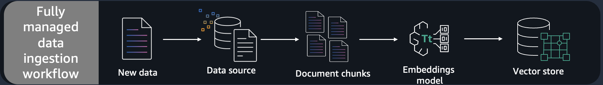
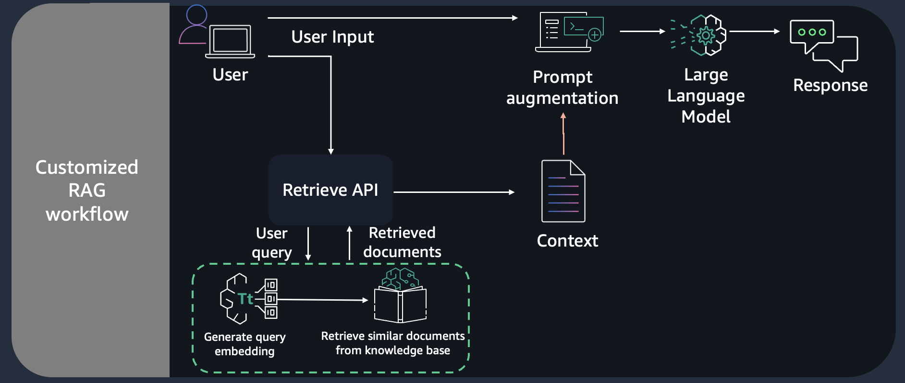

---
tags:
    - RAG/ Knowledge-Bases
    - Open Source/ Langchain
    - RAG/ Data-Ingestion
---

!!! tip inline end "[Open in github](https://github.com/aws-samples/amazon-bedrock-samples/tree/main/rag/knowledge-bases/features-examples/01-rag-concepts/03_customized-rag-retreive-api-hybrid-search-claude-3-sonnet-langchain.ipynb){:target="_blank"}"

<h2>Building Q&A application using Knowledge Bases for Amazon Bedrock - Retrieve API</h2>

<h3>Context</h3>

In this notebook, we will dive deep into building Q&A application using Knowledge Bases for Amazon Bedrock - Retrieve API. Here, we will query the knowledge base to get the desired number of document chunks based on similarity search. We will then augment the prompt with relevant documents and query which will go as input to Anthropic Claude V2 for generating response.

With a knowledge base, you can securely connect foundation models (FMs) in Amazon Bedrock to your company
data for Retrieval Augmented Generation (RAG). Access to additional data helps the model generate more relevant,
context-specific, and accurate responses without continuously retraining the FM. All information retrieved from
knowledge bases comes with source attribution to improve transparency and minimize hallucinations. For more information on creating a knowledge base using console, please refer to this [post](https://docs.aws.amazon.com/bedrock/latest/userguide/knowledge-base.html).
We will cover 2 parts in the notebook:
- Part 1, we will share how you can use `RetrieveAPI` with foundation models from Amazon Bedrock. We will use the `anthropic.claude-3-sonnet-20240229-v1:0` model. 
- Part 2, we will showcase the langchain integration.

<h3>Pattern</h3>

We can implement the solution using Retreival Augmented Generation (RAG) pattern. RAG retrieves data from outside the language model (non-parametric) and augments the prompts by adding the relevant retrieved data in context. Here, we are performing RAG effectively on the knowledge base created using console/sdk. 

<h3>Pre-requisite</h3>

Before being able to answer the questions, the documents must be processed and stored in a knowledge base. For this notebook, we use a `synthetic dataset for 10K financial reports` to create the Knowledge Bases for Amazon Bedrock. 

1. Upload your documents (data source) to Amazon S3 bucket.
2. Knowledge Bases for Amazon Bedrock using [01_create_ingest_documents_test_kb_multi_ds.ipynb](/knowledge-bases/01-rag-concepts/01_create_ingest_documents_test_kb_multi_ds.ipynb)
3. Note the Knowledge Base ID


<!--  -->


<h4>Notebook Walkthrough</h4>


For our notebook we will use the `Retreive API` provided by Knowledge Bases for Amazon Bedrock which converts user queries into
embeddings, searches the knowledge base, and returns the relevant results, giving you more control to build custom
workflows on top of the semantic search results. The output of the `Retrieve API` includes the the `retrieved text chunks`, the `location type` and `URI` of the source data, as well as the relevance `scores` of the retrievals. 


We will then use the text chunks being generated and augment it with the original prompt and pass it through the `anthropic.claude-3-sonnet-20240229-v1:0` model using prompt engineering patterns based on your use case.
    

<h3>USE CASE:</h3>

<h4>Dataset</h4>

In this example, you will use Octank's financial 10k reports (sythetically generated dataset) as a text corpus to perform Q&A on. This data is already ingested into the Knowledge Bases for Amazon Bedrock. You will need the `knowledge base id` to run this example.
In your specific use case, you can sync different files for different domain topics and query this notebook in the same manner to evaluate model responses using the retrieve API from knowledge bases.


<h3>Python 3.10</h3>

⚠  For this lab we need to run the notebook based on a Python 3.10 runtime. ⚠

If you carry out the workshop from your local environment outside of the Amazon SageMaker studio please make sure you are running a Python runtime > 3.10.

<h3>Setup</h3>

To run this notebook you would need to install following packages.


```python
%pip install --force-reinstall -q -r ../requirements.txt
```

<h4>Restart the kernel with the updated packages that are installed through the dependencies above</h4>


```python
<h2>restart kernel</h2>
from IPython.core.display import HTML
HTML("<script>Jupyter.notebook.kernel.restart()</script>")
```


```python
%store -r kb_id
<h2>kb_id = "<knowledge base id>" If you have already created knowledge base, comment the `store -r kb_id` and provide knowledge base id here.</h2>
```

<h3>Follow the steps below to initiate the bedrock client:</h3>

1. Import the necessary libraries, along with langchain for bedrock model selection, llama index to store the service context containing the llm and embedding model instances. We will use this service context later in the notebook for evaluating the responses from our Q&A application. 

2. Initialize `anthropic.claude-3-sonnet-20240229-v1:0` as our large language model to perform query completions using the RAG pattern with the given knowledge base, once we get all text chunk searches through the `retrieve` API.


```python
import boto3
import pprint
from botocore.client import Config
import json

pp = pprint.PrettyPrinter(indent=2)
session = boto3.session.Session()
region = session.region_name
bedrock_config = Config(connect_timeout=120, read_timeout=120, retries={'max_attempts': 0})
bedrock_client = boto3.client('bedrock-runtime', region_name = region)
bedrock_agent_client = boto3.client("bedrock-agent-runtime",
                              config=bedrock_config, region_name = region)
print(region)
```

<h3>Part 1 - Retrieve API with foundation models from Amazon Bedrock</h3>

Define a retrieve function that calls the `Retreive API` provided by Knowledge Bases for Amazon Bedrock which converts user queries into
embeddings, searches the knowledge base, and returns the relevant results, giving you more control to build custom
workflows on top of the semantic search results. The output of the `Retrieve API` includes the the `retrieved text chunks`, the `location type` and `URI` of the source data, as well as the relevance `scores` of the retrievals. You can also use the  `overrideSearchType` option in `retrievalConfiguration` which offers the choice to use either `HYBRID` or `SEMANTIC`. By default, it will select the right strategy for you to give you most relevant results, and if you want to override the default option to use either hybrid or semantic search, you can set the value to `HYBRID/SEMANTIC`.

<!--  -->


```python
def retrieve(query, kbId, numberOfResults=5):
    return bedrock_agent_client.retrieve(
        retrievalQuery= {
            'text': query
        },
        knowledgeBaseId=kbId,
        retrievalConfiguration= {
            'vectorSearchConfiguration': {
                'numberOfResults': numberOfResults,
                'overrideSearchType': "HYBRID", # optional
            }
        }
    )
```

<h4>Initialize your Knowledge base id before querying responses from the initialized LLM</h4>

Next, we will call the `retreive API`, and pass `knowledge base id`, `number of results` and `query` as paramters. 

`score`: You can view the associated score of each of the text chunk that was returned which depicts its correlation to the query in terms of how closely it matches it.


```python
query = "What was the total operating lease liabilities and total sublease income of the Octank as of December 31, 2022?"
response = retrieve(query, kb_id, 5)
retrievalResults = response['retrievalResults']
pp.pprint(retrievalResults)
```

<h3>Extract the text chunks from the retrieveAPI response</h3>

In the cell below, we will fetch the context from the retrieval results.


```python
<h2>fetch context from the response</h2>
def get_contexts(retrievalResults):
    contexts = []
    for retrievedResult in retrievalResults: 
        contexts.append(retrievedResult['content']['text'])
    return contexts
```


```python
contexts = get_contexts(retrievalResults)
pp.pprint(contexts)
```

<h3>Prompt specific to the model to personalize responses </h3>

Here, we will use the specific prompt below for the model to act as a financial advisor AI system that will provide answers to questions by using fact based and statistical information when possible. We will provide the `Retrieve API` responses from above as a part of the `{contexts}` in the prompt for the model to refer to, along with the user `query`.  


```python
prompt = f"""
Human: You are a financial advisor AI system, and provides answers to questions by using fact based and statistical information when possible. 
Use the following pieces of information to provide a concise answer to the question enclosed in <question> tags. 
If you don't know the answer, just say that you don't know, don't try to make up an answer.
<context>
{contexts}
</context>

<question>
{query}
</question>

The response should be specific and use statistics or numbers when possible.

Assistant:"""
```

<h3>Invoke foundation model from Amazon Bedrock</h3>
In this example, we will use `anthropic.claude-3-sonnet-20240229-v1:0` foundation model from Amazon Bedrock. 
- It offers maximum utility at a lower price than competitors, and is engineered to be the dependable, high-endurance workhorse for scaled AI deployments. Claude 3 Sonnet can process images and return text outputs, and features a 200K context window.
- Model attributes
    - Image to text & code, multilingual conversation, complex reasoning & analysis


```python
<h2>payload with model paramters</h2>
messages=[{ "role":'user', "content":[{'type':'text','text': prompt.format(contexts, query)}]}]
sonnet_payload = json.dumps({
    "anthropic_version": "bedrock-2023-05-31",
    "max_tokens": 512,
    "messages": messages,
    "temperature": 0.5,
    "top_p": 1
        }  )
```


```python
modelId = 'anthropic.claude-3-sonnet-20240229-v1:0' # change this to use a different version from the model provider
accept = 'application/json'
contentType = 'application/json'
response = bedrock_client.invoke_model(body=sonnet_payload, modelId=modelId, accept=accept, contentType=contentType)
response_body = json.loads(response.get('body').read())
response_text = response_body.get('content')[0]['text']

pp.pprint(response_text)
```

<h2>Part 2 - LangChain integration</h2>
In this notebook, we will dive deep into building Q&A application using Retrieve API provided by Knowledge Bases for Amazon Bedrock and LangChain. We will query the knowledge base to get the desired number of document chunks based on similarity search, integrate it with LangChain retriever and use `Anthropic Claude 3 Sonnet` model for answering questions.


```python
<h2>from langchain.llms.bedrock import Bedrock</h2>
import langchain
from langchain_aws import ChatBedrock
from langchain.retrievers.bedrock import AmazonKnowledgeBasesRetriever

llm = ChatBedrock(model_id=modelId, 
                  client=bedrock_client)
```

Create a `AmazonKnowledgeBasesRetriever` object from LangChain which will call the `Retreive API` provided by Knowledge Bases for Amazon Bedrock which converts user queries into embeddings, searches the knowledge base, and returns the relevant results, giving you more control to build custom workflows on top of the semantic search results. The output of the `Retrieve API` includes the the `retrieved text chunks`, the `location type` and `URI` of the source data, as well as the relevance `scores` of the retrievals.


```python
query = "What was the total operating lease liabilities and total sublease income of the Octank as of December 31, 2022?"
retriever = AmazonKnowledgeBasesRetriever(
        knowledge_base_id=kb_id,
        retrieval_config={"vectorSearchConfiguration": 
                          {"numberOfResults": 4,
                           'overrideSearchType': "SEMANTIC", # optional
                           }
                          },
        # endpoint_url=endpoint_url,
        # region_name=region,
        # credentials_profile_name="<profile_name>",
    )
docs = retriever.get_relevant_documents(
        query=query
    )
pp.pprint(docs)
```

<h2>Prompt specific to the model to personalize responses</h2>
Here, we will use the specific prompt below for the model to act as a financial advisor AI system that will provide answers to questions by using fact based and statistical information when possible. We will provide the Retrieve API responses from above as a part of the `{context}` in the prompt for the model to refer to, along with the user `query`.


```python
from langchain.prompts import PromptTemplate

PROMPT_TEMPLATE = """
Human: You are a financial advisor AI system, and provides answers to questions by using fact based and statistical information when possible. 
Use the following pieces of information to provide a concise answer to the question enclosed in <question> tags. 
If you don't know the answer, just say that you don't know, don't try to make up an answer.
<context>
{context}
</context>

<question>
{question}
</question>

The response should be specific and use statistics or numbers when possible.

Assistant:"""
claude_prompt = PromptTemplate(template=PROMPT_TEMPLATE, 
                               input_variables=["context","question"])
```

<h3>Integrating the retriever and the LLM defined above with RetrievalQA Chain to build the Q&A application.</h3>


```python
from langchain.chains import RetrievalQA

qa = RetrievalQA.from_chain_type(
    llm=llm,
    chain_type="stuff",
    retriever=retriever,
    return_source_documents=True,
    chain_type_kwargs={"prompt": claude_prompt}
)
```


```python
answer = qa.invoke(query)
pp.pprint(answer)
```

<h2>Conclusion</h2>
You can use Retrieve API for customizing your RAG based application, using either `InvokeModel` API from Bedrock, or you can integrate with LangChain using `AmazonKnowledgeBaseRetriever`.
Retrieve API provides you with the flexibility of using any foundation model provided by Amazon Bedrock, and choosing the right search type, either HYBRID or SEMANTIC, based on your use case. 
Here is the [blog](#https://aws.amazon.com/blogs/machine-learning/knowledge-bases-for-amazon-bedrock-now-supports-hybrid-search/) for Hybrid Search feature, for more details.

<div class="alert alert-block alert-warning">
<b>Note:</b> Remember to delete KB, OSS index and related IAM roles and policies to avoid incurring any charges.
</div>
