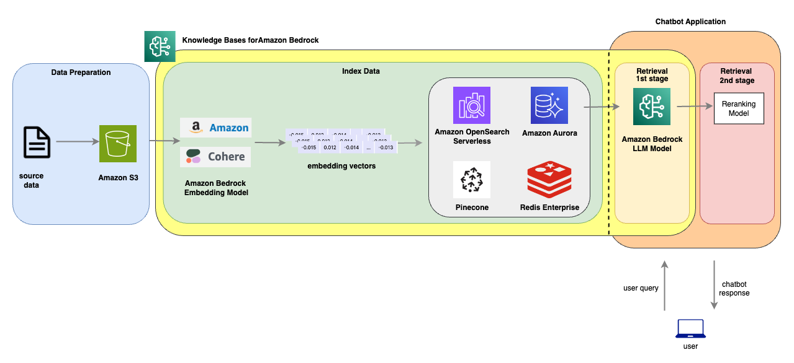
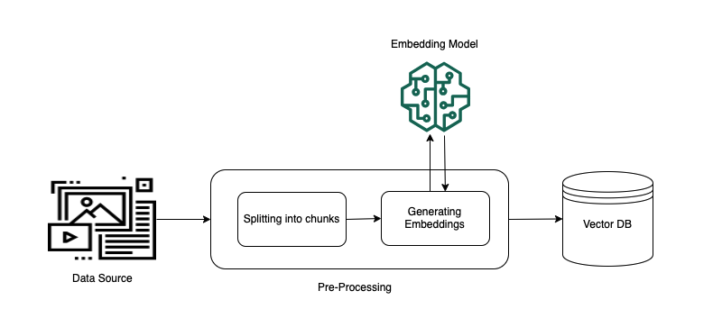
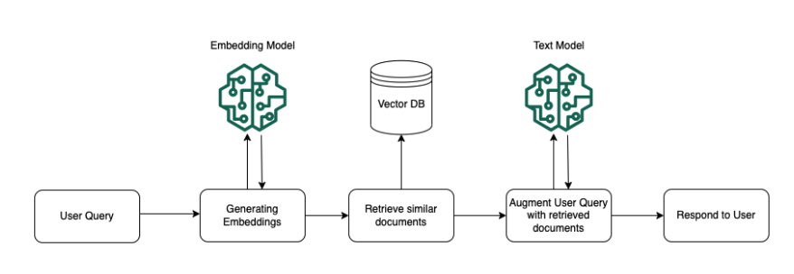
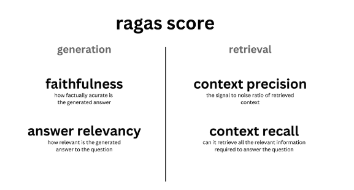

---
tags:
    - RAG/ Knowledge-Bases
    - RAG/ Data-Ingestion
    - Vector-DB/ OpenSearch
---

!!! tip inline end "[Open in github](https://github.com/aws-samples/amazon-bedrock-samples/tree/main/rag/knowledge-bases/features-examples/03-advanced-concepts/reranking/02_kb-reranker.ipynb){:target="_blank"}"

<h2>Improving accuracy for RAG based applications using Knowledge Bases For Amazon Bedrock and a Re-ranking model </h2>


<h2>Overview</h2>

When it comes to building a chatbot using GenAI LLMs, RAG is a popular architectural choice. It combines the strengths of knowledge base retrieval and generative models for text generation. Using RAG approach for building a chatbot has many advantages. For example, retrieving responses from its database before generating a response could provide more relevant and coherent responses. This helps improve the conversational flow. RAG also scales better with more data compared to pure generative models and it doesn’t require fine tuning of the model when new data is added to the knowledge base. Additionally, the retrieval component enables the model to incorporate external knowledge by retrieving relevant background information from its database. This approach helps provide factual, in-depth and knowledgeable responses.

<h2>RAG Challenges</h2>
Despite clear advantages of using RAG for building Chatbots, there are some challenges when it comes to applying it for practical use. 
In order to find an answer, RAG takes an approach that uses vector search across the documents. The advantage of using vector search is the speed and scalability. Rather than scanning every single document to find the aswer, using RAG approach, we would turn the texts (knowledge base) into embeddings and store these embeddings in the database. The embeddings are compressed version of the documents, represented by array of numerical values. After the embeddings are stored,  vector search queries the vector database to find the similarity based on the vectors associated with the documents. Typically vector search will return the top k most relevant documents based on the user question, and return the k results. However, since the similarity algorithm in vector database works on vectors and not documents, vector search does not always return the most relevant information in the top k results. This directly impacts the accuracy of the response if the most relevant contexts are not available to the LLM. 

A proposed solution to address the challenge of RAG approach is called Reranking. Reranking is a technique that can further improve the responses by selecting the best option out of several candidate responses. Here is how reranking could work, described in the sequential order:

1. The chatbot generates its top 5 response candidates using RAG.
2. These candidates are fed into a reranking model. This model scores each response based on how relevant, natural and informative they are.
3. The response with the highest reranking score is selected as the context to feed the LLM in generating a response .

In summary, reranking allows the chatbot to filter out poor responses and pick the best one to send back. This further improves the quality and consistency of the conversations.

<h2>Architecture</h2>
The following architecture dipicts a 2 stage retrieval by integrating a vector DB, an LLM and a reranking model. In the diagram, we will demonstrate how this could easily be built using Knowledge Base for Bedrock and a reranking model. 



In this notebook, we are going to demonstrate how to build a solution from the above architecture. Additionally, we'll also evaluate the performance of each approach (i.e. standard RAG approach vs RAG + reranking model) and perform analysis and share the results.

<h2>Prerequisites</h2>
1. This notebook is tested using Amazon SageMaker Studio Jupyterlab Notebook. This notebook contains steps require the appropriate permission to perform actions on behalf of the IAM user/ Assumed role who runs the notebook. Following snippet contains the IAM policies required to run the notebook successfully.
```
{
    "Version": "2012-10-17",
    "Statement": [
        {
            "Effect": "Allow",
            "Action": ["bedrock:*"],
            "Resource": "*"
        },
        {
            "Effect": "Allow",
            "Action": ["iam:PutRolePolicy", "iam:CreateRole"],
            "Resource": "*"
        },
        {
            "Effect": "Allow",
            "Action": ["aoss:*"],
            "Resource": "*"
        }
    ]
}
```

2. In order to run this notebook successfully, you would first deploy a reranking model. Our example utilizes a reranking model named [BGE-Large](https://huggingface.co/BAAI/bge-reranker-large) deployed in Amazon SageMaker. The code for deploying the model is available in [deploy-reranking-model-sm.ipynb](deploy-reranking-model-sm.ipynb) in this directory. If you haven't deployed the reranking model, please proceed to the notebook and complete the steps, then come back and continue with this notebook.

Let's first install the dependencies we need for the notebook.


```python
%pip install -r requirements.txt
```

Let's also restore the variables that we stored in the previous notebook: `deploy-reranking-model-sm.ipynb`


```python
%load_ext autoreload
%autoreload 2
```


```python
%store -r
```

Import the python libraries


```python
import boto3
import json
import os
import uuid
import urllib.request
import sagemaker
import math
from utils import helper
import ragas
from datasets import Dataset
import time
```

<h2>Dataset</h2>
To demonstrate RAG semantic search, we'll need to first ingest documents into a vector database. For this example, we'll ingest a book
call 'The Great Gatsby', a 1925 novel by American writer F. Scott Fitzgerald. This book is publically available in the project [gutenberg website](https://www.gutenberg.org/)

In addition to the book, we'll also leverage Bedrock model to create 20 questions and the answers so that we could use those information for evaluating the performance of these RAG approaches. 

Please refer to the license information for gutenbergy project: https://www.gutenberg.org/policy/license.html

The specific license for this ebook is documented at the bottom of the book here: https://www.gutenberg.org/cache/epub/64317/pg64317-images.html


```python
target_url = "https://www.gutenberg.org/ebooks/64317.txt.utf-8" # the great gatsby
data = urllib.request.urlopen(target_url)
my_texts = []
for line in data:
    my_texts.append(line.decode())
```

Split the documents into 10 large chunks by a fixed size, then uploads them to S3 bucket location for downstream process. 


```python
doc_size = 700 # size of the document to determine number of batches
batches = math.ceil(len(my_texts) / doc_size)
```


```python
<h2>use boto3 s3 to upload a string to S3 </h2>
sagemaker_session = sagemaker.Session()
default_bucket = sagemaker_session.default_bucket()
s3_prefix = "bedrock/knowledgebase/datasource"

start = 0
s3 = boto3.client("s3")
for batch in range(batches):
    batch_text_arr = my_texts[start:start+doc_size]
    batch_text = "".join(batch_text_arr)
    s3.put_object(
        Body=batch_text,
        Bucket=default_bucket,
        Key=f"{s3_prefix}/{start}.txt"
    )
    start += doc_size   
```

<h2>Setup</h2>
In our setup, we'll be using a Bedrock 3p model called Claude v3 Haiku with 200k context window. In addition, we'll use the Amazon Titan Text Embedding v2 to convert the documents into embeddings and store the vectors into Opensearch serverless collection. 


```python
execution_role = sagemaker.get_execution_role()
bedrock = boto3.client("bedrock")
bedrock_runtime = boto3.client("bedrock-runtime")
agent_runtime = boto3.client('bedrock-agent-runtime')
bedrock_agent = boto3.client("bedrock-agent")
retrieval_topk = 10
model_id = "anthropic.claude-3-haiku-20240307-v1:0"
embedding_dim = 1024
region = bedrock.meta.region_name
embedding_model_id = "amazon.titan-embed-text-v2:0"
embedding_model_arn = f"arn:aws:bedrock:{region}::foundation-model/amazon.titan-embed-text-v2:0"
boto3_credentials = boto3.Session().get_credentials() # needed for authenticating against opensearch cluster for index creation
```

<h2> Create a Knowledge Base using Amazon Bedrock</h2>
The following section describes the steps to take in order to create a knowledge base in Bedrock. We are going to use the Amazon Bedrock Agent SDK and Opensearch SDK to create the required components. 

<h3>How it works</h3>
Knowledge base for Amazon Bedrock help you take advantage of Retrieval Augmented Generation (RAG), a popular technique that involves drawing information from a data store to augment the responses generated by Large Language Models (LLMs). With this approach, your application can query the knowledge base to return most relevant information found in your knowledge base to answer the query either with direct quotations from sources or with natural responses generated from the query results.

There are 2 main processes involved in carrying out RAG functionality via Knowledge Bases for Bedrock:

1. Pre-processing - Ingest source data, create embeddings for the data and populate the embeddings into a vector database.
2. 
3. Runtime Execution - Query the vectorDB for similar documents based on user query and return topk documents as the basis for the LLM to provide a response.
The following diagrams illustrate schematically how RAG is carried out. Knowledge base simplifies the setup and implementation of RAG by automating several steps in this process.

The following diagrams show how the components for each stage and how they are constructed. 

<h3>Preprocesing Stage</h3>


<h3>Runtime Execution Stage</h3>



Defines the variables for creating a knowledge base, OpenSaerch serverless collection and creating an ingestion job. 


```python
random_id = str(uuid.uuid4().hex)[:5]
vector_store_name = f'bedrock-kb-rerank-{random_id}'
index_name = f"bedrock-kb-rerank-index-{random_id}"
encryption_policy_name = f"bedrock-kb-rerank-sp-{random_id}"
network_policy_name = f"bedrock-kb-rerank-np-{random_id}"
access_policy_name = f"bedrock-kb-rerank-ap-{random_id}"
kb_role_name = f"bedrock-kb-rerank-role-test-{random_id}"
knowledge_base_name = f"bedrock-kb-rerank-test-{random_id}"
```

<h2>Steps for creating a Knowledge Base for Bedrock application</h2>
Creating a knowledge base involves the following steps:

1. Create an opensearch serverless collection as the vector DB.
2. Create an index for the collection to be used for all the documents
3. Create the required IAM service roles for Bedrock to integrate with the collection
4. Create a Knowledge Base for Bedrock application.
5. Create a data ingestion job to create the embeddings into the opensearch serverless collection.

Luckily, all the steps outlined above are provided as a helper function so you don't have to do this yourself!

**Note** The knowledge base creation step below takes about 5 minutes. Please be patient and and let it finish everything before stopping any processes. 


```python
knowledge_base_id = helper.create_knowledge_base(knowledge_base_name, 
                                                 kb_role_name, 
                                                 embedding_model_arn, 
                                                 embedding_dim,
                                                 default_bucket, 
                                                 s3_prefix, 
                                                 vector_store_name, 
                                                 index_name, 
                                                 encryption_policy_name, 
                                                 network_policy_name, 
                                                 access_policy_name,
                                                 region,
                                                 boto3_credentials)
```

<h2>Generate Questions From the Documents</h2>
We have prepared a list of questions and answers from the book which we'll used as the base for the questions and answers.
These questions and answers are generated by an LLM in Bedrock. 

**Important:** Just as many LLM applications, it's important to leverage human in the loop to validate the Q&A generated by the LLM to ensure they are correct and accurate. For our experiment, all the questions and answers have been validated by human, so that we could use them as the ground truth for a fair model and RAG evaluation process. 

The Q&A data serves as the foundation for the RAG evaluation based on the approaches that we are going to implement. We'll define the generated answers from this step as ground truth data.

Next, based on the generated questions, we'll use Bedrock Agent SDK to retrieve the contexts that's most relevant to the question, and generate answers for each one of them. These data would be served as the source data for standard RAG approach.

We also share a notebook that walks through the process of using an LLM to generate questions and answers [here](qa-generator.ipynb)


```python
with open("data/qa_samples.json", "r") as f:
    data = f.read()
    data_samples = json.loads(data)
```


```python
standard_rag_time_start = time.time()
contexts, answers = helper.generate_context_answers(bedrock_runtime, agent_runtime, model_id, knowledge_base_id, retrieval_topk, data_samples['question'])
standard_rag_time_end = time.time()
standard_rag_time_elapsed_time = standard_rag_time_end - standard_rag_time_start
```


```python
contexts
```


```python
data_samples['contexts'] = contexts
data_samples['answer'] = answers
```


```python
ds = Dataset.from_dict(data_samples)
```

<h2>RAG Evaluation</h2>
To evaluate the effectiveness of RAG, well use a framework called [RAGAS](https://arxiv.org/pdf/2309.15217.pdf). The framework 
provides a suite of metrics which can be used to evaluate different dimensions. For more information about how to setup RAGAS for evaluation, please visit their [documentation](https://docs.ragas.io/en/stable/).

At a high level, RAGAS evaluation focuses on the following key components:




Here's are the summary of some of the evaluation components supported in RAGAS:

<h3>Faithfullness</h3>
This measures the factual consistency of the generated answer against the given context. It is calculated from answer and retrieved context. The answer is scaled to (0,1) range. Higher the better.

The generated answer is regarded as faithful if all the claims that are made in the answer can be inferred from the given context. To calculate this a set of claims from the generated answer is first identified. Then each one of these claims are cross checked with given context to determine if it can be inferred from given context or not. 

<h3>Answer Relevancy</h3>
The evaluation metric, Answer Relevancy, focuses on assessing how pertinent the generated answer is to the given prompt. A lower score is assigned to answers that are incomplete or contain redundant information. This metric is computed using the question and the answer, with values ranging between 0 and 1, where higher scores indicate better relevancy.

<h3>Context Relevancy</h3>
This metric gauges the relevancy of the retrieved context, calculated based on both the question and contexts. The values fall within the range of (0, 1), with higher values indicating better relevancy.

<h3>Answer Correctness</h3>
The assessment of Answer Correctness involves gauging the accuracy of the generated answer when compared to the ground truth. This evaluation relies on the ground truth and the answer, with scores ranging from 0 to 1. A higher score indicates a closer alignment between the generated answer and the ground truth, signifying better correctness.

Answer correctness encompasses two critical aspects: semantic similarity between the generated answer and the ground truth, as well as factual similarity. These aspects are combined using a weighted scheme to formulate the answer correctness score. Users also have the option to employ a ‘threshold’ value to round the resulting score to binary, if desired.

<h3>Answer Similarity</h3>
The concept of Answer Semantic Similarity pertains to the assessment of the semantic resemblance between the generated answer and the ground truth. This evaluation is based on the ground truth and the answer, with values falling within the range of 0 to 1. A higher score signifies a better alignment between the generated answer and the ground truth.

Measuring the semantic similarity between answers can offer valuable insights into the quality of the generated response. This evaluation utilizes a cross-encoder model to calculate the semantic similarity score.


In our example, we'll explore the following evaluation components:

* Answer Relevancy
* Answer Similarity
* Context Relevancy
* Answer Correctness


```python
from ragas import evaluate
from ragas.metrics import (
    faithfulness,
    answer_correctness,
    answer_similarity,
    context_relevancy,
    answer_relevancy
)
from langchain_aws import ChatBedrock
from langchain_community.embeddings import BedrockEmbeddings
```


```python
metrics = [
    answer_similarity,
    context_relevancy,
    answer_correctness,
    answer_relevancy
]
```


```python
import nest_asyncio 
nest_asyncio.apply() # Based on Ragas documenttion this is only needed when running in a jupyter notebook. 
```


```python
config = {
    "region_name": region,  # E.g. "us-east-1"
    "model_id": model_id,  # E.g "anthropic.claude-3-haiku-20240307-v1:0"
    "model_kwargs": {"temperature": 0.9},
}

bedrock_model = ChatBedrock(
    region_name=config["region_name"],
    model_id=config["model_id"],
    model_kwargs=config["model_kwargs"],
)

<h2>init the embeddings</h2>
bedrock_embeddings = BedrockEmbeddings(
    region_name=config["region_name"],
    model_id = embedding_model_id
)
```

Perform the RAG evaluation based on the collected datapoints.


```python
evaluation_result = evaluate(
    ds,
    metrics=metrics,
    llm=bedrock_model,
    embeddings=bedrock_embeddings,
    raise_exceptions=False
)
```

Shows the results in great detail


```python
df = evaluation_result.to_pandas()
df
```


```python
print(f"""A summarized report for standard RAG approach based on RAGAS evaluation: 

answer_relevancy: {evaluation_result['answer_relevancy']}
answer_similarity: {evaluation_result['answer_similarity']}
answer_correctness: {evaluation_result['answer_correctness']}
context_relevancy: {evaluation_result['context_relevancy']}""")
```

<h2>Evaluating RAG using 2 stage retrieval</h2>
In the following section, we'll explore the 2 stage retrieval approach by extending the standard RAG approach to integrate with a reranking model. 

In the context of RAG, reranking models are used after an initial set of contexts are retrieved by the retriever. The reranking model takes in the list of results and reranks each one of them based on the similarity between the context and the user query.

In our example, we'll use an opensource reranker called [bge-large](https://huggingface.co/BAAI/bge-reranker-large). For more information about deploying the model, please refer to [deploy-reranking-model-sm.ipynb](deploy-reranking-model-sm.ipynb).


```python
reranking_topk = 3

two_stage_rag_time_start = time.time()
contexts, answers = helper.generate_two_stage_context_answers(bedrock_runtime, 
                                                              agent_runtime,
                                                              model_id, 
                                                              knowledge_base_id,
                                                              retrieval_topk,
                                                              reranking_model_endpoint,
                                                              data_samples['question'], 
                                                              reranking_topk)
two_stage_rag_time_end = time.time()
two_stage_rag_time_elapsed_time = two_stage_rag_time_end - two_stage_rag_time_start
```


```python
two_stage_data_samples = {}
two_stage_data_samples['contexts'] = contexts
two_stage_data_samples['answer'] = answers
two_stage_data_samples['question'] = data_samples['question']
two_stage_data_samples['ground_truth'] = data_samples['ground_truth']
```


```python
two_stage_ds = Dataset.from_dict(two_stage_data_samples)
```


```python
two_stage_evaluation_result = evaluate(
    two_stage_ds,
    metrics=metrics,
    llm=bedrock_model,
    embeddings=bedrock_embeddings,
    raise_exceptions=False,
)
```


```python
df_two_stage = two_stage_evaluation_result.to_pandas()
df_two_stage
```


```python
print(f"""A summarized report for a 2 stage retrieval RAG approach based on RAGAS evaluation: 

answer_relevancy: {two_stage_evaluation_result['answer_relevancy']}
answer_similarity: {two_stage_evaluation_result['answer_similarity']}
answer_correctness: {two_stage_evaluation_result['answer_correctness']}
context_relevancy: {two_stage_evaluation_result['context_relevancy']}""")
```

<h2>Visualize RAGAS evaluation metrics</h2>
After running RAGAS evaluation for both approaches, let's compare the evaluation results and visualize the metrics in a plot as followed.


```python
from matplotlib import pyplot as plt
import pandas as pd
```


```python
two_stage_mean_df = pd.DataFrame({ 
    "answer_relevancy" : [df_two_stage['answer_relevancy'].mean()], 
    "answer_similarity" : [df_two_stage['answer_similarity'].mean()], 
    "context_relevancy" : [df_two_stage['context_relevancy'].mean()],
    "answer_correctness" : [df_two_stage['answer_correctness'].mean()]})
two_stage_mean_df = pd.melt(two_stage_mean_df, var_name="metric")
```


```python
one_stage_retrieval_mean_df = pd.DataFrame({ 
    "answer_relevancy" : [df['answer_relevancy'].mean()], 
    "answer_similarity" : [df['answer_similarity'].mean()], 
    "context_relevancy" : [df['context_relevancy'].mean()],
    "answer_correctness" : [df['answer_correctness'].mean()]})
one_stage_retrieval_mean_df = pd.melt(one_stage_retrieval_mean_df, var_name="metric")
```


```python
combined_df = pd.merge(one_stage_retrieval_mean_df, two_stage_mean_df, on='metric', suffixes=("_one_stage_retrieval", "_two_stage_retrieval"))
```


```python
plt.rcParams["figure.figsize"] = (10,5)
ax = combined_df.plot(kind='bar', x='metric', rot=0)
ax.legend(bbox_to_anchor=(1.05, 1), loc='upper left')
ax.set_title("RAG One Stage vs Two-Stage Retrieval Evaluation Metrics")
ax.set_xlabel('Metric', fontsize=10)
ax.set_ylabel('Score (higher the better)', fontsize=16)
plt.show()
```

<h2>Speed Comparison between RAG approaches</h2>
Due to using different approaches in the query and retrieval process in the Q&A application, we expect the performance would also be different. In the following, we'll compare the speed of both the RAG approaches and visualize the differences. 
In the previous cells, in addition to running the RAG for all the questions, we also captured the elapsed time for these 2 approaches. In the following section, we'll demonstrate the performance using a visualization based on the captured time. 


```python
print(f"Standard RAG took: {standard_rag_time_elapsed_time} seconds. Two stage retrieval took: {two_stage_rag_time_elapsed_time} seconds")
```


```python
speed_test_df = pd.DataFrame(data = { "speed (s)" : [standard_rag_time_elapsed_time, two_stage_rag_time_elapsed_time] }, index=["Standard RAG","Two Stage RAG"] )

```


```python
speed_test_df
```


```python
speed_test_df.plot(kind='bar', rot=0, title="Speed comparison between Standard RAG and Two Stage Retrieval (10 requests)", ylabel="elspased time", xlabel="RAG approach")
```

<h2>Observations</h2>
Based on the results we gathered over several runs, we share the observations as followed:

1. The two stage RAG model yields better answer correctness and answer similarity compared to the standard RAG.
2. The two stage RAG model yields better context relevancy because the number of contexts from the retrieval was reranked, then reduced through reraking model, therefore increasing the relevancy.
3. The standard RAG outperforms the two stage RAG model in terms of latency. This is due to the extra model invocation in the two stage RAG to rerank the documents. 

<h2>Conclusion</h2>
In this notebook, we demonstrates how to implement a 2 stage retrieval process by integrating a reranking model. 
We started by uploaded the sample texts into an S3 bucket for creating the corresponding vector embeddings. 
After the data is uploaded to S3, we created a [knowledge Base for Bedrock](https://aws.amazon.com/bedrock/knowledge-bases) application and 
integrated it with an OpenSearch serverless collection. We fired a data ingestion job using the Bedrock Agent SDK to create the vector embeddings for the 
data on S3, and persists the vectors into the given Opensearch serverless collection. 

To perform RAG evaluation on both the standard RAG and the two stage retrieval with a reranking model approach, we used an open source framework RAGAS focusing on *context relevancy*, *answer relevancy*, *answer similarity* and *answer correctness*. Finally, we provided a comparison between these 2 approaches using RAGAS metrics over a plot. 

<h2>Clean up</h2>
If you are done with the experiment, you can delete the resources used in this notebook by running the following cells below.


```python
response = bedrock_agent.delete_knowledge_base(
    knowledgeBaseId=knowledge_base_id
)
```


```python
aoss_client = boto3.client('opensearchserverless')
```


```python
response = aoss_client.delete_security_policy(name=encryption_policy_name, type='encryption')
```


```python
response = aoss_client.delete_access_policy(name=access_policy_name, type='data')
```


```python
response = aoss_client.list_collections(
    collectionFilters={
        'name': vector_store_name,
        'status': 'ACTIVE'
    },)
```


```python
collection_id = response['collectionSummaries'][0]['id']
```


```python
response = aoss_client.delete_collection(
    id=collection_id
)
```


```python
sess = sagemaker.Session()
sess.delete_endpoint(reranking_model_endpoint)
```


```python

```
