# Direct ingestion of Google Drive documents using a custom data source and the Document Level API (DLA)

With Document Level API (DLA), customers can now efficiently and cost-effectively ingest, update, or delete data directly from Amazon Bedrock Knowledge Bases using a single API call, without the need to perform a full sync with the data source periodically or after every change.

To read more about DLA, see the [documentation](https://docs.aws.amazon.com/bedrock/latest/userguide/kb-direct-ingestion-add.html)

In this example, we pull documents from google drive and then store these issues as documents in our knowledge base using DLA.

# Pre-requisites
- You will need to create a knowledge base with a custom data source.  You can do this via the AWS console or follow the instructions in this notebook.  [01_create_ingest_documents_test_kb_multi_ds.ipynb](/knowledge-bases/01-rag-concepts/01_create_ingest_documents_test_kb_multi_ds.ipynb).  Please note the knowledge base id and the data source id.
- You will need a Google Drive and some sample data.  You can create a free google account for this.  You will need to setup API access for Google Drive.  See below for details.


# Acquire Sample Data

We will use free ebooks from Project Gutenburg for our documents.  

First, right click and `save as` the following link to download 'Alice in Wonderland': https://www.gutenberg.org/ebooks/11.txt.utf-8

Second, right click and `save as` the following link to download 'Jonathan Swift': https://www.gutenberg.org/ebooks/829.txt.utf-8

# Add the documents to Google Drive.

You will need a google account.  Go to https://workspace.google.com/products/drive/ and sign in.  Drag the two books from your desktop to the drive.  When done it should look something like this:

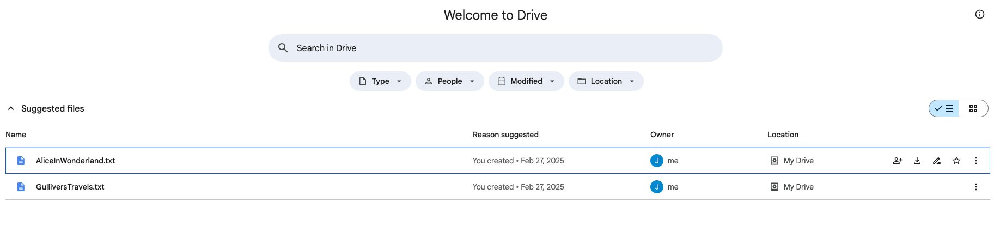

Now we can setup access to the Google Drive API

# Google Drive API Access Setup

https://console.cloud.google.com/flows/enableapi?apiid=drive.googleapis.com

1/ Create a project 

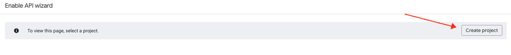

2/ Enter a project name and click create


3/ Confirm your project by clicking next

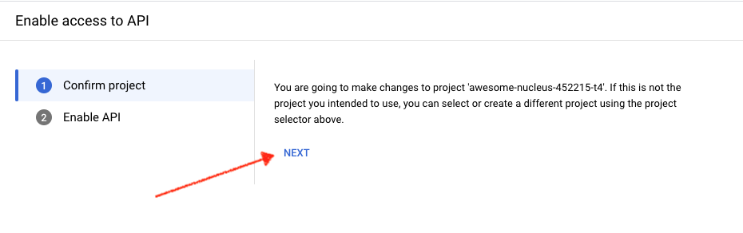

4/ Enable access to the API.  Click Enable

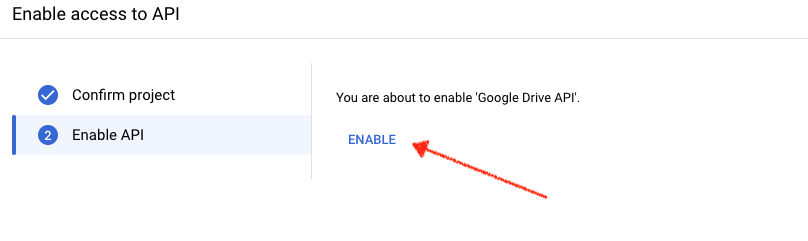

# configure OAUTH
https://console.cloud.google.com/auth/branding

5/ Go to the branding page and click "Get Started"

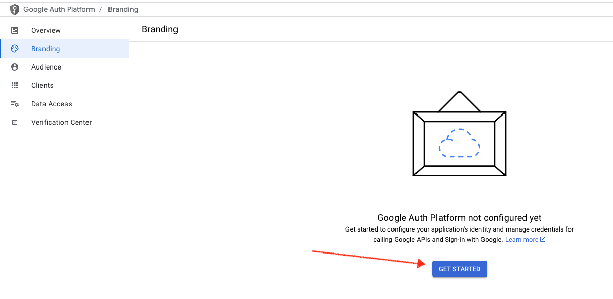

6/ Enter an App Name and Email, then click next.


7/ Choose External for audience, then click next.


8/ Enter your email, then click next.

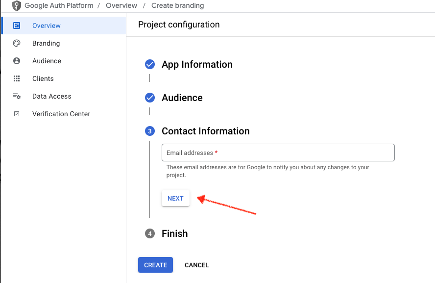

9/ Accept the terms then click create.

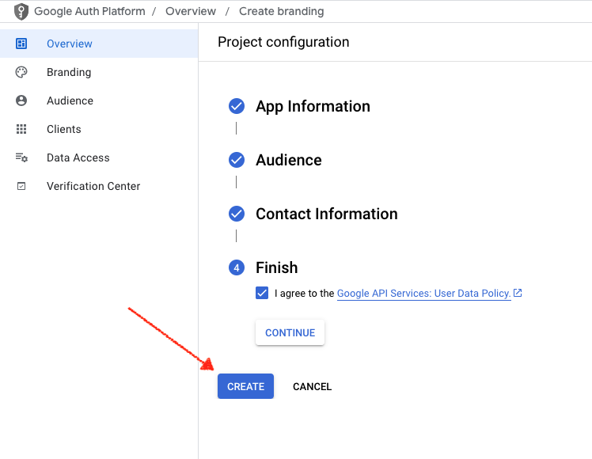

10/ Select "Data Access" then "Add or Remove Scopes"

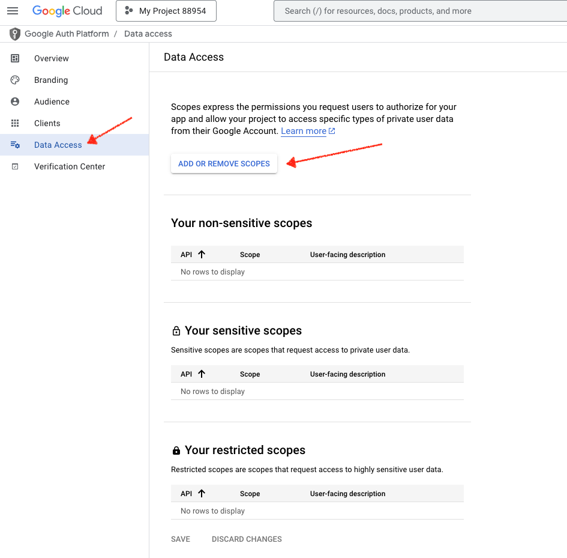

11/ Choose the scope as shown below, then click update.

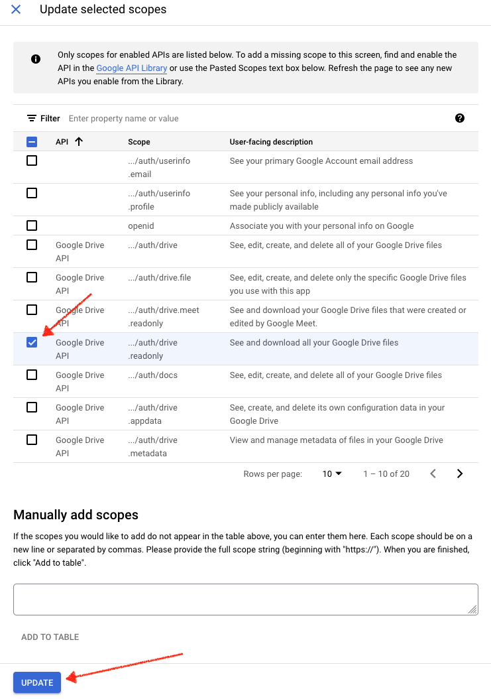

12/ Click Save

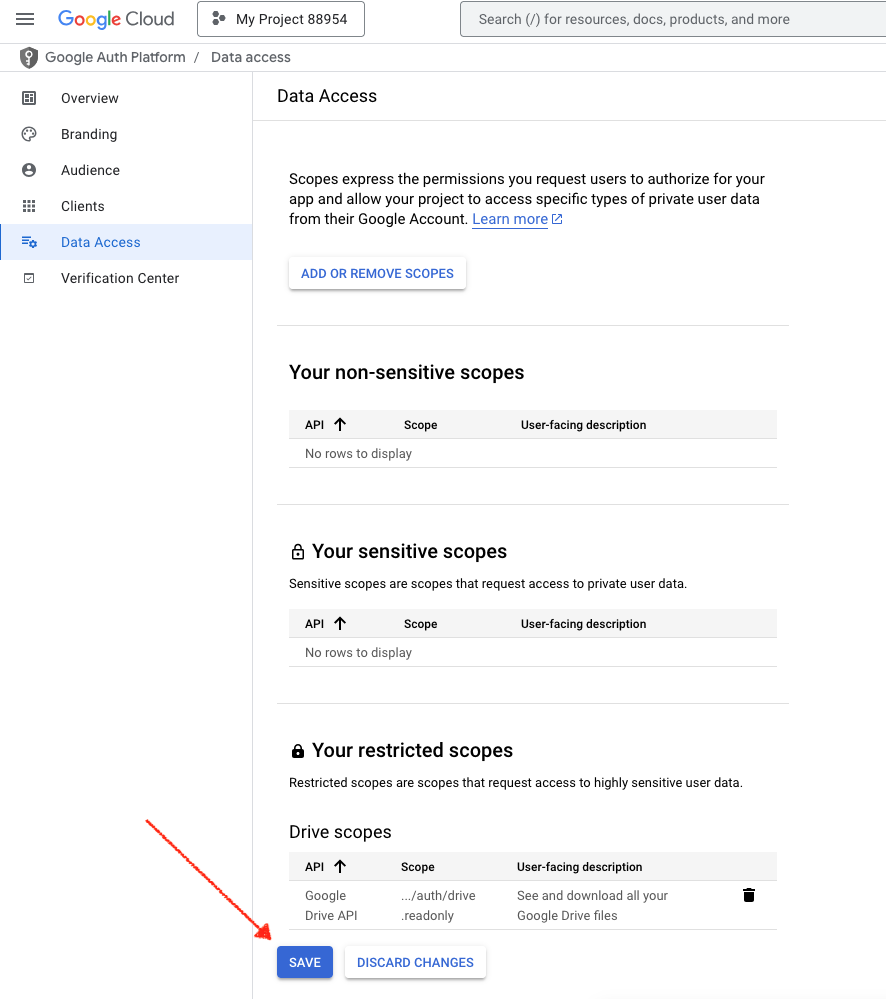

13/ Under Clients, create a desktop App.

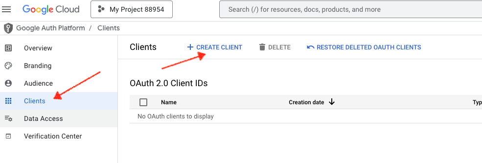

14/ Select Desktop App, then click create

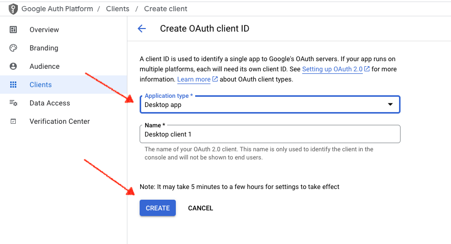

15/ Click the arrow to download your credentials.  Save them to the working directory as "credentials.json"


15/ Under Audience, add yourself as a test user.


This completes the google drive setup, now we can move on to the code.


```python
# install the google client libraries
!pip install --upgrade google-api-python-client google-auth-httplib2 google-auth-oauthlib

```

<div class="alert alert-block alert-info">
<b>Note:</b> Please make sure to enable `Anthropic Claude 3 Sonnet` and,  `Titan Text Embeddings V2` model access in Amazon Bedrock Console.
<br> -------------------------------------------------------------------------------------------------------------------------------------------------------   </br>
    
Please run the notebook cell by cell instead of using "Run All Cells" option.
</div>

# Install dependencies


```python
%pip install --force-reinstall -q -r ../../features-examples/requirements.txt  --quiet
%pip install --upgrade boto3
%pip install dotenv
```

# Set System Path
We are using helper functions from the features-examples folder so we set the system path accordingly to allow for imports.


```python
import sys
from pathlib import Path
current_path = Path().resolve()
# modify path so we can access the utilities functions in the features-examples folder
current_path = current_path.parent.parent / 'features-examples'
if str(current_path) not in sys.path:
    sys.path.append(str(current_path))
print(sys.path)

```

# Setup the environment
Open the file 'example_dot_env' and fill in the appropriate values for your `KNOWLEDGE_BASE_ID` and `DOCUMENT_STORE_ID`.  Rename it to .env so the python interpreter will pick it up.


```python
from dotenv import load_dotenv
import os

load_dotenv()

kb_id = os.environ.get("KNOWLEDGE_BASE_ID")
ds_id = os.environ.get("DOCUMENT_STORE_ID")

```

The following code has functions to list and read files from google drive.  For this exercise make sure the 2 ebooks are the only documents stored to your drive.  


```python
import os.path
import io
from google.auth.transport.requests import Request
from google.oauth2.credentials import Credentials
from google_auth_oauthlib.flow import InstalledAppFlow
from googleapiclient.discovery import build
from googleapiclient.errors import HttpError
from googleapiclient.http import MediaIoBaseDownload

# If modifying these scopes, delete the file token.json.
SCOPES = ["https://www.googleapis.com/auth/drive.readonly"]


def read_text_file(file_id):
    """Reads a text file from Google Drive and prints its contents
    Args:
        file_id: ID of the file to read
    """
    creds = None
    if os.path.exists("token.json"):
        creds = Credentials.from_authorized_user_file("token.json", SCOPES)
    if not creds or not creds.valid:
        if creds and creds.expired and creds.refresh_token:
            creds.refresh(Request())
        else:
            flow = InstalledAppFlow.from_client_secrets_file(
                "credentials.json", SCOPES
            )
            creds = flow.run_local_server(port=0)
        with open("token.json", "w") as token:
            token.write(creds.to_json())

    try:
        service = build("drive", "v3", credentials=creds)
        
        # Create a bytes IO object to store the file content
        request = service.files().get_media(fileId=file_id)
        file = io.BytesIO()
        downloader = MediaIoBaseDownload(file, request)
        
        # Download the file
        done = False
        while done is False:
            status, done = downloader.next_chunk()

        # Read the content
        file.seek(0)
        content = file.read().decode('utf-8')
        
        return content

    except HttpError as error:
        print(f"An error occurred: {error}")


def list_files():
  """Shows basic usage of the Drive v3 API.
  Prints the names and ids of the first 10 files the user has access to.
  """
  creds = None
  # The file token.json stores the user's access and refresh tokens, and is
  # created automatically when the authorization flow completes for the first
  # time.
  if os.path.exists("token.json"):
    creds = Credentials.from_authorized_user_file("token.json", SCOPES)
  # If there are no (valid) credentials available, let the user log in.
  if not creds or not creds.valid:
    if creds and creds.expired and creds.refresh_token:
      creds.refresh(Request())
    else:
      flow = InstalledAppFlow.from_client_secrets_file(
          "credentials.json", SCOPES
      )
      creds = flow.run_local_server(port=0)
    # Save the credentials for the next run
    with open("token.json", "w") as token:
      token.write(creds.to_json())

  try:
    service = build("drive", "v3", credentials=creds)

    # Call the Drive v3 API
    results = (
        service.files()
        .list(pageSize=10, fields="nextPageToken, files(id, name)")
        .execute()
    )
    items = results.get("files", [])

    if not items:
      print("No files found.")
      return
    return items
  except HttpError as error:
    # TODO(developer) - Handle errors from drive API.
    print(f"An error occurred: {error}")


```

# Generate documents for the knowledge base.
We loop through the books and create a 'document' for each one.  We store the book source as metadata for each document.  This allows for filtering when we use the Retrieve and Generate API.


```python
from utils.knowledge_base_operators import create_document_config, ingest_documents_dla
import json

def build_document_config(document_id, document_content, source_name):
    
    metadata_source = {'key': 'source', 'value': { 'stringValue': source_name, 'type': 'STRING'}}
    metadata_list =[metadata_source]


    custom_inline_text_inline_metadata = create_document_config(
            data_source_type='CUSTOM',
            document_id=document_id,
            inline_content={
                'type': 'TEXT',
                'data': json.dumps(document_content)
            },
            metadata= metadata_list
    )

    return custom_inline_text_inline_metadata


```

When you run the cell below, you'll be redirected to google to authenticate.  After authentication, it will read each ebook and store them to a list.


```python

documents = []

files = list_files()
for file in files:
    print(f"{file['name']} ({file['id']})")
    content = read_text_file(file['id'])
    document_id = file['name']
    doc = build_document_config(document_id, content, "Project Gutenburg")
    documents.append(doc)

print(f"Total number of documents: {len(documents)}")
```

# Load documents directly to the knowledge base


```python
# there is a limit of 10 documents per request, so we split the document into chunks.
for i in range(0, len(documents), 10):
    chunk = documents[i:i + 10]
    response = ingest_documents_dla(
            knowledge_base_id=kb_id,
            data_source_id=ds_id,
            documents=chunk 
        )
    print(response)
```

# Check the status of your documents
You should see a list of your documents with a status of 'indexed'


```python
import boto3
import pprint

bedrock_agent_client = boto3.client('bedrock-agent') 
# To fetch the status of documents
response = bedrock_agent_client.list_knowledge_base_documents(
    dataSourceId=ds_id,
    knowledgeBaseId=kb_id,
)
pprint.pprint(response)
```

# Query the knowledge base
Here we query the knowledge base with a question about Alice in Wonderland.  Notice the use of metadata to filter by document source.


```python


query = 'Who is the mad hatter?'
region = 'us-east-1'
foundation_model = "anthropic.claude-3-haiku-20240307-v1:0"

bedrock_agent_runtime_client = boto3.client('bedrock-agent-runtime') 

result = bedrock_agent_runtime_client.retrieve_and_generate(
    input={
        "text": query
    },
    retrieveAndGenerateConfiguration={
        "type": "KNOWLEDGE_BASE",
        "knowledgeBaseConfiguration": {
            'knowledgeBaseId': kb_id,
            "modelArn": "arn:aws:bedrock:{}::foundation-model/{}".format(region, foundation_model),
            "retrievalConfiguration": {
                "vectorSearchConfiguration": {
                    "numberOfResults":5,
                    "filter": {
                        "equals": {
                        "key": "source",
                        "value": "Project Gutenburg"
                    }
                }
                } 
            }

        }
    }
)
if result:
    print(result['output']['text'],end='\n'*2)
    print("------- METADATA -------")
    for citation in result['citations']:
        for ref in citation['retrievedReferences']:
            metadata = ref['metadata']
            print(metadata['x-amz-bedrock-kb-source-uri'], metadata['source'])


```

# Example response

The mad hatter is a character that appears in the search results. He is described as a hatter who is having tea with the March Hare and Dormouse. 
The search results indicate that the hatter is considered "mad" or insane.


------- METADATA -------
AliceInWonderland.txt Project Gutenburg

