# Direct ingestion of JIRA documents using a custom data source and the Document Level API (DLA)

With Document Level API (DLA), customers can now efficiently and cost-effectively ingest, update, or delete data directly from Amazon Bedrock Knowledge Bases using a single API call, without the need to perform a full sync with the data source periodically or after every change.

To read more about DLA, see the [documentation](https://docs.aws.amazon.com/bedrock/latest/userguide/kb-direct-ingestion-add.html)

In this example, we pull JIRA issues via an API then store these issues as documents in our knowledge base using DLA.

# Pre-requisites
- You will need to create a knowledge base with a custom data source.  You can do this via the AWS console or follow the instructions in this notebook.  [01_create_ingest_documents_test_kb_multi_ds.ipynb](/knowledge-bases/01-rag-concepts/01_create_ingest_documents_test_kb_multi_ds.ipynb).  Please note the knowledge base id and the data source id.
- You will need a JIRA account with an API key and some sample data.  See below for details.


# JIRA Setup

Follow the next steps to create a free JIRA account and get an API Key

1/ Go to www.atlassian.com and click sign-in


2/ Create an account

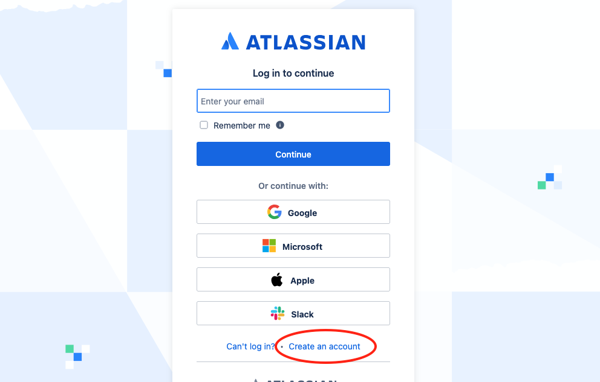

3/ Enter your email and click sign up

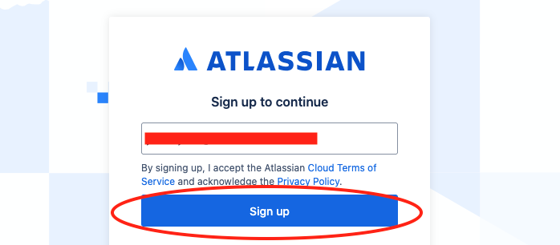

4/ Check your email then enter the verification code

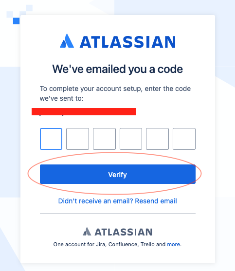

5/ Create your username and password

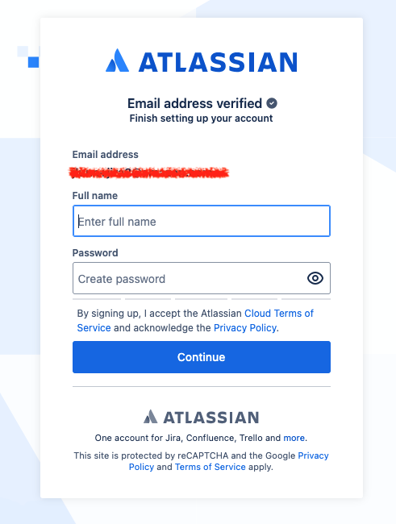

6/ Select the JIRA trial


7/ Select the free trial


8/ Create a site.  Note the name of the site for later.


9/ Create a project

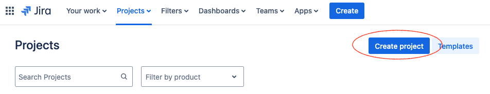

10/ Select the software development template and then choose Scrum

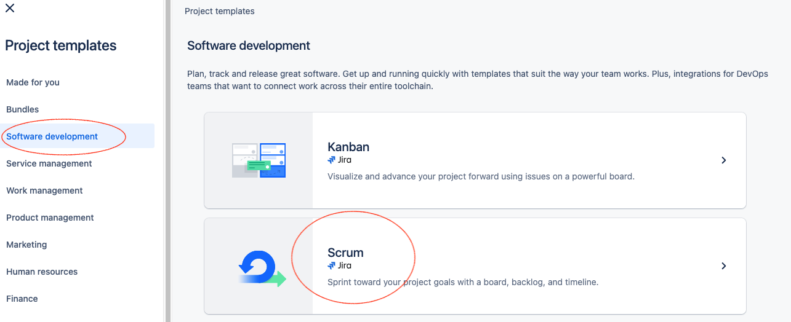

11/  Select Use Template 

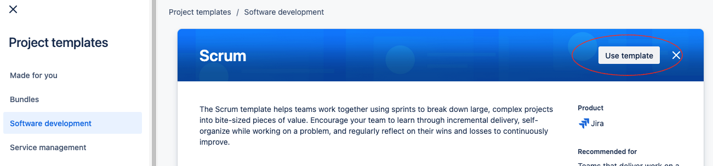

12/ Select Team Managed Project


13/ Give your project a name and create it.


14/ Create an issue for your project


15/ Fill in the details and click create.

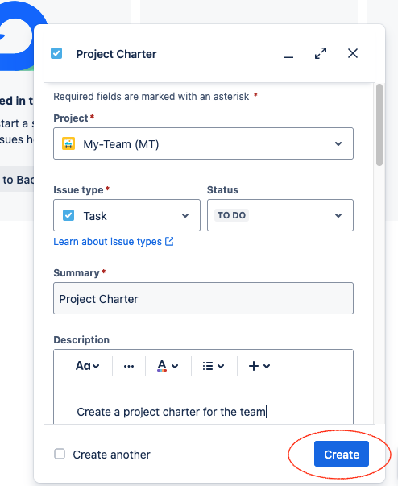

16/ Switch to the list view to see the issue you just created.

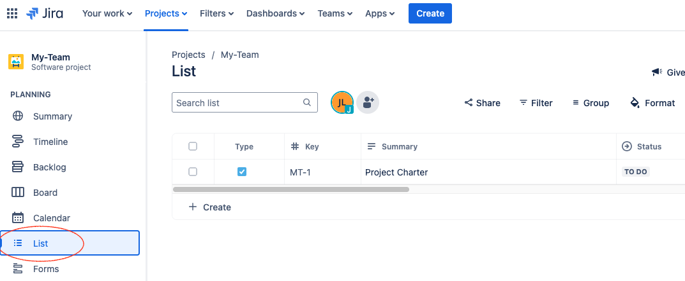

17/ Now we need to create an api key.  Click on your user profile then select 'manage account'

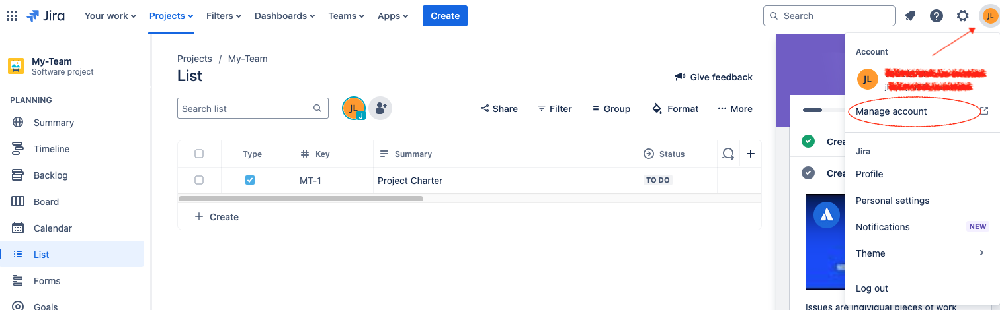

18/ On the security tab select 'create and manage api tokens'


19/ Click Create

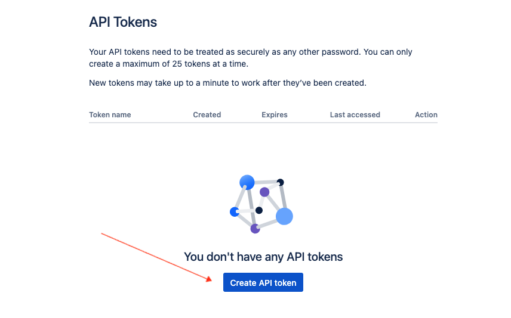

20/ Give your token a name and click create.

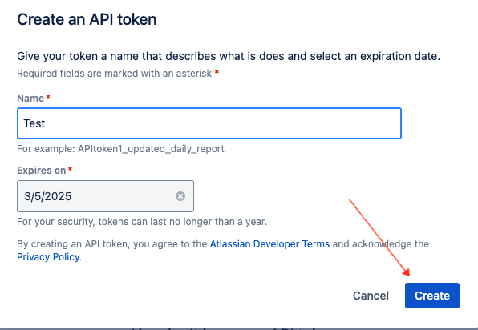

21/ Copy your API token, you will need this later.


<div class="alert alert-block alert-info">
<b>Note:</b> Please make sure to enable `Anthropic Claude 3 Sonnet` and,  `Titan Text Embeddings V2` model access in Amazon Bedrock Console.
<br> -------------------------------------------------------------------------------------------------------------------------------------------------------   </br>
    
Please run the notebook cell by cell instead of using "Run All Cells" option.
</div>

# Install dependencies


```python
%pip install --force-reinstall -q -r ../../features-examples/requirements.txt  --quiet
%pip install --upgrade boto3
%pip install jira
%pip install dotenv
```

# Set System Path
We are using helper functions from the features-examples folder so we set the system path accordingly to allow for imports.


```python
import sys
from pathlib import Path
current_path = Path().resolve()
# modify path so we can access the utilities functions in the features-examples folder
current_path = current_path.parent.parent / 'features-examples'
if str(current_path) not in sys.path:
    sys.path.append(str(current_path))
print(sys.path)

```

# Setup the environment
Open the file 'example_dot_env' and fill in the appropriate values.  Rename it to .env so the python interpreter will pick it up.


```python
from dotenv import load_dotenv
import os

load_dotenv()

jira_server = os.environ.get("JIRA_SERVER")
email = os.environ.get("JIRA_EMAIL")
api_token = os.environ.get("JIRA_API_TOKEN")
kb_id = os.environ.get("KNOWLEDGE_BASE_ID")
ds_id = os.environ.get("DOCUMENT_STORE_ID")

```

# Setup the JIRA connection


```python
from jira import JIRA

print(jira_server)
# Create JIRA connection
jira = JIRA(
    server=jira_server,
    basic_auth=(email, api_token)
)

# retrieve the jira projects
projects = jira.projects()


```

# Generate documents for the knowledge base.
We loop through each JIRA project and create a 'document' for each jira issue.  We store the project and the reporter as metadata for each document.  This allows for filtering when we use the Retrieve and Generate API.


```python
from utils.knowledge_base_operators import create_document_config, ingest_documents_dla
import json

def build_document_config(document_id, document_content, project_name, reporter_name):
    
    metadata_project = {'key': 'project', 'value': { 'stringValue': project_name, 'type': 'STRING'}}
    metadata_reporter = {'key': 'reporter', 'value': { 'stringValue': reporter_name, 'type': 'STRING'}}
    metadata_list =[metadata_project, metadata_reporter]


    custom_inline_text_inline_metadata = create_document_config(
            data_source_type='CUSTOM',
            document_id=document_id,
            inline_content={
                'type': 'TEXT',
                'data': json.dumps(document_content)
            },
            metadata= metadata_list
    )

    return custom_inline_text_inline_metadata

documents = []

for project in projects:
    project_name = project.name
    print(f"Project: {project_name}")
    print(project)
    issues = jira.search_issues(f"project={project}")
    for issue in issues:
        document_config = build_document_config(issue.key, issue.fields.description, project_name, issue.fields.reporter.displayName)
        documents.append(document_config)

print(f"Total number of documents: {len(documents)}")

```

# Load documents directly to the knowledge base


```python
# there is a limit of 10 documents per request, so we split the document into chunks.
for i in range(0, len(documents), 10):
    chunk = documents[i:i + 10]
    response = ingest_documents_dla(
            knowledge_base_id=kb_id,
            data_source_id=ds_id,
            documents=chunk 
        )
    print(response)
```

# Check the status of your documents
You should see a list of your documents with a status of 'indexed'


```python
import boto3
import pprint

bedrock_agent_client = boto3.client('bedrock-agent') 
# To fetch the status of documents
response = bedrock_agent_client.list_knowledge_base_documents(
    dataSourceId=ds_id,
    knowledgeBaseId=kb_id,
)
pprint.pprint(response)
```

# Query the knowledge base
Here we query the knowledge base for issues involving security.  Notice the use of metadata to filter by project name.  


```python


query = 'Do I have any security issues?'  # change this query to reflect the content of your jira issues.  
region = 'us-east-1'
foundation_model = "anthropic.claude-3-sonnet-20240229-v1:0"

bedrock_agent_runtime_client = boto3.client('bedrock-agent-runtime') 

result = bedrock_agent_runtime_client.retrieve_and_generate(
    input={
        "text": query
    },
    retrieveAndGenerateConfiguration={
        "type": "KNOWLEDGE_BASE",
        "knowledgeBaseConfiguration": {
            'knowledgeBaseId': kb_id,
            "modelArn": "arn:aws:bedrock:{}::foundation-model/{}".format(region, foundation_model),
            "retrievalConfiguration": {
                "vectorSearchConfiguration": {
                    "numberOfResults":5,
                    "filter": {
                        "equals": {
                        "key": "project",
                        "value": "Acme Software"
                    }
        }
                } 
            }

        }
    }
)
if result:
    print(result['output']['text'],end='\n'*2)
    print("------- METADATA -------")
    for citation in result['citations']:
        for ref in citation['retrievedReferences']:
            metadata = ref['metadata']
            print(metadata['x-amz-bedrock-kb-source-uri'], metadata['reporter'])


```

# Example Response

Based on the search results, you have security issues related to unrestricted access allowed by some of your security groups in AWS. Specifically, the search results mention that several of your security groups are allowing unrestricted incoming traffic (0.0.0.0/0) on certain ports, which poses a security risk. To resolve these issues, you should review the inbound rules for the affected security groups and restrict access to only trusted IP addresses or security groups for the required ports. Remove any rules allowing unrestricted 0.0.0.0/0 access on ports that should be restricted. Additionally, it is recommended to implement additional security measures like IP tables and regularly audit your security group rules to ensure they align with your security requirements.

