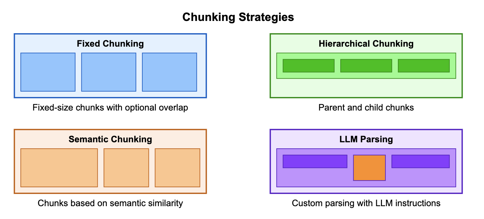

---
tags:
    - RAG/ Knowledge-Bases
    - Open Source/ Langchain
    - Open Source/ LlamaIndex
---

<!-- <style>
  .md-typeset h1,
  .md-content__button {
    display: none;
  }
</style> -->

<!-- <h2>Chunking strategies for RAG applications</h2> -->

!!! tip inline end "[Open in github](https://github.com/aws-samples/amazon-bedrock-samples/blob/main/rag/open-source/chunking/rag_chunking_strategies_langchain_bedrock.ipynb){:target="_blank"}"

**A quick Recap of RAG**

RAG consists of two main components: a retriever and a generator.

- Retriever: The retriever is responsible for retrieving relevant information from text source
- Generator: The generator is an LLM that takes the input query/context and the retrieved information as input and generates the final output text

Retriever has following steps:

- Dividing documents into smaller sections for efficient data access.
- Converting these sections into numerical representations called embeddings.
- Storing the embeddings in a vector index that maintains a link to the original documents.
- Using the vector embeddings to analyze and find related or relevant information within the data.

In this notebook we will dive deep into first step of retriever which is splitting the document into smaller sections.

Credit: 

[GenAI under the hood [Part 8] - A visual guide to advanced chunking strategies](!https://community.aws/content/2j9KouvnFz4zVdtsXcbMpN3G6Cw/genai-under-the-hood-part-8---a-visual-guide-to-advanced-chunking-strategies?lang=en) 

[How to split text based on semantic similarity](!https://python.langchain.com/v0.2/docs/how_to/semantic-chunker/)

<h2>Overview</h2>

In this notebook we will go through following topics:
- Different strategies to split the document into smaller sections
- Sample code to try out different strategies using LangChain and Amazon Bedrock
- Next steps

<h2>Types of Chunking Strategies:</h2>

- Standard/Fixed chunking
  -  Character Splitting - Simple static character chunks of data
  -  Recursive Character Text Splitting - Recursive chunking based on a list of separators
- Semantic Chunking
- Hierarchical chunking
- Advanced parsing/ LLM based chunking
  

  

  **In this notebook we will look into standard/fixed chunking, Semantic Chunking and Hierarchical chunking.**

<h3>Setup</h3>

!!! info
    This notebook should work well with the Data Science 3.0 kernel (Python 3.10 runtime) in SageMaker Studio

Before running the rest of this notebook, you'll need to run the cells below to (ensure necessary libraries are installed and) connect to Bedrock.


```python
%pip install -U opensearch-py==2.3.1 --quiet
%pip install -U boto3 --quiet
%pip install -U retrying==1.3.4 --quiet
%pip install --quiet langchain langchain-community langchain_experimental langchain_aws bs4 pypdf
%pip install --quiet llama-index
```


<h2>1. Load Documents</h2>

We first need to download sample documents on which we will be building our Q&A. For this sample we are downloading Amazon letter to shareholders.


```python
!mkdir -p ./data

from urllib.request import urlretrieve

urls = [
    "https://s2.q4cdn.com/299287126/files/doc_financials/2023/ar/2022-Shareholder-Letter.pdf",
    "https://s2.q4cdn.com/299287126/files/doc_financials/2022/ar/2021-Shareholder-Letter.pdf",
    "https://s2.q4cdn.com/299287126/files/doc_financials/2021/ar/Amazon-2020-Shareholder-Letter-and-1997-Shareholder-Letter.pdf",
    "https://s2.q4cdn.com/299287126/files/doc_financials/2020/ar/2019-Shareholder-Letter.pdf",
]

filenames = [
    "AMZN-2022-Shareholder-Letter.pdf",
    "AMZN-2021-Shareholder-Letter.pdf",
    "AMZN-2020-Shareholder-Letter.pdf",
    "AMZN-2019-Shareholder-Letter.pdf",
]

data_root = "./data/"

for idx, url in enumerate(urls):
    file_path = data_root + filenames[idx]
    urlretrieve(url, file_path)
```


```python
from langchain.document_loaders import PyPDFLoader
import os

data_root = "./data/"
folder_path = data_root
documents = []

# Loop through all files in the folder
for filename in os.listdir(folder_path):
    file_path = os.path.join(folder_path, filename)
    loader = PyPDFLoader(file_path)
    # Load the PDF data
    data = loader.load()
    # Add the loaded data to the documents list
    documents.extend(data)

# Print the text of the first page of the first document
if documents:
    print(documents[0].page_content)
else:
    print("No PDF files found in the folder.")
```

    To our shareowners:
    In Amazon’s 1997 letter to shareholders, our first, I talked about our hope to create an “enduring franchise,”
    one that would reinvent what it means to serve customers by unlocking the internet’s power. I noted that
    Amazon had grown from having 158 employees to 614, and that we had surpassed 1.5 million customer
    accounts. We had just gone public at a split-adjusted stock price of $1.50 per share. I wrote that it was Day 1.
    We’ve come a long way since then, and we are working harder than ever to serve and delight customers.
    Last year, we hired 500,000 employees and now directly employ 1.3 million people around the world. We have
    more than 200 million Prime members worldwide. More than 1.9 million small and medium-sized businesses
    sell in our store, and they make up close to 60% of our retail sales. Customers have connected more than
    100 million smart home devices to Alexa. Amazon Web Services serves millions of customers and ended 2020
    with a $50 billion annualized run rate. In 1997, we hadn’t invented Prime, Marketplace, Alexa, or AWS.
    They weren’t even ideas then, and none was preordained. We took great risk with each one and put sweat
    and ingenuity into each one.
    Along the way, we’ve created $1.6 trillion of wealth for shareowners. Who are they? Y our Chair is one, and
    my Amazon shares have made me wealthy. But more than 7/8ths of the shares, representing $1.4 trillion of
    wealth creation, are owned by others. Who are they? They’re pension funds, universities, and 401(k)s, and
    they’re Mary and Larry, who sent me this note out of the blue just as I was sitting down to write this
    shareholder letter:
    


<h2>Chunking</h2>

<h3>1. Fixed chunking</h3>

Fixed-size chunking allows you to customize the size of the text chunks by specifying the number of tokens per chunk and the amount of overlap between consecutive chunks. This provides flexibility to align the chunking with your specific requirements. You can set the maximum number of tokens that a chunk must not exceed, as well as the percentage of overlap between consecutive chunks. 

<h4>1.1 Character splitting</h4>

This is the simplest method. This splits text into chunks by specifying the number of tokens per chunk and an overlap percentage.

Let's load up LangChains `CharacterSplitter` and try it out!


```python
from langchain.text_splitter import CharacterTextSplitter
```

This is the simplest method. This splits based on a given character sequence, which defaults to "\n\n". Chunk length is measured by number of characters.

1. How the text is split: by single character separator.
2. How the chunk size is measured: by number of characters.


```python
text_splitter = CharacterTextSplitter(chunk_size=100, chunk_overlap=10, separator="")
splits = text_splitter.split_documents(documents)
```

`chunk_size`: the maximum length (in characters) of each chunk or segment that the text will be split into. 

`chunk_overlap`: the number of characters that should overlap between consecutive chunks. This overlap can help provide context to the subsequent chunks, especially when dealing with tasks that require understanding the surrounding context. 

`separator`: a string that specifies the separators used to split the text into chunks. By default, it is set to "\n\n", which means that the splitter will split the text at occurrences of two consecutive newline characters


```python
splits[:2]
```


    [Document(metadata={'source': './data/AMZN-2020-Shareholder-Letter.pdf', 'page': 0}, page_content='To our shareowners:\nIn Amazon’s 1997 letter to shareholders, our first, I talked about our hope to c'),
     Document(metadata={'source': './data/AMZN-2020-Shareholder-Letter.pdf', 'page': 0}, page_content='hope to create an “enduring franchise,”\none that would reinvent what it means to serve customers by')]


<h4> 1.2 Recursive Character Text Splitting </h4>

With `CharacterTextSplitter` we simply split by a fix number of characters.

The Recursive Character Text Splitter is recommended for generic text. It is parameterized by a list of characters. It tries to split on them in order until the chunks are small enough. The default list is ["\n\n", "\n", " ", ""]. This has the effect of trying to keep all paragraphs (and then sentences, and then words) together as long as possible, as those would generically seem to be the strongest semantically related pieces of text.


```python
from langchain_text_splitters import RecursiveCharacterTextSplitter

rec_text_splitter = RecursiveCharacterTextSplitter(
    chunk_size=100, chunk_overlap=10
)
rec_text_splits = text_splitter.split_documents(documents)
```


```python
rec_text_splits[:2]
```


    [Document(metadata={'source': './data/AMZN-2020-Shareholder-Letter.pdf', 'page': 0}, page_content='To our shareowners:\nIn Amazon’s 1997 letter to shareholders, our first, I talked about our hope to c'),
     Document(metadata={'source': './data/AMZN-2020-Shareholder-Letter.pdf', 'page': 0}, page_content='hope to create an “enduring franchise,”\none that would reinvent what it means to serve customers by')]


<h2>2. Semantic Chunking</h2>

Semantic chunking is a natural language processing technique that divides text into meaningful and complete chunks based on the semantic similarity calculated by the embedding model. By focusing on the text's meaning and context, semantic chunking significantly improves the quality of retrieval in most use cases, rather than blind, syntactic chunking.


**Create Text Splitter**

To instantiate a `SemanticChunker`, we must specify an embedding model. Below we will use `BedrockEmbeddings`


```python
from langchain_aws.embeddings.bedrock import BedrockEmbeddings
from langchain_experimental.text_splitter import SemanticChunker
import boto3

# ---- ⚠️ Update region for your AWS setup ⚠️ ----
bedrock_client = boto3.client("bedrock-runtime", region_name="us-east-1")

embeddings_model = BedrockEmbeddings(
    client=bedrock_client, model_id="amazon.titan-embed-text-v1"
)

semantic_text_splitter = SemanticChunker(embeddings_model)

semantic_text_splits = semantic_text_splitter.split_documents(documents)
```


```python
semantic_text_splits[:2]
```


    [Document(metadata={'source': './data/AMZN-2020-Shareholder-Letter.pdf', 'page': 0}, page_content='To our shareowners:\nIn Amazon’s 1997 letter to shareholders, our first, I talked about our hope to create an “enduring franchise,”\none that would reinvent what it means to serve customers by unlocking the internet’s power. I noted that\nAmazon had grown from having 158 employees to 614, and that we had surpassed 1.5 million customer\naccounts. We had just gone public at a split-adjusted stock price of $1.50 per share. I wrote that it was Day 1. We’ve come a long way since then, and we are working harder than ever to serve and delight customers. Last year, we hired 500,000 employees and now directly employ 1.3 million people around the world. We have\nmore than 200 million Prime members worldwide. More than 1.9 million small and medium-sized businesses\nsell in our store, and they make up close to 60% of our retail sales. Customers have connected more than\n100 million smart home devices to Alexa. Amazon Web Services serves millions of customers and ended 2020\nwith a $50 billion annualized run rate. In 1997, we hadn’t invented Prime, Marketplace, Alexa, or AWS. They weren’t even ideas then, and none was preordained.'),
     Document(metadata={'source': './data/AMZN-2020-Shareholder-Letter.pdf', 'page': 0}, page_content='We took great risk with each one and put sweat\nand ingenuity into each one. Along the way, we’ve created $1.6 trillion of wealth for shareowners. Who are they? Y our Chair is one, and\nmy Amazon shares have made me wealthy. But more than 7/8ths of the shares, representing $1.4 trillion of\nwealth creation, are owned by others. Who are they? They’re pension funds, universities, and 401(k)s, and\nthey’re Mary and Larry, who sent me this note out of the blue just as I was sitting down to write this\nshareholder letter:\n')]


**Breakpoints**

This chunker works by determining when to "break" apart sentences. This is done by looking for differences in embeddings between any two sentences. When that difference is past some threshold, then they are split.

There are a few ways to determine what that threshold is:
- Percentile
- Standard Deviation
- Interquartile
- Gradient


**Percentile**

The default way to split is based on percentile. In this method, all differences between sentences are calculated, and then any difference greater than the X percentile is split.


```python
semantic_text_splitter = SemanticChunker(
    embeddings_model, breakpoint_threshold_type="percentile"
)

semantic_text_splits = semantic_text_splitter.split_documents(documents)
```


```python
semantic_text_splits[:2]
```


    [Document(metadata={'source': './data/AMZN-2020-Shareholder-Letter.pdf', 'page': 0}, page_content='To our shareowners:\nIn Amazon’s 1997 letter to shareholders, our first, I talked about our hope to create an “enduring franchise,”\none that would reinvent what it means to serve customers by unlocking the internet’s power. I noted that\nAmazon had grown from having 158 employees to 614, and that we had surpassed 1.5 million customer\naccounts. We had just gone public at a split-adjusted stock price of $1.50 per share. I wrote that it was Day 1. We’ve come a long way since then, and we are working harder than ever to serve and delight customers. Last year, we hired 500,000 employees and now directly employ 1.3 million people around the world. We have\nmore than 200 million Prime members worldwide. More than 1.9 million small and medium-sized businesses\nsell in our store, and they make up close to 60% of our retail sales. Customers have connected more than\n100 million smart home devices to Alexa. Amazon Web Services serves millions of customers and ended 2020\nwith a $50 billion annualized run rate. In 1997, we hadn’t invented Prime, Marketplace, Alexa, or AWS. They weren’t even ideas then, and none was preordained.'),
     Document(metadata={'source': './data/AMZN-2020-Shareholder-Letter.pdf', 'page': 0}, page_content='We took great risk with each one and put sweat\nand ingenuity into each one. Along the way, we’ve created $1.6 trillion of wealth for shareowners. Who are they? Y our Chair is one, and\nmy Amazon shares have made me wealthy. But more than 7/8ths of the shares, representing $1.4 trillion of\nwealth creation, are owned by others. Who are they? They’re pension funds, universities, and 401(k)s, and\nthey’re Mary and Larry, who sent me this note out of the blue just as I was sitting down to write this\nshareholder letter:\n')]


**Standard Deviation**

In this method, any difference greater than X standard deviations is split.


```python
semantic_text_splitter = SemanticChunker(
    embeddings_model, breakpoint_threshold_type="standard_deviation"
)

semantic_text_splits = semantic_text_splitter.split_documents(documents)
```


```python
semantic_text_splits[:2]
```


    [Document(metadata={'source': './data/AMZN-2020-Shareholder-Letter.pdf', 'page': 0}, page_content='To our shareowners:\nIn Amazon’s 1997 letter to shareholders, our first, I talked about our hope to create an “enduring franchise,”\none that would reinvent what it means to serve customers by unlocking the internet’s power. I noted that\nAmazon had grown from having 158 employees to 614, and that we had surpassed 1.5 million customer\naccounts. We had just gone public at a split-adjusted stock price of $1.50 per share. I wrote that it was Day 1. We’ve come a long way since then, and we are working harder than ever to serve and delight customers. Last year, we hired 500,000 employees and now directly employ 1.3 million people around the world. We have\nmore than 200 million Prime members worldwide. More than 1.9 million small and medium-sized businesses\nsell in our store, and they make up close to 60% of our retail sales. Customers have connected more than\n100 million smart home devices to Alexa. Amazon Web Services serves millions of customers and ended 2020\nwith a $50 billion annualized run rate. In 1997, we hadn’t invented Prime, Marketplace, Alexa, or AWS. They weren’t even ideas then, and none was preordained. We took great risk with each one and put sweat\nand ingenuity into each one. Along the way, we’ve created $1.6 trillion of wealth for shareowners. Who are they? Y our Chair is one, and\nmy Amazon shares have made me wealthy. But more than 7/8ths of the shares, representing $1.4 trillion of\nwealth creation, are owned by others. Who are they? They’re pension funds, universities, and 401(k)s, and\nthey’re Mary and Larry, who sent me this note out of the blue just as I was sitting down to write this\nshareholder letter:\n'),
     Document(metadata={'source': './data/AMZN-2020-Shareholder-Letter.pdf', 'page': 1}, page_content='I am approached with similar stories all the time. I know people who’ve used their Amazon money for\ncollege, for emergencies, for houses, for vacations, to start their own business, for charity – and the list goes\non. I’m proud of the wealth we’ve created for shareowners. It’s significant, and it improves their lives. But I\nalso know something else: it’s not the largest part of the value we’ve created. Create More Than You Consume\nIf you want to be successful in business (in life, actually), you have to create more than you consume. Y our\ngoal should be to create value for everyone you interact with. Any business that doesn’t create value for those\nit touches, even if it appears successful on the surface, isn’t long for this world. It’s on the way out. Remember that stock prices are not about the past. They are a prediction of future cash flows discounted\nback to the present. The stock market anticipates. I’m going to switch gears for a moment and talk about the\npast. How much value did we create for shareowners in 2020? This is a relatively easy question to answer\nbecause accounting systems are set up to answer it. Our net income in 2020 was $21.3 billion. If, instead of\nbeing a publicly traded company with thousands of owners, Amazon were a sole proprietorship with a single\nowner, that’s how much the owner would have earned in 2020. How about employees? This is also a reasonably easy value creation question to answer because we can look\nat compensation expense. What is an expense for a company is income for employees. In 2020, employees\nearned $80 billion, plus another $11 billion to include benefits and various payroll taxes, for a total of\n$91 billion. How about third-party sellers? We have an internal team (the Selling Partner Services team) that works to\nanswer that question. They estimate that, in 2020, third-party seller profits from selling on Amazon were\nbetween $25 billion and $39 billion, and to be conservative here I’ll go with $25 billion. For customers, we have to break it down into consumer customers and AWS customers. We’ll do consumers first. We offer low prices, vast selection, and fast delivery, but imagine we ignore all of\nthat for the purpose of this estimate and value only one thing: we save customers time. Customers complete 28% of purchases on Amazon in three minutes or less, and half of all purchases are\nfinished in less than 15 minutes. Compare that to the typical shopping trip to a physical store – driving,\nparking, searching store aisles, waiting in the checkout line, finding your car, and driving home. Research\nsuggests the typical physical store trip takes about an hour. If you assume that a typical Amazon purchase\ntakes 15 minutes and that it saves you a couple of trips to a physical store a week, that’s more than 75\nhours a year saved. That’s important. We’re all busy in the early 21stcentury. So that we can get a dollar figure, let’s value the time savings at $10 per hour, which is conservative. Seventy-\nfive hours multiplied by $10 an hour and subtracting the cost of Prime gives you value creation for each\nPrime member of about $630. We have 200 million Prime members, for a total in 2020 of $126 billion of value\ncreation. AWS is challenging to estimate because each customer’s workload is so different, but we’ll do it anyway,\nacknowledging up front that the error bars are high. Direct cost improvements from operating in the cloud\nversus on premises vary, but a reasonable estimate is 30%. Across AWS’s entire 2020 revenue of $45 billion,\nthat 30% would imply customer value creation of $19 billion (what would have cost them $64 billion on\ntheir own cost $45 billion from AWS). The difficult part of this estimation exercise is that the direct cost\nreduction is the smallest portion of the customer benefit of moving to the cloud. The bigger benefit is the\nincreased speed of software development – something that can significantly improve the customer’s\ncompetitiveness and top line. We have no reasonable way of estimating that portion of customer value\nexcept to say that it’s almost certainly larger than the direct cost savings. To be conservative here (and\nremembering we’re really only trying to get ballpark estimates), I’ll say it’s the same and call AWS customer\nvalue creation $38 billion in 2020. Adding AWS and consumer together gives us total customer value creation in 2020 of $164 billion.')]


**Interquartile**

In this method, the interquartile distance is used to split chunks.


```python
semantic_text_splitter = SemanticChunker(
    embeddings_model, breakpoint_threshold_type="interquartile"
)

semantic_text_splits = semantic_text_splitter.split_documents(documents)
```


```python
semantic_text_splits[:2]
```

**Gradient**

In this method, the gradient of distance is used to split chunks along with the percentile method. This method is useful when chunks are highly correlated with each other or specific to a domain e.g. legal or medical. The idea is to apply anomaly detection on gradient array so that the distribution become wider and easy to identify boundaries in highly semantic data.


```python
semantic_text_splitter = SemanticChunker(
    embeddings_model, breakpoint_threshold_type="gradient"
)

semantic_text_splits = semantic_text_splitter.split_documents(documents)
```


```python
semantic_text_splits[:2]
```


    [Document(metadata={'source': './data/AMZN-2020-Shareholder-Letter.pdf', 'page': 0}, page_content='To our shareowners:\nIn Amazon’s 1997 letter to shareholders, our first, I talked about our hope to create an “enduring franchise,”\none that would reinvent what it means to serve customers by unlocking the internet’s power.'),
     Document(metadata={'source': './data/AMZN-2020-Shareholder-Letter.pdf', 'page': 0}, page_content='I noted that\nAmazon had grown from having 158 employees to 614, and that we had surpassed 1.5 million customer\naccounts. We had just gone public at a split-adjusted stock price of $1.50 per share. I wrote that it was Day 1. We’ve come a long way since then, and we are working harder than ever to serve and delight customers. Last year, we hired 500,000 employees and now directly employ 1.3 million people around the world. We have\nmore than 200 million Prime members worldwide. More than 1.9 million small and medium-sized businesses\nsell in our store, and they make up close to 60% of our retail sales. Customers have connected more than\n100 million smart home devices to Alexa. Amazon Web Services serves millions of customers and ended 2020\nwith a $50 billion annualized run rate. In 1997, we hadn’t invented Prime, Marketplace, Alexa, or AWS. They weren’t even ideas then, and none was preordained. We took great risk with each one and put sweat\nand ingenuity into each one. Along the way, we’ve created $1.6 trillion of wealth for shareowners. Who are they? Y our Chair is one, and\nmy Amazon shares have made me wealthy. But more than 7/8ths of the shares, representing $1.4 trillion of\nwealth creation, are owned by others. Who are they? They’re pension funds, universities, and 401(k)s, and\nthey’re Mary and Larry, who sent me this note out of the blue just as I was sitting down to write this\nshareholder letter:\n')]


<h2> 3. Hierarchical chunking</h2>

Hierarchical chunking goes a step further by organizing documents into parent and child chunks.

By structuring the document hierarchically, the model gains a better understanding of the relationships between different parts of the content, enabling it to provide more contextually relevant and coherent responses.

To implement this we are going to use `HierarchicalNodeParser` of `llama-index`.

This node parser will chunk nodes into hierarchical nodes. This means a single input will be chunked into several hierarchies of chunk sizes, with each node containing a reference to it's parent node.

When combined with the AutoMergingRetriever, this enables us to automatically replace retrieved nodes with their parents when a majority of children are retrieved. This process provides the LLM with more complete context for response synthesis.


```python
from llama_index.core import SimpleDirectoryReader

reader = SimpleDirectoryReader(input_dir="data")
documents = reader.load_data()
```


```python
from llama_index.core.node_parser import HierarchicalNodeParser

node_parser = HierarchicalNodeParser.from_defaults(chunk_sizes=[512, 254, 128])

nodes = node_parser.get_nodes_from_documents(documents)
nodes[0].text
```


    'To our shareowners:\nOne thing we’ve learned from the COVID-19 crisis is how important Amazon has become to our customers. We\nwant you to know we take this responsibility seriously, and we’re proud of the work our teams are doing to helpcustomers through this difficult time.\nAmazonians are working around the clock to get necessary supplies delivered directly to the doorsteps of people\nwho need them. The demand we are seeing for essential products has been and remains high. But unlike apredictable holiday surge, this spike occurred with little warning, creating major challenges for our suppliers anddelivery network. We quickly prioritized the stocking and delivery of essential household staples, medicalsupplies, and other critical products.\nOur Whole Foods Market stores have remained open, providing fresh food and other vital goods for customers.\nWe are taking steps to help those most vulnerable to the virus, setting aside the first hour of shopping at WholeFoods each day for seniors. We have temporarily closed Amazon Books, Amazon 4-star, and Amazon Pop Upstores because they don’t sell essential products, and we offered associates from those closed stores theopportunity to continue working in other parts of Amazon.\nCrucially, while providing these essential services, we are focused on the safety of our employees and contractors\naround the world—we are deeply grateful for their heroic work and are committed to their health and well-being.Consulting closely with medical experts and health authorities, we’ve made over 150 significant process changesin our operations network and Whole Foods Market stores to help teams stay healthy, and we conduct dailyaudits of the measures we’ve put into place. We’ve distributed face masks and implemented temperature checksat sites around the world to help protect employees and support staff. We regularly sanitize door handles,stairway handrails, lockers, elevator buttons, and touch screens, and disinfectant wipes and hand sanitizer arestandard across our network.\nWe’ve also introduced extensive social distancing measures to help protect our associates. We have eliminated\nstand-up meetings during shifts, moved information sharing to bulletin boards, staggered break times, and spreadout chairs in breakrooms. While training new hires is challenging with new distancing requirements, we continueto ensure that every new employee gets six hours of safety training.'


```python
nodes[1].text
```


    'We’ve shifted training protocols so we don’thave employees gathering in one spot, and we’ve adjusted our hiring processes to allow for social distancing.\nA next step in protecting our employees might be regular testing of all Amazonians, including those showing no\nsymptoms. Regular testing on a global scale, across all industries, would both help keep people safe and help getthe economy back up and running. For this to work, we as a society would need vastly more testing capacity thanis currently available. If every person could be tested regularly, it would make a huge difference in how we fightthis virus. Those who test positive could be quarantined and cared for, and everyone who tests negative couldre-enter the economy with confidence.\nWe’ve begun the work of building incremental testing capacity. A team of Amazonians—from research scientists\nand program managers to procurement specialists and software engineers—moved from their normal day jobsonto a dedicated team to work on this initiative. We have begun assembling the equipment we need to build ourfirst lab and hope to start testing small numbers of our frontline employees soon. We are not sure how far we willget in the relevant timeframe, but we think it’s worth trying, and we stand ready to share anything we learn.'


<h2> Conclusion</h2>

In this notebook we have seen standard chunking with Character Splitting and Recursive Character Text Splitting. If you are working with standard text documents you can start with these two approaches to get started. We have also seen Semantic chunking which is a more advanced approach that uses semantic similarity instead of fixed chunk sizes.

<h2> Next steps:</h2>

- Explore advance parsing options for complex data such as tables and graphs using Amazon Bedrock Knowledge bases - https://docs.aws.amazon.com/bedrock/latest/userguide/kb-chunking-parsing.html
- Explore evaluating the performance of different chunking strategies 
- Try out these strategies with Amazon Bedrock knowledge base 
