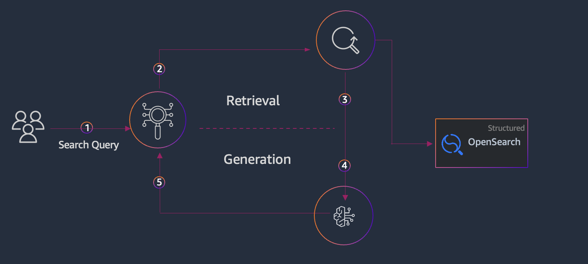

---
tags:
    - RAG/ Knowledge-Bases
    - Open Source/ Langchain
    - Vector-DB/ OpenSearch
---

<!-- <style>
  .md-typeset h1,
  .md-content__button {
    display: none;
  }
</style>

<h2> Build RAG solution with LangChain and Amazon Bedrock using OpenSearch Serverless</h2> -->

!!! tip inline end "[Open in github](https://github.com/aws-samples/amazon-bedrock-samples/blob/main/rag/open-source/vector_stores/rag_langchain_bedrock_opensearch.ipynb){:target="_blank"}"

This notebook provides sample code for building a RAG solution using LangChain and Amazon Bedrock using OpenSearch Serverless.

<h2>Overview</h2>

In a RAG application, the vector store plays a crucial role in the retrieval step. When a user submits a query, the query is first converted into a vector representation using a pre-trained language model. The vector store is then searched for the most relevant documents or passages based on the similarity between their vectors and the query vector. The retrieved documents or passages are then used to generate the response.

In this sample we will use OpenSearch Serverless to build a vector store and then use it in a RAG application using LangChain. The vector search collection type in OpenSearch Serverless provides a similarity search capability that is scalable and high performing. It makes it easy for you to build modern machine learning (ML) augmented search experiences and generative artificial intelligence (AI) applications without having to manage the underlying vector database infrastructure.




<h3>Steps: </h3>

1. Create necessary policies for Amazon OpenSearch Serverless
2. Create an OpenSearch Serverless cluster and deploy a vector store collection
3. Use the OpenSearch Serverless VectorStore as retriever in LangChain
4. Create generation pipeline using `create_stuff_documents_chain`
5. Use the pipeline to generate response for user queries


<h2> Setup </h2>

Before running the rest of this notebook, you'll need to run the cells below to (ensure necessary libraries are installed and) connect to Bedrock.


```python
%pip install -U opensearch-py==2.3.1 --quiet
%pip install -U boto3 --quiet
%pip install -U retrying==1.3.4 --quiet
%pip install --quiet langchain langchain-community langchain_aws bs4 pypdf
%pip install --quiet requests requests-aws4auth
```


<h2> 1. Create a vector store - OpenSearch Serverless index </h2>

First of all we have to create a vector store. In this section we will use Amazon OpenSearch serverless.

Amazon OpenSearch Serverless is a serverless option in Amazon OpenSearch Service. As a developer, you can use OpenSearch Serverless to run petabyte-scale workloads without configuring, managing, and scaling OpenSearch clusters. You get the same interactive millisecond response times as OpenSearch Service with the simplicity of a serverless environment. Pay only for what you use by automatically scaling resources to provide the right amount of capacity for your application—without impacting data ingestion.


```python
import boto3
import pprint

boto3_session = boto3.session.Session()
region_name = boto3_session.region_name
service = "aoss"


```


```python
vector_store_name = f'bedrock-sample-rag-oss'
index_name = f"bedrock-sample-rag-index-oss"
aoss_client = boto3_session.client('opensearchserverless')

pp = pprint.PrettyPrinter(indent=2)
```

This code creates three security policies for an Amazon OpenSearch Serverless collection using the. The policies include an encryption policy, a network policy, and an access policy. Here's a brief description of each policy:

**Encryption Policy:**

This policy specifies that Amazon OpenSearch Serverless should use an AWS-owned key for encrypting the data in the specified collection.
It grants the encryption permission for the specified collection.

**Network Policy:**

This policy allows public access to the specified collection.
It grants the network access permission for the specified collection.

**Access Policy:**

This policy grants permissions to the specified principal (the AWS identity executing the code) to perform various operations on the collection and its associated indexes.

For the collection, it grants permissions to create, delete, update, and describe collection items.
For the indexes associated with the collection, it grants permissions to create, delete, update, and describe indexes, as well as read and write documents.

<div class="alert alert-block alert-info">
<b>Note:</b> These policies are defined just to run this sample. Please make sure to define these policies based on your requirements and security best practices.
</div>


```python
import json


identity = boto3.client("sts").get_caller_identity()["Arn"]

encryption_policy_name = f"bedrock-sample-rag-oss"
network_policy_name = f"bedrock-sample-rag-np-oss"
access_policy_name = f"bedrock-sample-rag-ap-oss"

def create_policies_in_oss(
    vector_store_name, aoss_client
):
    encryption_policy = aoss_client.create_security_policy(
        name=encryption_policy_name,
        policy=json.dumps(
            {
                "Rules": [
                    {
                        "Resource": ["collection/" + vector_store_name],
                        "ResourceType": "collection",
                    }
                ],
                "AWSOwnedKey": True,
            }
        ),
        type="encryption",
    )

    network_policy = aoss_client.create_security_policy(
        name=network_policy_name,
        policy=json.dumps(
            [
                {
                    "Rules": [
                        {
                            "Resource": ["collection/" + vector_store_name],
                            "ResourceType": "collection",
                        }
                    ],
                    "AllowFromPublic": True,
                }
            ]
        ),
        type="network",
    )
    access_policy = aoss_client.create_access_policy(
        name=access_policy_name,
        policy=json.dumps(
            [
                {
                    "Rules": [
                        {
                            "Resource": ["collection/" + vector_store_name],
                            "Permission": [
                                "aoss:CreateCollectionItems",
                                "aoss:DeleteCollectionItems",
                                "aoss:UpdateCollectionItems",
                                "aoss:DescribeCollectionItems",
                            ],
                            "ResourceType": "collection",
                        },
                        {
                            "Resource": ["index/" + vector_store_name + "/*"],
                            "Permission": [
                                "aoss:CreateIndex",
                                "aoss:DeleteIndex",
                                "aoss:UpdateIndex",
                                "aoss:DescribeIndex",
                                "aoss:ReadDocument",
                                "aoss:WriteDocument",
                            ],
                            "ResourceType": "index",
                        },
                    ],
                    "Principal": [identity],
                    "Description": "Easy data policy",
                }
            ]
        ),
        type="data",
    )
    return encryption_policy, network_policy, access_policy
```

This code creates a new Amazon OpenSearch Serverless collection with the specified `vector_store_name` and applies the previously created security policies to it.


```python
encryption_policy, network_policy, access_policy = create_policies_in_oss(
    vector_store_name=vector_store_name,
    aoss_client=aoss_client,
)
collection = aoss_client.create_collection(name=vector_store_name, type="VECTORSEARCH")
```


```python
collection_id = collection["createCollectionDetail"]["id"]
collection_id = collection["createCollectionDetail"]["id"]
host = collection_id + "." + region_name + ".aoss.amazonaws.com"
print(host)
```

    7p2nmbgokp3l2ngnkrkf.us-east-1.aoss.amazonaws.com


```python
host = "7p2nmbgokp3l2ngnkrkf.us-east-1.aoss.amazonaws.com"
```


```python
import time

def interactive_sleep(seconds: int):
    dots = ""
    for i in range(seconds):
        dots += "."
        print(dots, end="\r")
        time.sleep(1)
    print("Done!")
```

Let's setup an OpenSearch index with a vector field for similarity search using the k-Nearest Neighbors (KNN) algorithm.

**Different embeddings models may have different output dimensions, and the dimension value in the mappings should be adjusted accordingly.**

In this sample we are using `amazon.titan-embed-text-v2:0`, which has an output dimension of 1024.


```python
# Create the vector index in Opensearch serverless, with the knn_vector field index mapping, specifying the dimension size, name and engine.
from opensearchpy import OpenSearch, RequestsHttpConnection, AWSV4SignerAuth, RequestError
credentials = boto3.Session().get_credentials()
awsauth = auth = AWSV4SignerAuth(credentials, region_name, service)

index_name = f"bedrock-sample-index-oss"
body_json = {
   "settings": {
      "index.knn": "true",
       "number_of_shards": 1,
       "knn.algo_param.ef_search": 512,
       "number_of_replicas": 0,
   },
   "mappings": {
      "properties": {
         "vector_field": {
            "type": "knn_vector",
            "dimension": 1024,
             "method": {
                 "name": "hnsw",
                 "engine": "faiss",
                 "space_type": "l2"
             },
         },
         "text": {
            "type": "text"
         },
         "text-metadata": {
            "type": "text"         }
      }
   }
}

# Build the OpenSearch client
oss_client = OpenSearch(
    hosts=[{'host': host, 'port': 443}],
    http_auth=awsauth,
    use_ssl=True,
    verify_certs=True,
    connection_class=RequestsHttpConnection,
    timeout=300
)
```


```python
# Create index
try:
    response = oss_client.indices.create(index=index_name, body=json.dumps(body_json))
    print("\nCreating index:")
    pp.pprint(response)

    # index creation can take up to a minute
    interactive_sleep(60)
except RequestError as e:
    # you can delete the index if its already exists
    # oss_client.indices.delete(index=index_name)
    print(
        f"Error while trying to create the index, with error {e.error}\nyou may unmark the delete above to delete, and recreate the index"
    )
```

    
    Creating index:
    { 'acknowledged': True,
      'index': 'bedrock-sample-index-oss',
      'shards_acknowledged': True}
    Done!.......................................................


<h2>Load Documents </h2>

We first need to download sample documents on which we will be building our Q&A. For this sample we are downloading Amazon letter to shareholders.


```python
!mkdir -p ./data

from urllib.request import urlretrieve

urls = [
    "https://s2.q4cdn.com/299287126/files/doc_financials/2023/ar/2022-Shareholder-Letter.pdf",
    "https://s2.q4cdn.com/299287126/files/doc_financials/2022/ar/2021-Shareholder-Letter.pdf",
    "https://s2.q4cdn.com/299287126/files/doc_financials/2021/ar/Amazon-2020-Shareholder-Letter-and-1997-Shareholder-Letter.pdf",
    "https://s2.q4cdn.com/299287126/files/doc_financials/2020/ar/2019-Shareholder-Letter.pdf",
]

filenames = [
    "AMZN-2022-Shareholder-Letter.pdf",
    "AMZN-2021-Shareholder-Letter.pdf",
    "AMZN-2020-Shareholder-Letter.pdf",
    "AMZN-2019-Shareholder-Letter.pdf",
]

data_root = "./data/"

for idx, url in enumerate(urls):
    file_path = data_root + filenames[idx]
    urlretrieve(url, file_path)
```

LangChain has a few different built-in document [loaders](https://python.langchain.com/v0.2/docs/how_to/document_loader_pdf/) to load pdf document. Below, we'll use pypdf package that reads from a filepath. 

- The loader reads the PDF at the specified path into memory.
- It then extracts text data using the pypdf package.
- Finally, it creates a LangChain Document for each page of the PDF with the page's content and some metadata about where in the document the text came from.


```python
from langchain.document_loaders import PyPDFLoader
import os

data_root = "./data/"
folder_path = data_root
documents = []

# Loop through all files in the folder
for filename in os.listdir(folder_path):
    file_path = os.path.join(folder_path, filename)
    loader = PyPDFLoader(file_path)
    # Load the PDF data
    data = loader.load()
    # Add the loaded data to the documents list
    documents.extend(data)

# Print the text of the first page of the first document
if documents:
    print(documents[0].page_content)
else:
    print("No PDF files found in the folder.")
```

    To our shareowners:
    In Amazon’s 1997 letter to shareholders, our first, I talked about our hope to create an “enduring franchise,”
    one that would reinvent what it means to serve customers by unlocking the internet’s power. I noted that
    Amazon had grown from having 158 employees to 614, and that we had surpassed 1.5 million customer
    accounts. We had just gone public at a split-adjusted stock price of $1.50 per share. I wrote that it was Day 1.
    We’ve come a long way since then, and we are working harder than ever to serve and delight customers.
    Last year, we hired 500,000 employees and now directly employ 1.3 million people around the world. We have
    more than 200 million Prime members worldwide. More than 1.9 million small and medium-sized businesses
    sell in our store, and they make up close to 60% of our retail sales. Customers have connected more than
    100 million smart home devices to Alexa. Amazon Web Services serves millions of customers and ended 2020
    with a $50 billion annualized run rate. In 1997, we hadn’t invented Prime, Marketplace, Alexa, or AWS.
    They weren’t even ideas then, and none was preordained. We took great risk with each one and put sweat
    and ingenuity into each one.
    Along the way, we’ve created $1.6 trillion of wealth for shareowners. Who are they? Y our Chair is one, and
    my Amazon shares have made me wealthy. But more than 7/8ths of the shares, representing $1.4 trillion of
    wealth creation, are owned by others. Who are they? They’re pension funds, universities, and 401(k)s, and
    they’re Mary and Larry, who sent me this note out of the blue just as I was sitting down to write this
    shareholder letter:
    


<h2>Indexing the documents</h2>

We will follow the following steps to index the documents:

- Obtain the chunked documents 
- Choose an embedding model: Select a suitable embedding model that can convert the text content of each chunk into a high-dimensional vector representation. In this example we are using Amazon titan embedding model - `amazon.titan-embed-text-v2:0`
- Store embeddings vector in a vector store: We will use the OpenSearch index that we have created in previous step to store the embeddings vector


```python
from langchain_text_splitters import RecursiveCharacterTextSplitter

text_splitter = RecursiveCharacterTextSplitter(chunk_size=1000, chunk_overlap=200)
splits = text_splitter.split_documents(documents)
```


```python
from langchain_aws.embeddings.bedrock import BedrockEmbeddings

# ---- ⚠️ Update region for your AWS setup ⚠️ ----
bedrock_client = boto3.client("bedrock-runtime", region_name="us-east-1")

embeddings_model = BedrockEmbeddings(
    client=bedrock_client, model_id="amazon.titan-embed-text-v2:0"
)
```

Now its time to store re the embeddings in the vector store. We are going to use embedding model that we have defined in the previous step.

For OpenSearch connection we will use AWS4Auth to provide authentication to the OpenSearch instance


```python
import boto3
import os
from opensearchpy import RequestsHttpConnection
from requests_aws4auth import AWS4Auth
from langchain_community.vectorstores import OpenSearchVectorSearch

# ---- ⚠️ Update profile name ⚠️ ----
profile_name = os.environ.get("AWS_PROFILE")

credentials = boto3.Session(
    profile_name=profile_name,
).get_credentials()
awsauth = AWS4Auth(region=region_name, service=service, refreshable_credentials=credentials)

docsearch = OpenSearchVectorSearch.from_documents(
    documents,
    embeddings_model,
    opensearch_url=host,
    http_auth=awsauth,
    timeout=300,
    use_ssl=True,
    verify_certs=True,
    connection_class=RequestsHttpConnection,
    index_name=index_name,
    engine="faiss"
)
```

Now we can test if the index by passing a query to `similarity_search`


```python


docs = docsearch.similarity_search(
    "What is Amazon doing in the field of generative AI?",
    search_type="script_scoring",
    space_type="cosinesimil",
    vector_field="vector_field",
    text_field="text",
    metadata_field="metadata",
)
```


```python
docs
```


    [Document(metadata={'source': './data/AMZN-2022-Shareholder-Letter.pdf', 'page': 6}, page_content='developer productivity by generating code suggestions in real time. I could write an entire letter on LLMs\nand Generative AI as I think they will be that transformative, but I’ll leave that for a future letter. Let’s justsay that LLMs and Generative AI are going to be a big deal for customers, our shareholders, and Amazon.\nSo, in closing, I’m optimistic that we’ll emerge from this challenging macroeconomic time in a stronger\nposition than when we entered it. There are several reasons for it and I’ve mentioned many of them above.But, there are two relatively simple statistics that underline our immense future opportunity. While we have aconsumer business that’s $434B in 2022, the vast majority of total market segment share in global retailstill resides in physical stores (roughly 80%). And, it’s a similar story for Global IT spending, where we haveAWS revenue of $80B in 2022, with about 90% of Global IT spending still on-premises and yet to migrateto the cloud. As these equations steadily flip—as we’re already seeing happen—we believe our leading customerexperiences, relentless invention, customer focus, and hard work will result in significant growth in thecoming years. And, of course, this doesn’t include the other businesses and experiences we’re pursuing atAmazon, all of which are still in their early days.\nI strongly believe that our best days are in front of us, and I look forward to working with my teammates at\nAmazon to make it so.\nSincerely,\nAndy Jassy\nPresident and Chief Executive OfficerAmazon.com, Inc.\nP .S. As we have always done, our original 1997 Shareholder Letter follows. What’s written there is as true\ntoday as it was in 1997.'),
     Document(metadata={'source': './data/AMZN-2022-Shareholder-Letter.pdf', 'page': 3}, page_content='of the Amazon shopping experience for more than a decade. However, unlike physical retailers, Amazon\ncan tailor these sponsored products to be relevant to what customers are searching for given what we knowabout shopping behaviors and our very deep investment in machine learning algorithms. This leads toadvertising that’s more useful for customers; and as a result, performs better for brands. This is part of whyour Advertising revenue has continued to grow rapidly (23% Y oY in Q4 2022, 25% Y oY overall for 2022on a $31B revenue base), even as most large advertising-focused businesses’ growth have slowed over the lastseveral quarters.\nWe strive to be the best place for advertisers to build their brands. We have near and long-term opportunities\nthat will help us achieve that mission. We’re continuing to make large investments in machine learning tokeep honing our advertising selection algorithms. For the past couple of years, we’ve invested in buildingcomprehensive, flexible, and durable planning and measurement solutions, giving marketers greater insightinto advertising effectiveness. An example is Amazon Marketing Cloud (“AMC”). AMC is a “clean room”(i.e. secure digital environment) in which advertisers can run custom audience and campaign analyticsacross a range of first and third-party inputs, in a privacy-safe manner, to generate advertising and businessinsights to inform their broader marketing and sales strategies. The Advertising and AWS teams havecollaborated to enable companies to store their data in AWS, operate securely in AMC with Amazon andother third-party data sources, perform analytics in AWS, and have the option to activate advertising onAmazon or third-party publishers through the Amazon Demand-Side Platform. Customers really like thisconcerted capability. We also see future opportunity to thoughtfully integrate advertising into our video,live sports, audio, and grocery products. We’ll continue to work hard to help brands uniquely engage withthe right audience, and grow this part of our business.\nWhile it’s tempting in turbulent times only to focus on your existing large businesses, to build a sustainable,\nlong-lasting, growing company that helps customers across a large number of dimensions, you can’t stop\ninventing and working on long-term customer experiences that can meaningfully impact customers andyour company.\nWhen we look at new investment opportunities, we ask ourselves a few questions:\n◦If we were successful, could it be big and have a reasonable return on invested capital?\n◦Is the opportunity being well-served today?\n◦Do we have a differentiated approach?\n◦And, do we have competence in that area? And if not, can we acquire it quickly?\nIf we like the answers to those questions, then we’ll invest. This process has led to some expansions that\nseem straightforward, and others that some folks might not have initially guessed.\nThe earliest example is when we chose to expand from just selling Books , to adding categories like Music,\nVideo, Electronics, and Toys. Back then (1998-1999), it wasn’t universally applauded, but in retrospect, itseems fairly obvious.\nThe same could be said for our international Stores expansion . In 2022, our international consumer segment\ndrove $118B of revenue. In our larger, established international consumer businesses, we’re big enough tobe impacted by the slowing macroeconomic conditions; however, the growth in 2019-2021 on a large base wasremarkable—30% compound annual growth rate (“CAGR”) in the UK, 26% in Germany, and 21% inJapan (excluding the impact of FX). Over the past several years, we’ve invested in new internationalgeographies, including India, Brazil, Mexico, Australia, various European countries, the Middle East, andparts of Africa. These new countries take a certain amount of fixed investment to get started and to scale, butwe like the trajectory they’re on, and their growth patterns resemble what we’ve seen in North Americaand our established international geographies. Emerging countries sometimes lack some of the infrastructureand services that our business relies on (e.g. payment methods, transportation services, and internet/telecom infrastructure). To solve these challenges, we continue to work with various partners to deliversolutions for customers. Ultimately, we believe that this investment in serving a broader geographical footprintwill allow us to help more customers across the world, as well as build a larger free cash flow-generatingconsumer business.'),
     Document(metadata={'source': './data/AMZN-2019-Shareholder-Letter.pdf', 'page': 4}, page_content='We want to improve workers’ lives beyond pay. Amazon provides every full-time employee with health\ninsurance, a 401(k) plan, 20 weeks paid maternity leave, and other benefits. These are the same benefits thatAmazon’s most senior executives receive. And with our rapidly changing economy, we see more clearly thanever the need for workers to evolve their skills continually to keep up with technology. That’s why we’respending $700 million to provide more than 100,000 Amazonians access to training programs, at their places ofwork, in high-demand fields such as healthcare, cloud computing, and machine learning. Since 2012, we haveoffered Career Choice, a pre-paid tuition program for fulfillment center associates looking to move into high-demand occupations. Amazon pays up to 95% of tuition and fees toward a certificate or diploma in qualifiedfields of study, leading to enhanced employment opportunities in high-demand jobs. Since its launch, more than25,000 Amazonians have received training for in-demand occupations.\nTo ensure that future generations have the skills they need to thrive in a technology-driven economy, we started a\nprogram last year called Amazon Future Engineer, which is designed to educate and train low-income anddisadvantaged young people to pursue careers in computer science. We have an ambitious goal: to help hundredsof thousands of students each year learn computer science and coding. Amazon Future Engineer currently fundsIntroduction to Computer Science and AP Computer Science classes for more than 2,000 schools in underservedcommunities across the country. Each year, Amazon Future Engineer also gives 100 four-year, $40,000 collegescholarships to computer science students from low-income backgrounds. Those scholarship recipients alsoreceive guaranteed, paid internships at Amazon after their first year of college. Our program in the UK funds 120engineering apprenticeships and helps students from disadvantaged backgrounds pursue technology careers.\nFor now, my own time and thinking continues to be focused on COVID-19 and how Amazon can help while\nwe’re in the middle of it. I am extremely grateful to my fellow Amazonians for all the grit and ingenuity they areshowing as we move through this. You can count on all of us to look beyond the immediate crisis for insights andlessons and how to apply them going forward.\nReflect on this from Theodor Seuss Geisel:\n“When something bad happens you have three choices. You can either let it define you, let it\ndestroy you, or you can let it strengthen you.”\nI am very optimistic about which of these civilization is going to choose.Even in these circumstances, it remains Day 1. As always, I attach a copy of our original 1997 letter.\nSincerely,\nJeffrey P. Bezos\nFounder and Chief Executive OfficerAmazon.com, Inc.'),
     Document(metadata={'source': './data/AMZN-2022-Shareholder-Letter.pdf', 'page': 5}, page_content='month flat fee, enables Prime members to get as many of the eligible prescription medications as they need\nfor dozens of common conditions, like high blood pressure, acid reflux, and anxiety. However, our customershave continued to express a strong desire for Amazon to provide a better alternative to the inefficient andunsatisfying broader healthcare experience. We decided to start with primary care as it’s a prevalent first stopin the patient journey. We evaluated and studied the existing landscape extensively, including some early\nAmazon experiments like Amazon Care. During this process, we identified One Medical’s patient-focusedexperience as an excellent foundation upon which to build our future business; and in July 2022, we announcedour acquisition of One Medical. There are several elements that customers love about One Medical. It hasa fantastic digital app that makes it easy for patients to discuss issues with a medical practitioner via chat orvideo conference. If a physical visit is required, One Medical has offices in cities across the US wherepatients can book same or next day appointments. One Medical has relationships with specialty physiciansin each of its cities and works closely with local hospital systems to make seeing specialists easy, so OneMedical members can quickly access these resources when needed. Going forward, we strongly believethat One Medical and Amazon will continue to innovate together to change what primary care will look likefor customers.\nKuiper is another example of Amazon innovating for customers over the long term in an area where there’s\nhigh customer need. Our vision for Kuiper is to create a low-Earth orbit satellite system to deliver high-qualitybroadband internet service to places around the world that don’t currently have it. There are hundreds ofmillions of households and businesses who don’t have reliable access to the internet. Imagine what they’ll beable to do with reliable connectivity, from people taking online education courses, using financial services,starting their own businesses, doing their shopping, enjoying entertainment, to businesses and governmentsimproving their coverage, efficiency, and operations. Kuiper will deliver not only accessibility, butaffordability. Our teams have developed low-cost antennas (i.e. customer terminals) that will lower thebarriers to access. We recently unveiled the new terminals that will communicate with the satellites passingoverhead, and we expect to be able to produce our standard residential version for less than $400 each. They’resmall: 11 inches square, 1 inch thick, and weigh less than 5 pounds without their mounting bracket, butthey deliver speeds up to 400 megabits per second. And they’re powered by Amazon-designed baseband chips.We’re preparing to launch two prototype satellites to test the entire end-to-end communications networkthis year, and plan to be in beta with commercial customers in 2024. The customer reaction to what we’veshared thus far about Kuiper has been very positive, and we believe Kuiper represents a very large potentialopportunity for Amazon. It also shares several similarities to AWS in that it’s capital intensive at the start,but has a large prospective consumer, enterprise, and government customer base, significant revenue andoperating profit potential, and relatively few companies with the technical and inventive aptitude, as well asthe investment hypothesis to go after it.\nOne final investment area that I’ll mention, that’s core to setting Amazon up to invent in every area of our\nbusiness for many decades to come, and where we’re investing heavily is Large Language Models (“LLMs”)\nand Generative AI . Machine learning has been a technology with high promise for several decades, but it’s\nonly been the last five to ten years that it’s started to be used more pervasively by companies. This shift wasdriven by several factors, including access to higher volumes of compute capacity at lower prices than was everavailable. Amazon has been using machine learning extensively for 25 years, employing it in everythingfrom personalized ecommerce recommendations, to fulfillment center pick paths, to drones for Prime Air,to Alexa, to the many machine learning services AWS offers (where AWS has the broadest machine learningfunctionality and customer base of any cloud provider). More recently, a newer form of machine learning,called Generative AI, has burst onto the scene and promises to significantly accelerate machine learningadoption. Generative AI is based on very Large Language Models (trained on up to hundreds of billionsof parameters, and growing), across expansive datasets, and has radically general and broad recall andlearning capabilities. We have been working on our own LLMs for a while now, believe it will transform andimprove virtually every customer experience, and will continue to invest substantially in these modelsacross all of our consumer, seller, brand, and creator experiences. Additionally, as we’ve done for years inAWS, we’re democratizing this technology so companies of all sizes can leverage Generative AI. AWS isoffering the most price-performant machine learning chips in Trainium and Inferentia so small and largecompanies can afford to train and run their LLMs in production. We enable companies to choose fromvarious LLMs and build applications with all of the AWS security, privacy and other features that customersare accustomed to using. And, we’re delivering applications like AWS’s CodeWhisperer, which revolutionizes')]


<h2>Retriever </h2>

A retriever is an interface that returns documents given an unstructured query. It is more general than a vector store. A retriever does not need to be able to store documents, only to return (or retrieve) them. 

In this example we are using Maximum marginal relevance search (MMR). MMR optimizes for similarity to query AND diversity among selected documents.


```python
retriever = docsearch.as_retriever(
    search_type="mmr",
    search_kwargs={'k': 5, 'fetch_k': 50}
)
retrieved_docs = retriever.invoke(
    "What is Amazon's doing in the field of generative AI?"
)
print(f"Number of retrieved documents: {len(retrieved_docs)}")
print(retrieved_docs[1].page_content)
```

    Number of retrieved documents: 5
    We’ve also committed to reaching 80% renewable energy by 2024 and 100% renewable energy by 2030. (The
    team is actually pushing to get to 100% by 2025 and has a challenging but credible plan to pull that off.)Globally, Amazon has 86 solar and wind projects that have the capacity to generate over 2,300 MW and delivermore than 6.3 million MWh of energy annually—enough to power more than 580,000 U.S. homes.
    We’ve made tremendous progress cutting packaging waste. More than a decade ago, we created the Frustration-
    Free Packaging program to encourage manufacturers to package their products in easy-to-open, 100% recyclablepackaging that is ready to ship to customers without the need for an additional shipping box. Since 2008, thisprogram has saved more than 810,000 tons of packaging material and eliminated the use of 1.4 billion shippingboxes.
    We are making these significant investments to drive our carbon footprint to zero despite the fact that shopping
    online is already inherently more carbon efficient than going to the store. Amazon’s sustainability scientists havespent more than three years developing the models, tools, and metrics to measure our carbon footprint. Theirdetailed analysis has found that shopping online consistently generates less carbon than driving to a store, since asingle delivery van trip can take approximately 100 roundtrip car journeys off the road on average. Our scientistsdeveloped a model to compare the carbon intensity of ordering Whole Foods Market groceries online versusdriving to your nearest Whole Foods Market store. The study found that, averaged across all basket sizes, onlinegrocery deliveries generate 43% lower carbon emissions per item compared to shopping in stores. Smaller basketsizes generate even greater carbon savings.
    AWS is also inherently more efficient than the traditional in-house data center. That’s primarily due to two
    things—higher utilization, and the fact that our servers and facilities are more efficient than what mostcompanies can achieve running their own data centers. Typical single-company data centers operate at roughly18% server utilization. They need that excess capacity to handle large usage spikes. AWS benefits from multi-tenant usage patterns and operates at far higher server utilization rates. In addition, AWS has been successful inincreasing the energy efficiency of its facilities and equipment, for instance by using more efficient evaporativecooling in certain data centers instead of traditional air conditioning. A study by 451 Research found that AWS’sinfrastructure is 3.6 times more energy efficient than the median U.S. enterprise data center surveyed. Along withour use of renewable energy, these factors enable AWS to do the same tasks as traditional data centers with an88% lower carbon footprint. And don’t think we’re not going to get those last 12 points—we’ll make AWS 100%carbon free through more investments in renewable energy projects.
    Leveraging scale for good
    Over the last decade, no company has created more jobs than Amazon. Amazon directly employs 840,000
    workers worldwide, including over 590,000 in the U.S., 115,000 in Europe, and 95,000 in Asia. In total, Amazondirectly and indirectly supports 2 million jobs in the U.S., including 680,000-plus jobs created by Amazon’sinvestments in areas like construction, logistics, and professional services, plus another 830,000 jobs created bysmall and medium-sized businesses selling on Amazon. Globally, we support nearly 4 million jobs. We areespecially proud of the fact that many of these are entry-level jobs that give people their first opportunity toparticipate in the workforce.
    And Amazon’s jobs come with an industry-leading $15 minimum wage and comprehensive benefits. More than
    40 million Americans—many making the federal minimum wage of $7.25 an hour—earn less than the lowest-paid Amazon associate. When we raised our starting minimum wage to $15 an hour in 2018, it had an immediateand meaningful impact on the hundreds of thousands of people working in our fulfillment centers. We want otherbig employers to join us by raising their own minimum pay rates, and we continue to lobby for a $15 federalminimum wage.


<h2> Generation </h2>

We will use the retriever created in above step to retrieve document text from OpenSearch and then use the LLM to generate a response. 

We’ll use Anthropic's Claude 3 Sonnet model from Amazon Bedrock as generation model, but you can also use other models from Bedrock.


```python
from langchain_aws import ChatBedrockConverse

llm = ChatBedrockConverse(
    client=bedrock_client,
    model_id="anthropic.claude-3-sonnet-20240229-v1:0"
)
```


```python
from langchain.chains import create_retrieval_chain
from langchain.chains.combine_documents import create_stuff_documents_chain
from langchain_core.prompts import ChatPromptTemplate

system_prompt = (
    "You are an assistant for question-answering tasks. "
    "Use the following pieces of retrieved context to answer "
    "the question. If you don't know the answer, say that you "
    "don't know. Use three sentences maximum and keep the "
    "answer concise."
    "\n\n"
    "{context}"
)

prompt = ChatPromptTemplate.from_messages(
    [
        ("system", system_prompt),
        ("human", "{input}"),
    ]
)


question_answer_chain = create_stuff_documents_chain(llm, prompt)
rag_chain = create_retrieval_chain(retriever, question_answer_chain)

results = rag_chain.invoke(
    {"input": "What is Amazon's doing in the field of generative AI?"}
)

results
```


    {'input': "What is Amazon's doing in the field of generative AI?",
     'context': [Document(metadata={'source': './data/AMZN-2022-Shareholder-Letter.pdf', 'page': 5}, page_content='month flat fee, enables Prime members to get as many of the eligible prescription medications as they need\nfor dozens of common conditions, like high blood pressure, acid reflux, and anxiety. However, our customershave continued to express a strong desire for Amazon to provide a better alternative to the inefficient andunsatisfying broader healthcare experience. We decided to start with primary care as it’s a prevalent first stopin the patient journey. We evaluated and studied the existing landscape extensively, including some early\nAmazon experiments like Amazon Care. During this process, we identified One Medical’s patient-focusedexperience as an excellent foundation upon which to build our future business; and in July 2022, we announcedour acquisition of One Medical. There are several elements that customers love about One Medical. It hasa fantastic digital app that makes it easy for patients to discuss issues with a medical practitioner via chat orvideo conference. If a physical visit is required, One Medical has offices in cities across the US wherepatients can book same or next day appointments. One Medical has relationships with specialty physiciansin each of its cities and works closely with local hospital systems to make seeing specialists easy, so OneMedical members can quickly access these resources when needed. Going forward, we strongly believethat One Medical and Amazon will continue to innovate together to change what primary care will look likefor customers.\nKuiper is another example of Amazon innovating for customers over the long term in an area where there’s\nhigh customer need. Our vision for Kuiper is to create a low-Earth orbit satellite system to deliver high-qualitybroadband internet service to places around the world that don’t currently have it. There are hundreds ofmillions of households and businesses who don’t have reliable access to the internet. Imagine what they’ll beable to do with reliable connectivity, from people taking online education courses, using financial services,starting their own businesses, doing their shopping, enjoying entertainment, to businesses and governmentsimproving their coverage, efficiency, and operations. Kuiper will deliver not only accessibility, butaffordability. Our teams have developed low-cost antennas (i.e. customer terminals) that will lower thebarriers to access. We recently unveiled the new terminals that will communicate with the satellites passingoverhead, and we expect to be able to produce our standard residential version for less than $400 each. They’resmall: 11 inches square, 1 inch thick, and weigh less than 5 pounds without their mounting bracket, butthey deliver speeds up to 400 megabits per second. And they’re powered by Amazon-designed baseband chips.We’re preparing to launch two prototype satellites to test the entire end-to-end communications networkthis year, and plan to be in beta with commercial customers in 2024. The customer reaction to what we’veshared thus far about Kuiper has been very positive, and we believe Kuiper represents a very large potentialopportunity for Amazon. It also shares several similarities to AWS in that it’s capital intensive at the start,but has a large prospective consumer, enterprise, and government customer base, significant revenue andoperating profit potential, and relatively few companies with the technical and inventive aptitude, as well asthe investment hypothesis to go after it.\nOne final investment area that I’ll mention, that’s core to setting Amazon up to invent in every area of our\nbusiness for many decades to come, and where we’re investing heavily is Large Language Models (“LLMs”)\nand Generative AI . Machine learning has been a technology with high promise for several decades, but it’s\nonly been the last five to ten years that it’s started to be used more pervasively by companies. This shift wasdriven by several factors, including access to higher volumes of compute capacity at lower prices than was everavailable. Amazon has been using machine learning extensively for 25 years, employing it in everythingfrom personalized ecommerce recommendations, to fulfillment center pick paths, to drones for Prime Air,to Alexa, to the many machine learning services AWS offers (where AWS has the broadest machine learningfunctionality and customer base of any cloud provider). More recently, a newer form of machine learning,called Generative AI, has burst onto the scene and promises to significantly accelerate machine learningadoption. Generative AI is based on very Large Language Models (trained on up to hundreds of billionsof parameters, and growing), across expansive datasets, and has radically general and broad recall andlearning capabilities. We have been working on our own LLMs for a while now, believe it will transform andimprove virtually every customer experience, and will continue to invest substantially in these modelsacross all of our consumer, seller, brand, and creator experiences. Additionally, as we’ve done for years inAWS, we’re democratizing this technology so companies of all sizes can leverage Generative AI. AWS isoffering the most price-performant machine learning chips in Trainium and Inferentia so small and largecompanies can afford to train and run their LLMs in production. We enable companies to choose fromvarious LLMs and build applications with all of the AWS security, privacy and other features that customersare accustomed to using. And, we’re delivering applications like AWS’s CodeWhisperer, which revolutionizes'),
      Document(metadata={'source': './data/AMZN-2019-Shareholder-Letter.pdf', 'page': 3}, page_content='We’ve also committed to reaching 80% renewable energy by 2024 and 100% renewable energy by 2030. (The\nteam is actually pushing to get to 100% by 2025 and has a challenging but credible plan to pull that off.)Globally, Amazon has 86 solar and wind projects that have the capacity to generate over 2,300 MW and delivermore than 6.3 million MWh of energy annually—enough to power more than 580,000 U.S. homes.\nWe’ve made tremendous progress cutting packaging waste. More than a decade ago, we created the Frustration-\nFree Packaging program to encourage manufacturers to package their products in easy-to-open, 100% recyclablepackaging that is ready to ship to customers without the need for an additional shipping box. Since 2008, thisprogram has saved more than 810,000 tons of packaging material and eliminated the use of 1.4 billion shippingboxes.\nWe are making these significant investments to drive our carbon footprint to zero despite the fact that shopping\nonline is already inherently more carbon efficient than going to the store. Amazon’s sustainability scientists havespent more than three years developing the models, tools, and metrics to measure our carbon footprint. Theirdetailed analysis has found that shopping online consistently generates less carbon than driving to a store, since asingle delivery van trip can take approximately 100 roundtrip car journeys off the road on average. Our scientistsdeveloped a model to compare the carbon intensity of ordering Whole Foods Market groceries online versusdriving to your nearest Whole Foods Market store. The study found that, averaged across all basket sizes, onlinegrocery deliveries generate 43% lower carbon emissions per item compared to shopping in stores. Smaller basketsizes generate even greater carbon savings.\nAWS is also inherently more efficient than the traditional in-house data center. That’s primarily due to two\nthings—higher utilization, and the fact that our servers and facilities are more efficient than what mostcompanies can achieve running their own data centers. Typical single-company data centers operate at roughly18% server utilization. They need that excess capacity to handle large usage spikes. AWS benefits from multi-tenant usage patterns and operates at far higher server utilization rates. In addition, AWS has been successful inincreasing the energy efficiency of its facilities and equipment, for instance by using more efficient evaporativecooling in certain data centers instead of traditional air conditioning. A study by 451 Research found that AWS’sinfrastructure is 3.6 times more energy efficient than the median U.S. enterprise data center surveyed. Along withour use of renewable energy, these factors enable AWS to do the same tasks as traditional data centers with an88% lower carbon footprint. And don’t think we’re not going to get those last 12 points—we’ll make AWS 100%carbon free through more investments in renewable energy projects.\nLeveraging scale for good\nOver the last decade, no company has created more jobs than Amazon. Amazon directly employs 840,000\nworkers worldwide, including over 590,000 in the U.S., 115,000 in Europe, and 95,000 in Asia. In total, Amazondirectly and indirectly supports 2 million jobs in the U.S., including 680,000-plus jobs created by Amazon’sinvestments in areas like construction, logistics, and professional services, plus another 830,000 jobs created bysmall and medium-sized businesses selling on Amazon. Globally, we support nearly 4 million jobs. We areespecially proud of the fact that many of these are entry-level jobs that give people their first opportunity toparticipate in the workforce.\nAnd Amazon’s jobs come with an industry-leading $15 minimum wage and comprehensive benefits. More than\n40 million Americans—many making the federal minimum wage of $7.25 an hour—earn less than the lowest-paid Amazon associate. When we raised our starting minimum wage to $15 an hour in 2018, it had an immediateand meaningful impact on the hundreds of thousands of people working in our fulfillment centers. We want otherbig employers to join us by raising their own minimum pay rates, and we continue to lobby for a $15 federalminimum wage.'),
      Document(metadata={'source': './data/AMZN-2022-Shareholder-Letter.pdf', 'page': 6}, page_content='developer productivity by generating code suggestions in real time. I could write an entire letter on LLMs\nand Generative AI as I think they will be that transformative, but I’ll leave that for a future letter. Let’s justsay that LLMs and Generative AI are going to be a big deal for customers, our shareholders, and Amazon.\nSo, in closing, I’m optimistic that we’ll emerge from this challenging macroeconomic time in a stronger\nposition than when we entered it. There are several reasons for it and I’ve mentioned many of them above.But, there are two relatively simple statistics that underline our immense future opportunity. While we have aconsumer business that’s $434B in 2022, the vast majority of total market segment share in global retailstill resides in physical stores (roughly 80%). And, it’s a similar story for Global IT spending, where we haveAWS revenue of $80B in 2022, with about 90% of Global IT spending still on-premises and yet to migrateto the cloud. As these equations steadily flip—as we’re already seeing happen—we believe our leading customerexperiences, relentless invention, customer focus, and hard work will result in significant growth in thecoming years. And, of course, this doesn’t include the other businesses and experiences we’re pursuing atAmazon, all of which are still in their early days.\nI strongly believe that our best days are in front of us, and I look forward to working with my teammates at\nAmazon to make it so.\nSincerely,\nAndy Jassy\nPresident and Chief Executive OfficerAmazon.com, Inc.\nP .S. As we have always done, our original 1997 Shareholder Letter follows. What’s written there is as true\ntoday as it was in 1997.'),
      Document(metadata={'source': './data/AMZN-2021-Shareholder-Letter.pdf', 'page': 3}, page_content='Prime Video : We started in 2006 with an offering called Amazon Unbox where customers could download\nabout a thousand movies from major studios. This made sense as bandwidth was slower those days (it wouldtake an hour to download a video). But, as bandwidth got much faster to people’s homes and mobiledevices, along with the advent of connected TVs, streaming was going to be a much better customer solution,and we focused our efforts on streaming. In 2011, we started offering over 5,000 streaming movies andshows as part of customers’ Amazon Prime subscriptions. Initially, all of our content was produced by otherstudios and entertainment companies. These deals were expensive, country-specific, and only available tous for a limited period; so, to expand our options, we started creating our own original shows. Our early effortsincluded short-lived shows like Alpha House andBetas , before we had our first award-winning series in\nTransparent , and eventually created multi-year franchises in The Marvelous Mrs. Maisel ,The Boys ,Bosch ,\nandJack Ryan . Along the way, we’ve learned a lot about producing compelling entertainment with memorable\nmoments and using machine learning and other inventive technology to provide a superior-quality streamingexperience (with useful, relevant data about actors, TV shows, movies, music, or sports stats a click awayin our unique X-Ray feature). Y ou might have seen some of this in action in our recent new hit series, Reacher ,\nand you’ll hopefully see it in our upcoming Lord of the Rings series launch (coming Labor Day 2022). Wealso expect that you’ll see this iterative invention when we launch Thursday Night Football , the NFL’s first\nweekly, prime time, streaming-only broadcast, airing exclusively on Prime Video starting in September2022. Our agreement with the NFL is for 11 years, and we will work relentlessly over the next several yearsto reinvent the NFL viewing experience for football fans.\nThis track record of frequent invention is not only why more sports entities are choosing to work with\nPrime Video, but also why so many large entertainment companies have become Prime Video Channelspartners. Channels is a program that enables entertainment companies to leverage Prime Video’s uniquetechnology and viewing experience, as well as its very large member base to offer monthly subscriptions totheir content. Companies like Warner Bros. Discovery, Paramount, Starz, Corus Entertainment, and Globohave found that they’re driving substantial incremental membership and better customer experiencethrough Channels. While there is so much progress in Prime Video from where we started, we have moreinvention in front of us in the next 15 years than the last 15—and our team is passionately committed toproviding customers with the most expansive collection of compelling content anywhere in the world.\nThis same sort of iterative invention can be applied to efforts supporting people and communities. Last\nsummer, we added two new Leadership Principles: Strive to be Earth’s Best Employer andSuccess and Scale\nBring Broad Responsibility . These concepts were always implicit at Amazon, but explicit Leadership\nPrinciples help us ask ourselves—and empower more Amazonians at all levels to ask—whether we’re livingup to these principles.\nFor example, more than a million Amazonians work in our fulfillment network. In 2018, we championed\nthe $15 minimum wage (which is more than double the federal minimum wage), but haven’t stopped there. Wecontinued to increase compensation such that our average starting hourly salary is currently over $18.Along with this compensation, we offer very robust benefits, including full health insurance, a 401K plan,up to 20 weeks of parental leave, and full tuition coverage for associates who want to get a college education(whether they remain with us or not). We’re not close to being done in how we improve the lives of ouremployees. We’ve researched and created a list of what we believe are the top 100 employee experience painpoints and are systematically solving them. We’re also passionate about further improving safety in ourfulfillment network, with a focus on reducing strains, sprains, falls, and repetitive stress injuries. Our injuryrates are sometimes misunderstood. We have operations jobs that fit both the “warehousing” and “courierand delivery” categories. In the last U.S. public numbers, our recordable incident rates were a little higherthan the average of our warehousing peers (6.4 vs. 5.5), and a little lower than the average of our courier anddelivery peers (7.6 vs. 9.1). This makes us about average relative to peers, but we don’t seek to be average.We want to be best in class. When I first started in my new role, I spent significant time in our fulfillmentcenters and with our safety team, and hoped there might be a silver bullet that could change the numbersquickly. I didn’t find that. At our scale (we hired over 300,000 people in 2021 alone, many of whom were newto this sort of work and needed training), it takes rigorous analysis, thoughtful problem-solving, and awillingness to invent to get to where you want. We’ve been dissecting every process path to discern how wecan further improve. We have a variety of programs in flight (e.g. rotational programs that help employeesavoid spending too much time doing the same repetitive motions, wearables that prompt employees when'),
      Document(metadata={'source': './data/AMZN-2021-Shareholder-Letter.pdf', 'page': 2}, page_content='Everybody agreed that having a persistent block store was important to a complete compute service;\nhowever, to have one ready would take an extra year. The question became could we offer customers auseful service where they could get meaningful value before we had all the features we thought they wanted?We decided that the initial launch of EC2 could be feature-poor if we also organized ourselves to listen tocustomers and iterate quickly. This approach works well if you indeed iterate quickly; but, is disastrous if youcan’t. We launched EC2 in 2006 with one instance size, in one data center, in one region of the world, withLinux operating system instances only (no Windows), without monitoring, load balancing, auto-scaling, oryes, persistent storage. EC2 was an initial success, but nowhere near the multi-billion-dollar service it’sbecome until we added the missing capabilities listed above, and then some.\nIn the early days of AWS, people sometimes asked us why compute wouldn’t just be an undifferentiated\ncommodity. But, there’s a lot more to compute than just a server. Customers want various flavors of compute(e.g. server configurations optimized for storage, memory, high-performance compute, graphics rendering,machine learning), multiple form factors (e.g. fixed instance sizes, portable containers, serverless functions),various sizes and optimizations of persistent storage, and a slew of networking capabilities. Then, there’sthe CPU chip that runs in your compute. For many years, the industry had used Intel or AMD x86 processors.We have important partnerships with these companies, but realized that if we wanted to push price andperformance further (as customers requested), we’d have to develop our own chips, too. Our first generalizedchip was Graviton, which we announced in 2018. This helped a subset of customer workloads run morecost-effectively than prior options. But, it wasn’t until 2020, after taking the learnings from Graviton and\ninnovating on a new chip, that we had something remarkable with our Graviton2 chip, which provides up to40% better price-performance than the comparable latest generation x86 processors. Think about howmuch of an impact 40% improvement on compute is. Compute is used for every bit of technology. That’s ahuge deal for customers. And, while Graviton2 has been a significant success thus far (48 of the top 50 AWSEC2 customers have already adopted it), the AWS Chips team was already learning from what customerssaid could be better, and announced Graviton3 this past December (offering a 25% improvement on top ofGraviton2’s relative gains). The list of what we’ve invented and delivered for customers in EC2 (and AWS ingeneral) is pretty mind-boggling, and this iterative approach to innovation has not only given customersmuch more functionality in AWS than they can find anywhere else (which is a significant differentiator), butalso allowed us to arrive at the much more game-changing offering that AWS is today.\nDevices : Our first foray into devices was the Kindle, released in 2007. It was not the most sophisticated\nindustrial design (it was creamy white in color and the corners were uncomfortable for some people to hold),but revolutionary because it offered customers the ability to download any of over 90,000 books (nowmillions) in 60 seconds—and we got better and faster at building attractive designs. Shortly thereafter, welaunched a tablet, and then a phone (with the distinguishing feature of having front-facing cameras and agyroscope to give customers a dynamic perspective along with varied 3D experiences). The phone wasunsuccessful, and though we determined we were probably too late to this party and directed these resourceselsewhere, we hired some fantastic long-term builders and learned valuable lessons from this failure thathave served us well in devices like Echo and FireTV .\nWhen I think of the first Echo device—and what Alexa could do for customers at that point—it was\nnoteworthy, yet so much less capable than what’s possible today. Today, there are hundreds of millions ofAlexa-enabled devices out there (in homes, offices, cars, hotel rooms, Amazon Echo devices, and third-partymanufacturer devices); you can listen to music—or watch videos now; you can control your lights andhome automation; you can create routines like “Start My Day” where Alexa tells you the weather, yourestimated commute time based on current traffic, then plays the news; you can easily order retail items onAmazon; you can get general or customized news, updates on sporting events and related stats—and we’re stillquite early with respect to what Alexa and Alexa-related devices will do for customers. Our goal is forAlexa to be the world’s most helpful and resourceful personal assistant, who makes people’s lives meaningfullyeasier and better. We have a lot more inventing and iterating to go, but customers continue to indicate thatwe’re on the right path. We have several other devices at varying stages of evolution (e.g. Ring and Blinkprovide the leading digital home security solutions, Astro is a brand new home robot that we just launchedin late 2021), but it’s safe to say that every one of our devices, whether you’re talking about Kindle, FireTV,Alexa/Echo, Ring, Blink, or Astro is an invention-in-process with a lot more coming that will keepimproving customers’ lives.')],
     'answer': 'According to the letter, Amazon is heavily investing in large language models (LLMs) and generative AI. Some key points:\n\n- Amazon believes generative AI based on large language models will "significantly accelerate machine learning adoption" and "transform and improve virtually every customer experience."\n\n- Amazon has been working on developing its own large language models for a while now. \n\n- Like with other AI technologies, Amazon plans to democratize generative AI through AWS so companies of all sizes can leverage it, offering price-performant chips like Trainium and Inferentia to run LLMs cost-effectively.\n\n- AWS is delivering applications powered by generative AI, like the CodeWhisperer tool that generates code suggestions in real-time to boost developer productivity.\n\n- The letter states "I could write an entire letter on LLMs and Generative AI as I think they will be that transformative" for Amazon\'s customers, shareholders and Amazon itself, signaling Amazon\'s major focus on this technology area.\n\nIn summary, Amazon views generative AI as highly promising and transformative, and is investing heavily through research into LLMs as well as offering generative AI services and applications to customers and third-parties via AWS.'}


<h2> Conclusion </h2>

In this notebook, we've successfully built a RAG solution using LangChain, Amazon Bedrock, and OpenSearch Serverless. We've covered the following key steps:

- Created necessary policies for Amazon OpenSearch Serverless
- Set up an OpenSearch Serverless cluster and deployed a vector store collection
- Loaded and indexed documents into the vector store
- Implemented search using OpenSearch Serverless
- Created a generation pipeline using Claude 3 Sonnet model from Amazon Bedrock

<h2>Next steps </h2>

- Metadata filtering
- Experiment with Different search methods - https://opensearch.org/docs/latest/search-plugins/vector-search/
- Implement Re-ranking
