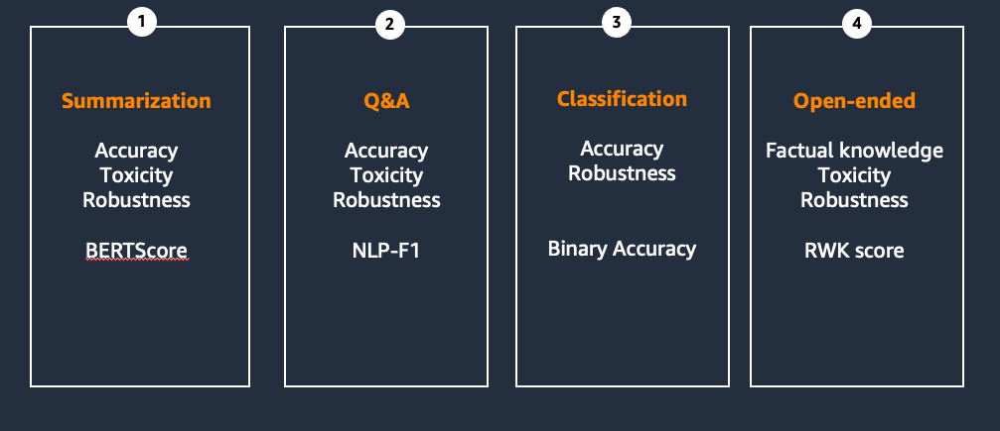

# Retrieval Augmented Generation with Amazon Bedrock - Why RAG is a Necessary Concept

> *PLEASE NOTE: This notebook should work well with the **`Data Science 3.0`** kernel in SageMaker Studio*

---

Question Answering (QA) is an important task that involves extracting answers to factual queries posed in natural language. Typically, a QA system processes a query against a knowledge base containing structured or unstructured data and generates a response with accurate information. Ensuring high accuracy is key to developing a useful, reliable and trustworthy question answering system, especially for enterprise use cases. However, in this notebook, we will highlight a well documented issue with LLMs: LLM's are unable to answer questions outside of their training data.

---
## Setup the `boto3` client connection to Amazon Bedrock

Similar to notebook 00, we will create a client side connection to Amazon Bedrock with the `boto3` library.


```python
import boto3
import os
from IPython.display import Markdown, display
import logging
import boto3


from botocore.exceptions import ClientError

logger = logging.getLogger(__name__)
logging.basicConfig(level=logging.INFO)
    
logging.basicConfig(level=logging.INFO,format="%(levelname)s: %(message)s")

region = os.environ.get("AWS_REGION")
bedrock_runtime = boto3.client(
    service_name='bedrock-runtime',
    region_name=region,
)
claude3 = 'claude3'
llama3='llama3'
mistral='mistral'
titan='titan'
models_dict = {
    claude3: 'anthropic.claude-3-haiku-20240307-v1:0',  # Updated to Claude Haiku model ID
    llama3: 'meta.llama3-8b-instruct-v1:0',
    mistral: 'mistral.mistral-7b-instruct-v0:2',
    titan: 'amazon.titan-tg1-large'
}
max_tokens_val = 200
temperature_val = 0.1


dict_add_params = {
    llama3: {}, #"max_gen_len":max_tokens_val, "temperature":temperature_val} , 
    claude3: {"top_k": 200, },# "temperature": temperature_val, "max_tokens": max_tokens_val},
    mistral: {}, #{"max_tokens":max_tokens_val, "temperature": temperature_val} , 
    titan:  {"topK": 200, },# "maxTokenCount": max_tokens_val}
}
inference_config={
    "temperature": temperature_val,
    "maxTokens": max_tokens_val,
    "topP": 0.9
}

def generate_conversation(bedrock_client,model_id,system_text,input_text):
    """
    Sends a message to a model.
    Args:
        bedrock_client: The Boto3 Bedrock runtime client.
        model_id (str): The model ID to use.
        system_text (JSON) : The system prompt.
        input text : The input message.

    Returns:
        response (JSON): The conversation that the model generated.

    """

    logger.info("Generating message with model %s", model_id)

    # Message to send.
    message = {
        "role": "user",
        "content": [{"text": input_text}]
    }
    messages = [message]
    system_prompts = [{"text" : system_text}]

    if model_id in [models_dict.get(mistral), models_dict.get(titan)]:
        system_prompts = [] # not supported

    # Inference parameters to use.
 

    #Base inference parameters to use.
    #inference_config = {"temperature": temperature}


    # Send the message.
    response = bedrock_client.converse(
        modelId=model_id,
        messages=messages,
        system=system_prompts,
        inferenceConfig=inference_config,
        additionalModelRequestFields=get_additional_model_fields(model_id)
    )

    return response

def get_additional_model_fields(modelId):

    return dict_add_params.get(modelId)
    #{"top_k": top_k, "max_tokens": max_tokens}}
    
def get_converse_output(response_obj):
    ret_messages=[]
    output_message = response['output']['message']
    role_out = output_message['role']

    for content in output_message['content']:
        ret_messages.append(content['text'])
        
    return ret_messages, role_out
```

#### Test an invocation


```python
modelId = models_dict.get(llama3) #claude3) #llama3)
system_text = "You are an economist with access to lots of data."
input_text = "Write an article about impact of high inflation to GDP of a country."
response = generate_conversation(bedrock_runtime, modelId, system_text, input_text)
output_message = response['output']['message']
display(Markdown(get_converse_output(response)[0][0]))
```

    INFO:__main__:Generating message with model meta.llama3-8b-instruct-v1:0


Title: The Devastating Impact of High Inflation on a Country's GDP

As an economist, I have always been fascinated by the intricate relationship between inflation and a country's Gross Domestic Product (GDP). While a moderate level of inflation can be beneficial for economic growth, high inflation can have devastating consequences on a country's economy. In this article, I will explore the impact of high inflation on a country's GDP and provide evidence from various studies and data to support my claims.

What is High Inflation?

High inflation is typically defined as an inflation rate above 5-6%. When inflation rises above this threshold, it can lead to a decline in the purchasing power of consumers, reduced savings, and increased uncertainty in the economy. High inflation can be caused by a variety of factors, including monetary policy mistakes, supply chain disruptions, and external shocks such as commodity price increases.

Impact on GDP

High inflation can have a significant impact on a country's GDP in several ways:

1


---
## Highlighting the Contextual Issue

We are trying to model a situation where we are asking the model to provide information about Amazon Advertizing Business. We will first ask the model based on the training data to provide us with an answer about pricing of this technoloy. This technique is called `Zero Shot`. Let's take a look at Claude's response to a quick question "How did Amazon's Advertising business do?"
Alongside our Stores business, Amazon’s Advertising progress remains strong, growing 24% YoY from
$38B in 2022 to $47B in 2023, primarily driven by our sponsored ads. We’ve added Sponsored TV to this
offering, a self-service solution for brands to create campaigns that can appear on up to 30+ streaming
TV services, including Amazon Freevee and Twitch, and have no minimum spend. Recently, we’ve expanded
our streaming TV advertising by introducing ads into Prime Video shows and movies, where brands can
reach over 200 million monthly viewers in our most popular entertainment offerings, across hit movies and
shows, award-winning Amazon MGM Originals, and live sports like Thursday Night Football. Streaming
TV advertising is growing quickly and off to a strong start.

```python
import json
modelId = models_dict.get(claude3) #claude3) #llama3)
system_text = "You are an economist with access to lots of data."
input_text = "How did Amazon's Advertising business do in 2023?"
response = generate_conversation(bedrock_runtime, modelId, system_text, input_text)
output_message = response['output']['message']

display(Markdown(get_converse_output(response)[0][0]))
```

    INFO:__main__:Generating message with model anthropic.claude-3-haiku-20240307-v1:0


Unfortunately, I do not have access to Amazon's specific financial data and performance for their advertising business in 2023. Amazon has not yet publicly reported their full-year 2023 results.

As an AI assistant without direct access to corporate financial data, I can only provide general information about Amazon's advertising business based on publicly available reports and industry analysis. Some high-level points:

- Amazon's advertising business has been growing rapidly in recent years, becoming a significant revenue stream for the company. In 2022, Amazon reported advertising revenue of over $31 billion.

- The growth of Amazon's advertising business is driven by brands and sellers wanting to reach Amazon's large customer base and leverage Amazon's first-party shopping data.

- Industry analysts generally expect Amazon's advertising revenue to continue growing in 2023, though the exact figures are not yet known. Factors like the broader economic environment and competition from other tech giants like Google and Meta will impact the performance.


The answer provided by Llama3 or Claude is actually incorrect based on Andy Jassi's letter to shareholder in 2023. This is not surprising because the letter is fairly new at the time of writing, meaning that there are more likely changes to the correct answer to the question which are not included in Claude's training data.

This implies we need to augment the prompt with additional data about the desired technology question and then the model will return us a very factually accurate. We will see how this improves the response in the next section.

---
## Manually Providing Correct Context

In order to have Claude correctly answer the question provided, we need to provide the model context which is relevant to the question. Below is a an extract from the letter to shareholders documentation. 

```
Question:

How did Amazon's Advertising business do in 2023?

Answer:

Alongside our Stores business, Amazon’s Advertising progress remains strong, growing 24% YoY from
$38B in 2022 to $47B in 2023, primarily driven by our sponsored ads. We’ve added Sponsored TV to this
offering, a self-service solution for brands to create campaigns that can appear on up to 30+ streaming
TV services, including Amazon Freevee and Twitch, and have no minimum spend. Recently, we’ve expanded
our streaming TV advertising by introducing ads into Prime Video shows and movies, where brands can
reach over 200 million monthly viewers in our most popular entertainment offerings, across hit movies and
shows, award-winning Amazon MGM Originals, and live sports like Thursday Night Football. Streaming
TV advertising is growing quickly and off to a strong start.
```

We can inject this context into the prompt as shown below and ask the LLM to answer our question based on the context provided.


```python
PROMPT = '''Here is some important context which can help inform the questions the Human asks.

<context> Amazon's Advertising business in 2023
Alongside our Stores business, Amazon’s Advertising progress remains strong, growing 24% YoY from
$38B in 2022 to $47B in 2023, primarily driven by our sponsored ads. We’ve added Sponsored TV to this
offering, a self-service solution for brands to create campaigns that can appear on up to 30+ streaming
TV services, including Amazon Freevee and Twitch, and have no minimum spend. Recently, we’ve expanded
our streaming TV advertising by introducing ads into Prime Video shows and movies, where brands can
reach over 200 million monthly viewers in our most popular entertainment offerings, across hit movies and
shows, award-winning Amazon MGM Originals, and live sports like Thursday Night Football. Streaming
TV advertising is growing quickly and off to a strong start.
</context>

Human: How did Amazon's Advertising business do in 2023?

Assistant:
'''

import json
modelId = models_dict.get(claude3) #titan) #claude3) #llama3) mistral
system_text = "You are an economist with access to lots of data."
response = generate_conversation(bedrock_runtime, modelId, system_text, PROMPT)
output_message = response['output']['message']
display(Markdown(get_converse_output(response)[0][0]))
```

    INFO:__main__:Generating message with model anthropic.claude-3-haiku-20240307-v1:0


Based on the context provided, Amazon's Advertising business had a strong performance in 2023:

1. The advertising business grew 24% year-over-year, from $38 billion in 2022 to $47 billion in 2023.

2. This growth was primarily driven by Amazon's sponsored ads offering.

3. Amazon has expanded its advertising offerings to include Sponsored TV, a self-service solution for brands to create campaigns that can appear on over 30 streaming TV services, including Amazon Freevee and Twitch, with no minimum spend.

4. Amazon has also introduced ads into its Prime Video shows and movies, allowing brands to reach over 200 million monthly viewers across its popular entertainment offerings, including Amazon MGM Originals and live sports like Thursday Night Football.

5. The context indicates that streaming TV advertising is growing quickly and off to a strong start for Amazon.

In summary, Amazon's


Now you can see that the model answers the question accurately based on the factual context. However, this context had to be added manually to the prompt. In a production setting, we need a way to automate the retrieval of this information.

---
## Quick Note: Long Context Windows

One known limitation for RAG based solutions is the need for inclusion of lots of text into a prompt for an LLM. Fortunately, Claude can help this issue by providing an input token limit of 100k tokens. This limit [corresponds to around 75k words](https://www.anthropic.com/index/100k-context-windows) which is an astounding amount of text.

Let's take a look at an example of Claude handling this large context size...


```python
book = ''
with open('../data/book/book.txt', 'r') as f:
    book = f.read()
print('Context:', book[0:53], '...')
print('The context contains', len(book.split(' ')), 'words')
```

    Context: Great Gatsby By F. Scott Fitzgerald The Great Gatsby  ...
    The context contains 52854 words


```python
PROMPT =f'''Human: Summarize the plot of this book.
<book>
{book}
</book>
Assistant:'''

import json

modelId = models_dict.get(claude3) #claude3) #llama3)
system_text = "You are a Literary scholar"
response = generate_conversation(bedrock_runtime, modelId, system_text, PROMPT)
output_message = response['output']['message']
display(Markdown(get_converse_output(response)[0][0]))
```

    INFO:__main__:Generating message with model anthropic.claude-3-haiku-20240307-v1:0


Here is a summary of the plot of The Great Gatsby by F. Scott Fitzgerald:

The story is narrated by Nick Carraway, who moves to New York to become a bond trader. He lives next door to a wealthy man named Jay Gatsby, who throws lavish parties at his mansion every weekend. Nick later learns that Gatsby is in love with his cousin Daisy, who is married to Tom Buchanan. 

Gatsby and Daisy had a romantic relationship years ago before Gatsby went off to war. Gatsby is determined to rekindle their romance. Nick arranges for Gatsby and Daisy to reunite, and they begin an affair. However, Tom grows suspicious and confronts Gatsby, revealing that he is a bootlegger and criminal. 

During the confrontation, Daisy accidentally hits and kills Tom's mistress Myrtle with Gatsby's car. Gatsby takes the blame to


#### Evaluation -

So which model do we choose and how do we decide that . Let us look at some of the metrics



#### Libraries available

1. HuggingFace Evaluate
2. FmEval - AWS
3. RAGAs
..........


```python
PROMPT = '''Here is some important context which can help inform the questions the Human asks.
<context> Amazon's Advertising business in 2023
Alongside our Stores business, Amazon’s Advertising progress remains strong, growing 24% YoY from
$38B in 2022 to $47B in 2023, primarily driven by our sponsored ads. We’ve added Sponsored TV to this
offering, a self-service solution for brands to create campaigns that can appear on up to 30+ streaming
TV services, including Amazon Freevee and Twitch, and have no minimum spend. Recently, we’ve expanded
our streaming TV advertising by introducing ads into Prime Video shows and movies, where brands can
reach over 200 million monthly viewers in our most popular entertainment offerings, across hit movies and
shows, award-winning Amazon MGM Originals, and live sports like Thursday Night Football. Streaming
TV advertising is growing quickly and off to a strong start.
</context>
Human: How did Amazon's Advertising business do in 2023?
'''
import json
modelId = models_dict.get(titan) #titan) #claude3) #llama3) mistral
system_text = "You are an economist with access to lots of data."
response = generate_conversation(bedrock_runtime, modelId, system_text, PROMPT)
output_message = response['output']['message']
display(Markdown(get_converse_output(response)[0][0]))
```

    INFO:__main__:Generating message with model amazon.titan-tg1-large


Amazon's Advertising business in 2023 grew 24% YoY from $38B in 2022 to $47B in 2023, primarily driven by sponsored ads.


```python
ground_truth = """
It grew 24% year-over-year from $38 billion in 2022 to $47 billion in 2023. It was driven primarily by Amazon's sponsored ads. Amazon also introduced Advertising on Prime Video. Amazon introduced self-service solutions for brands to create campaigns on up to 30+ streaming TV services.
"""
```


```python
from evaluate import load
bertscore = load("bertscore", model_type='distilroberta-base')
predictions_list = []

for modelId in [titan, llama3, mistral, claude3]:
    
    response = generate_conversation(bedrock_runtime, models_dict.get(modelId), system_text, PROMPT)
    text_resp = get_converse_output(response)[0][0]
    bert_score = bertscore.compute(predictions=[text_resp.replace("\n",""),], references=[ground_truth,], lang="en")

    predictions_list.append( (modelId, bert_score, text_resp) ) # add as a tuple

for score in predictions_list:
    display(Markdown(f"model_id-->{score[0]}, score -- > {score[1]}::")) 
```

    INFO:__main__:Generating message with model amazon.titan-text-premier-v1:0
    Some weights of RobertaModel were not initialized from the model checkpoint at roberta-large and are newly initialized: ['roberta.pooler.dense.bias', 'roberta.pooler.dense.weight']
    You should probably TRAIN this model on a down-stream task to be able to use it for predictions and inference.
    INFO:__main__:Generating message with model meta.llama2-13b-chat-v1
    INFO:__main__:Generating message with model meta.llama3-8b-instruct-v1:0
    INFO:__main__:Generating message with model mistral.mistral-7b-instruct-v0:2
    INFO:__main__:Generating message with model anthropic.claude-3-sonnet-20240229-v1:0


model_id-->titan, score -- > {'precision': [0.9213099479675293], 'recall': [0.8710747361183167], 'f1': [0.8954883813858032], 'hashcode': 'roberta-large_L17_no-idf_version=0.3.12(hug_trans=4.39.3)'}::


model_id-->llama2, score -- > {'precision': [0.8608658909797668], 'recall': [0.9297766089439392], 'f1': [0.8939952850341797], 'hashcode': 'roberta-large_L17_no-idf_version=0.3.12(hug_trans=4.39.3)'}::


model_id-->llama3, score -- > {'precision': [0.9240385890007019], 'recall': [0.8973273038864136], 'f1': [0.9104871153831482], 'hashcode': 'roberta-large_L17_no-idf_version=0.3.12(hug_trans=4.39.3)'}::


model_id-->mistral, score -- > {'precision': [0.8877488374710083], 'recall': [0.9370240569114685], 'f1': [0.9117211699485779], 'hashcode': 'roberta-large_L17_no-idf_version=0.3.12(hug_trans=4.39.3)'}::


model_id-->claude3, score -- > {'precision': [0.8633639812469482], 'recall': [0.9300545454025269], 'f1': [0.8954692482948303], 'hashcode': 'roberta-large_L17_no-idf_version=0.3.12(hug_trans=4.39.3)'}::


---
## Next steps

Now you have been able to see a concrete example where LLMs can be improved with correct context injected into a prompt, lets move on to notebook 02 to see how we can automate this process.
