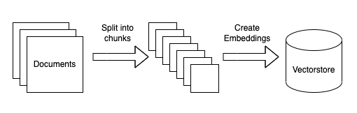

# Retrieval Augmented Generation with Amazon Bedrock - Solving Contextual Limitations with RAG

> *PLEASE NOTE: This notebook should work well with the **`Data Science 3.0`** kernel in SageMaker Studio*

---

## Background

Previously we saw that Amazon Bedrock could provide an answer to a technical question, however we had to manually provide it with the relevant data and provide the contex ourselves. While that approach works with short documents or single-ton applications, it fails to scale to enterprise level question answering where there could be large enterprise documents which cannot all be fit into the prompt sent to the model.

We can improve upon this process by implementing an architecure called Retreival Augmented Generation (RAG). RAG retrieves data from outside the language model (non-parametric) and augments the prompts by adding the relevant retrieved data in context. 

In this notebook we explain how to approach the pattern of Question Answering to find and leverage the documents to provide answers to the user questions.

## Solution
To the above challenges, this notebook uses the following strategy

### Prepare documents for search


Before being able to answer the questions, the documents must be processed and a stored in a document store index
- Load the documents
- Process and split them into smaller chunks
- Create a numerical vector representation of each chunk using Amazon Bedrock Titan Embeddings model
- Create an index using the chunks and the corresponding embeddings

### Respond to user question


When the documents index is prepared, you are ready to ask the questions and relevant documents will be fetched based on the question being asked. Following steps will be executed.
- Create an embedding of the input question
- Compare the question embedding with the embeddings in the index
- Fetch the (top N) relevant document chunks
- Add those chunks as part of the context in the prompt
- Send the prompt to the model under Amazon Bedrock
- Get the contextual answer based on the documents retrieved

---
## Setup the `boto3` client connection to Amazon Bedrock

Just like previous notebooks, we will create a client side connection to Amazon Bedrock with the `boto3` library.


```python
import boto3
import os
from IPython.display import Markdown, display

import logging
import boto3


from botocore.exceptions import ClientError

region = os.environ.get("AWS_REGION")
boto3_bedrock = boto3.client(
    service_name='bedrock-runtime',
    region_name=region,
)


logger = logging.getLogger(__name__)
logging.basicConfig(level=logging.INFO)
    
logging.basicConfig(level=logging.INFO,format="%(levelname)s: %(message)s")

region = os.environ.get("AWS_REGION")
bedrock_runtime = boto3.client(
    service_name='bedrock-runtime',
    region_name=region,
)
claude3 = 'claude3'
llama2 = 'llama2'
llama3='llama3'
mistral='mistral'
titan='titan'
models_dict = {
    claude3 : 'anthropic.claude-3-haiku-20240307-v1:0',
    llama2: 'meta.llama2-13b-chat-v1',
    llama3: 'meta.llama3-8b-instruct-v1:0',
    mistral: 'mistral.mistral-7b-instruct-v0:2',
    titan : 'amazon.titan-text-premier-v1:0'
}
max_tokens_val = 200
temperature_val = 0.1
dict_add_params = {
    llama3: {}, #"max_gen_len":max_tokens_val, "temperature":temperature_val} , 
    claude3: {"top_k": 200, },# "temperature": temperature_val, "max_tokens": max_tokens_val},
    mistral: {}, #{"max_tokens":max_tokens_val, "temperature": temperature_val} , 
    titan:  {"topK": 200, },# "maxTokenCount": max_tokens_val}
}
inference_config={
    "temperature": temperature_val,
    "maxTokens": max_tokens_val,
    "topP": 0.9
}


def generate_conversation(bedrock_client,model_id,system_text,input_text):
    """
    Sends a message to a model.
    Args:
        bedrock_client: The Boto3 Bedrock runtime client.
        model_id (str): The model ID to use.
        system_text (JSON) : The system prompt.
        input text : The input message.

    Returns:
        response (JSON): The conversation that the model generated.

    """

    logger.info("Generating message with model %s", model_id)

    # Message to send.
    message = {
        "role": "user",
        "content": [{"text": input_text}]
    }
    messages = [message]
    system_prompts = [{"text" : system_text}]

    if model_id in [models_dict.get(mistral), models_dict.get(titan)]:
        system_prompts = [] # not supported

    # Inference parameters to use.


    #Base inference parameters to use.
    #inference_config 


    # Send the message.
    response = bedrock_client.converse(
        modelId=model_id,
        messages=messages,
        system=system_prompts,
        inferenceConfig=inference_config,
        additionalModelRequestFields=get_additional_model_fields(model_id)
    )

    return response

def get_additional_model_fields(modelId):

    return dict_add_params.get(modelId)
    #{"top_k": top_k, "max_tokens": max_tokens}}
    
def get_converse_output(response_obj):
    ret_messages=[]
    output_message = response_obj['output']['message']
    role_out = output_message['role']

    for content in output_message['content']:
        ret_messages.append(content['text'])
        
    return ret_messages, role_out

```

---
## Semantic Similarity with Amazon Titan Embeddings

Semantic search refers to searching for information based on the meaning and concepts of words and phrases, rather than just matching keywords. Embedding models like Amazon Titan Embeddings allow semantic search by representing words and sentences as dense vectors that encode their semantic meaning.

Semantic matching is extremely helpful for RAG because it returns results that are conceptually related to the user's query, even if they don't contain the exact keywords. This leads to more relevant and useful search results which can be injected into our LLM's prompts.

First, let's take a look below to illustrate the capabilities of semantic search with Amazon Titan.

The `embed_text_input` function below is an example function which will return an embedding output based on text output.


```python
import json
import numpy as np

def embed_text_input(bedrock_client, prompt_data, modelId="amazon.titan-embed-text-v1"):
    accept = "application/json"
    contentType = "application/json"
    body = json.dumps({"inputText": prompt_data})
    response = bedrock_client.invoke_model(
        body=body, modelId=modelId, accept=accept, contentType=contentType
    )
    response_body = json.loads(response.get("body").read())
    embedding = response_body.get("embedding")
    return np.array(embedding)
```

To give an example of how this works, lets take a look at matching a user input to two "documents". We use a dot product calculation to rank the similarity between the input and each document, but there are many ways to do this in practice.


```python
user_input = 'Things to do on vacation'
document_1 = 'swimming, site seeing, sky diving'
document_2 = 'cleaning, note taking, studying'

user_input_vector = embed_text_input(boto3_bedrock, user_input)
document_1_vector = embed_text_input(boto3_bedrock, document_1)
document_2_vector = embed_text_input(boto3_bedrock, document_2)

doc_1_match_score = np.dot(user_input_vector, document_1_vector)
doc_2_match_score = np.dot(user_input_vector, document_2_vector)

print(f'"{user_input}" matches "{document_1}" with a score of {doc_1_match_score:.1f}')
print(f'"{user_input}" matches "{document_2}" with a score of {doc_2_match_score:.1f}')
```

    "Things to do on vacation" matches "swimming, site seeing, sky diving" with a score of 219.6
    "Things to do on vacation" matches "cleaning, note taking, studying" with a score of 150.2


```python
user_input = 'Things to do that are productive'
document_1 = 'swimming, site seeing, sky diving'
document_2 = 'cleaning, note taking, studying'

user_input_vector = embed_text_input(boto3_bedrock, user_input)
document_1_vector = embed_text_input(boto3_bedrock, document_1)
document_2_vector = embed_text_input(boto3_bedrock, document_2)

doc_1_match_score = np.dot(user_input_vector, document_1_vector)
doc_2_match_score = np.dot(user_input_vector, document_2_vector)

print(f'"{user_input}" matches "{document_1}" with a score of {doc_1_match_score:.1f}')
print(f'"{user_input}" matches "{document_2}" with a score of {doc_2_match_score:.1f}')
```

    "Things to do that are productive" matches "swimming, site seeing, sky diving" with a score of 99.9
    "Things to do that are productive" matches "cleaning, note taking, studying" with a score of 210.1


The example above shows how the semantic meaning behind the user input and provided documents can be effectively ranked by Amazon Titan.

---
## Simplifying Search with LangChain and FAISS

Two helpful tools that help set up these semantic similarity vector search engines are LangChain and FAISS. We will use LangChain to help prepare text documents, create an easy to use abstration to the Amazon Bedrock embedding model. We will use FAISS to create a searchable data structure for documents in vector formats.

First, let's import the required LangChain libraries for the system. Notice that LangChain has a FAISS wrapper class which we will be using as well.


```python
from langchain.docstore.document import Document
from langchain.document_loaders import TextLoader
from langchain.embeddings import BedrockEmbeddings
from langchain.text_splitter import CharacterTextSplitter
from langchain.vectorstores import FAISS
```

### Prepare Text with LangChain

In order to load our document into FAISS, we first need to split the document into smaller chunks.

Note: The retrieved document/text should be large enough to contain enough information to answer a question; but small enough to fit into the LLM prompt. Also the embeddings model has a limited length of input tokens, so for the sake of this use-case we are creating chunks of roughly 1000 characters.


```python
from langchain.document_loaders import PyPDFLoader
from langchain.tools.retriever import create_retriever_tool
from langchain_community.document_loaders import TextLoader, PyPDFLoader
from langchain_community.vectorstores import FAISS
from langchain_text_splitters import CharacterTextSplitter
from langchain_aws.embeddings import BedrockEmbeddings

br_embeddings = BedrockEmbeddings(model_id="amazon.titan-embed-text-v1", client=boto3_bedrock)

loader = PyPDFLoader('../data/sagemaker/Amazon-com-Inc-2023-Shareholder-Letter.pdf') # --- > 219 docs with 400 chars, each row consists in a question column and an answer column
documents_aws = loader.load() #
print(f"Number of documents={len(documents_aws)}")
```

    Number of documents=11


### Create an Embedding Store with FAISS

Once the documents are prepared, LangChain's `BedrockEmbeddings` and `FAISS` classes make it very easy to create an in memory vector store as shown below.

```python
# create instantiation to embedding model
embedding_model = BedrockEmbeddings(
    client=boto3_bedrock,
    model_id="amazon.titan-embed-text-v1"
)

# create vector store
vs = FAISS.from_documents(split_docs, embedding_model)
```

For times sake in this lab, we have already run the code above and provided the FAISS index as a persistent file in the `faiss-index/langchain` directory. We load the vector store (along with a connection to the Titan embedding model) into memory with the cell below.


```python
docs = CharacterTextSplitter(chunk_size=2000, chunk_overlap=400, separator="\n").split_documents(documents_aws) #-  separator=","

print(f"Number of documents after split and chunking={len(docs)}")


vs = FAISS.from_documents(
    documents=docs,
     embedding = br_embeddings
)

print(f"vectorstore_faiss_aws: number of elements in the index={vs.index.ntotal}::")
```

    Number of documents after split and chunking=31


    INFO:faiss.loader:Loading faiss with AVX2 support.
    INFO:faiss.loader:Successfully loaded faiss with AVX2 support.


    vectorstore_faiss_aws: number of elements in the index=31::


Below is an example of one of the document chunks. Notice how the semantic text could easily be searched to answer a given question.


```python
docs[0]
```


    Document(metadata={'source': '../data/sagemaker/Amazon-com-Inc-2023-Shareholder-Letter.pdf', 'page': 0}, page_content='Dear Shareholders:\nLast year at this time, I shared my enthusiasm and optimism for Amazon’s future. Today, I have even more.\nThe reasons are many, but start with the progress we’ve made in our financial results and customerexperiences, and extend to our continued innovation and the remarkable opportunities in front of us.\nIn 2023, Amazon’s total revenue grew 12% year-over-year (“Y oY”) from $514B to $575B. By segment, North\nAmerica revenue increased 12% Y oY from $316B to $353B, International revenue grew 11% Y oY from$118B to $131B, and AWS revenue increased 13% Y oY from $80B to $91B.\nFurther, Amazon’s operating income and Free Cash Flow (“FCF”) dramatically improved. Operating\nincome in 2023 improved 201% Y oY from $12.2B (an operating margin of 2.4%) to $36.9B (an operatingmargin of 6.4%). Trailing Twelve Month FCF adjusted for equipment finance leases improved from -$12.8Bin 2022 to $35.5B (up $48.3B).\nWhile we’ve made meaningful progress on our financial measures, what we’re most pleased about is the\ncontinued customer experience improvements across our businesses.\nIn our Stores business, customers have enthusiastically responded to our relentless focus on selection, price,\nand convenience. We continue to have the broadest retail selection, with hundreds of millions of products\navailable, tens of millions added last year alone, and several premium brands starting to list on Amazon(e.g. Coach, Victoria’s Secret, Pit Viper, Martha Stewart, Clinique, Lancôme, and Urban Decay).\nBeing sharp on price is always important, but particularly in an uncertain economy, where customers are\ncareful about how much they’re spending. As a result, in Q4 2023, we kicked off the holiday season with Prime')


### Search the FAISS Vector Store

We can now use the `similarity_search` function to match a question to the best 3 chunks of text from our document which was loaded into FAISS. Notice how the search result is correctly matched to the input question :)


```python
search_results = vs.similarity_search(
    "How did Amazon's Advertising business do in 2023?", k=3
)
print(search_results[0])
```

    page_content='expand selection and features, and move toward profitability (in Q4 2023, Mexico became our latest
    international Stores locale to turn profitable). We have high conviction that these new geographies willcontinue to grow and be profitable in the long run.
    Alongside our Stores business, Amazon’s Advertising progress remains strong, growing 24% Y oY from
    $38B in 2022 to $47B in 2023, primarily driven by our sponsored ads. We’ve added Sponsored TV to this
    offering, a self-service solution for brands to create campaigns that can appear on up to 30+ streamingTV services, including Amazon Freevee and Twitch, and have no minimum spend. Recently, we’ve expandedour streaming TV advertising by introducing ads into Prime Video shows and movies, where brands canreach over 200 million monthly viewers in our most popular entertainment offerings, across hit movies andshows, award-winning Amazon MGM Originals, and live sports like Thursday Night Football . Streaming
    TV advertising is growing quickly and off to a strong start.
    Shifting to AWS, we started 2023 seeing substantial cost optimization, with most companies trying to save
    money in an uncertain economy. Much of this optimization was catalyzed by AWS helping customers use the
    cloud more efficiently and leverage more powerful, price-performant AWS capabilities like Graviton chips(our generalized CPU chips that provide ~40% better price-performance than other leading x86 processors),S3 Intelligent Tiering (a storage class that uses AI to detect objects accessed less frequently and store themin less expensive storage layers), and Savings Plans (which give customers lower prices in exchange for longercommitments). This work diminished short-term revenue, but was best for customers, much appreciated,and should bode well for customers and AWS longer-term. By the end of 2023, we saw cost optimizationattenuating, new deals accelerating, customers renewing at larger commitments over longer time periods, andmigrations growing again.' metadata={'source': '../data/sagemaker/Amazon-com-Inc-2023-Shareholder-Letter.pdf', 'page': 1}


---
## Combine Search Results with Text Generation

In the final section of this notebook, we can now combine our vector search capability with our LLM in order to dynamically provide context to answer questions effectively with RAG. 

First, we will start by using a utility from LangChain called prompt templates. The `PromptTemplate` class allows us to easily inject context and a human input into the Claude prompt template.


```python
from langchain import PromptTemplate
from langchain.memory import ConversationBufferMemory
from langchain.prompts import PromptTemplate
from langchain.prompts.chat import ChatPromptTemplate
from langchain_community.chat_models import BedrockChat
from langchain_core.messages import HumanMessage
from langchain.chains import ConversationChain
from langchain_core.output_parsers import StrOutputParser


SYSTEM_MESSAGE = """
System: Here is some important context which can help inform the questions the Human asks.
Make sure to not make anything up to answer the question if it is not provided in the context.

Context: {context}
"""
HUMAN_MESSAGE = "{text}"

messages = [
    ("system", SYSTEM_MESSAGE),
    ("human", HUMAN_MESSAGE)
]

prompt_data = ChatPromptTemplate.from_messages(messages)
```

    /Users/sergncp/Library/Python/3.9/lib/python/site-packages/pydantic/_internal/_fields.py:132: UserWarning: Field "model_id" in BedrockBase has conflict with protected namespace "model_".
    
    You may be able to resolve this warning by setting `model_config['protected_namespaces'] = ()`.
      warnings.warn(
    /Users/sergncp/Library/Python/3.9/lib/python/site-packages/pydantic/_internal/_fields.py:132: UserWarning: Field "model_kwargs" in BedrockBase has conflict with protected namespace "model_".
    
    You may be able to resolve this warning by setting `model_config['protected_namespaces'] = ()`.
      warnings.warn(


Just like before, we will again use the `similarity_search` function to provide relevant context from our documentation.

Now we will augment the LangChain prompt template with the human input and the context from the documents.


```python
human_input =  "How did Amazon's Advertising business do in 2023?"
search_results = vs.similarity_search(human_input, k=3)
context_string = '\n\n'.join([f'Document {ind+1}: ' + i.page_content for ind, i in enumerate(search_results)])
len(context_string)
```


    5691


```python
human_query =  "How did Amazon's Advertising business do in 2023?"
```

Finally, we will use the LangChain `Bedrock` class to call the Claude model with our augmented prompt


```python
from langchain.memory import ConversationBufferMemory
from langchain.prompts import PromptTemplate
from langchain.prompts.chat import ChatPromptTemplate
from langchain_aws import ChatBedrock


# turn verbose to true to see the full logs and documents
modelId = models_dict.get(claude3)
cl_llm = ChatBedrock(
    model_id=modelId,
    client=boto3_bedrock,
    model_kwargs={"temperature": 0.1, 'max_tokens': 100},
)

br_embeddings = BedrockEmbeddings(model_id="amazon.titan-embed-text-v1", client=boto3_bedrock)

chain = prompt_data | cl_llm | StrOutputParser()
chain_input = {
        "context": context_string, #"This is a sample context doc", #context_doc,
        "text": human_query,
    }


for chunk in chain.stream(chain_input):
    print(chunk, end="", flush=True)


```

    According to the context provided:
    
    Amazon's Advertising progress remained strong in 2023, growing 24% year-over-year from $38 billion in 2022 to $47 billion in 2023. This growth was primarily driven by Amazon's sponsored ads business.
    
    The context also mentions that Amazon has added "Sponsored TV" to its advertising offerings, which is a self-service solution for brands to create campaigns that can appear on up to 30+


```python
display(Markdown(chain.invoke(chain_input)))
```


According to the context provided:

Amazon's Advertising progress remained strong in 2023, growing 24% year-over-year from $38 billion in 2022 to $47 billion in 2023. This growth was primarily driven by Amazon's sponsored ads.

The context also mentions that Amazon has added "Sponsored TV" to its advertising offerings, which is a self-service solution for brands to create campaigns that can appear on up to 30+ streaming


---

## Scaling Vector Databases

In this lab, we have only used a local, in-memory vector database with FAISS. This is due to the fact that is this is a workshop and not a production setting. If you are looking for a way to easily scale this FAISS solution on AWS, check out [this example](https://github.com/aws-samples/sagemaker-vector-store-microservice) which utilize Amazon SageMaker to deploy a vector search microservice with FAISS.

However, once you get to production and have billions (or more) vectors which need to be used in a RAG architecture, you will need to employ a larger scale solution which is purpose built and tuned for distributed vector search. AWS offers multiple ways to accomplish this this. Here are a few of the notable options available today.

### Amazon Open Search

The vector engine for Amazon OpenSearch Serverless introduces a simple, scalable, and high-performing vector storage and search capability that helps developers build machine learning (ML)–augmented search experiences and generative artificial intelligence (AI) applications without having to manage the vector database infrastructure. Get contextually relevant responses across billions of vectors in milliseconds by querying vector embeddings, which can be combined with text-based keywords in a single hybrid request.

Check out these links for more information...
* [Vector Engine for Amazon OpenSearch Serverless](https://aws.amazon.com/opensearch-service/serverless-vector-engine/)
* [Amazon OpenSearch Service’s vector database capabilities explained](https://aws.amazon.com/blogs/big-data/amazon-opensearch-services-vector-database-capabilities-explained/)

### Amazon Aurora with `pgvector`

Amazon Aurora PostgreSQL-Compatible Edition now supports the pgvector extension to store embeddings from machine learning (ML) models in your database and to perform efficient similarity searches. pgvector can store and search embeddings from Amazon Bedrock which helps power vector search for RAG. pgvector on Aurora PostgreSQL is a great option for a vector database for teams who are looking for the power of semantic search in combination with tried and trusted Amazon Relational Database Services (RDS).

Check out these links for more information...
* [Feature announcement](https://aws.amazon.com/about-aws/whats-new/2023/07/amazon-aurora-postgresql-pgvector-vector-storage-similarity-search/)
* [Leverage pgvector and Amazon Aurora PostgreSQL for Natural Language Processing, Chatbots and Sentiment Analysis](https://aws.amazon.com/blogs/database/leverage-pgvector-and-amazon-aurora-postgresql-for-natural-language-processing-chatbots-and-sentiment-analysis/)

---
## Next steps

Now you have been able to enhance your Amazon Bedrock LLM with RAG in order to better answer user questions with up-to-date context. In the next section, we will learn how to combine this solution with a chat based paradigm in order to create a more interactive application which utilizes RAG.
