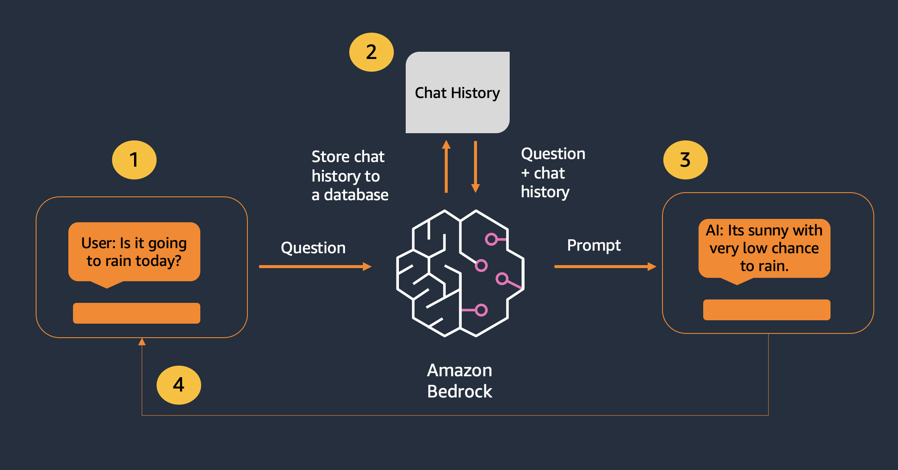

# Retrieval Augmented Generation with Amazon Bedrock - Enhancing Chat Applications with RAG

> *PLEASE NOTE: This notebook should work well with the **`Data Science 3.0`** kernel in SageMaker Studio*

---

## Chat with LLMs Overview

Conversational interfaces such as chatbots and virtual assistants can be used to enhance the user experience for your customers. Chatbots can be used in a variety of applications, such as customer service, sales, and e-commerce, to provide quick and efficient responses to users.

The key technical detail which we need to include in our system to enable a chat feature is conversational memory. This way, customers can ask follow up questions and the LLM will understand what the customer has already said in the past. The image below shows how this is orchestrated at a high level.



## Extending Chat with RAG

However, in our workshop's situation, we want to be able to enable a customer to ask follow up questions regarding documentation we provide through RAG. This means we need to build a system which has conversational memory AND contextual retrieval built into the text generation.


Let's get started!

---

## Setup `boto3` Connection


```python
import boto3
import os
from IPython.display import Markdown, display

region = os.environ.get("AWS_REGION")
boto3_bedrock = boto3.client(
    service_name='bedrock-runtime',
    region_name=region,
)
```

---
## Using LangChain for Conversation Memory

We will use LangChain's `ChatMessageHistory` class provides an easy way to capture conversational memory for LLM chat applications. Let's check out an example of Claude being able to retrieve context through conversational memory below.

Similar to the last workshop, we will use both a prompt template and a LangChain LLM for this example. Note that this time our prompt template includes a `{history}` variable where our chat history will be included to the prompt.


```python
from langchain_core.prompts import PromptTemplate

CHAT_PROMPT_TEMPLATE = '''You are a helpful conversational assistant.
{history}

Human: {human_input}

Assistant:
'''
# Creating the prompt template
PROMPT = PromptTemplate(input_variables=["history", "human_input"], template=CHAT_PROMPT_TEMPLATE)
```


```python
from langchain_aws import ChatBedrock
import boto3
import os

# Initialize the Bedrock LLM with Claude model
region = os.environ.get("AWS_REGION")
boto3_bedrock = boto3.client(
    service_name='bedrock-runtime',
    region_name=region,
)

llm = ChatBedrock(
    client=boto3_bedrock,
    model_id="anthropic.claude-3-haiku-20240307-v1:0",
    model_kwargs={
        "temperature": 0.9,
    },
)
```

The `ChatMessageHistory` class is instantiated here and you will notice the history is blank.


```python
from langchain.memory import ChatMessageHistory

# Initializing memory to store conversation
memory = ChatMessageHistory()

print(memory.messages)
```

    []


We now ask Claude a simple question "How can I check for imbalances in my model?". The LLM responds to the question and we can use the `add_user_message` and `add_ai_message` functions to save the input and output into memory. We can then retrieve the entire conversation history and print the response. Currently the model will still return answer using the data it was trained upon. Further will examine how to get a curated answer using our own FAq's


```python
human_input = 'How can I check for imbalances in my model?'

# Formatting the prompt with human input and history
prompt_data = PROMPT.format(human_input=human_input, history=memory.messages)
ai_output = llm.invoke(prompt_data)

# Storing the conversation in memory
memory.add_user_message(human_input)
memory.add_ai_message(ai_output)

# Retrieving updated conversation history
display(Markdown(ai_output.content))
```


There are a few ways you can check for potential imbalances in your model:

1. **Data Imbalance**: Examine the distribution of your training data. Are there any classes or categories that are significantly underrepresented compared to others? Imbalanced data can lead to biased models that perform poorly on the underrepresented classes.

2. **Model Performance Metrics**: Evaluate your model's performance using metrics that are sensitive to imbalanced classes, such as precision, recall, F1-score, and area under the ROC curve (AUC-ROC). Look for large discrepancies in these metrics across different classes.

3. **Confusion Matrix**: Construct a confusion matrix to visualize the model's predictions against the true labels. This can help identify classes that are being misclassified more often.

4. **Feature Importance**: Analyze the feature importance of your model to see if certain features are dominating the predictions. This can indicate that the model is overly reliant on a subset of the features, which could be a sign of imbalance.

5. **Fairness Metrics**: Depending on your use case, you may want to evaluate your model's fairness across different demographic groups or sensitive attributes. Metrics like demographic parity, equal opportunity, and equalized odds can help identify potential biases.

6. **Qualitative Analysis**: Manually inspect a sample of your model's predictions, especially for the underrepresented classes. This can provide valuable insights into the types of errors the model is making and help you identify the root causes.

7. **Robustness Checks**: Test your model's performance on out-of-distribution data or adversarial examples to see how it handles edge cases and corner cases. This can reveal weaknesses that may be related to imbalances in the training data.

By using a combination of these techniques, you can gain a better understanding of the potential imbalances in your model and take appropriate steps to address them, such as collecting more balanced data, applying data augmentation techniques, or adjusting your model architecture or training process.


Now we will ask a follow up question about the kind of imbalances does it detect and save the input and outputs again. Notice how the model is able to understand that when the human says "it", because it has access to the context of the chat history, the model is able to accurately understand what the user is asking about.


```python
human_input = 'What kind does it detect?'

# Formatting the new prompt with the updated conversation history
prompt_data = PROMPT.format(human_input=human_input, history=memory.messages)
ai_output = llm.invoke(prompt_data)

# Saving the new messages into memory
memory.add_user_message(human_input)
memory.add_ai_message(ai_output)

# Displaying the model's response
display(Markdown(ai_output.content))
```


The methods I described can detect a few different types of imbalances in a model:

1. Data imbalance - This refers to having significantly more data for some classes/categories compared to others in the training data. This can lead to biased models that perform poorly on the underrepresented classes.

2. Performance metric imbalance - Looking at metrics like precision, recall, F1-score, and AUC-ROC can reveal if the model is performing much better or worse on certain classes.

3. Prediction imbalance - The confusion matrix can show which classes are being misclassified more frequently by the model.

4. Feature imbalance - Analyzing feature importance can indicate if the model is overly reliant on a subset of the available features, which could be a sign of imbalance.

5. Demographic/fairness imbalance - Fairness metrics can uncover biases in how the model performs across different demographic groups or sensitive attributes.

So in summary, these techniques can detect imbalances in the data, model performance, predictions, features used, and fairness - providing a comprehensive view of potential issues in the model. The goal is to identify and address any significant imbalances to improve the overall robustness and fairness of the model.


---
## Creating a class to help facilitate conversation

To help create some structure around these conversations, we create a custom `Conversation` class below. This class will hold a stateful conversational memory and be the base for conversational RAG later.


```python
class Conversation:
    def __init__(self, client, model_id: str="anthropic.claude-3-haiku-20240307-v1:0") -> None:
        """instantiates a new rag based conversation

        Args:
            model_id (str, optional): which bedrock model to use for the conversational agent. Defaults to "anthropic.claude-3-haiku-20240307-v1:0".
        """

        # instantiate memory
        self.memory = ChatMessageHistory()

        # instantiate LLM connection
        self.llm = ChatBedrock(
            client=client,
            model_id=model_id,
            model_kwargs={
                "temperature": 0.9,
            },
        )

    def ai_respond(self, user_input: str=None):
        """responds to the user input in the conversation with context used

        Args:
            user_input (str, optional): user input. Defaults to None.

        Returns:
            ai_output (str): response from AI chatbot
        """

        # format the prompt with chat history and user input
        #history = self.memory.load_memory_variables({})['history']
        llm_input = PROMPT.format(history=memory.messages, human_input=user_input)

        # respond to the user with the LLM
        ai_output = self.llm.invoke(llm_input)

        # store the input and output
        self.memory.add_user_message(user_input)
        self.memory.add_ai_message(ai_output)

        return ai_output.content
```

Let's see the class in action with two contextual questions. Again, notice the model is able to correctly interpret the context because it has memory of the conversation.


```python
chat = Conversation(client=boto3_bedrock)
```


```python
output = chat.ai_respond('How can I check for imbalances in my model?')
display(Markdown(output))
```


There are a few key ways you can check for potential imbalances in your model:

1. **Data Imbalance**: Examine the distribution of your training data. Are there any classes or categories that are significantly underrepresented compared to others? Imbalanced data can lead to biased models that perform poorly on the underrepresented classes.

2. **Model Performance Metrics**: Evaluate your model's performance using metrics that are sensitive to imbalanced classes, such as precision, recall, F1-score, and area under the ROC curve (AUC-ROC). Look for large discrepancies in these metrics across different classes.

3. **Confusion Matrix**: Construct a confusion matrix to visualize the model's predictions against the true labels. This can help identify classes that are being misclassified more often.

4. **Feature Importance**: Analyze the feature importance of your model to see if certain features are dominating the predictions. This can indicate that the model is overly reliant on a subset of the features, which could be a sign of imbalance.

5. **Fairness Metrics**: Depending on your use case, you may want to evaluate your model's fairness across different demographic groups or sensitive attributes. Metrics like demographic parity, equal opportunity, and equalized odds can help identify potential biases.

6. **Qualitative Analysis**: Manually inspect a sample of your model's predictions, especially for the underrepresented classes. This can provide valuable insights into the types of errors the model is making and help you identify the root causes.

7. **Robustness Checks**: Test your model's performance on out-of-distribution data or adversarial examples to see how it handles edge cases and corner cases. This can reveal weaknesses that may be related to imbalances in the training data.

By using a combination of these techniques, you can gain a better understanding of the potential imbalances in your model and take appropriate steps to address them, such as collecting more balanced data, applying data augmentation techniques, or adjusting your model architecture or training process.


```python
output = chat.ai_respond('What kind does it detect?')
display(Markdown(output))
```


The methods I described can detect a few different types of imbalances in a model:

1. Data imbalance - This refers to having significantly more data for some classes/categories compared to others in the training data. This can lead to biased models that perform poorly on the underrepresented classes.

2. Performance metric imbalance - Looking at metrics like precision, recall, F1-score, and AUC-ROC can reveal if the model is performing much better or worse on certain classes.

3. Prediction imbalance - The confusion matrix can show which classes are being misclassified more frequently by the model.

4. Feature imbalance - Analyzing feature importance can indicate if the model is overly reliant on a subset of the available features, which could be a sign of imbalance.

5. Demographic/fairness imbalance - Fairness metrics can uncover biases in how the model performs across different demographic groups or sensitive attributes.

So in summary, these techniques can detect imbalances in the data, model performance, predictions, features used, and fairness - providing a comprehensive view of potential issues in the model. The goal is to identify and address any significant imbalances to improve the overall robustness and fairness of the model.


---
## Combining RAG with Conversation

Now that we have a conversational system built, lets incorporate the RAG system we built in notebook 02 into the chat paradigm. 

First, we will create the same vector store with LangChain and FAISS from the last notebook.

Our goal is to create a curated response from the model and only use the FAQ's we have provided.


```python
from langchain_aws.embeddings import BedrockEmbeddings
from langchain.vectorstores import FAISS

# create instantiation to embedding model
embedding_model = BedrockEmbeddings(
    client=boto3_bedrock,
    model_id="amazon.titan-embed-text-v1"
)

# create vector store
vs = FAISS.load_local('../faiss-index/langchain/', embedding_model, allow_dangerous_deserialization=True)
```

### Visualize Semantic Search 

⚠️ ⚠️ ⚠️ This section is for Advanced Practioners. Please feel free to run through these cells and come back later to re-examine the concepts ⚠️ ⚠️ ⚠️ 

Let's see how the semantic search works:
1. First we calculate the embeddings vector for the query, and
2. then we use this vector to do a similarity search on the store


##### Citation
We will also be able to get the `citation` or the underlying documents which our Vector Store matched to our query. This is useful for debugging and also measuring the quality of the vector stores. let us look at how the underlying Vector store calculates the matches

##### Vector DB Indexes
One of the key components of the Vector DB is to be able to retrieve documents matching the query with accuracy and speed. There are multiple algorithims for the same and some examples can be [read here](https://thedataquarry.com/posts/vector-db-3/) 


```python
from IPython.display import HTML, display
import warnings
warnings.filterwarnings('ignore')
#- helpful function to display in tabular format

def display_table(data):
    html = "<table>"
    for row in data:
        html += "<tr>"
        for field in row:
            html += "<td>%s</td>"%(field)
        html += "</tr>"
    html += "</table>"
    display(HTML(html))
```


```python

v = embedding_model.embed_query("How can I check for imbalances in my model?")
print(v[0:10])
results = vs.similarity_search_by_vector(v, k=2)
display(Markdown('Let us look at the documents which had the relevant information pertaining to our query'))
for r in results:
    display(Markdown(r.page_content))
    display(Markdown('-'*20))
```

    [-0.1474609375, 0.77734375, 0.26953125, -0.55859375, 0.0478515625, -0.435546875, -0.0576171875, -0.0003032684326171875, -0.5703125, -0.337890625]


Let us look at the documents which had the relevant information pertaining to our query


What kind of bias does SageMaker Clarify detect?," Measuring bias in ML models is a first step to mitigating bias. Bias may be measured before training and after training, as well as for inference for a deployed model. Each measure of bias corresponds to a different notion of fairness. Even considering simple notions of fairness leads to many different measures applicable in various contexts. You must choose bias notions and metrics that are valid for the application and the situation under investigation. SageMaker currently supports the computation of different bias metrics for training data (as part of SageMaker data preparation), for the trained model (as part of Amazon SageMaker Experiments), and for inference for a deployed model (as part of Amazon SageMaker Model Monitor). For example, before training, we provide metrics for checking whether the training data is representative (that is, whether one group is underrepresented) and whether there are differences in the label distribution across groups. After training or during deployment, metrics can be helpful to measure whether (and by how much) the performance of the model differs across groups. For example, start by comparing the error rates (how likely a model's prediction is to differ from the true label) or break further down into precision (how likely a positive prediction is to be correct) and recall (how likely the model will correctly label a positive example)."


--------------------


How do I build an ML model to generate accurate predictions in SageMaker Canvas?," Once you have connected sources, selected a dataset, and prepared your data, you can select the target column that you want to predict to initiate a model creation job. SageMaker Canvas will automatically identify the problem type, generate new relevant features, test a comprehensive set of prediction models using ML techniques such as linear regression, logistic regression, deep learning, time-series forecasting, and gradient boosting, and build the model that makes accurate predictions based on your dataset."


--------------------


#### Similarity Search

##### Distance scoring in Vector Data bases
[Distance scores](https://weaviate.io/blog/distance-metrics-in-vector-search) are the key in vector searches. Here are some FAISS specific methods. One of them is similarity_search_with_score, which allows you to return not only the documents but also the distance score of the query to them. The returned distance score is L2 distance ( Squared Euclidean) . Therefore, a lower score is better. Further in FAISS we have similarity_search_with_score (ranked by distance: low to high) and similarity_search_with_relevance_scores ( ranked by relevance: high to low) with both using the distance strategy. The similarity_search_with_relevance_scores calculates the relevance score as 1 - score. For more details of the various distance scores [read here](https://milvus.io/docs/metric.md)


```python
display(Markdown(f"##### Let us look at the documents based on {vs.distance_strategy.name} which will be used to answer our question 'What kind of bias does Clarify detect ?'"))

context = vs.similarity_search('What kind of bias does Clarify detect ?', k=2)
#-  langchain.schema.document.Document
display(Markdown('-'*20))
list_context = [[doc.page_content, doc.metadata] for doc in context]
list_context.insert(0, ['Documents', 'Meta-data'])
display_table(list_context)
```


##### Let us look at the documents based on EUCLIDEAN_DISTANCE which will be used to answer our question 'What kind of bias does Clarify detect ?'


--------------------


<table><tr><td>Documents</td><td>Meta-data</td></tr><tr><td>What kind of bias does SageMaker Clarify detect?," Measuring bias in ML models is a first step to mitigating bias. Bias may be measured before training and after training, as well as for inference for a deployed model. Each measure of bias corresponds to a different notion of fairness. Even considering simple notions of fairness leads to many different measures applicable in various contexts. You must choose bias notions and metrics that are valid for the application and the situation under investigation. SageMaker currently supports the computation of different bias metrics for training data (as part of SageMaker data preparation), for the trained model (as part of Amazon SageMaker Experiments), and for inference for a deployed model (as part of Amazon SageMaker Model Monitor). For example, before training, we provide metrics for checking whether the training data is representative (that is, whether one group is underrepresented) and whether there are differences in the label distribution across groups. After training or during deployment, metrics can be helpful to measure whether (and by how much) the performance of the model differs across groups. For example, start by comparing the error rates (how likely a model's prediction is to differ from the true label) or break further down into precision (how likely a positive prediction is to be correct) and recall (how likely the model will correctly label a positive example)."</td><td>{}</td></tr><tr><td>How does SageMaker Clarify improve model explainability?, SageMaker Clarify is integrated with SageMaker Experiments to provide a feature importance graph detailing the importance of each input for your model’s overall decision-making process after the model has been trained. These details can help determine if a particular model input has more influence than it should on overall model behavior. SageMaker Clarify also makes explanations for individual predictions available through an API.</td><td>{}</td></tr></table>


Let us first look at the Page context and the meta data associated with the documents. Now let us look at the L2 scores based on the distance scoring as explained above. Lower score is better


```python
#- relevancy of the documents
results = vs.similarity_search_with_score("What kind of bias does Clarify detect ?", k=2, fetch_k=3)
display(Markdown('##### Similarity Search Table with relevancy score.'))
display(Markdown('-'*20))
results.insert(0, ['Documents', 'Relevancy Score'])
display_table(results)
```


##### Similarity Search Table with relevancy score.


--------------------


<table><tr><td>Documents</td><td>Relevancy Score</td></tr><tr><td>page_content='What kind of bias does SageMaker Clarify detect?," Measuring bias in ML models is a first step to mitigating bias. Bias may be measured before training and after training, as well as for inference for a deployed model. Each measure of bias corresponds to a different notion of fairness. Even considering simple notions of fairness leads to many different measures applicable in various contexts. You must choose bias notions and metrics that are valid for the application and the situation under investigation. SageMaker currently supports the computation of different bias metrics for training data (as part of SageMaker data preparation), for the trained model (as part of Amazon SageMaker Experiments), and for inference for a deployed model (as part of Amazon SageMaker Model Monitor). For example, before training, we provide metrics for checking whether the training data is representative (that is, whether one group is underrepresented) and whether there are differences in the label distribution across groups. After training or during deployment, metrics can be helpful to measure whether (and by how much) the performance of the model differs across groups. For example, start by comparing the error rates (how likely a model's prediction is to differ from the true label) or break further down into precision (how likely a positive prediction is to be correct) and recall (how likely the model will correctly label a positive example)."'</td><td>130.92531</td></tr><tr><td>page_content='How does SageMaker Clarify improve model explainability?, SageMaker Clarify is integrated with SageMaker Experiments to provide a feature importance graph detailing the importance of each input for your model’s overall decision-making process after the model has been trained. These details can help determine if a particular model input has more influence than it should on overall model behavior. SageMaker Clarify also makes explanations for individual predictions available through an API.'</td><td>188.70465</td></tr></table>


#### Marginal Relevancy score

Maximal Marginal Relevance  has been introduced in the paper [The Use of MMR, Diversity-Based Reranking for Reordering Documents and Producing Summaries](https://www.cs.cmu.edu/~jgc/publication/The_Use_MMR_Diversity_Based_LTMIR_1998.pdf). Maximal Marginal Relevance tries to reduce the redundancy of results while at the same time maintaining query relevance of results for already ranked documents/phrases etc. In the below results since we have a very limited data set it might not make a difference but for larger data sets the query will theoritically run faster while still preserving the over all relevancy of the documents


```python
#- normalizing the relevancy
display(Markdown('##### Let us look at MRR scores'))
results = vs.max_marginal_relevance_search_with_score_by_vector(embedding_model.embed_query("What kind of bias does Clarify detect ?"), k=3)
results.insert(0, ["Document", "MRR Score"])
display_table(results)

```


##### Let us look at MRR scores


<table><tr><td>Document</td><td>MRR Score</td></tr><tr><td>page_content='What kind of bias does SageMaker Clarify detect?," Measuring bias in ML models is a first step to mitigating bias. Bias may be measured before training and after training, as well as for inference for a deployed model. Each measure of bias corresponds to a different notion of fairness. Even considering simple notions of fairness leads to many different measures applicable in various contexts. You must choose bias notions and metrics that are valid for the application and the situation under investigation. SageMaker currently supports the computation of different bias metrics for training data (as part of SageMaker data preparation), for the trained model (as part of Amazon SageMaker Experiments), and for inference for a deployed model (as part of Amazon SageMaker Model Monitor). For example, before training, we provide metrics for checking whether the training data is representative (that is, whether one group is underrepresented) and whether there are differences in the label distribution across groups. After training or during deployment, metrics can be helpful to measure whether (and by how much) the performance of the model differs across groups. For example, start by comparing the error rates (how likely a model's prediction is to differ from the true label) or break further down into precision (how likely a positive prediction is to be correct) and recall (how likely the model will correctly label a positive example)."'</td><td>130.92531</td></tr><tr><td>page_content='How does SageMaker Clarify improve model explainability?, SageMaker Clarify is integrated with SageMaker Experiments to provide a feature importance graph detailing the importance of each input for your model’s overall decision-making process after the model has been trained. These details can help determine if a particular model input has more influence than it should on overall model behavior. SageMaker Clarify also makes explanations for individual predictions available through an API.'</td><td>188.70465</td></tr><tr><td>page_content='What is the underlying tuning algorithm for Automatic Model Tuning?," Currently, the algorithm for tuning hyperparameters is a customized implementation of Bayesian Optimization. It aims to optimize a customer-specified objective metric throughout the tuning process. Specifically, it checks the object metric of completed training jobs, and uses the knowledge to infer the hyperparameter combination for the next training job."
Does Automatic Model Tuning recommend specific hyperparameters for tuning?," No. How certain hyperparameters impact the model performance depends on various factors, and it is hard to definitively say one hyperparameter is more important than the others and thus needs to be tuned. For built-in algorithms within SageMaker, we do call out whether or not a hyperparameter is tunable."'</td><td>281.98914</td></tr></table>


#### Update embeddings of the Vector Databases

Update of documents happens all the time and we have multiple versions of the documents. Which means we need to also factor how do we update the embeddings in our Vector Data bases. Fortunately we have and can leverage the meta data to update embeddings

The key steps are:
1. Load the new embeddings and add the meta data stating the version as 2
2. Merge to the exisiting Vector database
3. Run the query using the filter to only search in the new index and get the latest documents for the same query


```python
# create vector store
from langchain.document_loaders import CSVLoader
from langchain.text_splitter import CharacterTextSplitter
from langchain.vectorstores import FAISS
from langchain.schema import Document

loader = CSVLoader(
    file_path="../data/sagemaker/sm_faq_v2.csv",
    csv_args={
        "delimiter": ",",
        "quotechar": '"',
        "fieldnames": ["Question", "Answer"],
    },
)

#docs_split = loader.load()
docs_split = CharacterTextSplitter(chunk_size=1000, chunk_overlap=0, separator=",").split_documents(loader.load())
list_of_documents = [Document(page_content=doc.page_content, metadata=dict(page='v2')) for doc in docs_split]
print(f"Number of split docs={len(docs_split)}")
db = FAISS.from_documents(list_of_documents, embedding_model)
```

    Number of split docs=6


#### Run a query against version 2 of the documents
Let us run the query agsint our exisiting vector data base and we will see the the exisiting or the version 1 of the documents coming back. If we run with the filter since those do not exist in our vector Database we will see no results returned or an empty list back


```python
# Run the query with requesting data from version 2 which does not exist
vs = FAISS.load_local('../faiss-index/langchain/', embedding_model, allow_dangerous_deserialization=True)
search_query = "How can I check for imbalances in my model?"
#print(f"Running with v1 of the documents we get response of {vs.similarity_search_with_score(query=search_query, k=1, fetch_k=4)}")
print("-"*20)
print(f"Running the query with V2 of the document we get {vs.similarity_search_with_score(query=search_query, filter=dict(page='v2'), k=1)}:")

```

    --------------------
    Running the query with V2 of the document we get []:


#### Add a new version of the document
We will create the version 2 of the documents and use meta data to add to our original index. Once done we will then apply a filter in our query which will return to us the documents newly added. Run the query now after adding version of the documents

We will also examine a way to speed up our searches and queries and look at another way to narrow the search using the  fetch_k parameter when calling similarity_search with filters. Usually you would want the fetch_k to be more than the k parameter. This is because the fetch_k parameter is the number of documents that will be fetched before filtering. If you set fetch_k to a low number, you might not get enough documents to filter from.


```python
# - now let us add version 2 of the data set and run query from that

vs.merge_from(db)
```

#### Query complete merged data base with no filters
Run the query against the fully merged DB without any filters for the meta data and we see that it returns the top results of the new V2 data and also the top results of the v1 data. Essentially it will match and return data closest to the query


```python
# - run the query again
search_query_v2 = "How can I check for imbalances in my model?"
results_with_scores = vs.similarity_search_with_score(search_query_v2, k=2, fetch_k=3)
results_with_scores = [[doc.page_content, doc.metadata, score] for doc, score in results_with_scores]
results_with_scores.insert(0, ['Document', 'Meta-Data', 'Score'])
display_table(results_with_scores)
```


<table><tr><td>Document</td><td>Meta-Data</td><td>Score</td></tr><tr><td>Question: How can I check for imbalances in my model?
Answer: Amazon SageMaker Clarify Version 2 will helps improve model transparency. SageMaker Clarify checks for imbalances during data preparation, after training, and ongoing over time</td><td>{'page': 'v2'}</td><td>154.83807</td></tr><tr><td>What kind of bias does SageMaker Clarify detect?," Measuring bias in ML models is a first step to mitigating bias. Bias may be measured before training and after training, as well as for inference for a deployed model. Each measure of bias corresponds to a different notion of fairness. Even considering simple notions of fairness leads to many different measures applicable in various contexts. You must choose bias notions and metrics that are valid for the application and the situation under investigation. SageMaker currently supports the computation of different bias metrics for training data (as part of SageMaker data preparation), for the trained model (as part of Amazon SageMaker Experiments), and for inference for a deployed model (as part of Amazon SageMaker Model Monitor). For example, before training, we provide metrics for checking whether the training data is representative (that is, whether one group is underrepresented) and whether there are differences in the label distribution across groups. After training or during deployment, metrics can be helpful to measure whether (and by how much) the performance of the model differs across groups. For example, start by comparing the error rates (how likely a model's prediction is to differ from the true label) or break further down into precision (how likely a positive prediction is to be correct) and recall (how likely the model will correctly label a positive example)."</td><td>{}</td><td>229.07724</td></tr></table>


#### Query with Filter
Now we will ask to search only against the version 2 of the data and use filter criteria against it


```python
# - run the query again
search_query_v2 = "How can I check for imbalances in my model?"
results_with_scores = vs.similarity_search_with_score(search_query_v2, filter=dict(page='v2'), k=2, fetch_k=3)
results_with_scores = [[doc.page_content, doc.metadata, score] for doc, score in results_with_scores]
results_with_scores.insert(0, ['Document', 'Meta-Data', 'Score'])
display_table(results_with_scores)
```


<table><tr><td>Document</td><td>Meta-Data</td><td>Score</td></tr><tr><td>Question: How can I check for imbalances in my model?
Answer: Amazon SageMaker Clarify Version 2 will helps improve model transparency. SageMaker Clarify checks for imbalances during data preparation, after training, and ongoing over time</td><td>{'page': 'v2'}</td><td>154.83807</td></tr><tr><td>Question: What kind of bias does SageMaker Clarify detect?
Answer: Measuring bias in ML models is a first step to mitigating bias.</td><td>{'page': 'v2'}</td><td>268.96292</td></tr></table>


#### Query for new data
Now let us ask a question which exists only on the version 2 of the document


```python
# - now let us ask a question which ONLY exits in the version 2 of the document
search_query_v2 = "Can i use Quantum computing?"
results_with_scores = vs.similarity_search_with_score(query=search_query_v2, filter=dict(page='v2'), k=1, fetch_k=3)
results_with_scores = [[doc.page_content, doc.metadata, score] for doc, score in results_with_scores]
results_with_scores.insert(0, ['Document', 'Meta-Data', 'Score'])
display_table(results_with_scores)
```


<table><tr><td>Document</td><td>Meta-Data</td><td>Score</td></tr><tr><td>Question: Can i use Quantum computing?
Answer: Yes SageMaker version sometime in future will let you run quantum computing</td><td>{'page': 'v2'}</td><td>97.103165</td></tr></table>


### Let us continue to build our chatbot

The prompt template is now altered to include both conversation memory as well as chat history as inputs along with the human input. Notice how the prompt also instructs Claude to not answer questions which it does not have the context for. This helps reduce hallucinations which is extremely important when creating end user facing applications which need to be factual.


```python
# re-create vector store and continue
vs = FAISS.load_local('../faiss-index/langchain/', embedding_model, allow_dangerous_deserialization=True)
```


```python
RAG_TEMPLATE = """You are a helpful conversational assistant.

If you are unsure about the answer OR the answer does not exist in the context, respond with
"Sorry but I do not understand your request. I am still learning so I appreciate your patience! 😊
NEVER make up the answer.

If the human greets you, simply introduce yourself.

The context will be placed in <context></context> XML tags.

<context>{context}</context>

Do not include any xml tags in your response.

{history}

Human: {input}

Assistant:
"""
PROMPT = PromptTemplate.from_template(RAG_TEMPLATE)
```

The new `ConversationWithRetrieval` class now includes a `get_context` function which searches our vector database based on the human input and combines it into the base prompt.


```python
class ConversationWithRetrieval:
    def __init__(self, client, vector_store: FAISS=None, model_id: str="anthropic.claude-3-haiku-20240307-v1:0") -> None:
        """instantiates a new rag based conversation

        Args:
            vector_store (FAISS, optional): pre-populated vector store for searching context. Defaults to None.
            model_id (str, optional): which bedrock model to use for the conversational agent. Defaults to "anthropic.claude-3-haiku-20240307-v1:0".
        """

        # store vector store
        self.vector_store = vector_store

        # instantiate memory
        self.memory = ChatMessageHistory()

        # instantiate LLM connection
        self.llm = ChatBedrock(
            client=client,
            model_id=model_id,
            model_kwargs={
                "temperature": 0.0,
            },
        )

    def ai_respond(self, user_input: str=None):
        """responds to the user input in the conversation with context used

        Args:
            user_input (str, optional): user input. Defaults to None.

        Returns:
            ai_output (str): response from AI chatbot
            search_results (list): context used in the completion
        """

        # format the prompt with chat history and user input
        context_string, search_results = self.get_context(user_input)

        llm_input = PROMPT.format(history=memory.messages, input=user_input, context=context_string)

        # respond to the user with the LLM
        ai_output = self.llm.invoke(llm_input)

        # store the input and output
        self.memory.add_user_message(user_input)
        self.memory.add_ai_message(ai_output)

        return ai_output.content, search_results

    def get_context(self, user_input, k=5):
        """returns context used in the completion

        Args:
            user_input (str): user input as a string
            k (int, optional): number of results to return. Defaults to 5.

        Returns:
            context_string (str): context used in the completion as a string
            search_results (list): context used in the completion as a list of Document objects
        """
        search_results = self.vector_store.similarity_search(
            user_input, k=k
        )
        context_string = '\n\n'.join([f'Document {ind+1}: ' + i.page_content for ind, i in enumerate(search_results)])
        return context_string, search_results
```

Now the model can answer some specific domain questions based on our document database!


```python
chat = ConversationWithRetrieval(boto3_bedrock, vs)
```


```python
output, context = chat.ai_respond('How can I check for imbalances in my model?')
display(Markdown(output))
```


Sorry but I do not understand your request. I am still learning so I appreciate your patience! 😊


```python
output, context = chat.ai_respond('What kind does it detect?')
display(Markdown(f'** AI Assistant Answer: ** \n{output}'))
display(Markdown(f'\n\n** Relevant Documentation: ** \n{context}'))
```


** AI Assistant Answer: ** 
Sorry but I do not understand your request. I am still learning so I appreciate your patience! 😊

The context provided does not mention what specific types of bias Amazon SageMaker Clarify can detect. The information given focuses more on the general concept of measuring bias in machine learning models, but does not go into the details of what SageMaker Clarify is capable of detecting. Without more specific information in the context, I cannot provide a definitive answer to your question. Please let me know if you have any other questions I can try to assist with.


** Relevant Documentation: ** 
[Document(page_content='What is Amazon SageMaker Autopilot?," SageMaker Autopilot is the industry’s first automated machine learning capability that gives you complete control and visibility into your ML models. SageMaker Autopilot automatically inspects raw data, applies feature processors, picks the best set of algorithms, trains and tunes multiple models, tracks their performance, and then ranks the models based on performance, all with just a few clicks. The result is the best-performing model that you can deploy at a fraction of the time normally required to train the model. You get full visibility into how the model was created and what’s in it, and SageMaker Autopilot integrates with SageMaker Studio. You can explore up to 50 different models generated by SageMaker Autopilot inside SageMaker Studio so it’s easy to pick the best model for your use case. SageMaker Autopilot can be used by people without ML experience to easily produce a model, or it can be used by experienced developers to quickly develop a baseline model on which teams can further iterate."', metadata={}), Document(page_content='What is Amazon SageMaker Studio Lab?," SageMaker Studio Lab is a free ML development environment that provides the compute, storage (up to 15 GB), and security—all at no cost—for anyone to learn and experiment with ML. All you need to get started is a valid email ID; you don’t need to configure infrastructure or manage identity and access or even sign up for an AWS account. SageMaker Studio Lab accelerates model building through GitHub integration, and it comes preconfigured with the most popular ML tools, frameworks, and libraries to get you started immediately. SageMaker Studio Lab automatically saves your work so you don’t need to restart between sessions. It’s as easy as closing your laptop and coming back later."', metadata={}), Document(page_content='What kind of bias does SageMaker Clarify detect?," Measuring bias in ML models is a first step to mitigating bias. Bias may be measured before training and after training, as well as for inference for a deployed model. Each measure of bias corresponds to a different notion of fairness. Even considering simple notions of fairness leads to many different measures applicable in various contexts. You must choose bias notions and metrics that are valid for the application and the situation under investigation. SageMaker currently supports the computation of different bias metrics for training data (as part of SageMaker data preparation), for the trained model (as part of Amazon SageMaker Experiments), and for inference for a deployed model (as part of Amazon SageMaker Model Monitor). For example, before training, we provide metrics for checking whether the training data is representative (that is, whether one group is underrepresented) and whether there are differences in the label distribution across groups. After training or during deployment, metrics can be helpful to measure whether (and by how much) the performance of the model differs across groups. For example, start by comparing the error rates (how likely a model\'s prediction is to differ from the true label) or break further down into precision (how likely a positive prediction is to be correct) and recall (how likely the model will correctly label a positive example)."', metadata={}), Document(page_content='How can I reproduce a feature from a given moment in time?, SageMaker Feature Store maintains time stamps for all features at every instance of time. This helps you retrieve features at any period of time for business or compliance requirements. You can easily explain model features and their values from when they were first created to the present time by reproducing the model from a given moment in time.\nWhat are offline features?," Offline features are used for training because you need access to very large volumes over a long period of time. These features are served from a high-throughput, high-bandwidth repository."\nWhat are online features?, Online features are used in applications required to make real-time predictions. Online features are served from a high-throughput repository with single-digit millisecond latency for fast predictions.', metadata={}), Document(page_content='Why should I use SageMaker for shadow testing?," SageMaker simplifies the process of setting up and monitoring shadow variants so you can evaluate the performance of the new ML model on live production traffic. SageMaker eliminates the need for you to orchestrate infrastructure for shadow testing. It lets you control testing parameters such as the percentage of traffic mirrored to the shadow variant and the duration of the test. As a result, you can start small and increase the inference requests to the new model after you gain confidence in model performance. SageMaker creates a live dashboard displaying performance differences across key metrics, so you can easily compare model performance to evaluate how the new model differs from the production model."', metadata={})]


--- 
## Using LangChain for Orchestration of RAG

Beyond the primitive classes for prompt handling and conversational memory management, LangChain also provides a framework for [orchestrating RAG flows](https://python.langchain.com/docs/expression_language/cookbook/retrieval) with what purpose built "chains". In this section, we will see how to be a retrieval chain with LangChain which is more comprehensive and robust than the original retrieval system we built above.

The workflow we used above follows the following process...

1. User input is received.
2. User input is queried against the vector database to retrieve relevant documents.
3. Relevant documents and chat memory are inserted into a new prompt to respond to the user input.
4. Return to step 1.

However, more complex methods of interacting with the user input can generate more accurate results in RAG architectures. One of the popular mechanisms which can increase accuracy of these retrieval systems is utilizing more than one call to an LLM in order to reformat the user input for more effective search to your vector database. A better workflow is described below compared to the one we already built...

1. User input is received.
2. An LLM is used to reword the user input to be a better search query for the vector database based on the chat history and other instructions. This could include things like condensing, rewording, addition of chat context, or stylistic changes.
3. Reformatted user input is queried against the vector database to retrieve relevant documents.
4. The reformatted user input and relevant documents are inserted into a new prompt in order to answer the user question.
5. Return to step 1.

Let's now build out this second workflow using LangChain below.

First we need to make a prompt which will reformat the user input to be more compatible for searching of the vector database. The way we do this is by providing the chat history as well as the some basic instructions to Claude and asking it to condense the input into a single output.


```python
condense_prompt = PromptTemplate.from_template("""
{context}

{input}

Human: Given the conversation above, rewrite the follow-up message to be a standalone question that captures all relevant context. Answer only with the new question and nothing else.

Assistant: Standalone Question:
""")
```

The next prompt we need is the prompt which will answer the user's question based on the retrieved information. In this case, we provide specific instructions about how to answer the question as well as provide the context retrieved from the vector database.


```python
respond_prompt = PromptTemplate.from_template("""
{context}

Human: Given the context above, answer the following question:

{input}

If the answer is not in the context, say "Sorry, I don't know as the answer was not found in the context."

Assistant:
""")
```

Now that we have our prompts set up, let's set up the conversational memory just like we did earlier in the notebook. Notice how we inject an example human and assistant message in order to help guide our AI assistant on what its job is.


```python

llm = ChatBedrock(
    client=boto3_bedrock,
    model_id="anthropic.claude-instant-v1",
    model_kwargs={ "temperature": 0.9}
)
memory_chain = ChatMessageHistory()
memory_chain.add_user_message(
    'Hello, what are you able to do?'
)
memory_chain.add_ai_message(
    'Hi! I am a help chat assistant which can answer questions about Amazon SageMaker.'
)
```

Lastly, we will used the `create_retrieval_chain` and `create_stuff_documents_chain` from LangChain to orchestrate this whole system


```python

from langchain.chains import create_retrieval_chain
from langchain.chains.combine_documents import create_stuff_documents_chain


qa = create_stuff_documents_chain(llm, condense_prompt)

rag_chain = create_retrieval_chain(
    vs.as_retriever(), # this is our FAISS vector database
    qa
)

```

Let's go ahead and generate some responses from our RAG solution!


```python
output = rag_chain.invoke({'input': 'How can I check for imbalances in my model?'}) #qa.run({'question': 'How can I check for imbalances in my model?'})
display(Markdown(output["answer"]))
```


Here are a few types of bias that SageMaker Clarify can detect:

- Demographic parity: Whether the model predicts equally for different demographic groups (e.g. gender, race, etc.). 

- Equal opportunity: Whether the model has equal true positive rates for different groups. 

- Calibration: Whether the predicted probabilities are well-calibrated across groups.

- Accuracy equality: Whether the model achieves similar overall accuracy for different groups. 

- Fairness through unawareness: Whether the model treats sensitive attributes (e.g. gender) as irrelevant to predictions.

Does this help summarize the kinds of bias SageMaker Clarify can measure? Let me know if you need any clarification or have additional questions.


```python
output = rag_chain.invoke({'input': 'What kind does it detect?' })
display(Markdown(output["answer"]))
```


SageMaker Clarify can detect different types of algorithmic bias like representation bias, accuracy bias and calibration bias. Which specific type of bias detection capabilities are provided by SageMaker Clarify - representation bias, accuracy bias or calibration bias?


```python
output = rag_chain.invoke({'input': 'How does this improve model explainability?' })
display(Markdown(output["answer"]))
```


SageMaker Clarify improves model explainability in several ways:

It provides a feature importance graph to show the influence of each input on the model's decisions. This helps determine if any inputs have undue influence. 

It also exposes explanations for individual predictions via an API. This allows understanding why the model produced a certain prediction for a given example.

Together, these capabilities offer more transparency into how the model works. Understanding feature importance and reason codes for predictions aids in interpreting a model's behavior and identifying any potential issues.


--- 
## Using LlamaIndex for Orchestration of RAG

Another popular open source framework for orchestrating RAG is [LlamaIndex](https://gpt-index.readthedocs.io/en/latest/index.html). Let's take a look below at how to use our SageMaker FAQ vector index to have a conversational RAG application with LlamaIndex.


```python
%pip install llama-index-llms-langchain
%pip install llama-index-embeddings-langchain
%pip install llama-index-vector-stores-faiss
```

    Defaulting to user installation because normal site-packages is not writeable
    Requirement already satisfied: llama-index-llms-langchain in /Users/sergncp/Library/Python/3.9/lib/python/site-packages (0.4.1)
    Requirement already satisfied: langchain>=0.1.3 in /Users/sergncp/Library/Python/3.9/lib/python/site-packages (from llama-index-llms-langchain) (0.3.1)
    Requirement already satisfied: llama-index-core<0.12.0,>=0.11.0 in /Users/sergncp/Library/Python/3.9/lib/python/site-packages (from llama-index-llms-langchain) (0.11.8)
    Requirement already satisfied: PyYAML>=5.3 in /Users/sergncp/Library/Python/3.9/lib/python/site-packages (from langchain>=0.1.3->llama-index-llms-langchain) (6.0.2)
    Requirement already satisfied: SQLAlchemy<3,>=1.4 in /Users/sergncp/Library/Python/3.9/lib/python/site-packages (from langchain>=0.1.3->llama-index-llms-langchain) (2.0.34)
    Requirement already satisfied: aiohttp<4.0.0,>=3.8.3 in /Users/sergncp/Library/Python/3.9/lib/python/site-packages (from langchain>=0.1.3->llama-index-llms-langchain) (3.10.5)
    Requirement already satisfied: async-timeout<5.0.0,>=4.0.0 in /Users/sergncp/Library/Python/3.9/lib/python/site-packages (from langchain>=0.1.3->llama-index-llms-langchain) (4.0.3)
    Requirement already satisfied: langchain-core<0.4.0,>=0.3.6 in /Users/sergncp/Library/Python/3.9/lib/python/site-packages (from langchain>=0.1.3->llama-index-llms-langchain) (0.3.7)
    Requirement already satisfied: langchain-text-splitters<0.4.0,>=0.3.0 in /Users/sergncp/Library/Python/3.9/lib/python/site-packages (from langchain>=0.1.3->llama-index-llms-langchain) (0.3.0)
    Requirement already satisfied: langsmith<0.2.0,>=0.1.17 in /Users/sergncp/Library/Python/3.9/lib/python/site-packages (from langchain>=0.1.3->llama-index-llms-langchain) (0.1.129)
    Requirement already satisfied: numpy<2,>=1 in /Users/sergncp/Library/Python/3.9/lib/python/site-packages (from langchain>=0.1.3->llama-index-llms-langchain) (1.26.4)
    Requirement already satisfied: pydantic<3.0.0,>=2.7.4 in /Users/sergncp/Library/Python/3.9/lib/python/site-packages (from langchain>=0.1.3->llama-index-llms-langchain) (2.9.1)
    Requirement already satisfied: requests<3,>=2 in /Users/sergncp/Library/Python/3.9/lib/python/site-packages (from langchain>=0.1.3->llama-index-llms-langchain) (2.32.3)
    Requirement already satisfied: tenacity!=8.4.0,<9.0.0,>=8.1.0 in /Users/sergncp/Library/Python/3.9/lib/python/site-packages (from langchain>=0.1.3->llama-index-llms-langchain) (8.3.0)
    Requirement already satisfied: dataclasses-json in /Users/sergncp/Library/Python/3.9/lib/python/site-packages (from llama-index-core<0.12.0,>=0.11.0->llama-index-llms-langchain) (0.6.7)
    Requirement already satisfied: deprecated>=1.2.9.3 in /Users/sergncp/Library/Python/3.9/lib/python/site-packages (from llama-index-core<0.12.0,>=0.11.0->llama-index-llms-langchain) (1.2.14)
    Requirement already satisfied: dirtyjson<2.0.0,>=1.0.8 in /Users/sergncp/Library/Python/3.9/lib/python/site-packages (from llama-index-core<0.12.0,>=0.11.0->llama-index-llms-langchain) (1.0.8)
    Requirement already satisfied: fsspec>=2023.5.0 in /Users/sergncp/Library/Python/3.9/lib/python/site-packages (from llama-index-core<0.12.0,>=0.11.0->llama-index-llms-langchain) (2024.6.1)
    Requirement already satisfied: httpx in /Users/sergncp/Library/Python/3.9/lib/python/site-packages (from llama-index-core<0.12.0,>=0.11.0->llama-index-llms-langchain) (0.27.2)
    Requirement already satisfied: nest-asyncio<2.0.0,>=1.5.8 in /Users/sergncp/Library/Python/3.9/lib/python/site-packages (from llama-index-core<0.12.0,>=0.11.0->llama-index-llms-langchain) (1.6.0)
    Requirement already satisfied: networkx>=3.0 in /Users/sergncp/Library/Python/3.9/lib/python/site-packages (from llama-index-core<0.12.0,>=0.11.0->llama-index-llms-langchain) (3.2.1)
    Requirement already satisfied: nltk>3.8.1 in /Users/sergncp/Library/Python/3.9/lib/python/site-packages (from llama-index-core<0.12.0,>=0.11.0->llama-index-llms-langchain) (3.9.1)
    Requirement already satisfied: pillow>=9.0.0 in /Users/sergncp/Library/Python/3.9/lib/python/site-packages (from llama-index-core<0.12.0,>=0.11.0->llama-index-llms-langchain) (9.4.0)
    Requirement already satisfied: tiktoken>=0.3.3 in /Users/sergncp/Library/Python/3.9/lib/python/site-packages (from llama-index-core<0.12.0,>=0.11.0->llama-index-llms-langchain) (0.7.0)
    Requirement already satisfied: tqdm<5.0.0,>=4.66.1 in /Users/sergncp/Library/Python/3.9/lib/python/site-packages (from llama-index-core<0.12.0,>=0.11.0->llama-index-llms-langchain) (4.66.5)
    Requirement already satisfied: typing-extensions>=4.5.0 in /Users/sergncp/Library/Python/3.9/lib/python/site-packages (from llama-index-core<0.12.0,>=0.11.0->llama-index-llms-langchain) (4.12.2)
    Requirement already satisfied: typing-inspect>=0.8.0 in /Users/sergncp/Library/Python/3.9/lib/python/site-packages (from llama-index-core<0.12.0,>=0.11.0->llama-index-llms-langchain) (0.9.0)
    Requirement already satisfied: wrapt in /Users/sergncp/Library/Python/3.9/lib/python/site-packages (from llama-index-core<0.12.0,>=0.11.0->llama-index-llms-langchain) (1.16.0)
    Requirement already satisfied: aiohappyeyeballs>=2.3.0 in /Users/sergncp/Library/Python/3.9/lib/python/site-packages (from aiohttp<4.0.0,>=3.8.3->langchain>=0.1.3->llama-index-llms-langchain) (2.4.0)
    Requirement already satisfied: aiosignal>=1.1.2 in /Users/sergncp/Library/Python/3.9/lib/python/site-packages (from aiohttp<4.0.0,>=3.8.3->langchain>=0.1.3->llama-index-llms-langchain) (1.3.1)
    Requirement already satisfied: attrs>=17.3.0 in /Users/sergncp/Library/Python/3.9/lib/python/site-packages (from aiohttp<4.0.0,>=3.8.3->langchain>=0.1.3->llama-index-llms-langchain) (23.2.0)
    Requirement already satisfied: frozenlist>=1.1.1 in /Users/sergncp/Library/Python/3.9/lib/python/site-packages (from aiohttp<4.0.0,>=3.8.3->langchain>=0.1.3->llama-index-llms-langchain) (1.4.1)
    Requirement already satisfied: multidict<7.0,>=4.5 in /Users/sergncp/Library/Python/3.9/lib/python/site-packages (from aiohttp<4.0.0,>=3.8.3->langchain>=0.1.3->llama-index-llms-langchain) (6.1.0)
    Requirement already satisfied: yarl<2.0,>=1.0 in /Users/sergncp/Library/Python/3.9/lib/python/site-packages (from aiohttp<4.0.0,>=3.8.3->langchain>=0.1.3->llama-index-llms-langchain) (1.11.1)
    Requirement already satisfied: jsonpatch<2.0,>=1.33 in /Users/sergncp/Library/Python/3.9/lib/python/site-packages (from langchain-core<0.4.0,>=0.3.6->langchain>=0.1.3->llama-index-llms-langchain) (1.33)
    Requirement already satisfied: packaging<25,>=23.2 in /Users/sergncp/Library/Python/3.9/lib/python/site-packages (from langchain-core<0.4.0,>=0.3.6->langchain>=0.1.3->llama-index-llms-langchain) (23.2)
    Requirement already satisfied: orjson<4.0.0,>=3.9.14 in /Users/sergncp/Library/Python/3.9/lib/python/site-packages (from langsmith<0.2.0,>=0.1.17->langchain>=0.1.3->llama-index-llms-langchain) (3.10.7)
    Requirement already satisfied: anyio in /Users/sergncp/Library/Python/3.9/lib/python/site-packages (from httpx->llama-index-core<0.12.0,>=0.11.0->llama-index-llms-langchain) (4.4.0)
    Requirement already satisfied: certifi in /Users/sergncp/Library/Python/3.9/lib/python/site-packages (from httpx->llama-index-core<0.12.0,>=0.11.0->llama-index-llms-langchain) (2023.7.22)
    Requirement already satisfied: httpcore==1.* in /Users/sergncp/Library/Python/3.9/lib/python/site-packages (from httpx->llama-index-core<0.12.0,>=0.11.0->llama-index-llms-langchain) (1.0.5)
    Requirement already satisfied: idna in /Users/sergncp/Library/Python/3.9/lib/python/site-packages (from httpx->llama-index-core<0.12.0,>=0.11.0->llama-index-llms-langchain) (3.7)
    Requirement already satisfied: sniffio in /Users/sergncp/Library/Python/3.9/lib/python/site-packages (from httpx->llama-index-core<0.12.0,>=0.11.0->llama-index-llms-langchain) (1.3.1)
    Requirement already satisfied: h11<0.15,>=0.13 in /Users/sergncp/Library/Python/3.9/lib/python/site-packages (from httpcore==1.*->httpx->llama-index-core<0.12.0,>=0.11.0->llama-index-llms-langchain) (0.14.0)
    Requirement already satisfied: click in /Users/sergncp/Library/Python/3.9/lib/python/site-packages (from nltk>3.8.1->llama-index-core<0.12.0,>=0.11.0->llama-index-llms-langchain) (8.1.7)
    Requirement already satisfied: joblib in /Users/sergncp/Library/Python/3.9/lib/python/site-packages (from nltk>3.8.1->llama-index-core<0.12.0,>=0.11.0->llama-index-llms-langchain) (1.4.2)
    Requirement already satisfied: regex>=2021.8.3 in /Users/sergncp/Library/Python/3.9/lib/python/site-packages (from nltk>3.8.1->llama-index-core<0.12.0,>=0.11.0->llama-index-llms-langchain) (2024.7.24)
    Requirement already satisfied: annotated-types>=0.6.0 in /Users/sergncp/Library/Python/3.9/lib/python/site-packages (from pydantic<3.0.0,>=2.7.4->langchain>=0.1.3->llama-index-llms-langchain) (0.7.0)
    Requirement already satisfied: pydantic-core==2.23.3 in /Users/sergncp/Library/Python/3.9/lib/python/site-packages (from pydantic<3.0.0,>=2.7.4->langchain>=0.1.3->llama-index-llms-langchain) (2.23.3)
    Requirement already satisfied: charset-normalizer<4,>=2 in /Users/sergncp/Library/Python/3.9/lib/python/site-packages (from requests<3,>=2->langchain>=0.1.3->llama-index-llms-langchain) (3.3.2)
    Requirement already satisfied: urllib3<3,>=1.21.1 in /Users/sergncp/Library/Python/3.9/lib/python/site-packages (from requests<3,>=2->langchain>=0.1.3->llama-index-llms-langchain) (1.26.18)
    Requirement already satisfied: greenlet!=0.4.17 in /Users/sergncp/Library/Python/3.9/lib/python/site-packages (from SQLAlchemy<3,>=1.4->langchain>=0.1.3->llama-index-llms-langchain) (3.1.0)
    Requirement already satisfied: mypy-extensions>=0.3.0 in /Users/sergncp/Library/Python/3.9/lib/python/site-packages (from typing-inspect>=0.8.0->llama-index-core<0.12.0,>=0.11.0->llama-index-llms-langchain) (1.0.0)
    Requirement already satisfied: marshmallow<4.0.0,>=3.18.0 in /Users/sergncp/Library/Python/3.9/lib/python/site-packages (from dataclasses-json->llama-index-core<0.12.0,>=0.11.0->llama-index-llms-langchain) (3.22.0)
    Requirement already satisfied: jsonpointer>=1.9 in /Users/sergncp/Library/Python/3.9/lib/python/site-packages (from jsonpatch<2.0,>=1.33->langchain-core<0.4.0,>=0.3.6->langchain>=0.1.3->llama-index-llms-langchain) (3.0.0)
    Requirement already satisfied: exceptiongroup>=1.0.2 in /Users/sergncp/Library/Python/3.9/lib/python/site-packages (from anyio->httpx->llama-index-core<0.12.0,>=0.11.0->llama-index-llms-langchain) (1.2.2)
    Note: you may need to restart the kernel to use updated packages.
    Defaulting to user installation because normal site-packages is not writeable
    Requirement already satisfied: llama-index-embeddings-langchain in /Users/sergncp/Library/Python/3.9/lib/python/site-packages (0.2.1)
    Requirement already satisfied: llama-index-core<0.12.0,>=0.11.0 in /Users/sergncp/Library/Python/3.9/lib/python/site-packages (from llama-index-embeddings-langchain) (0.11.8)
    Requirement already satisfied: PyYAML>=6.0.1 in /Users/sergncp/Library/Python/3.9/lib/python/site-packages (from llama-index-core<0.12.0,>=0.11.0->llama-index-embeddings-langchain) (6.0.2)
    Requirement already satisfied: SQLAlchemy>=1.4.49 in /Users/sergncp/Library/Python/3.9/lib/python/site-packages (from SQLAlchemy[asyncio]>=1.4.49->llama-index-core<0.12.0,>=0.11.0->llama-index-embeddings-langchain) (2.0.34)
    Requirement already satisfied: aiohttp<4.0.0,>=3.8.6 in /Users/sergncp/Library/Python/3.9/lib/python/site-packages (from llama-index-core<0.12.0,>=0.11.0->llama-index-embeddings-langchain) (3.10.5)
    Requirement already satisfied: dataclasses-json in /Users/sergncp/Library/Python/3.9/lib/python/site-packages (from llama-index-core<0.12.0,>=0.11.0->llama-index-embeddings-langchain) (0.6.7)
    Requirement already satisfied: deprecated>=1.2.9.3 in /Users/sergncp/Library/Python/3.9/lib/python/site-packages (from llama-index-core<0.12.0,>=0.11.0->llama-index-embeddings-langchain) (1.2.14)
    Requirement already satisfied: dirtyjson<2.0.0,>=1.0.8 in /Users/sergncp/Library/Python/3.9/lib/python/site-packages (from llama-index-core<0.12.0,>=0.11.0->llama-index-embeddings-langchain) (1.0.8)
    Requirement already satisfied: fsspec>=2023.5.0 in /Users/sergncp/Library/Python/3.9/lib/python/site-packages (from llama-index-core<0.12.0,>=0.11.0->llama-index-embeddings-langchain) (2024.6.1)
    Requirement already satisfied: httpx in /Users/sergncp/Library/Python/3.9/lib/python/site-packages (from llama-index-core<0.12.0,>=0.11.0->llama-index-embeddings-langchain) (0.27.2)
    Requirement already satisfied: nest-asyncio<2.0.0,>=1.5.8 in /Users/sergncp/Library/Python/3.9/lib/python/site-packages (from llama-index-core<0.12.0,>=0.11.0->llama-index-embeddings-langchain) (1.6.0)
    Requirement already satisfied: networkx>=3.0 in /Users/sergncp/Library/Python/3.9/lib/python/site-packages (from llama-index-core<0.12.0,>=0.11.0->llama-index-embeddings-langchain) (3.2.1)
    Requirement already satisfied: nltk>3.8.1 in /Users/sergncp/Library/Python/3.9/lib/python/site-packages (from llama-index-core<0.12.0,>=0.11.0->llama-index-embeddings-langchain) (3.9.1)
    Requirement already satisfied: numpy<2.0.0 in /Users/sergncp/Library/Python/3.9/lib/python/site-packages (from llama-index-core<0.12.0,>=0.11.0->llama-index-embeddings-langchain) (1.26.4)
    Requirement already satisfied: pillow>=9.0.0 in /Users/sergncp/Library/Python/3.9/lib/python/site-packages (from llama-index-core<0.12.0,>=0.11.0->llama-index-embeddings-langchain) (9.4.0)
    Requirement already satisfied: pydantic<3.0.0,>=2.7.0 in /Users/sergncp/Library/Python/3.9/lib/python/site-packages (from llama-index-core<0.12.0,>=0.11.0->llama-index-embeddings-langchain) (2.9.1)
    Requirement already satisfied: requests>=2.31.0 in /Users/sergncp/Library/Python/3.9/lib/python/site-packages (from llama-index-core<0.12.0,>=0.11.0->llama-index-embeddings-langchain) (2.32.3)
    Requirement already satisfied: tenacity!=8.4.0,<9.0.0,>=8.2.0 in /Users/sergncp/Library/Python/3.9/lib/python/site-packages (from llama-index-core<0.12.0,>=0.11.0->llama-index-embeddings-langchain) (8.3.0)
    Requirement already satisfied: tiktoken>=0.3.3 in /Users/sergncp/Library/Python/3.9/lib/python/site-packages (from llama-index-core<0.12.0,>=0.11.0->llama-index-embeddings-langchain) (0.7.0)
    Requirement already satisfied: tqdm<5.0.0,>=4.66.1 in /Users/sergncp/Library/Python/3.9/lib/python/site-packages (from llama-index-core<0.12.0,>=0.11.0->llama-index-embeddings-langchain) (4.66.5)
    Requirement already satisfied: typing-extensions>=4.5.0 in /Users/sergncp/Library/Python/3.9/lib/python/site-packages (from llama-index-core<0.12.0,>=0.11.0->llama-index-embeddings-langchain) (4.12.2)
    Requirement already satisfied: typing-inspect>=0.8.0 in /Users/sergncp/Library/Python/3.9/lib/python/site-packages (from llama-index-core<0.12.0,>=0.11.0->llama-index-embeddings-langchain) (0.9.0)
    Requirement already satisfied: wrapt in /Users/sergncp/Library/Python/3.9/lib/python/site-packages (from llama-index-core<0.12.0,>=0.11.0->llama-index-embeddings-langchain) (1.16.0)
    Requirement already satisfied: aiohappyeyeballs>=2.3.0 in /Users/sergncp/Library/Python/3.9/lib/python/site-packages (from aiohttp<4.0.0,>=3.8.6->llama-index-core<0.12.0,>=0.11.0->llama-index-embeddings-langchain) (2.4.0)
    Requirement already satisfied: aiosignal>=1.1.2 in /Users/sergncp/Library/Python/3.9/lib/python/site-packages (from aiohttp<4.0.0,>=3.8.6->llama-index-core<0.12.0,>=0.11.0->llama-index-embeddings-langchain) (1.3.1)
    Requirement already satisfied: attrs>=17.3.0 in /Users/sergncp/Library/Python/3.9/lib/python/site-packages (from aiohttp<4.0.0,>=3.8.6->llama-index-core<0.12.0,>=0.11.0->llama-index-embeddings-langchain) (23.2.0)
    Requirement already satisfied: frozenlist>=1.1.1 in /Users/sergncp/Library/Python/3.9/lib/python/site-packages (from aiohttp<4.0.0,>=3.8.6->llama-index-core<0.12.0,>=0.11.0->llama-index-embeddings-langchain) (1.4.1)
    Requirement already satisfied: multidict<7.0,>=4.5 in /Users/sergncp/Library/Python/3.9/lib/python/site-packages (from aiohttp<4.0.0,>=3.8.6->llama-index-core<0.12.0,>=0.11.0->llama-index-embeddings-langchain) (6.1.0)
    Requirement already satisfied: yarl<2.0,>=1.0 in /Users/sergncp/Library/Python/3.9/lib/python/site-packages (from aiohttp<4.0.0,>=3.8.6->llama-index-core<0.12.0,>=0.11.0->llama-index-embeddings-langchain) (1.11.1)
    Requirement already satisfied: async-timeout<5.0,>=4.0 in /Users/sergncp/Library/Python/3.9/lib/python/site-packages (from aiohttp<4.0.0,>=3.8.6->llama-index-core<0.12.0,>=0.11.0->llama-index-embeddings-langchain) (4.0.3)
    Requirement already satisfied: click in /Users/sergncp/Library/Python/3.9/lib/python/site-packages (from nltk>3.8.1->llama-index-core<0.12.0,>=0.11.0->llama-index-embeddings-langchain) (8.1.7)
    Requirement already satisfied: joblib in /Users/sergncp/Library/Python/3.9/lib/python/site-packages (from nltk>3.8.1->llama-index-core<0.12.0,>=0.11.0->llama-index-embeddings-langchain) (1.4.2)
    Requirement already satisfied: regex>=2021.8.3 in /Users/sergncp/Library/Python/3.9/lib/python/site-packages (from nltk>3.8.1->llama-index-core<0.12.0,>=0.11.0->llama-index-embeddings-langchain) (2024.7.24)
    Requirement already satisfied: annotated-types>=0.6.0 in /Users/sergncp/Library/Python/3.9/lib/python/site-packages (from pydantic<3.0.0,>=2.7.0->llama-index-core<0.12.0,>=0.11.0->llama-index-embeddings-langchain) (0.7.0)
    Requirement already satisfied: pydantic-core==2.23.3 in /Users/sergncp/Library/Python/3.9/lib/python/site-packages (from pydantic<3.0.0,>=2.7.0->llama-index-core<0.12.0,>=0.11.0->llama-index-embeddings-langchain) (2.23.3)
    Requirement already satisfied: charset-normalizer<4,>=2 in /Users/sergncp/Library/Python/3.9/lib/python/site-packages (from requests>=2.31.0->llama-index-core<0.12.0,>=0.11.0->llama-index-embeddings-langchain) (3.3.2)
    Requirement already satisfied: idna<4,>=2.5 in /Users/sergncp/Library/Python/3.9/lib/python/site-packages (from requests>=2.31.0->llama-index-core<0.12.0,>=0.11.0->llama-index-embeddings-langchain) (3.7)
    Requirement already satisfied: urllib3<3,>=1.21.1 in /Users/sergncp/Library/Python/3.9/lib/python/site-packages (from requests>=2.31.0->llama-index-core<0.12.0,>=0.11.0->llama-index-embeddings-langchain) (1.26.18)
    Requirement already satisfied: certifi>=2017.4.17 in /Users/sergncp/Library/Python/3.9/lib/python/site-packages (from requests>=2.31.0->llama-index-core<0.12.0,>=0.11.0->llama-index-embeddings-langchain) (2023.7.22)
    Requirement already satisfied: greenlet!=0.4.17 in /Users/sergncp/Library/Python/3.9/lib/python/site-packages (from SQLAlchemy>=1.4.49->SQLAlchemy[asyncio]>=1.4.49->llama-index-core<0.12.0,>=0.11.0->llama-index-embeddings-langchain) (3.1.0)
    Requirement already satisfied: mypy-extensions>=0.3.0 in /Users/sergncp/Library/Python/3.9/lib/python/site-packages (from typing-inspect>=0.8.0->llama-index-core<0.12.0,>=0.11.0->llama-index-embeddings-langchain) (1.0.0)
    Requirement already satisfied: marshmallow<4.0.0,>=3.18.0 in /Users/sergncp/Library/Python/3.9/lib/python/site-packages (from dataclasses-json->llama-index-core<0.12.0,>=0.11.0->llama-index-embeddings-langchain) (3.22.0)
    Requirement already satisfied: anyio in /Users/sergncp/Library/Python/3.9/lib/python/site-packages (from httpx->llama-index-core<0.12.0,>=0.11.0->llama-index-embeddings-langchain) (4.4.0)
    Requirement already satisfied: httpcore==1.* in /Users/sergncp/Library/Python/3.9/lib/python/site-packages (from httpx->llama-index-core<0.12.0,>=0.11.0->llama-index-embeddings-langchain) (1.0.5)
    Requirement already satisfied: sniffio in /Users/sergncp/Library/Python/3.9/lib/python/site-packages (from httpx->llama-index-core<0.12.0,>=0.11.0->llama-index-embeddings-langchain) (1.3.1)
    Requirement already satisfied: h11<0.15,>=0.13 in /Users/sergncp/Library/Python/3.9/lib/python/site-packages (from httpcore==1.*->httpx->llama-index-core<0.12.0,>=0.11.0->llama-index-embeddings-langchain) (0.14.0)
    Requirement already satisfied: packaging>=17.0 in /Users/sergncp/Library/Python/3.9/lib/python/site-packages (from marshmallow<4.0.0,>=3.18.0->dataclasses-json->llama-index-core<0.12.0,>=0.11.0->llama-index-embeddings-langchain) (23.2)
    Requirement already satisfied: exceptiongroup>=1.0.2 in /Users/sergncp/Library/Python/3.9/lib/python/site-packages (from anyio->httpx->llama-index-core<0.12.0,>=0.11.0->llama-index-embeddings-langchain) (1.2.2)
    Note: you may need to restart the kernel to use updated packages.
    Defaulting to user installation because normal site-packages is not writeable
    Requirement already satisfied: llama-index-vector-stores-faiss in /Users/sergncp/Library/Python/3.9/lib/python/site-packages (0.2.1)
    Requirement already satisfied: llama-index-core<0.12.0,>=0.11.0 in /Users/sergncp/Library/Python/3.9/lib/python/site-packages (from llama-index-vector-stores-faiss) (0.11.8)
    Requirement already satisfied: PyYAML>=6.0.1 in /Users/sergncp/Library/Python/3.9/lib/python/site-packages (from llama-index-core<0.12.0,>=0.11.0->llama-index-vector-stores-faiss) (6.0.2)
    Requirement already satisfied: SQLAlchemy>=1.4.49 in /Users/sergncp/Library/Python/3.9/lib/python/site-packages (from SQLAlchemy[asyncio]>=1.4.49->llama-index-core<0.12.0,>=0.11.0->llama-index-vector-stores-faiss) (2.0.34)
    Requirement already satisfied: aiohttp<4.0.0,>=3.8.6 in /Users/sergncp/Library/Python/3.9/lib/python/site-packages (from llama-index-core<0.12.0,>=0.11.0->llama-index-vector-stores-faiss) (3.10.5)
    Requirement already satisfied: dataclasses-json in /Users/sergncp/Library/Python/3.9/lib/python/site-packages (from llama-index-core<0.12.0,>=0.11.0->llama-index-vector-stores-faiss) (0.6.7)
    Requirement already satisfied: deprecated>=1.2.9.3 in /Users/sergncp/Library/Python/3.9/lib/python/site-packages (from llama-index-core<0.12.0,>=0.11.0->llama-index-vector-stores-faiss) (1.2.14)
    Requirement already satisfied: dirtyjson<2.0.0,>=1.0.8 in /Users/sergncp/Library/Python/3.9/lib/python/site-packages (from llama-index-core<0.12.0,>=0.11.0->llama-index-vector-stores-faiss) (1.0.8)
    Requirement already satisfied: fsspec>=2023.5.0 in /Users/sergncp/Library/Python/3.9/lib/python/site-packages (from llama-index-core<0.12.0,>=0.11.0->llama-index-vector-stores-faiss) (2024.6.1)
    Requirement already satisfied: httpx in /Users/sergncp/Library/Python/3.9/lib/python/site-packages (from llama-index-core<0.12.0,>=0.11.0->llama-index-vector-stores-faiss) (0.27.2)
    Requirement already satisfied: nest-asyncio<2.0.0,>=1.5.8 in /Users/sergncp/Library/Python/3.9/lib/python/site-packages (from llama-index-core<0.12.0,>=0.11.0->llama-index-vector-stores-faiss) (1.6.0)
    Requirement already satisfied: networkx>=3.0 in /Users/sergncp/Library/Python/3.9/lib/python/site-packages (from llama-index-core<0.12.0,>=0.11.0->llama-index-vector-stores-faiss) (3.2.1)
    Requirement already satisfied: nltk>3.8.1 in /Users/sergncp/Library/Python/3.9/lib/python/site-packages (from llama-index-core<0.12.0,>=0.11.0->llama-index-vector-stores-faiss) (3.9.1)
    Requirement already satisfied: numpy<2.0.0 in /Users/sergncp/Library/Python/3.9/lib/python/site-packages (from llama-index-core<0.12.0,>=0.11.0->llama-index-vector-stores-faiss) (1.26.4)
    Requirement already satisfied: pillow>=9.0.0 in /Users/sergncp/Library/Python/3.9/lib/python/site-packages (from llama-index-core<0.12.0,>=0.11.0->llama-index-vector-stores-faiss) (9.4.0)
    Requirement already satisfied: pydantic<3.0.0,>=2.7.0 in /Users/sergncp/Library/Python/3.9/lib/python/site-packages (from llama-index-core<0.12.0,>=0.11.0->llama-index-vector-stores-faiss) (2.9.1)
    Requirement already satisfied: requests>=2.31.0 in /Users/sergncp/Library/Python/3.9/lib/python/site-packages (from llama-index-core<0.12.0,>=0.11.0->llama-index-vector-stores-faiss) (2.32.3)
    Requirement already satisfied: tenacity!=8.4.0,<9.0.0,>=8.2.0 in /Users/sergncp/Library/Python/3.9/lib/python/site-packages (from llama-index-core<0.12.0,>=0.11.0->llama-index-vector-stores-faiss) (8.3.0)
    Requirement already satisfied: tiktoken>=0.3.3 in /Users/sergncp/Library/Python/3.9/lib/python/site-packages (from llama-index-core<0.12.0,>=0.11.0->llama-index-vector-stores-faiss) (0.7.0)
    Requirement already satisfied: tqdm<5.0.0,>=4.66.1 in /Users/sergncp/Library/Python/3.9/lib/python/site-packages (from llama-index-core<0.12.0,>=0.11.0->llama-index-vector-stores-faiss) (4.66.5)
    Requirement already satisfied: typing-extensions>=4.5.0 in /Users/sergncp/Library/Python/3.9/lib/python/site-packages (from llama-index-core<0.12.0,>=0.11.0->llama-index-vector-stores-faiss) (4.12.2)
    Requirement already satisfied: typing-inspect>=0.8.0 in /Users/sergncp/Library/Python/3.9/lib/python/site-packages (from llama-index-core<0.12.0,>=0.11.0->llama-index-vector-stores-faiss) (0.9.0)
    Requirement already satisfied: wrapt in /Users/sergncp/Library/Python/3.9/lib/python/site-packages (from llama-index-core<0.12.0,>=0.11.0->llama-index-vector-stores-faiss) (1.16.0)
    Requirement already satisfied: aiohappyeyeballs>=2.3.0 in /Users/sergncp/Library/Python/3.9/lib/python/site-packages (from aiohttp<4.0.0,>=3.8.6->llama-index-core<0.12.0,>=0.11.0->llama-index-vector-stores-faiss) (2.4.0)
    Requirement already satisfied: aiosignal>=1.1.2 in /Users/sergncp/Library/Python/3.9/lib/python/site-packages (from aiohttp<4.0.0,>=3.8.6->llama-index-core<0.12.0,>=0.11.0->llama-index-vector-stores-faiss) (1.3.1)
    Requirement already satisfied: attrs>=17.3.0 in /Users/sergncp/Library/Python/3.9/lib/python/site-packages (from aiohttp<4.0.0,>=3.8.6->llama-index-core<0.12.0,>=0.11.0->llama-index-vector-stores-faiss) (23.2.0)
    Requirement already satisfied: frozenlist>=1.1.1 in /Users/sergncp/Library/Python/3.9/lib/python/site-packages (from aiohttp<4.0.0,>=3.8.6->llama-index-core<0.12.0,>=0.11.0->llama-index-vector-stores-faiss) (1.4.1)
    Requirement already satisfied: multidict<7.0,>=4.5 in /Users/sergncp/Library/Python/3.9/lib/python/site-packages (from aiohttp<4.0.0,>=3.8.6->llama-index-core<0.12.0,>=0.11.0->llama-index-vector-stores-faiss) (6.1.0)
    Requirement already satisfied: yarl<2.0,>=1.0 in /Users/sergncp/Library/Python/3.9/lib/python/site-packages (from aiohttp<4.0.0,>=3.8.6->llama-index-core<0.12.0,>=0.11.0->llama-index-vector-stores-faiss) (1.11.1)
    Requirement already satisfied: async-timeout<5.0,>=4.0 in /Users/sergncp/Library/Python/3.9/lib/python/site-packages (from aiohttp<4.0.0,>=3.8.6->llama-index-core<0.12.0,>=0.11.0->llama-index-vector-stores-faiss) (4.0.3)
    Requirement already satisfied: click in /Users/sergncp/Library/Python/3.9/lib/python/site-packages (from nltk>3.8.1->llama-index-core<0.12.0,>=0.11.0->llama-index-vector-stores-faiss) (8.1.7)
    Requirement already satisfied: joblib in /Users/sergncp/Library/Python/3.9/lib/python/site-packages (from nltk>3.8.1->llama-index-core<0.12.0,>=0.11.0->llama-index-vector-stores-faiss) (1.4.2)
    Requirement already satisfied: regex>=2021.8.3 in /Users/sergncp/Library/Python/3.9/lib/python/site-packages (from nltk>3.8.1->llama-index-core<0.12.0,>=0.11.0->llama-index-vector-stores-faiss) (2024.7.24)
    Requirement already satisfied: annotated-types>=0.6.0 in /Users/sergncp/Library/Python/3.9/lib/python/site-packages (from pydantic<3.0.0,>=2.7.0->llama-index-core<0.12.0,>=0.11.0->llama-index-vector-stores-faiss) (0.7.0)
    Requirement already satisfied: pydantic-core==2.23.3 in /Users/sergncp/Library/Python/3.9/lib/python/site-packages (from pydantic<3.0.0,>=2.7.0->llama-index-core<0.12.0,>=0.11.0->llama-index-vector-stores-faiss) (2.23.3)
    Requirement already satisfied: charset-normalizer<4,>=2 in /Users/sergncp/Library/Python/3.9/lib/python/site-packages (from requests>=2.31.0->llama-index-core<0.12.0,>=0.11.0->llama-index-vector-stores-faiss) (3.3.2)
    Requirement already satisfied: idna<4,>=2.5 in /Users/sergncp/Library/Python/3.9/lib/python/site-packages (from requests>=2.31.0->llama-index-core<0.12.0,>=0.11.0->llama-index-vector-stores-faiss) (3.7)
    Requirement already satisfied: urllib3<3,>=1.21.1 in /Users/sergncp/Library/Python/3.9/lib/python/site-packages (from requests>=2.31.0->llama-index-core<0.12.0,>=0.11.0->llama-index-vector-stores-faiss) (1.26.18)
    Requirement already satisfied: certifi>=2017.4.17 in /Users/sergncp/Library/Python/3.9/lib/python/site-packages (from requests>=2.31.0->llama-index-core<0.12.0,>=0.11.0->llama-index-vector-stores-faiss) (2023.7.22)
    Requirement already satisfied: greenlet!=0.4.17 in /Users/sergncp/Library/Python/3.9/lib/python/site-packages (from SQLAlchemy>=1.4.49->SQLAlchemy[asyncio]>=1.4.49->llama-index-core<0.12.0,>=0.11.0->llama-index-vector-stores-faiss) (3.1.0)
    Requirement already satisfied: mypy-extensions>=0.3.0 in /Users/sergncp/Library/Python/3.9/lib/python/site-packages (from typing-inspect>=0.8.0->llama-index-core<0.12.0,>=0.11.0->llama-index-vector-stores-faiss) (1.0.0)
    Requirement already satisfied: marshmallow<4.0.0,>=3.18.0 in /Users/sergncp/Library/Python/3.9/lib/python/site-packages (from dataclasses-json->llama-index-core<0.12.0,>=0.11.0->llama-index-vector-stores-faiss) (3.22.0)
    Requirement already satisfied: anyio in /Users/sergncp/Library/Python/3.9/lib/python/site-packages (from httpx->llama-index-core<0.12.0,>=0.11.0->llama-index-vector-stores-faiss) (4.4.0)
    Requirement already satisfied: httpcore==1.* in /Users/sergncp/Library/Python/3.9/lib/python/site-packages (from httpx->llama-index-core<0.12.0,>=0.11.0->llama-index-vector-stores-faiss) (1.0.5)
    Requirement already satisfied: sniffio in /Users/sergncp/Library/Python/3.9/lib/python/site-packages (from httpx->llama-index-core<0.12.0,>=0.11.0->llama-index-vector-stores-faiss) (1.3.1)
    Requirement already satisfied: h11<0.15,>=0.13 in /Users/sergncp/Library/Python/3.9/lib/python/site-packages (from httpcore==1.*->httpx->llama-index-core<0.12.0,>=0.11.0->llama-index-vector-stores-faiss) (0.14.0)
    Requirement already satisfied: packaging>=17.0 in /Users/sergncp/Library/Python/3.9/lib/python/site-packages (from marshmallow<4.0.0,>=3.18.0->dataclasses-json->llama-index-core<0.12.0,>=0.11.0->llama-index-vector-stores-faiss) (23.2)
    Requirement already satisfied: exceptiongroup>=1.0.2 in /Users/sergncp/Library/Python/3.9/lib/python/site-packages (from anyio->httpx->llama-index-core<0.12.0,>=0.11.0->llama-index-vector-stores-faiss) (1.2.2)
    Note: you may need to restart the kernel to use updated packages.


```python
from IPython.display import Markdown, display
from langchain.embeddings.bedrock import BedrockEmbeddings
from langchain_aws.llms import BedrockLLM

from llama_index.core import Settings, StorageContext
```

First we need to set up the system setting to define the embedding model and LLM. Again, we will be using titan and claude respectively.


```python
embed_model = BedrockEmbeddings(client=boto3_bedrock, model_id="amazon.titan-embed-text-v1")
llm = BedrockLLM(
    client=boto3_bedrock,
    model_id="anthropic.claude-instant-v1",
    model_kwargs={
        "max_tokens_to_sample": 500,
        "temperature": 0.9,
    },
)
Settings.llm = llm
Settings.embed_model = embed_model
Settings.chunk_size = 512

""" service_context = StorageContext.from_defaults(
    llm=llm, embed_model=embed_model, chunk_size=512
)  """
```


    ' service_context = StorageContext.from_defaults(\n    llm=llm, embed_model=embed_model, chunk_size=512\n)  '


The next step would be to create a FAISS index from our document base. In this lab, this is already done for you and stored in the [faiss-index/llama-index/](../faiss-index/llama-index/) folder.

If you are interested in how this was accomplished, follow [this tutorial](https://gpt-index.readthedocs.io/en/latest/examples/vector_stores/FaissIndexDemo.html) from LlamIndex. The code below is the basics of how this was accomplished as well.

```python
# faiss_index = faiss.IndexFlatL2(1536)
# vector_store = FaissVectorStore(faiss_index=faiss_index)
# documents = SimpleDirectoryReader("./../data/sagemaker").load_data()
# vector_store = FaissVectorStore(faiss_index=faiss_index)
# storage_context = StorageContext.from_defaults(vector_store=vector_store)
# index = VectorStoreIndex.from_documents(
#     documents, storage_context=storage_context, service_context=service_context
# )
# index.storage_context.persist('../faiss-index/llama-index/')
```

Once the index is created, we can load the persistent files to a `FaissVectorStore` object and create a `query_engine` from the vector index. To learn more about indicies in LlamaIndex, read more [here](https://gpt-index.readthedocs.io/en/latest/understanding/indexing/indexing.html).


```python
from llama_index.core import load_index_from_storage, StorageContext
from llama_index.vector_stores.faiss import FaissVectorStore

vector_store = FaissVectorStore.from_persist_path("../faiss-index/llama-index/vector_store.json")
storage_context = StorageContext.from_defaults(
    vector_store=vector_store, persist_dir="../faiss-index/llama-index"
)
index = load_index_from_storage(storage_context=storage_context) #, service_context = service_context)
query_engine = index.as_query_engine()
```

Now let's set up a retrieval based chat application similar to LangChain. We will use the same condensing question strategy as before and can reuse the same prompt to condense the question for vector searching. Notice how we include some custom chat history to inject context into the prompt for the model to understand what we are asking questions about. The resulting `chat_engine` object is now fully ready to chat about our documents.


```python
from llama_index.core.prompts import PromptTemplate
from llama_index.core.llms import ChatMessage, MessageRole
from llama_index.core.chat_engine.condense_question import CondenseQuestionChatEngine
custom_prompt = PromptTemplate("""
{chat_history}
{question}
Human: Given the conversation above, rewrite the message to be a standalone question that captures all relevant context from the conversation. Answer only with the new question and nothing else.
Assistant: Standalone Question:
""")
custom_chat_history = [
 ChatMessage(
 role=MessageRole.USER,
 content='Hello assistant, I have some questions about using Amazon SageMaker today.'
 ),
 ChatMessage(
 role=MessageRole.ASSISTANT,
 content='Okay, sounds good.'
 )
]
query_engine = index.as_query_engine()
chat_engine = CondenseQuestionChatEngine.from_defaults(
 query_engine=query_engine,
 condense_question_prompt=custom_prompt,
 chat_history=custom_chat_history,
 verbose=True
)
```

Let's go ahead and ask our first question. Notice that the verbose `chat_engine` will print out the condensed question as well.


```python
response = chat_engine.chat("How can I check for imbalances in my model?")
output = str(response)
display(Markdown(output))
```

    Querying with: 
    How can I check for imbalances in my model when using Amazon SageMaker?


 Based on the context provided, here is how you can check for imbalances in your model when using Amazon SageMaker:

Amazon SageMaker Clarify helps improve model transparency by detecting statistical bias across the entire ML workflow. SageMaker Clarify checks for imbalances during data preparation, after training, and ongoing over time. It includes tools to help explain ML models and their predictions. Findings can be shared through explainability reports. 

Specifically, SageMaker Clarify can detect various types of biases by computing different bias metrics:

- Before training, it provides metrics to check if the training data is representative (not underrepresented for any group) and if there are differences in label distributions across groups.

- After training or during deployment, it provides metrics to measure if model performance differs across groups, such as comparing error rates or precision and recall across groups. 

So in summary, to check for imbalances in your SageMaker model, you can leverage the bias detection and explainability features of SageMaker Clarify. It analyzes your data, model and predictions to surface any statistical biases across protected attributes like gender or ethnicity.


Now follow up questions can be asked with conversational context in mind!


```python
response = chat_engine.chat("How does this improve model explainability?")
output = str(response)
display(Markdown(output))
```

    Querying with: 
    How can I leverage Amazon SageMaker Clarify to check for and analyze potential imbalances or biases in my model's training data, performance across groups, and ongoing predictions?


 Based on the context provided, here are some ways Amazon SageMaker Clarify can help check for and analyze potential imbalances or biases in a model:

- SageMaker Clarify can check the training data for representativeness and differences in label distributions across groups, to detect potential data imbalances before training. 

- After model training or during deployment, Clarify provides metrics to measure if model performance (e.g. error rates, precision, recall) differs across groups, indicating potential biases. 

- Clarify integrates with SageMaker Experiments to provide feature importance graphs showing influence of inputs on model behavior, helping determine if certain inputs have undue influence related to biases.

- Clarify's explanations for individual predictions, available through an API, can help analyze ongoing predictions for potential biases over time. 

- The findings from Clarify's various bias checks and analyses can be shared in explainability reports to improve model transparency and help mitigate any detected biases.

So in summary, SageMaker Clarify enables comprehensive checking for and analysis of potential imbalances or biases at different stages of the ML workflow and ongoing model predictions. Its integrated tools aim to improve model transparency and help address any fairness issues.


---
## Next steps

Now that we have a working RAG application with vector search retrieval, we will explore a new type of retrieval. In the next notebook we will see how to use LLM agents to automatically retrieve information from APIs.


