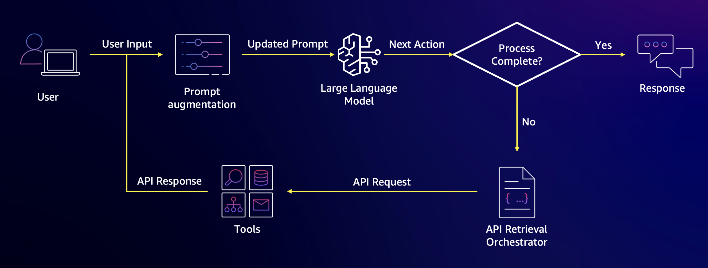

# Retrieval Augmented Generation with Amazon Bedrock - Retrieving Data Automatically from APIs

> *PLEASE NOTE: This notebook should work well with the **`Data Science 3.0`** kernel in SageMaker Studio*

---

Throughout this workshop so far, we have been working with unstructured text retrieval via semantic similarity search. However, another important type of retrieval which customers can take advantage of with Amazon Bedrock is **structured data retrieval** from APIs. Structured data retrieval is extremely useful for augmenting LLM applications with up to date information which can be retrieved in a repeatable manner, but the outputs are always changing. An example of a question you might ask an LLM which uses this type of retrieval might be "How long will it take for my Amazon.com order containing socks to arrive?". In this notebook, we will show how to integrate an LLM with a backend API service which has the ability to answer a user's question through RAG.

Specifically, we will be building a tool which is able to tell you the weather based on natural language. This is a fairly trivial example, but it does a good job of showing how multiple API tools can be used by an LLM to retrieve dynamic data to augment a prompt. Here is a visual of the architecture we will be building today.



Let's get started!

---
## Setup `boto3` Connection


```python
import boto3
import os
from IPython.display import Markdown, display, Pretty

region = os.environ.get("AWS_REGION")
boto3_bedrock = boto3.client(
    service_name='bedrock-runtime',
    region_name=region,
)
```

---
## Defining the API Tools

The first thing we need to do for our LLM is define the tools it has access to. In this case we will be defining local Python functions, but it important to not that these could be any type of application service. Examples of what these tools might be on AWS include...

* An AWS Lambda function
* An Amazon RDS database connection
* An Amazon DynamnoDB table
  
More generic examples include...

* REST APIs
* Data warehouses, data lakes, and databases
* Computation engines

In this case, we define two tools which reach external APIs below with two python functions
1. the ability to retrieve the latitude and longitude of a place given a natural language input
2. the ability to retrieve the weather given an input latitude and longitude


```python
import requests

place_index_name = "Bedrock-RAG-Foundations-Workshop-PlaceIndex"
location_client = boto3.client('location')

try:
    location_client.create_place_index(
        DataSource="Esri",
        IndexName=place_index_name,
    )
except location_client.exceptions.ConflictException:
    # place index already exists, which is ok
    pass

def get_lat_long(place: str):
    try:
        response = location_client.search_place_index_for_text(
            IndexName=place_index_name,
            Text=place,
            MaxResults=1,
        )
        lon, lat = response["Results"][0]["Place"]["Geometry"]["Point"]
    except:
        print("Place not found - using (0,0) instead!")
        lon, lat = "0", "0"
    return {"latitude": lat, "longitude": lon}

def get_weather(latitude: str, longitude: str):
    # This is a 3rd party service - be nice to them!
    url = f"https://api.open-meteo.com/v1/forecast?latitude={latitude}&longitude={longitude}&current_weather=true"
    response = requests.get(url)
    return response.json()

def call_function(tool_name, parameters):
    func = globals()[tool_name]
    output = func(**parameters)
    return output
```

We also define a function called `call_function` which is used to abstract the tool name. You can see an example of determining the weather in Las Vegas below.


```python
place = 'Las Vegas'
lat_long_response = call_function('get_lat_long', {'place' : place})
weather_response = call_function('get_weather', lat_long_response)
print(f'Weather in {place} is...')
weather_response
```

    Weather in Las Vegas is...


    {'latitude': 36.16438,
     'longitude': -115.14392,
     'generationtime_ms': 0.04601478576660156,
     'utc_offset_seconds': 0,
     'timezone': 'GMT',
     'timezone_abbreviation': 'GMT',
     'elevation': 621.0,
     'current_weather_units': {'time': 'iso8601',
      'interval': 'seconds',
      'temperature': '°C',
      'windspeed': 'km/h',
      'winddirection': '°',
      'is_day': '',
      'weathercode': 'wmo code'},
     'current_weather': {'time': '2024-10-01T19:30',
      'interval': 900,
      'temperature': 37.8,
      'windspeed': 10.9,
      'winddirection': 73,
      'is_day': 1,
      'weathercode': 0}}


As you might expect, we have to describe our tools to our LLM, so it knows how to use them. The strings below describe the python functions for lat/long and weather to Claude in an XML friendly format which we have seen previously in the workshop.


```python
get_weather_description = """\
<tool_description>
<tool_name>get_weather</tool_name>
<parameters>
<name>latitude</name>
<name>longitude</name>
</parameters>
</tool_description>
"""

get_lat_long_description = """
<tool_description>
<tool_name>get_lat_long</tool_name>
<parameters>
<name>place</name>
</parameters>
</tool_description>"""

list_of_tools_specs = [get_weather_description, get_lat_long_description]
tools_string = ''.join(list_of_tools_specs)
print(tools_string)
```

    <tool_description>
    <tool_name>get_weather</tool_name>
    <parameters>
    <name>latitude</name>
    <name>longitude</name>
    </parameters>
    </tool_description>
    
    <tool_description>
    <tool_name>get_lat_long</tool_name>
    <parameters>
    <name>place</name>
    </parameters>
    </tool_description>


---
## Define Prompts to Orchestrate our LLM Using Tools

Now that the tools are defined both programmatically and as a string, we can start orchestrating the flow which will answer user questions. The first step to this is creating a prompt which defines the rules of operation for Claude. In the prompt below, we provide explicit direction on how Claude should use tools to answer these questions.


```python
from langchain import PromptTemplate

TOOL_TEMPLATE = """\
Your job is to formulate a solution to a given <user-request> based on the instructions and tools below.

Use these Instructions:
1. In this environment you have access to a set of tools and functions you can use to answer the question.
2. You can call the functions by using the <function_calls> format below.
3. Only invoke one function at a time and wait for the results before invoking another function.
4. The Results of the function will be in xml tag <function_results>. Never make these up. The values will be provided for you.
5. Only use the information in the <function_results> to answer the question.
6. Once you truly know the answer to the question, place the answer in <answer></answer> tags. Make sure to answer in a full sentence which is friendly.
7. Never ask any questions

<function_calls>
<invoke>
<tool_name>$TOOL_NAME</tool_name>
<parameters>
<$PARAMETER_NAME>$PARAMETER_VALUE</$PARAMETER_NAME>
...
</parameters>
</invoke>
</function_calls>

Here are the tools available:
<tools>
{tools_string}
</tools>

<user-request>
{user_input}
</user-request>

Human: What is the first step in order to solve this problem?

Assistant:
"""
TOOL_PROMPT = PromptTemplate.from_template(TOOL_TEMPLATE)
```

---
## Executing the RAG Workflow

Armed with our prompt and structured tools, we can now write an orchestration function which will iteratively step through the logical tasks to answer a user question. In the cell below we use the `invoke_model` function to generate a response with Claude and the `single_retriever_step` function to iteratively call tools when the LLM tells us we need to. The general flow works like this...

1. The user enters an input to the application
2. The user input is merged with the original prompt and sent to the LLM to determine the next step
3. If the LLM knows the answer, it will answer and we are done. If not, go to next step 4.
4. The LLM will determine which tool to use to answer the question.
5. We will use the tool as directed by the LLM and retrieve the results.
6. We provide the results back into the original prompt as more context.
7. We ask the LLM the next step or if knows the answer.
8. Return to step 3.

If this is a bit confusing do not panic, we will walk through this flow in an example shortly!


```python
import xmltodict
import json

def invoke_model(prompt):
    client = boto3.client(service_name='bedrock-runtime', region_name=os.environ.get("AWS_REGION"),)
    body = json.dumps({"prompt": prompt, "max_tokens_to_sample": 500, "temperature": 0,})
    modelId = "anthropic.claude-3-haiku-20240307-v1:0"
    response = client.invoke_model(
        body=body, modelId=modelId, accept="application/json", contentType="application/json"
    )
    return json.loads(response.get("body").read()).get("completion")

def single_retriever_step(prompt, output):

    # first check if the model has answered the question
    done = False
    if '<answer>' in output:
        answer = output.split('<answer>')[1]
        answer = answer.split('</answer>')[0]
        done = True
        return done, answer

    # if the model has not answered the question, go execute a function
    else:

        # parse the output for any
        function_xml = output.split('<function_calls>')[1]
        function_xml = function_xml.split('</function_calls>')[0]
        function_dict = xmltodict.parse(function_xml)
        func_name = function_dict['invoke']['tool_name']
        parameters = function_dict['invoke']['parameters']

        # call the function which was parsed
        func_response = call_function(func_name, parameters)

        # create the next human input
        func_response_str = '\n\nHuman: Here is the result from your function call\n\n'
        func_response_str = func_response_str + f'<function_results>\n{func_response}\n</function_results>'
        func_response_str = func_response_str + '\n\nIf you know the answer, say it. If not, what is the next step?\n\nAssistant:'

        # augment the prompt
        prompt = prompt + output + func_response_str
    return done, prompt
```

Let's start our first example `What is the weather in Las Vegas?`. The code below asks the LLM what the first step is and you will notice that the LLM is able to ascertain it needs to use the `get_lat_long` tool first.


```python
user_input = 'What is the weather in Las Vegas?'
next_step = TOOL_PROMPT.format(tools_string=tools_string, user_input=user_input)

output = invoke_model(next_step).strip()
done, next_step = single_retriever_step(next_step, output)
if not done:
    display(Pretty(output))
else:
    display(Pretty('Final answer from LLM:'))
    display(Pretty(next_step))
```


    The first step is to invoke the get_lat_long function to get the latitude and longitude of Las Vegas:
    
    <function_calls>
    <invoke>
    <tool_name>get_lat_long</tool_name>  
    <parameters>
    <place>Las Vegas</place>
    </parameters>
    </invoke>
    </function_calls>


Great, Claude has figured out that we should first call the lat and long tool. The next step is then orchestrated just like the first. This time, Claude uses the lat/long from the first request to now ask for the weather of that specific location.


```python
output = invoke_model(next_step).strip()
done, next_step = single_retriever_step(next_step, output)
if not done:
    display(Pretty(output))
else:
    display(Pretty('Final answer from LLM:\n'))
    display(Pretty(next_step))
```


    The next step is to invoke the get_weather function using the latitude and longitude returned from the previous function call to get the weather in Las Vegas:
    
    <function_calls>
    <invoke>
    <tool_name>get_weather</tool_name>
    <parameters>
    <latitude>36.1690921</latitude>
    <longitude>-115.1405767</longitude>  
    </parameters>
    </invoke>
    </function_calls>


Finally the LLM is able to answer the question based on the input function above. Very cool!


```python
output = invoke_model(next_step).strip()
done, next_step = single_retriever_step(next_step, output)
if not done:
    display(Pretty(output))
else:
    display(Pretty('Final answer from LLM:'))
    display(Pretty(next_step))
```


    Final answer from LLM:


    
    The weather in Las Vegas is currently 37.8 degrees Celsius with a wind speed of 10.9 km/h coming from the southeast.


Let's try another example to show how a different place (Singapore) can be used in this example. Notice how we set the for loop to 5 iterations even though the model only uses 3 of these. This iteration capping is common in agent workflows and should be tuned according to your use case. 


```python
user_input = 'What is the weather in Singapore?'
next_step = TOOL_PROMPT.format(tools_string=tools_string, user_input=user_input)

for i in range(5):
    output = invoke_model(next_step).strip()
    done, next_step = single_retriever_step(next_step, output)
    if not done:
        display(Pretty(output))
    else:
        display(Pretty('Final answer from LLM:'))
        display(Pretty(next_step))
        break
```


    The first step is to invoke the get_lat_long function to get the latitude and longitude of Singapore, since that information is needed by the get_weather function to return the weather conditions.
    
    <function_calls>
    <invoke>
    <tool_name>get_lat_long</tool_name>  
    <parameters>
    <place>Singapore</place>
    </parameters>
    </invoke>
    </function_calls>


    The next step is to invoke the get_weather function, passing in the latitude and longitude retrieved from the previous get_lat_long call, to get the weather conditions in Singapore.
    
    <function_calls>
    <invoke>  
    <tool_name>get_weather</tool_name>
    <parameters>
    <latitude>1.2894365</latitude> 
    <longitude>103.8499802</longitude>
    </parameters>
    </invoke>
    </function_calls>


    Final answer from LLM:


    
    The weather in Singapore is 26.9 degrees Celsius, with a wind speed of 1.8 km/h coming from a direction of 191 degrees.


---
## Next steps

Now that you have used a few different retrieval systems, lets move on to the next notebook where you can apply the skills you've learned so far!
