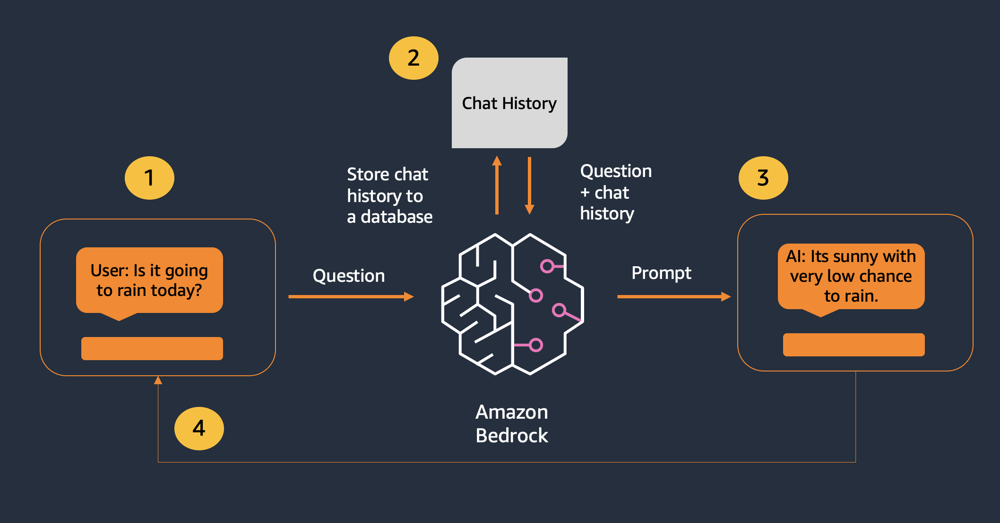
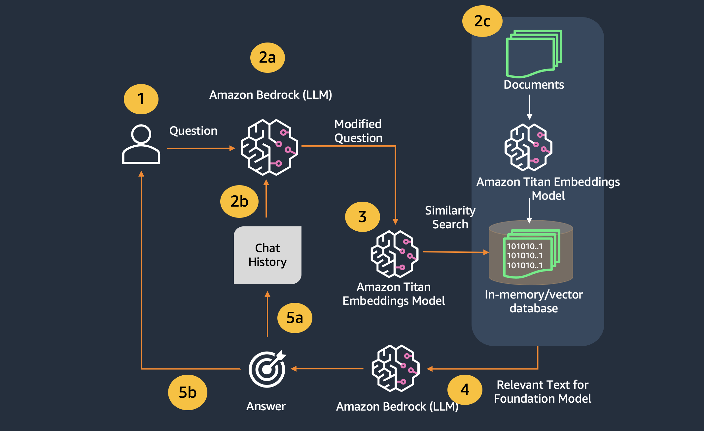

# Retrieval Augmented Generation with Amazon Bedrock - Enhancing Chat Applications with RAG

> *PLEASE NOTE: This notebook should work well with the **`Data Science 3.0`** kernel in SageMaker Studio*

---

## Chat with LLMs Overview

Conversational interfaces such as chatbots and virtual assistants can be used to enhance the user experience for your customers. Chatbots can be used in a variety of applications, such as customer service, sales, and e-commerce, to provide quick and efficient responses to users.

The key technical detail which we need to include in our system to enable a chat feature is conversational memory. This way, customers can ask follow up questions and the LLM will understand what the customer has already said in the past. The image below shows how this is orchestrated at a high level.



## Extending Chat with RAG

However, in our workshop's situation, we want to be able to enable a customer to ask follow up questions regarding documentation we provide through RAG. This means we need to build a system which has conversational memory AND contextual retrieval built into the text generation.



Let's get started!

---

## Setup `boto3` Connection


```python
import boto3
import os
from IPython.display import Markdown, display

import logging
import boto3


from botocore.exceptions import ClientError

region = os.environ.get("AWS_REGION")
boto3_bedrock = boto3.client(
    service_name='bedrock-runtime',
    region_name=region,
)


logger = logging.getLogger(__name__)
logging.basicConfig(level=logging.INFO)
    
logging.basicConfig(level=logging.INFO,format="%(levelname)s: %(message)s")

region = os.environ.get("AWS_REGION")
bedrock_runtime = boto3.client(
    service_name='bedrock-runtime',
    region_name=region,
)
claude3 = 'claude3'
llama2 = 'llama2'
llama3='llama3'
mistral='mistral'
titan='titan'
models_dict = {
    claude3 : 'anthropic.claude-3-sonnet-20240229-v1:0',
    llama2: 'meta.llama2-13b-chat-v1',
    llama3: 'meta.llama3-8b-instruct-v1:0',
    mistral: 'mistral.mistral-7b-instruct-v0:2',
    titan : 'amazon.titan-text-premier-v1:0'
}
max_tokens_val = 200
temperature_val = 0.1
dict_add_params = {
    llama3: {}, #"max_gen_len":max_tokens_val, "temperature":temperature_val} , 
    claude3: {"top_k": 200, },# "temperature": temperature_val, "max_tokens": max_tokens_val},
    mistral: {}, #{"max_tokens":max_tokens_val, "temperature": temperature_val} , 
    titan:  {"topK": 200, },# "maxTokenCount": max_tokens_val}
}
inference_config={
    "temperature": temperature_val,
    "maxTokens": max_tokens_val,
    "topP": 0.9
}


def generate_conversation(bedrock_client,model_id,system_text,input_text):
    """
    Sends a message to a model.
    Args:
        bedrock_client: The Boto3 Bedrock runtime client.
        model_id (str): The model ID to use.
        system_text (JSON) : The system prompt.
        input text : The input message.

    Returns:
        response (JSON): The conversation that the model generated.

    """

    logger.info("Generating message with model %s", model_id)

    # Message to send.
    message = {
        "role": "user",
        "content": [{"text": input_text}]
    }
    messages = [message]
    system_prompts = [{"text" : system_text}]

    if model_id in [models_dict.get(mistral), models_dict.get(titan)]:
        system_prompts = [] # not supported

    # Inference parameters to use.
  

    #Base inference parameters to use.
    #inference_config = {"temperature": temperature}


    # Send the message.
    response = bedrock_client.converse(
        modelId=model_id,
        messages=messages,
        system=system_prompts,
        inferenceConfig=inference_config,
        additionalModelRequestFields=get_additional_model_fields(model_id)
    )

    return response

def get_additional_model_fields(modelId):

    return dict_add_params.get(modelId)
    #{"top_k": top_k, "max_tokens": max_tokens}}
    
def get_converse_output(response_obj):
    ret_messages=[]
    output_message = response['output']['message']
    role_out = output_message['role']

    for content in output_message['content']:
        ret_messages.append(content['text'])
        
    return ret_messages, role_out
```

---
## Using LangChain for Conversation Memory

We will use LangChain's `ConversationBufferMemory` class provides an easy way to capture conversational memory for LLM chat applications. Let's check out an example of Claude being able to retrieve context through conversational memory below.

Similar to the last workshop, we will use both a prompt template and a LangChain LLM for this example. Note that this time our prompt template includes a `{history}` variable where our chat history will be included to the prompt.


```python
from langchain import PromptTemplate
from langchain.memory import ConversationBufferMemory
from langchain.prompts import PromptTemplate
from langchain.prompts.chat import ChatPromptTemplate
from langchain_community.chat_models import BedrockChat
from langchain_core.messages import HumanMessage
from langchain.chains import ConversationChain
from langchain_core.output_parsers import StrOutputParser

```


```python
from langchain.memory import ConversationBufferMemory
from langchain.prompts import PromptTemplate
from langchain.prompts.chat import ChatPromptTemplate


# turn verbose to true to see the full logs and documents
modelId = models_dict.get(claude3)
cl_llm = BedrockChat(
    model_id=modelId,
    client=boto3_bedrock,
    model_kwargs={"temperature": 0.1, 'max_tokens': 100},
)
```

    /Users/rsgrewal/opt/anaconda3/envs/ragtest310/lib/python3.12/site-packages/langchain_core/_api/deprecation.py:119: LangChainDeprecationWarning: The class `BedrockChat` was deprecated in LangChain 0.0.34 and will be removed in 0.3. An updated version of the class exists in the langchain-aws package and should be used instead. To use it run `pip install -U langchain-aws` and import as `from langchain_aws import ChatBedrock`.
      warn_deprecated(


The `ConversationBufferMemory` class is instantiated here and you will notice that we use Claude specific human and assistant prefixes. When we initialize the memory, the history is blank.


```python
from langchain.memory import ConversationBufferMemory

memory = ConversationBufferMemory(human_prefix="\nHuman", ai_prefix="\nAssistant")
history = memory.load_memory_variables({})['history']
print(history)
```

    


```python
human_query =  "How did Amazon's Advertising business do in 2023?"
```

---
## Combining RAG with Conversation

Now that we have a conversational system built, lets incorporate the RAG system we built in notebook 02 into the chat paradigm. 

First, we will create the same vector store with LangChain and FAISS from the last notebook.

Our goal is to create a curated response from the model and only use the FAQ's we have provided.


```python
from langchain.embeddings import BedrockEmbeddings
from langchain.vectorstores import FAISS
from langchain.document_loaders import PyPDFLoader
from langchain.tools.retriever import create_retriever_tool
from langchain_community.document_loaders import TextLoader, PyPDFLoader
from langchain_community.vectorstores import FAISS
from langchain_text_splitters import CharacterTextSplitter
from langchain.embeddings.bedrock import BedrockEmbeddings

br_embeddings = BedrockEmbeddings(model_id="amazon.titan-embed-text-v1", client=boto3_bedrock)

loader = PyPDFLoader('../data/sagemaker/Amazon-com-Inc-2023-Shareholder-Letter.pdf') # --- > 219 docs with 400 chars, each row consists in a question column and an answer column
documents_aws = loader.load() #
print(f"Number of documents={len(documents_aws)}")

docs = CharacterTextSplitter(chunk_size=2000, chunk_overlap=400, separator="\n").split_documents(documents_aws) #-  separator=","

print(f"Number of documents after split and chunking={len(docs)}")


vs = FAISS.from_documents(
    documents=docs,
     embedding = br_embeddings
)

print(f"vectorstore_faiss_aws: number of elements in the index={vs.index.ntotal}::")
```

    Number of documents=11
    Number of documents after split and chunking=31


    INFO:faiss.loader:Loading faiss.
    INFO:faiss.loader:Successfully loaded faiss.


    vectorstore_faiss_aws: number of elements in the index=31::


### Visualize Semantic Search 

⚠️ ⚠️ ⚠️ This section is for Advanced Practioners. Please feel free to run through these cells and come back later to re-examine the concepts ⚠️ ⚠️ ⚠️ 

Let's see how the semantic search works:
1. First we calculate the embeddings vector for the query, and
2. then we use this vector to do a similarity search on the store


##### Citation
We will also be able to get the `citation` or the underlying documents which our Vector Store matched to our query. This is useful for debugging and also measuring the quality of the vector stores. let us look at how the underlying Vector store calculates the matches

##### Vector DB Indexes
One of the key components of the Vector DB is to be able to retrieve documents matching the query with accuracy and speed. There are multiple algorithims for the same and some examples can be [read here](https://thedataquarry.com/posts/vector-db-3/) 


```python
from IPython.display import HTML, display
import warnings
warnings.filterwarnings('ignore')
#- helpful function to display in tabular format

def display_table(data):
    html = "<table>"
    for row in data:
        html += "<tr>"
        for field in row:
            html += "<td>%s</td>"%(field)
        html += "</tr>"
    html += "</table>"
    display(HTML(html))
```


```python

v = br_embeddings.embed_query(human_query)
print(v[0:10])
results = vs.similarity_search_by_vector(v, k=2)
display(Markdown('Let us look at the documents which had the relevant information pertaining to our query'))
for r in results:
    display(Markdown(r.page_content))
    display(Markdown('-'*20))
```

    [0.8125, -0.78515625, 0.27929688, -0.45703125, 0.6640625, 0.103515625, 0.14941406, -0.00026512146, 0.10644531, 0.15820312]


Let us look at the documents which had the relevant information pertaining to our query


expand selection and features, and move toward profitability (in Q4 2023, Mexico became our latest
international Stores locale to turn profitable). We have high conviction that these new geographies willcontinue to grow and be profitable in the long run.
Alongside our Stores business, Amazon’s Advertising progress remains strong, growing 24% Y oY from
$38B in 2022 to $47B in 2023, primarily driven by our sponsored ads. We’ve added Sponsored TV to this
offering, a self-service solution for brands to create campaigns that can appear on up to 30+ streamingTV services, including Amazon Freevee and Twitch, and have no minimum spend. Recently, we’ve expandedour streaming TV advertising by introducing ads into Prime Video shows and movies, where brands canreach over 200 million monthly viewers in our most popular entertainment offerings, across hit movies andshows, award-winning Amazon MGM Originals, and live sports like Thursday Night Football . Streaming
TV advertising is growing quickly and off to a strong start.
Shifting to AWS, we started 2023 seeing substantial cost optimization, with most companies trying to save
money in an uncertain economy. Much of this optimization was catalyzed by AWS helping customers use the
cloud more efficiently and leverage more powerful, price-performant AWS capabilities like Graviton chips(our generalized CPU chips that provide ~40% better price-performance than other leading x86 processors),S3 Intelligent Tiering (a storage class that uses AI to detect objects accessed less frequently and store themin less expensive storage layers), and Savings Plans (which give customers lower prices in exchange for longercommitments). This work diminished short-term revenue, but was best for customers, much appreciated,and should bode well for customers and AWS longer-term. By the end of 2023, we saw cost optimizationattenuating, new deals accelerating, customers renewing at larger commitments over longer time periods, andmigrations growing again.


--------------------


Being sharp on price is always important, but particularly in an uncertain economy, where customers are
careful about how much they’re spending. As a result, in Q4 2023, we kicked off the holiday season with Prime
Big Deal Days, an exclusive event for Prime members to provide an early start on holiday shopping. Thiswas followed by our extended Black Friday and Cyber Monday holiday shopping event, open to all customers,that became our largest revenue event ever. For all of 2023, customers saved nearly $24B across millions ofdeals and coupons, almost 70% more than the prior year.
We also continue to improve delivery speeds, breaking multiple company records. In 2023, Amazon
delivered at the fastest speeds ever to Prime members, with more than 7 billion items arriving same or next
day, including more than 4 billion in the U.S. and more than 2 billion in Europe. In the U.S., this result is thecombination of two things. One is the benefit of regionalization, where we re-architected the network tostore items closer to customers. The other is the expansion of same-day facilities, where in 2023, we increasedthe number of items delivered same day or overnight by nearly 70% Y oY . As we get items to customers thisfast, customers choose Amazon to fulfill their shopping needs more frequently, and we can see the results invarious areas including how fast our everyday essentials business is growing (over 20% Y oY in Q4 2023).
Our regionalization efforts have also trimmed transportation distances, helping lower our cost to serve. In
2023, for the first time since 2018, we reduced our cost to serve on a per unit basis globally. In the U.S. alone,
cost to serve was down by more than $0.45 per unit Y oY . Decreasing cost to serve allows us both to investin speed improvements and afford adding more selection at lower Average Selling Prices (“ASPs”). Moreselection at lower prices puts us in consideration for more purchases.


--------------------


#### Similarity Search

##### Distance scoring in Vector Data bases
[Distance scores](https://weaviate.io/blog/distance-metrics-in-vector-search) are the key in vector searches. Here are some FAISS specific methods. One of them is similarity_search_with_score, which allows you to return not only the documents but also the distance score of the query to them. The returned distance score is L2 distance ( Squared Euclidean) . Therefore, a lower score is better. Further in FAISS we have similarity_search_with_score (ranked by distance: low to high) and similarity_search_with_relevance_scores ( ranked by relevance: high to low) with both using the distance strategy. The similarity_search_with_relevance_scores calculates the relevance score as 1 - score. For more details of the various distance scores [read here](https://milvus.io/docs/metric.md)


```python
display(Markdown(f"##### Let us look at the documents based on {vs.distance_strategy.name} which will be used to answer our question {human_query}"))

context = vs.similarity_search('What kind of bias does Clarify detect ?', k=2)
#-  langchain.schema.document.Document
display(Markdown('-'*20))
list_context = [[doc.page_content, doc.metadata] for doc in context]
list_context.insert(0, ['Documents', 'Meta-data'])
display_table(list_context)
```


##### Let us look at the documents based on EUCLIDEAN_DISTANCE which will be used to answer our question How did Amazon's Advertising business do in 2023?


--------------------


<table><tr><td>Documents</td><td>Meta-data</td></tr><tr><td>service. Amazon Bedrock invented this layer and provides customers with the easiest way to build and scale
GenAI applications with the broadest selection of first- and third-party FMs, as well as leading ease-of-usecapabilities that allow GenAI builders to get higher quality model outputs more quickly. Bedrock is off to avery strong start with tens of thousands of active customers after just a few months. The team continuesto iterate rapidly on Bedrock, recently delivering Guardrails (to safeguard what questions applications will
answer), Knowledge Bases (to expand models’ knowledge base with Retrieval Augmented Generation—or
RAG—and real-time queries), Agents (to complete multi-step tasks), and Fine-Tuning (to keep teaching
and refining models), all of which improve customers’ application quality. We also just added new modelsfrom Anthropic (their newly-released Claude 3 is the best performing large language model in the world),Meta (with Llama 2), Mistral, Stability AI, Cohere, and our own Amazon Titan family of FMs. Whatcustomers have learned at this early stage of GenAI is that there’s meaningful iteration required to build aproduction GenAI application with the requisite enterprise quality at the cost and latency needed. Customersdon’t want only one model. They want access to various models and model sizes for different types of
applications. Customers want a service that makes this experimenting and iterating simple, and this is whatBedrock does, which is why customers are so excited about it. Customers using Bedrock already include ADP,Amdocs, Bridgewater Associates, Broadridge, Clariant, Dana-Farber Cancer Institute, Delta Air Lines,Druva, Genesys, Genomics England, GoDaddy, Intuit, KT, Lonely Planet, LexisNexis, Netsmart, PerplexityAI, Pfizer, PGA TOUR, Ricoh, Rocket Companies, and Siemens.
Thetoplayer of this stack is the application layer. We’re building a substantial number of GenAI applications</td><td>{'source': '../data/sagemaker/Amazon-com-Inc-2023-Shareholder-Letter.pdf', 'page': 6}</td></tr><tr><td>2023, for the first time since 2018, we reduced our cost to serve on a per unit basis globally. In the U.S. alone,
cost to serve was down by more than $0.45 per unit Y oY . Decreasing cost to serve allows us both to investin speed improvements and afford adding more selection at lower Average Selling Prices (“ASPs”). Moreselection at lower prices puts us in consideration for more purchases.
As we look toward 2024 (and beyond), we’re not done lowering our cost to serve. We’ve challenged every
closely held belief in our fulfillment network, and reevaluated every part of it, and found several areas where
we believe we can lower costs even further while also delivering faster for customers. Our inbound fulfillmentarchitecture and resulting inventory placement are areas of focus in 2024, and we have optimism there’smore upside for us.
Internationally, we like the trajectory of our established countries, and see meaningful progress in our
emerging geographies (e.g. India, Brazil, Australia, Mexico, Middle East, Africa, etc.) as they continue to</td><td>{'source': '../data/sagemaker/Amazon-com-Inc-2023-Shareholder-Letter.pdf', 'page': 0}</td></tr></table>


Let us first look at the Page context and the meta data associated with the documents. Now let us look at the L2 scores based on the distance scoring as explained above. Lower score is better


```python
#- relevancy of the documents
results = vs.similarity_search_with_score(human_query, k=2, fetch_k=3)
display(Markdown('##### Similarity Search Table with relevancy score.'))
display(Markdown('-'*20))
results.insert(0, ['Documents', 'Relevancy Score'])
display_table(results)
```


##### Similarity Search Table with relevancy score.


--------------------


<table><tr><td>Documents</td><td>Relevancy Score</td></tr><tr><td>page_content='expand selection and features, and move toward profitability (in Q4 2023, Mexico became our latest\ninternational Stores locale to turn profitable). We have high conviction that these new geographies willcontinue to grow and be profitable in the long run.\nAlongside our Stores business, Amazon’s Advertising progress remains strong, growing 24% Y oY from\n$38B in 2022 to $47B in 2023, primarily driven by our sponsored ads. We’ve added Sponsored TV to this\noffering, a self-service solution for brands to create campaigns that can appear on up to 30+ streamingTV services, including Amazon Freevee and Twitch, and have no minimum spend. Recently, we’ve expandedour streaming TV advertising by introducing ads into Prime Video shows and movies, where brands canreach over 200 million monthly viewers in our most popular entertainment offerings, across hit movies andshows, award-winning Amazon MGM Originals, and live sports like Thursday Night Football . Streaming\nTV advertising is growing quickly and off to a strong start.\nShifting to AWS, we started 2023 seeing substantial cost optimization, with most companies trying to save\nmoney in an uncertain economy. Much of this optimization was catalyzed by AWS helping customers use the\ncloud more efficiently and leverage more powerful, price-performant AWS capabilities like Graviton chips(our generalized CPU chips that provide ~40% better price-performance than other leading x86 processors),S3 Intelligent Tiering (a storage class that uses AI to detect objects accessed less frequently and store themin less expensive storage layers), and Savings Plans (which give customers lower prices in exchange for longercommitments). This work diminished short-term revenue, but was best for customers, much appreciated,and should bode well for customers and AWS longer-term. By the end of 2023, we saw cost optimizationattenuating, new deals accelerating, customers renewing at larger commitments over longer time periods, andmigrations growing again.' metadata={'source': '../data/sagemaker/Amazon-com-Inc-2023-Shareholder-Letter.pdf', 'page': 1}</td><td>126.094025</td></tr><tr><td>page_content='Being sharp on price is always important, but particularly in an uncertain economy, where customers are\ncareful about how much they’re spending. As a result, in Q4 2023, we kicked off the holiday season with Prime\nBig Deal Days, an exclusive event for Prime members to provide an early start on holiday shopping. Thiswas followed by our extended Black Friday and Cyber Monday holiday shopping event, open to all customers,that became our largest revenue event ever. For all of 2023, customers saved nearly $24B across millions ofdeals and coupons, almost 70% more than the prior year.\nWe also continue to improve delivery speeds, breaking multiple company records. In 2023, Amazon\ndelivered at the fastest speeds ever to Prime members, with more than 7 billion items arriving same or next\nday, including more than 4 billion in the U.S. and more than 2 billion in Europe. In the U.S., this result is thecombination of two things. One is the benefit of regionalization, where we re-architected the network tostore items closer to customers. The other is the expansion of same-day facilities, where in 2023, we increasedthe number of items delivered same day or overnight by nearly 70% Y oY . As we get items to customers thisfast, customers choose Amazon to fulfill their shopping needs more frequently, and we can see the results invarious areas including how fast our everyday essentials business is growing (over 20% Y oY in Q4 2023).\nOur regionalization efforts have also trimmed transportation distances, helping lower our cost to serve. In\n2023, for the first time since 2018, we reduced our cost to serve on a per unit basis globally. In the U.S. alone,\ncost to serve was down by more than $0.45 per unit Y oY . Decreasing cost to serve allows us both to investin speed improvements and afford adding more selection at lower Average Selling Prices (“ASPs”). Moreselection at lower prices puts us in consideration for more purchases.' metadata={'source': '../data/sagemaker/Amazon-com-Inc-2023-Shareholder-Letter.pdf', 'page': 0}</td><td>168.52493</td></tr></table>


#### Marginal Relevancy score

Maximal Marginal Relevance  has been introduced in the paper [The Use of MMR, Diversity-Based Reranking for Reordering Documents and Producing Summaries](https://www.cs.cmu.edu/~jgc/publication/The_Use_MMR_Diversity_Based_LTMIR_1998.pdf). Maximal Marginal Relevance tries to reduce the redundancy of results while at the same time maintaining query relevance of results for already ranked documents/phrases etc. In the below results since we have a very limited data set it might not make a difference but for larger data sets the query will theoritically run faster while still preserving the over all relevancy of the documents


```python
#- normalizing the relevancy
display(Markdown('##### Let us look at MRR scores'))
results = vs.max_marginal_relevance_search_with_score_by_vector(br_embeddings.embed_query(human_query), k=3)
results.insert(0, ["Document", "MRR Score"])
display_table(results)

```


##### Let us look at MRR scores


<table><tr><td>Document</td><td>MRR Score</td></tr><tr><td>page_content='expand selection and features, and move toward profitability (in Q4 2023, Mexico became our latest\ninternational Stores locale to turn profitable). We have high conviction that these new geographies willcontinue to grow and be profitable in the long run.\nAlongside our Stores business, Amazon’s Advertising progress remains strong, growing 24% Y oY from\n$38B in 2022 to $47B in 2023, primarily driven by our sponsored ads. We’ve added Sponsored TV to this\noffering, a self-service solution for brands to create campaigns that can appear on up to 30+ streamingTV services, including Amazon Freevee and Twitch, and have no minimum spend. Recently, we’ve expandedour streaming TV advertising by introducing ads into Prime Video shows and movies, where brands canreach over 200 million monthly viewers in our most popular entertainment offerings, across hit movies andshows, award-winning Amazon MGM Originals, and live sports like Thursday Night Football . Streaming\nTV advertising is growing quickly and off to a strong start.\nShifting to AWS, we started 2023 seeing substantial cost optimization, with most companies trying to save\nmoney in an uncertain economy. Much of this optimization was catalyzed by AWS helping customers use the\ncloud more efficiently and leverage more powerful, price-performant AWS capabilities like Graviton chips(our generalized CPU chips that provide ~40% better price-performance than other leading x86 processors),S3 Intelligent Tiering (a storage class that uses AI to detect objects accessed less frequently and store themin less expensive storage layers), and Savings Plans (which give customers lower prices in exchange for longercommitments). This work diminished short-term revenue, but was best for customers, much appreciated,and should bode well for customers and AWS longer-term. By the end of 2023, we saw cost optimizationattenuating, new deals accelerating, customers renewing at larger commitments over longer time periods, andmigrations growing again.' metadata={'source': '../data/sagemaker/Amazon-com-Inc-2023-Shareholder-Letter.pdf', 'page': 1}</td><td>126.094025</td></tr><tr><td>page_content='So, how do you build the right set of primitives?Pursuing primitives is not a guarantee of success. There are many you could build, and even more ways to\ncombine them. But, a good compass is to pick real customer problems you’re trying to solve .\nOur logistics primitives are an instructive example. In Amazon’s early years, we built core capabilities\naround warehousing items, and then picking, packing, and shipping them quickly and reliably to customers.As we added third-party sellers to our marketplace, they frequently requested being able to use these samelogistics capabilities. Because we’d built this initial set of logistics primitives, we were able to introduceFulfillment by Amazon (“FBA ”) in 2006, allowing sellers to use Amazon’s Fulfillment Network to storeitems, and then have us pick, pack, and ship them to customers, with the bonus of these products beingavailable for fast, Prime delivery. This service has saved sellers substantial time and money (typically about70% less expensive than doing themselves), and remains one of our most popular services. As more merchantsbegan to operate their own direct-to-consumer (“DTC”) websites, many yearned to still use our fulfillmentcapabilities, while also accessing our payments and identity primitives to drive higher order conversion ontheir own websites (as Prime members have already shared this payment and identity information withAmazon). A couple years ago, we launched Buy with Prime to address this customer need. Prime memberscan check out quickly on DTC websites like they do on Amazon, and receive fast Prime shipping speeds onBuy with Prime items—increasing order conversion for merchants by ~25% vs. their default experience.\nAs our Stores business has grown substantially, and our supply chain become more complex, we’ve had to' metadata={'source': '../data/sagemaker/Amazon-com-Inc-2023-Shareholder-Letter.pdf', 'page': 3}</td><td>256.7152</td></tr><tr><td>page_content='(By the way, don’t underestimate the importance of security in GenAI. Customers’ AI models contain some\nof their most sensitive data. AWS and its partners offer the strongest security capabilities and track recordin the world; and as a result, more and more customers want to run their GenAI on AWS.)\n===Recently, I was asked a provocative question—how does Amazon remain resilient? While simple in its\nwording, it’s profound because it gets to the heart of our success to date as well as for the future. The answerlies in our discipline around deeply held principles: 1/ hiring builders who are motivated to continuallyimprove and expand what’s possible; 2/ solving real customer challenges, rather than what we think may beinteresting technology; 3/ building in primitives so that we can innovate and experiment at the highest rate;4/ not wasting time trying to fight gravity (spoiler alert: you always lose)—when we discover technologythat enables better customer experiences, we embrace it; 5/ accepting and learning from failed experiments—actually becoming more energized to try again, with new knowledge to employ.\nToday, we continue to operate in times of unprecedented change that come with unusual opportunities for\ngrowth across the areas in which we operate. For instance, while we have a nearly $500B consumer business,about 80% of the worldwide retail market segment still resides in physical stores. Similarly, with a cloudcomputing business at nearly a $100B revenue run rate, more than 85% of the global IT spend is still' metadata={'source': '../data/sagemaker/Amazon-com-Inc-2023-Shareholder-Letter.pdf', 'page': 6}</td><td>213.93944</td></tr></table>


#### Query with Filter
Now we will ask to search only against the version 2 of the data and use filter criteria against it


```python
# - run the query again

results_with_scores = vs.similarity_search_with_score(human_query, filter=dict(page='v2'), k=2, fetch_k=3)
results_with_scores = [[doc.page_content, doc.metadata, score] for doc, score in results_with_scores]
results_with_scores.insert(0, ['Document', 'Meta-Data', 'Score'])
display_table(results_with_scores)
```


<table><tr><td>Document</td><td>Meta-Data</td><td>Score</td></tr></table>


### Let us continue to build our chatbot

The prompt template is now altered to include both conversation memory as well as chat history as inputs along with the human input. Notice how the prompt also instructs Claude to not answer questions which it does not have the context for. This helps reduce hallucinations which is extremely important when creating end user facing applications which need to be factual.

--- 
## Using LangChain for Orchestration of RAG

Beyond the primitive classes for prompt handling and conversational memory management, LangChain also provides a framework for [orchestrating RAG flows](https://python.langchain.com/docs/expression_language/cookbook/retrieval) with what purpose built "chains". In this section, we will see how to be a retrieval chain with LangChain which is more comprehensive and robust than the original retrieval system we built above.

The workflow we used above follows the following process...

1. User input is received.
2. User input is queried against the vector database to retrieve relevant documents.
3. Relevant documents and chat memory are inserted into a new prompt to respond to the user input.
4. Return to step 1.

However, more complex methods of interacting with the user input can generate more accurate results in RAG architectures. One of the popular mechanisms which can increase accuracy of these retrieval systems is utilizing more than one call to an LLM in order to reformat the user input for more effective search to your vector database. A better workflow is described below compared to the one we already built...

1. User input is received.
2. An LLM is used to reword the user input to be a better search query for the vector database based on the chat history and other instructions. This could include things like condensing, rewording, addition of chat context, or stylistic changes.
3. Reformatted user input is queried against the vector database to retrieve relevant documents.
4. The reformatted user input and relevant documents are inserted into a new prompt in order to answer the user question.
5. Return to step 1.

Let's now build out this second workflow using LangChain below.

First we need to make a prompt which will reformat the user input to be more compatible for searching of the vector database. The way we do this is by providing the chat history as well as the some basic instructions to Claude and asking it to condense the input into a single output.


```python
condense_prompt = PromptTemplate.from_template("""\
<chat-history>
{chat_history}
</chat-history>

<follow-up-message>
{question}
<follow-up-message>

Human: Given the conversation above (between Human and Assistant) and the follow up message from Human, \
rewrite the follow up message to be a standalone question that captures all relevant context \
from the conversation. Answer only with the new question and nothing else.

Assistant: Standalone Question:""")
```

#### However we are goign to continue to use the in-built template


```python
from langchain.chains.conversational_retrieval.prompts import CONDENSE_QUESTION_PROMPT

print(CONDENSE_QUESTION_PROMPT.template)
```

    Given the following conversation and a follow up question, rephrase the follow up question to be a standalone question, in its original language.
    
    Chat History:
    {chat_history}
    Follow Up Input: {question}
    Standalone question:


The next prompt we need is the prompt which will answer the user's question based on the retrieved information. In this case, we provide specific instructions about how to answer the question as well as provide the context retrieved from the vector database.


```python
from langchain import PromptTemplate
from langchain.memory import ConversationBufferMemory
from langchain.prompts import PromptTemplate
from langchain.prompts.chat import ChatPromptTemplate
from langchain_community.chat_models import BedrockChat
from langchain_core.messages import HumanMessage
from langchain.chains import ConversationChain
from langchain_core.output_parsers import StrOutputParser


SYSTEM_MESSAGE = """
System: You are a helpful conversational assistant.If you are unsure about the answer OR the answer does not exist in the context, respond with
"Sorry but I do not understand your request. I am still learning so I appreciate your patience! 😊. NEVER make up the answer.
Here is some important context which can help inform the questions the Human asks. Make sure to not make anything up to answer the question if it is not provided in the context. 

Context: {context}

History: {chat_history}

"""
HUMAN_MESSAGE = "{question}"

messages = [
    ("system", SYSTEM_MESSAGE),
    ("human", HUMAN_MESSAGE)
]

chat_prompt_template = ChatPromptTemplate.from_messages(messages)
```

Now that we have our prompts set up, let's set up the conversational memory buffer just like we did earlier in the notebook. Notice how we inject an example human and assistant message in order to help guide our AI assistant on what its job is.


```python
llm = BedrockChat(
    client=boto3_bedrock,
    model_id=models_dict.get(claude3),
    model_kwargs=dict_add_params.get(claude3) #{"max_tokens_to_sample": 500, "temperature": 0.9}
)
memory_chain = ConversationBufferMemory(
    memory_key="chat_history",
    return_messages=True,
    # human_prefix="Human",
    # ai_prefix="Assistant"
)

```

Lastly, we will used the `ConversationalRetrievalChain` from LangChain to orchestrate this whole system. If you would like to see some more logs about what is happening in the orchestration and not just the final output, make sure to change the `verbose` argument to `True`.


```python
from langchain.chains import ConversationalRetrievalChain
qa = ConversationalRetrievalChain.from_llm(
    llm=llm, # this is our claude model
    retriever=vs.as_retriever(), # this is our FAISS vector database
    memory=memory_chain, # this is the conversational memory storage class
    condense_question_prompt=CONDENSE_QUESTION_PROMPT, # this is the prompt for condensing user inputs
    verbose=False, # change this to True in order to see the logs working in the background
)
qa.combine_docs_chain.llm_chain.prompt = chat_prompt_template#  respond_prompt # this is the prompt in order to respond to condensed questions
```


```python
chat_prompt_template
```


    ChatPromptTemplate(input_variables=['chat_history', 'context', 'question'], messages=[SystemMessagePromptTemplate(prompt=PromptTemplate(input_variables=['chat_history', 'context'], template='\nSystem: You are a helpful conversational assistant.If you are unsure about the answer OR the answer does not exist in the context, respond with\n"Sorry but I do not understand your request. I am still learning so I appreciate your patience! 😊. NEVER make up the answer.\nHere is some important context which can help inform the questions the Human asks. Make sure to not make anything up to answer the question if it is not provided in the context. \n\nContext: {context}\n\nHistory: {chat_history}\n\n')), HumanMessagePromptTemplate(prompt=PromptTemplate(input_variables=['question'], template='{question}'))])


```python
qa.run({'question': human_query})
```


    "According to the context provided, Amazon's Advertising business had strong progress in 2023, growing 24% year-over-year from $38 billion in 2022 to $47 billion in 2023. This growth was primarily driven by Amazon's sponsored ads offerings. The context also mentions that Amazon expanded its advertising offerings by introducing Sponsored TV ads that can appear on streaming services like Amazon Freevee, Twitch, and Prime Video shows/movies reaching over 200 million monthly viewers."


Let's go ahead and generate some responses from our RAG solution!


```python
output = qa.run({'question': 'How  is it predicted for 2024?'})
display(Markdown(output))
```


Sorry, the provided context does not mention any predictions or forecasts about how Amazon's Advertising business will perform in 2024. It only discusses the performance and growth of the Advertising business in 2023 compared to 2022. There are no details given about projected performance for 2024.


```python
output = qa.run({'question': 'How did it do in 2022?' })
display(Markdown(output))
```


According to the context, it states that Amazon's Advertising business grew from $38 billion in 2022 to $47 billion in 2023.

So the context directly provides that in 2022, Amazon's Advertising business had revenue of $38 billion.


---
## Next steps

Now that we have a working RAG application with vector search retrieval, we will explore a new type of retrieval. In the next notebook we will see how to use LLM agents to automatically retrieve information from APIs.


