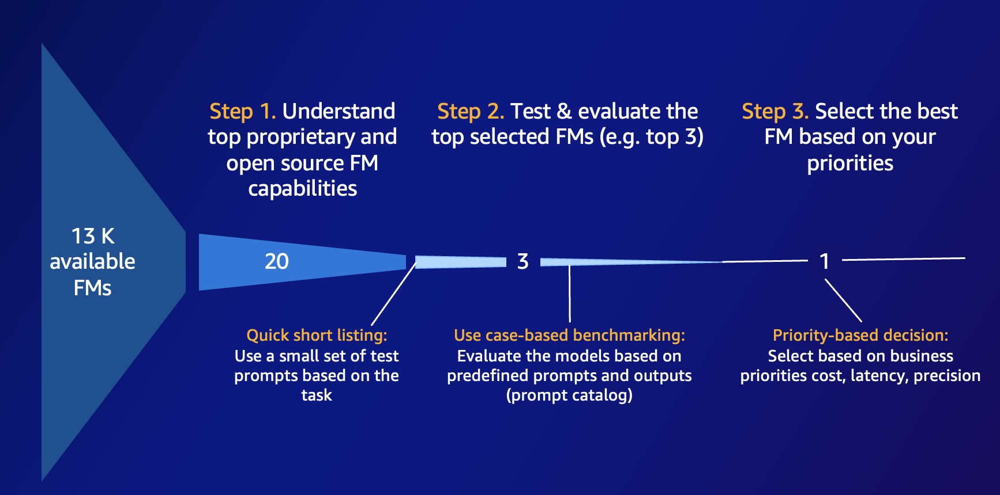
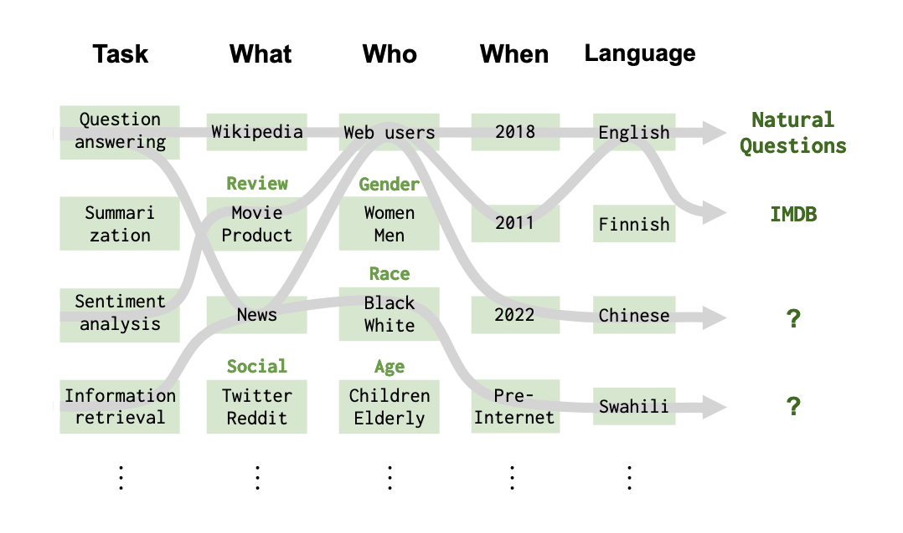

---
tags:
    - RAG
    - Prompt-Engineering
    - Langchain
---
<!-- <h2>Build agentic workflows with Amazon Bedrock and open source frameworks - Introduction</h2> -->

!!! tip inline end "[Open in github](https://github.com/aws-samples/amazon-bedrock-samples/blob/main/workshops/open-source-l400/00_Lab_Intro to Use-Case.pynb){:target="_blank"}"

> *PLEASE NOTE: This notebook should work well with the **`Data Science 3.0`** kernel in SageMaker Studio*

<h2>Overview</h2>

The goal of this workshop is to provide in-depth examples on key concepts and frameworks for Retrieval Augmented Generation (RAG) and Agentic application. We introduce an example use case to serve as a backdrop for curated and prescriptive guidance for RAG and Agentic workflows including libraries and blueprints for some of the top trends in the market today.

In this notebook, we introduce the requirements that lead us to build our **Virtual Travel Agent**. We end by running some **course-grained model evaluation** across a subset of the models available in Amazon Bedrock.

<h2>Context</h2>

Through web-scale training, foundation models (FMs) are built to support a wide variety of tasks across a large body of general knowledge. Without being exposed to additional information or further fine-tuning, they suffer from a knowledge cutoff preventing them from reliably completing tasks requiring specific data not available at training time. Furthermore, their inability to call external functions limits their capacity to resolve complex tasks beyond ones that can be solved with their own internal body of knowledge.

<h2>Prerequisites</h2>

Before you can use Amazon Bedrock, you must carry out the following steps:

- Sign up for an AWS account (if you don't already have one) and IAM Role with the necessary permissions for Amazon Bedrock, see [AWS Account and IAM Role](https://docs.aws.amazon.com/bedrock/latest/userguide/getting-started.html#new-to-aws){:target="_blank"}.
- Request access to the foundation models (FM) that you want to use, see [Request access to FMs](https://docs.aws.amazon.com/bedrock/latest/userguide/getting-started.html#getting-started-model-access){:target="_blank"}. 
  
<h2>Setup</h2>

```python
!pip3 install langchain-aws --quiet
```

<h2>Functional requirements</h2>

The purpose of the solution is to improve the experience for customers searching for their dream travel destination. To do this, a customer needs the ability to do the following:
- Rapidly get a sense a given destination with a representative description.
- Discover new destinations based on location, weather or other aspects that may be of interest.
- Book travel dates for a given destination ensuring it does not collide with their other travel.

Before diving deeper into the solution, we begin with some lite testing of the various models available in the `us-west-2` region.

<h2>Course-grained model evaluation</h2>

In this section, we experiment with multiple models available on Amazon Bedrock and run course-grained evaluation on one of our task of interest. With the thousands of available models on the market, it is intractable to evaluation every single one. Hence, it is generally necessary to pre-filter for the ones that are not only from trusted providers, but have shown strong performance on a variety of benchmarks. 

Amazon Bedrock allows you to make a quick short-list by supporting a growing list providers such as Anthropic, Meta, Mistral, Cohere, AI21Labs, Stability AI and Amazon. This lets you start with a strong base to continue the model selection process.



Since, academic benchmarks are known to model providers and often used as marketing materials, it is important to not to rely too heavily on them, but rather use them as a soft measure. 

Next we perform course-grained model evalution on the following models to inform our initial choice of model for our task of interest:
- Anthropic: Claude Sonnet 3.5, Claude 3 Sonnet, Claude 3 Haiku
- Meta: Llama 3.1 70B, Llama 3.1 8B
- Mistral: Mistral Large
- Cohere: Command R+

We start by importing the boto3 client for the Bedrock Runtime.


```python
import boto3

region = 'us-west-2'
bedrock = boto3.client(
    service_name = 'bedrock-runtime',
    region_name = region,
)
```

We use the `ChatBedrock` object part of `langchain-aws` to interact with the Bedrock service.


```python
from langchain_aws.chat_models.bedrock import ChatBedrock

modelId = 'anthropic.claude-3-sonnet-20240229-v1:0'
llm = ChatBedrock(
    model_id=modelId,
    client=bedrock,
    beta_use_converse_api=True
)
llm.invoke("Help me with my travel needs.").content
```

To perform an initial evaluation, we create a small curated dataset of 10 examples. The optimal initial number of examples should be sufficiently big to roughly cover the types of queries our customers will send our model. Since this stage of the model evaluation process is meant to get a rough idea, the number of examples can be small. To come up with our examples, we use [HELM's](https://crfm.stanford.edu/helm/lite/latest/) definition of a scenario, which is broken down by the following diagram:



To start, our scenario can be described by summarization (**task**) of vacation destinations (**what**) asked by travelers (**who**) at the time of development (**when**) in English (**language**). The set of initial questions can be found in [examples.txt](./data/examples.txt). We could expand our test by changing one or more of the variables composing the scenario of interesting. For instance, we could generate equivalent examples, but asked by people who aren't travelers or by others speaking in any other languages.


```python
with open("./data/examples.txt", "r") as file:
    examples = file.read().splitlines()
```

Once we retrieved our limited set of examples, we defined `generate_answers`, which outputs a dataframe where each column is populated by a given model's answers. This allows us to quickly capture model answers across a set of `examples`.


```python
import pandas as pd
from langchain_core.messages import HumanMessage, SystemMessage

pd.set_option('display.max_colwidth', None)


def generate_answers(
    examples: list = [],
    system_prompt: SystemMessage = None
):
    modelIds = [
        "anthropic.claude-3-5-sonnet-20240620-v1:0",
        "anthropic.claude-3-sonnet-20240229-v1:0",
        "anthropic.claude-3-haiku-20240307-v1:0",
        "cohere.command-r-plus-v1:0",
        "meta.llama3-1-70b-instruct-v1:0",
        "meta.llama3-1-8b-instruct-v1:0",
        "mistral.mistral-large-2407-v1:0"
    ]
    output = pd.DataFrame({
        'example': [],
        'Claude35Sonnet': [],
        'Claude3Sonnet': [],
        'Claude3Haiku': [],
        'CommandRplus': [],
        'Llama8b': [],
        'Llama70b': [],
        'MistralLarge': [],
    })
    for example in examples:
        results = [example]
        for modelId in modelIds:
            messages = [
                system_prompt if system_prompt else SystemMessage(content=""),
                HumanMessage(content=example)
            ]
            llm = ChatBedrock(
                model_id=modelId,
                client=bedrock,
                beta_use_converse_api=True
            )
            resp = llm.invoke(messages).content
            results.append(resp)
        output.loc[len(output)] = results
    return output
```

We generate model outputs without a system prompt for a single example. This example is pulled from the top of the examples list and contains just the words *New York*.


```python
one_example = examples[:1]
output = generate_answers(one_example)
```

We should the answers generated by the various models for this example. Quickly, we notice Llama 3.1 70B has produce the longest input. As expected, we also see some consistency in the outputs within a given model family.

When diving deeper into the examples, it is clear the model has been trained has broad knowledge of the subject and is able to give us some facts about it. However, we do not provide additional information into the model's current role. This results in fairly long and generic answers. Hence, in the next step we will continue to tailor model output by supplying it with a consistent system prompt reused across all examples.

To get a better sense of model functionality without additional context, it may be helpful to rerun the previous cells on other examples or create your own.


```python
output.head()
```

We define a `SystemMessage` passed as a system prompt that is passed to all models for every example. The purpose is to provide more context to the model as to what is expected from it.


```python
one_example = examples[:1]
output = generate_answers(
    one_example,
    SystemMessage(content="You are a text summarizer for travelers who are on the go. Generate your summary in a single sentence."))
```

When looking through the model responses, the difference in size of response is immediately obvious and is a direct result of the content of the system prompt.   


```python
output.head()
```

Next, we modify the original `generate_answers` function to accomodate for few-shots. The purpose of few-shot learning is to enable machine learning models to learn from a small number of examples or training data points, rather than requiring a large labeled dataset. This is particularly useful in scenarios where obtaining a large amount of labeled data is difficult, expensive, or time-consuming. There are several advantages of few-shot learning:

- **Data efficiency**: Few-shot learning allows models to learn from limited data, which is beneficial when obtaining large labeled datasets is challenging or costly.
- **Adaptability**: Few-shot learning enables models to quickly adapt to new tasks or domains without the need for extensive retraining from scratch, making the models more flexible and versatile.
- **Transfer learning**: Few-shot learning relies on transfer learning principles, where knowledge gained from one task or domain is transferred and applied to a different but related task or domain.
- **Human-like learning**: Few-shot learning aims to mimic the way humans can learn new concepts from just a few examples, leveraging prior knowledge and experience.

As we start adding more repeated elements to our prompt, we also introduce the `ChatPromptTemplate` a core component of Langchain allowing us to define a template receiving runtime inputs. We pipe the resulting prompt to the model for inference. `FewShotChatMessagePromptTemplate` extends this object to provide prompt template that supports few-shot examples. 

Although we supply a static set of examples, the library does support dynamic few-shots where examples are chosen based on semantic similarity to the query.


```python
from langchain_core.prompts import (
    ChatPromptTemplate,
    FewShotChatMessagePromptTemplate,
)


def generate_answers(
    examples: list = [],
    system_prompt: str = None,
    few_shots: list = []
):
    modelIds = [
        "anthropic.claude-3-5-sonnet-20240620-v1:0",
        "anthropic.claude-3-sonnet-20240229-v1:0",
        "anthropic.claude-3-haiku-20240307-v1:0",
        "cohere.command-r-plus-v1:0",
        "meta.llama3-1-70b-instruct-v1:0",
        "meta.llama3-1-8b-instruct-v1:0",
        "mistral.mistral-large-2407-v1:0"
    ]
    output = pd.DataFrame({
        'example': [],
        'Claude35Sonnet': [],
        'Claude3Sonnet': [],
        'Claude3Haiku': [],
        'CommandRplus': [],
        'Llama8b': [],
        'Llama70b': [],
        'MistralLarge': [],
    })
    for example in examples:
        results = [example]
        for modelId in modelIds:
            messages = [
                system_prompt if system_prompt else SystemMessage(content=""),
                HumanMessage(content=example)
            ]
            llm = ChatBedrock(
                model_id=modelId,
                client=bedrock,
                beta_use_converse_api=True
            )

            example_prompt = ChatPromptTemplate.from_messages(
                [
                    ("human", "{input}"),
                    ("ai", "{output}"),
                ]
            )
            few_shot_prompt = FewShotChatMessagePromptTemplate(
                example_prompt=example_prompt,
                examples=few_shots,
            )
            final_prompt = ChatPromptTemplate.from_messages(
                [
                    ("system", system_prompt),
                    few_shot_prompt,
                    ("human", "{input}"),
                ]
            )
            chain = final_prompt | llm

            resp = chain.invoke(messages).content
            results.append(resp)
        output.loc[len(output)] = results
    return output
```

We create few examples requesting for description, comparisons and lists. In all cases, the examples include a description followed by some type of recommendation. For the requests for summaries, we prefix the response with *Nice!*  


```python
few_shots = [
    {"input": "Describe the culinary scene in Tokyo.", "output": "Nice! Tokyo's culinary scene is diverse and vibrant, offering everything from traditional Japanese cuisine to international flavors, street food, Michelin-starred restaurants, and unique dining experiences abound, so I highly recommend trying some of the city's famous ramen shops for a quintessential Tokyo dining experience with rich, flavorful broths and perfectly cooked noodles."},
    {"input": "List the top attractions in Barcelona.", "output": "Barcelona's top attractions include Sagrada Familia, Park Güell, Casa Batlló, La Rambla, Gothic Quarter, and Camp Nou, offering a mix of stunning architecture, history, and vibrant culture, so I highly recommend exploring the winding streets of the Gothic Quarter for an immersive experience in the city's rich heritage."},
    {"input": "Compare the climates of Seattle and Miami", "output": "Seattle has a temperate climate with mild, wet winters and cool, dry summers, while Miami has a tropical climate with hot, humid summers and warm, dry winters, with Seattle receiving more rainfall and Miami experiencing more sunshine and occasional hurricanes, so I highly recommend visiting Seattle during the summer months to enjoy the city's beautiful parks and outdoor activities without the constant rain."},
    {"input": "Outline the best ways to experience Paris on a budget.", "output": "budget-friendly ways to experience Paris include walking tours, visiting free museums on certain days, picnicking in parks, using public transportation, staying in budget accommodations, and enjoying street food, with many iconic sights like Notre-Dame Cathedral and the Eiffel Tower able to be appreciated from the outside for free, so I highly recommend taking advantage of the city's numerous free or low-cost attractions and activities to fully immerse yourself in the Parisian atmosphere without breaking the bank."},
    {"input": "Summarize the cultural etiquette for visitors to Japan.", "output": "Nice! cultural etiquette in Japan includes bowing as a greeting, removing shoes before entering homes or certain establishments, using chopsticks correctly, being punctual, avoiding public displays of affection, respecting quiet in public spaces, gift-giving is common, and it's important to be mindful of table manners and bathing customs in public baths, so I highly recommend familiarizing yourself with these customs and traditions to ensure a respectful and enriching cultural experience during your visit to Japan."},
]
```

We prompt the model with an example asking for a summary about Bali.


```python
one_example = examples[1]
output = generate_answers(
    [one_example],
    "You are a text summarizer for travelers who are on the go.",
    few_shots
)
```

For our specific few-shots and prompt, we notice **Claude 3.5 Sonnet**, **Claude 3 Sonnet**, **Llama 3.1 8B** and **Llama 3.1 70B** all responded with the correct prefix and a recommendation. 

We suggest tailoring the few-shots and system prompt to further understand model behaviour.


```python
output.head()
```

Next, we generate answers for our set of examples reusing the lessons.


```python
output = generate_answers(
    examples,
    "You are a text summarizer for travelers who are on the go.",
    few_shots
)
```

Although the models are able to adequatly answer the most general questions, queries about current events or requiring data not available at training time remain unanswered.  


```python
output.head()
```

<h2>Next steps</h2>

In this notebook, we demonstrated simple interactions between Langchain and Bedrock. We tailored model outputs by suppliying it with a system prompt and few-shots, which both help guide behavior. Next, we invite you to complete the RAG lab focused on customizing the model output and prompt flow using Retrieval Augmented Generation (RAG). 

<h2>Clean up</h2>

There is no necessary clean up for this notebook.