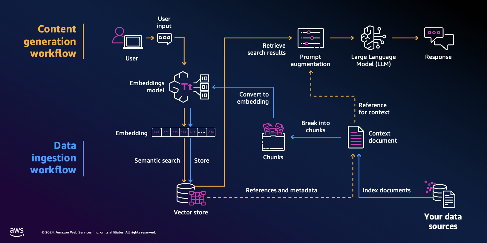
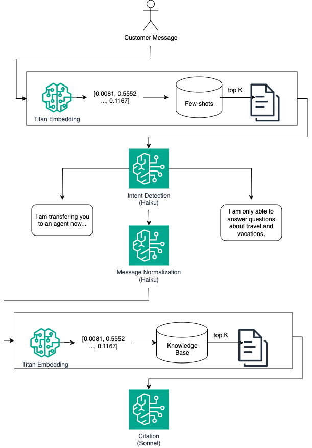

---
tags:
    - RAG
    - Prompt-Engineering
    - Langchain
---
<!-- <h2>Complete Document Retrieval and RAG</h2> -->

!!! tip inline end "[Open in github](https://github.com/aws-samples/amazon-bedrock-samples/blob/main/workshops/open-source-l400/02_Lab_Find a Dream Destination_RAG query.pynb){:target="_blank"}"

---

> *PLEASE NOTE: This notebook should work well with the **`Data Science 3.0`** kernel in SageMaker Studio*

<h2>Overview</h2>
- **Retrieval Pipeline** With customers having the ability to enter any number of possibilities into the solution, it is helpful to detect intent and normalize the query. Few-shots are a useful tool to tailor the normalization to the nature of the query in-line. 
- **Advanced methods** For more complex cases, it can be beneficial to generate hypothetical queries and documents solving for sub-queries and improving the semantic similarity.
- **Model answer generation** Once the model is shown a set of documents, it must generate an answer while staying as closely aligned to the contents of the documents as possible. We cover self-verification and citation as methods giving greater flexibility to the model for a given query and set of retrieved documents.

<h2>Context</h2>

Retrieval Augmented Generation (RAG) requires the indexation of relevant unstructured documents into a vector database. Then given a customer query, the relevant are retrieved and past as context to the model, which generates an answer. This can best be described by the following flow.



Once our documents (PDFs, CSV, Tables, JSON, ...) have been indexed into our knowledge base, we start working towards retrieval of a relevant subset of documents based on a given query. For many applications, the success of the retrieval is a strong indicator for the performance of the overall response. This notebook assumes you are familiar with the basics of RAG, embedding models and vector databases.

In this notebook, we seek to go beyond RAG to generate the model answer by applying other relevant steps in the answer pipeline.

<h2>Prerequisites</h2>

Before you can use Amazon Bedrock, you must carry out the following steps:

- Sign up for an AWS account (if you don't already have one) and IAM Role with the necessary permissions for Amazon Bedrock, see [AWS Account and IAM Role](https://docs.aws.amazon.com/bedrock/latest/userguide/getting-started.html#new-to-aws){:target="_blank"}.
- Request access to the foundation models (FM) that you want to use, see [Request access to FMs](https://docs.aws.amazon.com/bedrock/latest/userguide/getting-started.html#getting-started-model-access){:target="_blank"}. 
    
<h2>Setup</h2>


```python
!pip3 install langchain-aws --quiet
!pip3 install faiss-cpu --quiet
!pip3 install wikipedia --quiet
```

We import the relevant objects used in this notebook.


```python
import boto3
import faiss
import datetime
import re
from operator import itemgetter
from typing import List, Iterable
from langchain_aws.chat_models.bedrock import ChatBedrock
from langchain_aws import BedrockEmbeddings
from langchain_core.prompts import (
    ChatPromptTemplate,
    FewShotChatMessagePromptTemplate,
)
from langchain_community.docstore import InMemoryDocstore
from langchain_community.vectorstores import FAISS
from langchain.memory import VectorStoreRetrieverMemory
from typing import Literal, Optional, Tuple
from langchain_core.pydantic_v1 import BaseModel, Field
from langchain_core.example_selectors import SemanticSimilarityExampleSelector
from langchain_core.prompts import FewShotPromptTemplate, PromptTemplate
from langchain_core.prompts import HumanMessagePromptTemplate, AIMessagePromptTemplate
from langchain.output_parsers import PydanticToolsParser
from langchain_community.retrievers import WikipediaRetriever
from langchain_core.output_parsers import StrOutputParser
from langchain_core.messages import AIMessage, AIMessageChunk
from langchain_core.documents import Document
from langchain_core.runnables import (
    RunnableLambda,
    RunnableParallel,
    RunnablePassthrough,
    RunnableBranch,
)
```

Although this example leverages Claude 3 Sonnet, Bedrock supports many other models. This full list of models and supported features can be found [here](https://docs.aws.amazon.com/bedrock/latest/userguide/conversation-inference.html). The models are invoked via `bedrock-runtime`.


```python
region = 'us-west-2'
bedrock = boto3.client(
    service_name = 'bedrock-runtime',
    region_name = region,
)
```

We use `ChatBedrock` and `BedrockEmbeddings` to interact with the Bedrock API. We enable `beta_use_converse_api` to use the Converse API.


```python
modelId = 'anthropic.claude-3-haiku-20240307-v1:0'
haiku = ChatBedrock(
    model_id=modelId,
    client=bedrock,
    beta_use_converse_api=True
)
embeddingId = "amazon.titan-embed-text-v1"
embeddings = BedrockEmbeddings(
    model_id=embeddingId,
    client=bedrock)
```

We correctly get a generic answer message from the model.


```python
haiku.invoke("Help me with my travel needs today.").content
```

<h2>Reformating the initial query</h2>

<h3>Intent Detection</h3>

In order to limit the scope of answers handled by the solution with RAG, a common first step in the answer pipeline is **Intent Detection or Classification**. This step is important to ensure the relevancy of the question to the indexed content, which works to limit the model's tendancy to answer questions that may not have been accounted for or tested by the application developers.

When requesting some information that is irrelevant to the previously stated purpose, we quickly see the model attempting to provide an answer.


```python
haiku.invoke("I want to learn more about my mom's pie recipe").content
```


    "Here are some tips for learning more about your mom's pie recipe:\n\n1. Ask your mom to teach you. The best way to learn her recipe and techniques is to have her walk you through making the pie step-by-step. Ask her to share any tips or tricks she's picked up over the years.\n\n2. Get the recipe from her. See if she's willing to write down the full recipe with measurements and instructions. This will give you the basic framework to start with.\n\n3. Observe her making the pie. Watch closely as she prepares the crust, fillings, and assembles the pie. Note any little details she does that may not be written in the recipe.\n\n4. Take notes. When she's making the pie, jot down any extra tips she shares, like how to tell when the crust is perfectly baked or how to ensure the filling thickens properly.\n\n5. Ask questions. Don't be afraid to ask her why she does certain steps a certain way. Understanding the reasoning behind her methods can help you replicate the recipe accurately.\n\n6. Experiment. Once you have the basic recipe, try making the pie yourself. Adjust small things and see how it affects the final result. This can help you learn her technique.\n\nThe key is to learn from your mom directly if possible. Her personal touches and tricks are what make the recipe uniquely hers. With her guidance, you can master making the pies just the way she does."


Hence, we provide an initial system prompt defining the model's role as an intent classifier. We supply the classes and few-shots to improve performance and ensure the model is aligned to the desired intended output, which needs to include `<intention></intention>` tags.


```python
intent_system_prompt = """You are a precise classifier. Your task is to assess customer intent and categorize customer inquiry into one of the intentions. 

Intentions with their description:
vacation: Information on vacations, various travel destinations and my recent travels.
contact: Expressing the desire to talk to support.
irrelevant: Not related to vacations and travel.

Here is an example of how to respond in a standard interaction:
<example>
    Human: I am seeking a place that is sunny a family friendly.
    AI: <intention>vacation</intention>
</example>
<example>
    Human: I want to learn more about my mom's pie recipe
    AI: <intention>irrelevant</intention>
</example>
<example>
    Human: I want to talk to a someone.
    AI: <intention>contact</intention>
</example>

Think about your answer first before you respond. Think step-by-step and insert the classification in <intention></intention> tags and do not include anything after."""
```

We supply the prompt as part of `ChatPromptTemplate`and use the pipe operator to define a chain connecting the model to the resulting prompt.


```python
intent_detection_prompt = ChatPromptTemplate.from_messages(
    [
        ("system", intent_system_prompt),
        ("human", "Here is the customer's question: <question>{question}</question> How do you answer to the instructions?"),
    ]
)
intent_detection_chain = intent_detection_prompt | haiku
```

We invoke the model with the same query and notice the classification result. We invite you to try additional questions.


```python
intent_detection_chain.invoke("Tell me about my mother's pie recipe").content
```

Since we expect the answer to always contain these tags, we can parse it and branch off depending on the model's classification. 

<h3>Dynamic few-shots</h3>

Although static few-shots are helpful, they have two major obstacles. On the one hand, they do not cover the breadth of necessary examples, and on the other, given that any submitted query is rarely relevant to all supplied examples, they often introduce unecessary tokens and noise to the prompt. In constrast, supplying dynamic few-shots from a larger corpus of examples enables us to select a number of the most relevant examples prior to inference. Evidently, these are determined by the nature of the query. Although we apply it to intent classification, dynamic few-shots can be applied anywhere in the RAG pipeline and generally yield stronger results compared to static examples. 

We bootstrap `few_shot_library` using examples distilled by **Claude 3.5 Sonnet**. It is important to continuously iterate on the library after the initial deployment. During this phase, it is a general best practice to collect and label real interactions where the model made mistakes and append those to the set of examples.


```python
few_shot_library = [
    {
        "question": "Can you recommend some tropical beach destinations?",
        "class": "vacation"
    },
    {
        "question": "I need to speak with a customer service representative.",
        "class": "contact"
    },
    {
        "question": "What's the best way to cook spaghetti?",
        "class": "irrelevant"
    },
    {
        "question": "Are there any family-friendly resorts in Florida?",
        "class": "vacation"
    },
    {
        "question": "How do I file a complaint about my recent stay?",
        "class": "contact"
    },
    {
        "question": "What's the weather like in Paris in June?",
        "class": "vacation"
    },
    {
        "question": "Can you help me with my car insurance claim?",
        "class": "irrelevant"
    },
    {
        "question": "I'd like to book an all-inclusive Caribbean cruise.",
        "class": "vacation"
    },
    {
        "question": "Is there a phone number for your reservations team?",
        "class": "contact"
    },
    {
        "question": "What's the best way to learn a new language?",
        "class": "irrelevant"
    },
    {
        "question": "Are there any good hiking trails in Yellowstone?",
        "class": "vacation"
    },
    {
        "question": "I need to update my billing information.",
        "class": "contact"
    },
    {
        "question": "How do I make homemade bread?",
        "class": "irrelevant"
    },
    {
        "question": "What are some popular tourist attractions in Rome?",
        "class": "vacation"
    },
    {
        "question": "Can I speak with a manager about my recent experience?",
        "class": "contact"
    },
    {
        "question": "What's the best time to visit Japan?",
        "class": "vacation"
    },
    {
        "question": "How do I reset my Netflix password?",
        "class": "irrelevant"
    },
    {
        "question": "Are there any good ski resorts in Colorado?",
        "class": "vacation"
    },
    {
        "question": "I need help with my online booking.",
        "class": "contact"
    },
    {
        "question": "What's the plot of the latest Marvel movie?",
        "class": "irrelevant"
    },
    {
        "question": "Can you suggest some budget-friendly European cities?",
        "class": "vacation"
    },
    {
        "question": "How do I request a refund for my canceled trip?",
        "class": "contact"
    },
    {
        "question": "What's the best way to train a puppy?",
        "class": "irrelevant"
    },
    {
        "question": "Are there any good wildlife safaris in Africa?",
        "class": "vacation"
    },
    {
        "question": "I need to change my flight reservation.",
        "class": "contact"
    },
    {
        "question": "What are some must-see landmarks in New York City?",
        "class": "vacation"
    },
    {
        "question": "How do I fix a leaky faucet?",
        "class": "irrelevant"
    },
    {
        "question": "Can you recommend some romantic getaways for couples?",
        "class": "vacation"
    },
    {
        "question": "I have a question about my loyalty points balance.",
        "class": "contact"
    },
    {
        "question": "What's the best way to prepare for a job interview?",
        "class": "irrelevant"
    },
    {
        "question": "Tell me about my travel history",
        "class": "vacation"
    },
    
]
```

In this notebook, we use FAISS (Facebook AI Similarity Search) [(github)](https://github.com/facebookresearch/faiss), which is an open-source library developed by Facebook AI Research for efficient similarity search and clustering of dense vector embeddings. We call the Lanchain's `FAISS` object to interact with the in-memory vector store.

We embed the examples using the Titan Embedding model.


```python
embedding_size = 1536
index = faiss.IndexFlatL2(embedding_size)
embedding_fn = embeddings.embed_query
vectorstore = FAISS(embedding_fn, index, InMemoryDocstore({}), {})
```

    `embedding_function` is expected to be an Embeddings object, support for passing in a function will soon be removed.


We use `SemanticSimilarityExampleSelector` to dynamically select the `k` most relevant examples based on our query. When instantiated, this object embeds the set of examples into our vector store of choice. `FewShotChatMessagePromptTemplate` defines the formatting of the selected examples into a given prompt. We define the template to be consistent with what will be generated by the model during intent classification.


```python
example_selector = SemanticSimilarityExampleSelector.from_examples(
    few_shot_library,
    embeddings,
    vectorstore,
    k=5,
)

few_shot_prompt = FewShotChatMessagePromptTemplate(
    example_selector=example_selector,
    example_prompt=(
        HumanMessagePromptTemplate.from_template("{question}")
        + AIMessagePromptTemplate.from_template("<intention>{class}</intention>")
    ),
    input_variables=["question"],
)
```

We print the relevant examples for a given query. Notice that the distribution of labels will change based on the nature of the query. This helps further align the model with our expectations.


```python
print(few_shot_prompt.format(question="tell me about my travels"))
```

    Human: Tell me about my travel history
    AI: <intention>vacation</intention>
    Human: I'd like to book an all-inclusive Caribbean cruise.
    AI: <intention>vacation</intention>
    Human: Can you suggest some budget-friendly European cities?
    AI: <intention>vacation</intention>
    Human: Can I speak with a manager about my recent experience?
    AI: <intention>contact</intention>
    Human: How do I request a refund for my canceled trip?
    AI: <intention>contact</intention>


We redefine the system prompt to accomodate for the dynamic few-shots.


```python
few_shot_intent_system_prompt = """You are a precise classifier. Your task is to assess customer intent and categorize customer inquiry into one of the intentions. 

Intentions with their description:
vacation: Information on vacations, various travel destinations and my recent travels.
contact: Expressing the desire to talk to support.
irrelevant: Not related to vacations and travel.

Here is an example of how to respond in a standard interaction:
"""
```

We redefine the prompt template to accomodate for the dynamic few-shots. As expected, the final string created from `intent_detection_prompt` will change based on message similarity to previous examples.


```python
few_shot_intent_detection_prompt = ChatPromptTemplate.from_messages(
    [
        ("system", few_shot_intent_system_prompt),
        few_shot_prompt,
        ("human", "Think step-by-step and always ensure you insert the classification in <intention></intention> tags and do not include anything after.\
        Here is the customer's question: <question>{question}</question> How do you answer to the instructions?"),
    ]
)
few_shot_intent_chain = intent_detection_prompt | haiku
```

We test the newly created chain.


```python
few_shot_intent_chain.invoke({"question": "tell me about my travel history"}).content
```

<h3>Normalizing the user message</h3>

We may want to restrict the queries that are sent to downstream inference without restricting the user experience. Normalizing messages enables us to do exactly this. It can often be used to set a certain tone, reduce length and extract the specific purpose of the message while reducing unecessary noise. Notice the role the rule book plays in determining the nature of the returned message.

Alternatively, it is common to supply few-shot examples as we have done in the previous step. We again return the resulting message in between tags.


```python
norm_system_prompt = """You are a precise message synthesizer. Your task is to write a condensed message encompassing the latest original message's intent and main keywords. 
The condensed message must follow the rule book.

Rule book:
- Must be a complete sentence formulated as a request from the perspective of the original requester.
- No longer than 2 short sentences with no concatination.
- Never include names.
- It is safe to reformulate questions with only keyword as looking for information on the place they mention.
 
Think about your answer first before you respond. Think step-by-step and the condensed message in <condensed_message></condensed message> tags and do not include anything after."""
```

We define the prompt template incorporating the system prompt with the user defined message. 


```python
norm_prompt = ChatPromptTemplate.from_messages(
    [
        ("system", norm_system_prompt),
        ("human", "Here is the customer's question: <question>{question}</question> How do you answer to the instructions?"),
    ]
)
norm_chain = norm_prompt | haiku
```

When executing the chain on a longer query, the returned message pulls out only the information necessary to the task at hand.


```python
norm_chain.invoke({"question": """I have been all around the world seing a bunch of stuff. 
I met a bunch of people like Bernard and Tamy. Tell me about my travel history"""}).content
```

When executing the chain on a query that only has keywords, the model fills in the gap to provide additional context. Although the initial queries are quite different, notice that their resulting output is quite similar.


```python
norm_chain.invoke({"question": """New York"""}).content
```

Once we have detected the message's intent and normalized it to some extent, we are able to have much greater assurance as to the nature of the messages sent to subsequent steps, namely the retrieval.

<h2>Advanced methods of retrieval</h2>

The main driver of performance for RAG pipelines is the retrieval mechanism. This step involves identifying a subset of documents that are most relevant to the original query. The common baseline is generally to embed the query in its original form and pull the top-K nearest documents. However, for some datasets this begins to fall short in cases where queries address multiple topics or, more generally, are phrased in a way that is incompatible or is dissimilar to the documents that should be retrieved. We look at how it is possible to improve on these types of queries. 

Given the increase complexity of the tasks in this section, we choose to leverage Claude 3 Sonnet in this part of the pipeline. 


```python
modelId = 'anthropic.claude-3-sonnet-20240229-v1:0'
sonnet = ChatBedrock(
    model_id=modelId,
    client=bedrock,
    beta_use_converse_api=True
)
```

<h3>Decomposition</h3>

For more complex queries, it may be helpful to breakdown the original question into sub-problems each having their own retrieval step. We perform query decomposition to return the original question or an equivalent set of questions each with a single target.

This process is driven by the underlying model. We define the system prompt describing the intended task and supply static few-shot examples to enable the model to better generalize. Removing these examples yields results that are less robust.


```python
decomp_system_prompt = """You are a expert assistant that prepares queries that will be sent to a search component. 
These queries may be very complex. Your job is to simplify complex queries into multiple queries that can be answered in isolation to eachother.

If the query is simple, then keep it as it is.

If there are acronyms or words you are not familiar with, do not try to rephrase them.
Here is an example of how to respond in a standard interaction:
<example>
- Query: Did Meta or Nvidia make more money last year?
Decomposed Questions: [SubQuery(sub_query='How much profit did Meta make last year?'), SubQuery(sub_query'How much profit did Nvidia make last year?')]
</example>
<example>
- Query: What is the capital of France?
Decomposed Questions: [SubQuery(sub_query='What is the capital of France?')]
</example>"""
```

To ensure a consistent format is returned for subsequent steps, we use Pydantic, a data-validation library. We rely on a Pydantic-based helper function for doing the tool config translation for us in a way that ensures we avoid potential mistakes when defining our tool config schema in a JSON dictionary.

We define `SubQuery` to be a query corresponding to a subset of the points of a larger parent query. 


```python
class SubQuery(BaseModel):
    """You have performed query decomposition to generate a subquery of a question"""

    sub_query: str = Field(description="A unique subquery of the original question.")
```

We define the prompt template leveraging the previously defined system prompt. We then expose `SubQuery` as a tool the model can leverage. This enables to model to format one or more requests to this tool.


```python
query_decomposition_prompt = ChatPromptTemplate.from_messages(
    [
        ("system", decomp_system_prompt),
        ("human", "Here is the customer's question: <question>{question}</question> How do you answer to the instructions?"),
    ]
)

llm_with_tools = sonnet.bind_tools([SubQuery])
decomp_query_analyzer = query_decomposition_prompt | llm_with_tools | PydanticToolsParser(tools=[SubQuery])
```

We asking a broad question about multiple destinations, the model chooses to return multiple calls to `SubQuery`. Each can be sent for document retrieval in parallel, thus ensuring we do not encure additional latency beyond that of the model inferencing. 


```python
queries = decomp_query_analyzer.invoke({"question": "How do go on vacation in thailand and in California?"})
queries
```

<h3>Expansion</h3>

Query expansion is similar to decomposition in that it produces multiple queries as a strategy to improve the odds of hitting a relevant result. However, expansion returns multiple different wordings of the original query.  

We define the system prompt to consistently return 3 versions of the original query. 


```python
paraphrase_system_prompt = """You are an expert at converting user questions into database queries. 
You have access to a database of travel destinations and a list of recent destinations for travelers. 

Perform query expansion. If there are multiple common ways of phrasing a user question 
or common synonyms for key words in the question, make sure to return multiple versions 
of the query with the different phrasings.

If there are acronyms or words you are not familiar with, do not try to rephrase them.

Always return at least 3 versions of the question."""
```

We define the prompt template leveraging the previously defined system prompt. We then expose `ParaphrasedQuery` as a tool the model can leverage. This enables to model to format one or more requests to this tool.


```python
class ParaphrasedQuery(BaseModel):
    """You have performed query expansion to generate a paraphrasing of a question."""

    paraphrased_query: str = Field(description="A unique paraphrasing of the original question.")
```

We define the prompt template leveraging the previously defined system prompt. We then expose `ParaphrasedQuery` as a tool the model can leverage. This enables to model to format one or more requests to this tool.


```python
query_expansion_prompt = ChatPromptTemplate.from_messages(
    [
        ("system", paraphrase_system_prompt),
        ("human", "Here is the customer's question: <question>{question}</question> How do you answer to the instructions?"),
    ]
)
llm_with_tools = sonnet.bind_tools([ParaphrasedQuery])
query_expansion = query_expansion_prompt | llm_with_tools | PydanticToolsParser(tools=[ParaphrasedQuery])
```

Now no matter the nature of the query, the model generates alternatives that can be sent for retrieval in parallel.


```python
query_expansion.invoke({"question": "how to use travel to Canada and to Mexico?"})
```

<h3>Hypothetical Document Embeddings (HyDE)</h3>

Given that models have been trained large volumes of data, we can generate a relevant hypothetical document to answer the user question. Then for retrieval, this new (or *hypethetical*) document can be embedded with the original query. This approach has been shown in [Precise Zero-Shot Dense Retrieval without Relevance Labels](https://arxiv.org/abs/2212.10496) to improve recall. We define the system prompt relevant to this task.


```python
hyde_system_prompt = """You are an expert about travel destinations all over the worlds. Your task is to provide your best response based on the question.
You need to produce a high-quality and complete sentence hyper focused on answer the question. 
Do not answer in bulletpoints.

Think about your answer first before you respond. Think step-by-step and the answer in <hyde></hyde> tags and do not include anything after."""
```

We define the prompt template leveraging the previously defined system prompt.


```python
hyde_prompt = ChatPromptTemplate.from_messages(
    [
        ("system", hyde_system_prompt),
        ("human", "Here is the customer's question: <question>{question}</question> How do you answer to the instructions?"),
    ]
)
hyde_chain = hyde_prompt | sonnet | StrOutputParser()
```

We produce a document for the query in between tags that is be appended at retrieval time.


```python
queries = hyde_chain.invoke({"question": "How do go on vacation in thailand and in California?"})
print(queries)
```

    To answer this question while following the instructions, I would think step-by-step:
    <hyde>To go on vacation in Thailand and California, you will need to plan two separate trips - one to Southeast Asia for Thailand and one to the western United States for California, as they are in very different regions of the world. For Thailand, you'll want to research top destinations like Bangkok, Phuket, Chiang Mai, and the islands in the Thai Gulf. Book flights, accommodations, tours/activities, and obtain any necessary travel documents. For California, some highlights include Los Angeles, San Francisco, Yosemite National Park, wine country in Napa/Sonoma, the beaches, and national parks like Joshua Tree. Again, you'll need to book airfare, lodging, transportation, and plan your itinerary based on your interests and travel dates. Be sure to look into any visa requirements for Thailand and factor in costs, jet lag, and travel time between the two very distant locations.</hyde>


In this section we demonstrated the possiblity of augmented the original message to produce stronger results. Naturally, this LLM-driven approach requires an additional inference, which introduces some additional latency.  

<h2>Model answer generation</h2>

In most RAG pipelines, the number of documents shown to the model is driven by the retrieval mechanism. This generally returns up to some static number of documents provided they meeting the necessary similarity treshold. Often, this results in irrelevant documents being sent to the model for inference. Although we can easily intruct the model to ignore irrelevant documents, it is often useful for the model to explicitly call-out the documents it did use. Furthermore, many lines of research have demonstrated the effectiveness of enabling the model to correct itself. In both cases, we make an additional call to the model once an initial answer is generated in order to improve the output for the end-user. 

<h3>Citation</h3>

We generate an output with `answer` and `docs` keys. `docs` contains a list of Langchain `Document` objects. These are the documents the model has picked as being relevant to answering the original query. Although the documents are currently returned with title and summaries, these keys are part of a `metadata` attribute letting you determine any number of field that may be relevant to be used by your application such as author, source URL, etc... 

We define the system prompt to generate the model answer. Note that this is a simple template that can be further augmented with additional sections better describing our task and intended output.


```python
citation_system_prompt = """You're a helpful AI assistant. Given a user question and some article snippets, answer the user question. 
If none of the articles answer the question, just say you don't know.

Here are the articles: {context}
"""
```

This prompt is past as part the broader chat template.


```python
citation_prompt = ChatPromptTemplate.from_messages(
    [
        ("system", citation_system_prompt),
        ("human", "Here is the customer's question: <question>{question}</question> How do you answer to the instructions?"),
    ]
)

answer_generator = citation_prompt | sonnet | StrOutputParser()
```

Lets use the `WikipediaRetriever` allowing us to interact with the Wikipedia API.


```python
wiki = WikipediaRetriever(top_k_results=6, doc_content_chars_max=2000)
```

The `format_docs` helper function is used to format the documents returned by the retriever to make them more friendly to the model. We supply the document's title and summary snippet. At the end, we pass the function to a child of Lanchain's `Runnable` class. This simply enables us to call the function with a standard API (invoke, batch, stream, transform and compose). Many object in Langchain implement this interface including `BaseModel`. 

To demonstrate the power of citations, we also append an additional obviously irrelevant document to the formatted documents.


```python
def format_docs(docs: List[Document]) -> str:
    """Convert Documents to a single string.:"""
    formatted = [
        f"Article Title: {doc.metadata['title']}\nArticle Snippet: {doc.page_content}"
        for doc in docs
    ]
    formatted.append("Article Title: This is an irrelevant document \
    Article Snippet: The document is most irrelevant.")
    return "\n\n" + "\n\n".join(formatted)


format = itemgetter("docs") | RunnableLambda(format_docs)
```

We define a chain as `RunnableParallel` object, which is an extention of `Runnable` that runs a mapping of Runnables in parallel, and returns a mapping of their outputs. We set the question property using `RunnablePassthrough`. This passes the input unchanged. Then, we assign values to keys in the prompt templates. 


```python
citation_chain = (
    RunnableParallel(question=RunnablePassthrough(), docs=wiki)
    .assign(context=format)
    .assign(answer=answer_generator)
    .pick(["answer", "docs"])
)
```

When invoking the chain, it returns the original answer and the documents used for generation. Notice that some documents are relevant to the final answer and some are not. We can address this challenge with further LLM or metadata document filtering.


```python
citation_chain.invoke("How do go on vacation in thailand and in California?")
```

<h3>Self-validation</h3>

Giving the model an opportunity to correct itself has been shown to increase performance on a number of tasks. We perform self-validation and define a set of formatting rules that align with the conversational tone we expect to have from our application. We define a system prompt with this task and set of rules.


```python
valid_system_prompt = """You are a validator and message synthesize. 
Your task is to create one coherent answer and double check the original responses to the question {question} for common mistakes, including:
- Answer in bullet points. It should be a complete paragraph instead.
- Inaccuracies or things that seem impossible

If there are any of the above mistakes, rewrite the response. If there are no mistakes, just reproduce the original response.
Think about your answer first before you respond. 
If some exist, put all the issues and then put your final response in <validation></validation> tags and do not include anything after.
"""
```

We define the prompt template with the system prompt and original model answer.


```python
validation_prompt = ChatPromptTemplate.from_messages(
    [
        ("system", valid_system_prompt), 
        ("human", "Here is the original message produced: <orignal_message>{original}</orignal_message> How do you answer to the instructions?")]
)
validation_chain = validation_prompt | sonnet | StrOutputParser()
```

We invoke model, which points out obvious issues in the original document and answers with a more consistent alternative. 


```python
validation = validation_chain.invoke({
    "question" : "how to go to thailand from Montreal?",
    "original": "1- by plane 2-by car.",
})
print(validation)
```

<h2>Putting it all together</h2>

The previous components offer important primitives to build a performant RAG solution. They act as building blocks of a broader solution. We provide an example showcasing how they can be brought together in a single chain to improve response accuracy. To minimize latency and improve accuracy, we use Claude Haiku for simpler tasks and Claude Sonnet where we need more performance. The pipeline is described by the following diagram.



First, we create helper functions to parse the return messages for the relevant section that can be found in between tags.


```python
def parse_intent(ai_message: AIMessage) -> str:
    """Parse the AI message."""
    intent_pattern = r"<intention>(.*?)</intention>"
    intent_match = re.findall(intent_pattern, ai_message.content, flags=0)
    if intent_match:
        return intent_match[0]
    else:
        return "No intention found."

def parse_norm_message(ai_message: AIMessage) -> str:
    """Parse the AI message."""
    norm_pattern = r"<condensed_message>(.*?)</condensed_message>"
    norm_match = re.findall(norm_pattern, ai_message['question'].content, flags=0)
    if norm_match:
        return norm_match[0]
    else:
        return "Message could not be successfully normalized."
```

We define an end-to-end RAG chain primairly using LangChain Expression Language (LCEL), which allows us to define `Runnable` objects in success to one another. The resulting chain reuses many of the components we previously defined including intent detection with **dynamic few-shots, message normalization and citation**. 


```python
rag_chain = RunnableParallel(
    question=RunnablePassthrough(),
    intent=few_shot_intent_detection_prompt | haiku | parse_intent
) | RunnableBranch(
    (lambda payload: "vacation" == payload["intent"].lower(), lambda x: (
        RunnablePassthrough().pick(["question"])
        .assign(question=norm_chain)
        .assign(question=parse_norm_message)
        .assign(context=lambda inputs: wiki.invoke(inputs["question"]))
        .assign(answer=answer_generator)
        .pick(["answer", "context"])
    )),
    (lambda payload: "irrelevant" == payload["intent"].lower(), lambda x: AIMessage(content="I am only able to answer questions about travel and vacations.")),
    (lambda payload: "contact" == payload["intent"].lower(), lambda x: AIMessage(content="I am transfering you to an agent now...")),
    lambda payload: AIMessage(content="I am only able to answer questions about travel and vacations." )
)

print(rag_chain.invoke("I want to know more about how to plan a vacation?"))
```

It is evident that latency is increased in corralation with the number calls being made in succession. Hence, it is optimal to make calls in parallel where possible to reduce overall time to execute the entire pipeline. Notice in in our example that the intent detection could be made in parallel to message normalization and citation (model inference).

Additionally, it may be benifitial to modify the pipeline to include a query augmentation step for reasons described earlier in the notebook.

<h2>Next steps</h2>

Where RAG enables single-turn conversations where users and agents alternate sending eachother messages, agents supply the ability to the application developer to build increased complexity into the conversation flow. These applications are characterized by increase **autonomy, reactivity, proactiveness, adaptability and situatedness**. They typically have some form of validation, the ability to loop back and call external functions to improve outputs. You can dive deeper into agents in the next lab of this workshop.

<h2>Clean up</h2>

There is no necessary clean up for this notebook.
