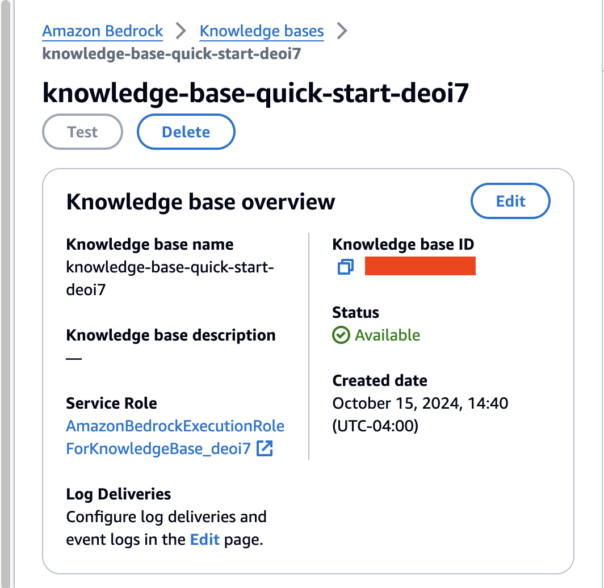

# Dream Destination Finder with CrewAI and Amazon Bedrock

In this notebook, we will explore how to use the CrewAI framework with Amazon Bedrock to build an intelligent agent that can find dream travel destinations based on user preferences. The agent will utilize a large language model (LLM) and web search capabilities to research and recommend destinations that match the user's description.

## What's CrewAI:
CrewAI is one of the leading open-source Python frameworks designed to help developers create and manage multi-agent AI systems.


Diagram Representation of CrewAI architecture

__!pip install boto3 botocore crewai crewai_tools duckduckgo-search langchain-community -q__

We start by importing the necessary modules from the crewai and crewai_tools packages.

#### Configuring AWS Credentials:
Before using Amazon Bedrock, ensure that your AWS credentials are configured correctly. You can set them up using the AWS CLI or by setting environment variables. For this notebook, we’ll assume that the credentials are already configured.

To use bedrock we will use [__CrewAI__ __LLM__ api](https://docs.crewai.com/how-to/llm-connections#supported-providers) 


```python
from crewai import Agent, Task, Crew, LLM
from crewai_tools import tool
from langchain_community.tools import DuckDuckGoSearchRun
```

#### Define web-search tool:


```python
@tool('DuckDuckGoSearch')
def search(search_query: str):
    """Search the web for information on a given topic"""
    return DuckDuckGoSearchRun().run(search_query)
```

### Configuring the LLM

We will use Anthropic’s Claude-3 model via Amazon Bedrock as our LLM. CrewAI uses LiteLLM under the hood to interact with different LLM providers.


```python
# Configure the LLM
llm = LLM(model="bedrock/anthropic.claude-3-sonnet-20240229-v1:0")
```

### Defining the Agent

We will create an agent with the role of a “Travel Destination Researcher.” This agent will be responsible for finding destinations that match the user’s travel preferences.


```python
# Define the Agent
travel_agent = Agent(
    role='Travel Destination Researcher',
    goal='Find dream destinations matching user preferences',
    backstory="You are an experienced travel agent specializing in personalized travel recommendations.",
    verbose=True,
    allow_delegation=False,
    llm=llm,
    tools=[search]  # Tool for online searching
)
```

### Defining the Task

We need to specify the task that the agent will perform. The task includes a description, expected output, and is assigned to the agent we just created.


```python
# Define the Task
task = Task(
    description="Based on the user's travel preferences: {preferences}, research and recommend suitable travel destinations.",
    expected_output="A list of recommended destinations with brief descriptions.",
    agent=travel_agent
)
```

### Creating the Crew

A crew is a team of agents working together to achieve a common goal. In this case, we have only one agent, but the framework allows for scalability.


```python
# Create the Crew
crew = Crew(
    agents=[travel_agent],
    tasks=[task],
    verbose=True,
)
```

### Executing the Workflow

Now, we can execute the crew with the user’s travel preferences as input.


```python
# User input for travel preferences
user_input = {
    "preferences": "I want a tropical beach vacation with great snorkeling and vibrant nightlife."
}

# Execute the Crew
result = crew.kickoff(inputs=user_input)
```

#### As the crew executes, CrewAI will:

•	Decompose the task into actions using ReAct (Reasoning and Act), optionally using the tools assigned to the agent.

•	Make multiple calls to Amazon Bedrock to complete each step from the previous phase.


```python
from IPython.display import Markdown
```


```python
Markdown(result.raw)
```

### Adding Memory to the Agent
CrewAI supports [several memory types](https://docs.crewai.com/concepts/memory#implementing-memory-in-your-crew), which help agents remember and learn from past interactions. In this case, we’ll enable short-term memory using Amazon Bedrock’s embedding model.


```python
# Enabling Memory in the Agent
crew_with_memory = Crew(
    agents=[travel_agent],
    tasks=[task],
    verbose=True,
    memory=True,  # Enable memory
    embedder={
        "provider": "aws_bedrock",
        "config": {
            "model": "amazon.titan-embed-text-v2:0",  # Embedding model for memory
            "vector_dimension": 1024
        }
    },
    
)
```


```python
# Executing the Crew with Memory
result_with_memory = crew_with_memory.kickoff(inputs=user_input)
```


```python
Markdown(result_with_memory.raw)
```

### Integrating Retrieval-Augmented Generation (RAG) with Amazon Bedrock Knowledge Base
In this section, we will enhance our dream destination finder agent by incorporating Retrieval-Augmented Generation (RAG) using Amazon Bedrock’s Knowledge Base. This will allow our agent to access up-to-date and domain-specific travel information, improving the accuracy and relevance of its recommendations.


#### What is Retrieval-Augmented Generation (RAG)?

RAG is a technique that combines the capabilities of large language models (LLMs) with a retrieval mechanism to fetch relevant information from external data sources. By integrating RAG, our agent can retrieve the most recent and specific information from a knowledge base, overcoming the limitations of LLMs that may have outdated or insufficient data.

Setting Up Amazon Bedrock Knowledge Base

Before we proceed, ensure you have access to Amazon Bedrock and the necessary permissions to create and manage knowledge bases.

* Step 1: Prepare Your Data
* Step 2: Create a Knowledge Base in Amazon Bedrock
* Step 3: Note the Knowledge Base ID

After the knowledge base is created, note down its Knowledge Base ID (kb_id), which will be used in our code.



Updating the Agent to Use RAG with CrewAI

We will modify our agent to include a custom tool that queries the Amazon Bedrock Knowledge Base. This allows the agent to retrieve up-to-date information during its reasoning process.


```python
import boto3
# Initialize the Bedrock client
bedrock_agent_runtime_client = boto3.client("bedrock-agent-runtime", region_name="{YOUR-REGION}")
```

### Knowledge Base Tool Set up:
Using the __kb id__, __model arn__ (either foundational or custom) we can leverage Amazons Knowledge Bases. In this example the question will also be broken down using __orchestrationConfiguration__ settings.


```python
@tool("TravelExpertSearchEngine")
def query_knowledge_base(question: str) -> str:
    """Queries the Amazon Bedrock Knowledge Base for travel-related information."""
    kb_id = "XXXX"  # Replace with your Knowledge Base ID
    model_id = "foundation-model/anthropic.claude-3-sonnet-20240229-v1:0"   # Use an available model in Bedrock
    model_arn = f'arn:aws:bedrock:YOUR-REGION::{model_id}'

    response = bedrock_agent_runtime_client.retrieve_and_generate(
        input={'text': question},
        retrieveAndGenerateConfiguration={
            "type": "KNOWLEDGE_BASE",
            "knowledgeBaseConfiguration" : {'knowledgeBaseId': kb_id,
                                    'modelArn': model_arn,
                                    'orchestrationConfiguration': {
                                        'queryTransformationConfiguration': {
                                            'type': 'QUERY_DECOMPOSITION'
                                        }
                                    }
                                            }
        }
    )
    try:
        return str({"Results": response['output']['text'], "Citations": response['citations'][0]})
    except KeyError:
        return "No data available"


```

### Update the Agent with the New Tool
We will update our agent to include the TravelExpert tool.


```python
# Configure the LLM
llm = LLM(model="bedrock/anthropic.claude-3-sonnet-20240229-v1:0")

# Update the Agent
agent_with_rag = Agent(
    role='Travel Destination Researcher',
    goal='Find dream destinations in the USA, first think about cities matching user preferences and then use information from the search engine, nothing else.',
    backstory="""You are an experienced travel agent specializing in personalized travel recommendations. 
                 Your approach is as follows: 
                 Deduce which regions within the USA will have those activities listed by the user.
                 List major cities within that region
                 Only then use the tool provided to look up information, look up should be done by passing city highlights and activities.
              """,
    verbose=True,
    allow_delegation=False,
    llm=llm,
    tools=[query_knowledge_base],  # Include the RAG tool
    max_iter=5
)

```

### Update the task and set up the Crew


```python
# Define the Task
task_with_rag = Task(
    description="Based on the user's travel request, research and recommend suitable travel destinations using the latest information. Only use output provided by the Travel Destination Researcher, nothing else: USER: {preferences}",
    expected_output="A place where they can travel to along with recommendations on what to see and do while there.",
    agent=agent_with_rag
)


# Create the Crew
crew_with_rag = Crew(
    agents=[agent_with_rag],
    tasks=[task_with_rag],
    verbose=True,
)
```


```python
# User input for travel preferences
user_input = {
    "preferences": "Where can I go for cowboy vibes, watch a rodeo, and a museum or two?"
}

# Execute the Crew
result_with_rag = crew_with_rag.kickoff(inputs=user_input)

```

### Display the results


```python
# Display the result
Markdown(result_with_rag.raw)
```


```python

```
