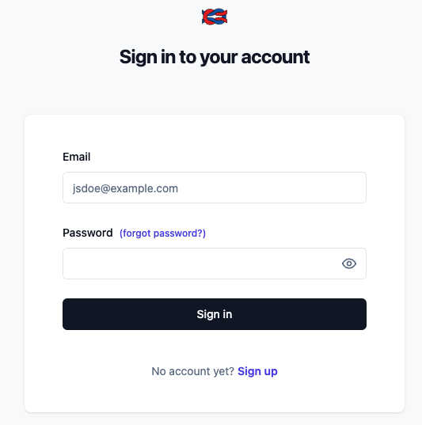
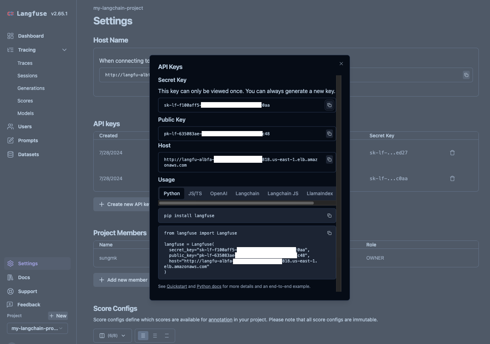
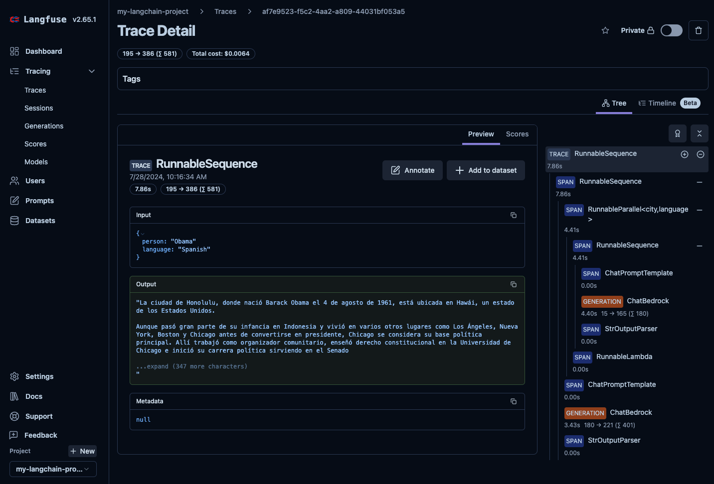

# Hosting Langfuse on Amazon ECS with Fargate using CDK Python

> :information_source: This guide covers Langfuse v2. For Langfuse v3, see the [v3 documentation](https://langfuse.com/self-hosting).


This repository contains the AWS CDK Python code for deploying the [Langfuse](https://langfuse.com/) application using Amazon Elastic Container Registry (ECR) and Amazon Elastic Container Service (ECS).

Langfuse is an open-source LLM engineering platform that helps teams collaboratively debug, analyze, and iterate on their LLM applications.

The `cdk.json` file tells the CDK Toolkit how to execute your app.

This project is set up like a standard Python project.  The initialization
process also creates a virtualenv within this project, stored under the `.venv`
directory.  To create the virtualenv it assumes that there is a `python3`
(or `python` for Windows) executable in your path with access to the `venv`
package. If for any reason the automatic creation of the virtualenv fails,
you can create the virtualenv manually.

To manually create a virtualenv on MacOS and Linux:

```
$ git clone --depth=1 https://github.com/aws-samples/amazon-bedrock-samples.git
$ cd evaluation-observe/deploy-langfuse-on-ecs-with-fargate
$ git sparse-checkout init --cone
$ git sparse-checkout set langfuse-v2
$ cd langfuse-v2

$ python3 -m venv .venv
```

After the init process completes and the virtualenv is created, you can use the following
step to activate your virtualenv.

```
$ source .venv/bin/activate
```

If you are a Windows platform, you would activate the virtualenv like this:

```
% .venv\Scripts\activate.bat
```

Once the virtualenv is activated, you can install the required dependencies.

```
(.venv) $ pip install -r requirements.txt
```

> To add additional dependencies, for example other CDK libraries, just add
them to your `setup.py` file and rerun the `pip install -r requirements.txt`
command.

### Set up `cdk.context.json`

Then, we need to set approperly the cdk context configuration file, `cdk.context.json`.

For example,

```
{
  "db_cluster_name": "langfuse-db",
  "ecs_cluster_name": "langfuse-cluster",
  "ecs_service_name": "langfuse-alb-service",
  "image_version": "2",
  "langfuse_env": {
    "NODE_ENV": "production",
    "NEXTAUTH_SECRET": "mysecret",
    "SALT": "mysalt",
    "TELEMETRY_ENABLED": "true",
    "NEXT_PUBLIC_SIGN_UP_DISABLED": "false",
    "LANGFUSE_ENABLE_EXPERIMENTAL_FEATURES": "true"
  }
}
```

:information_source: This guide covers Langfuse v2. `image_version` should be set to `2`.

:information_source: `NEXTAUTH_SECRET` and `SALT` can be created using `openssl rand -base64 32` on `MacOS` or `Ubuntu`.
(For more information, see [**Langfuse Configuring Environment Variables**](https://langfuse.com/docs/deployment/self-host#configuring-environment-variables))

### Deploy

At this point you can now synthesize the CloudFormation template for this code.

```
(.venv) $ export CDK_DEFAULT_ACCOUNT=$(aws sts get-caller-identity --query Account --output text)
(.venv) $ export CDK_DEFAULT_REGION=$(aws configure get region)
(.venv) $ cdk synth --all
```

Use `cdk deploy` command to create the stack shown above.

```
(.venv) $ cdk deploy --require-approval never --all
```

We can list all the CDK stacks by using the `cdk list` command prior to deployment.

```
(.venv) $ cdk list
LangFuseECRStack
LangFuseVpcStack
LangFuseALBStack
LangFuseAuroraPostgreSQLStack
LangFuseECSClusterStack
LangFuseECSTaskStack
LangFuseECSAlbFargateServiceStack
```

## Clean Up

Delete the CloudFormation stack by running the below command.

```
(.venv) $ cdk destroy --force --all
```

## Useful commands

 * `cdk ls`          list all stacks in the app
 * `cdk synth`       emits the synthesized CloudFormation template
 * `cdk deploy`      deploy this stack to your default AWS account/region
 * `cdk diff`        compare deployed stack with current state
 * `cdk docs`        open CDK documentation

Enjoy!

## Tracing for your LLM Application with Langfuse

After deploying all CDK stacks, you can find the **Langfuse URL** using the following command:

```bash
aws cloudformation describe-stacks --stack-name LangFuseECSAlbFargateServiceStack --region ${CDK_DEFAULT_REGION} | \
  jq -r '.Stacks[0].Outputs | map(select(.OutputKey == "LoadBalancerDNS")) | .[0].OutputValue'
```

Next, open the **Langfuse URL** in your browser to create a new project for tracking your LLM application with Langfuse.

### Create a New Project in Langfuse

1. Create a Langfuse Account

    

    
2. Create a New Project
    
3. Create New API Credentials in the Project Settings
    

### Log Your First LLM Call to Langfuse

Open the `tracing_for_langchain_bedrock` notebook in the `examples` folder and run it. (See [here](./examples/tracing_for_langchain_bedrock.ipynb) for more information)

You will the see the list of traces as follows:


You will also see the details of the selected trace as follows:



## References

 * [(Workshop) GenAIOps - Observability for GenAI applications with Amazon Bedrock and Langfuse](https://catalog.workshops.aws/genaiops-langfuse)
 * [(AWS Korea Tech Blog) Hosting Langfuse on Amazon ECS with Fargate using AWS CDK Python (2024-08-09)](https://aws.amazon.com/ko/blogs/tech/hosting-langfuse-with-aws-cdk-python-using-amazon-ecs-and-aws-fargate/)
 * [Langfuse Official Documents](https://langfuse.com/docs) - Langfuse is an open-source LLM engineering platform that helps teams collaboratively debug, analyze, and iterate on their LLM applications.
    * [Langfuse Self-Hosting Guide (Docker)](https://langfuse.com/docs/deployment/self-host)
    * [Langfuse Configuring Environment Variables](https://langfuse.com/docs/deployment/self-host#configuring-environment-variables)
    * [Tracing for Langchain (Python & JS/TS)](https://langfuse.com/docs/integrations/langchain/tracing)
    * [Langfuse Python SDK (Low-level)](https://langfuse.com/docs/sdk/python/low-level-sdk)
 * [Langfuse Cookbook](https://github.com/langfuse/langfuse-docs/tree/main/cookbook)
 * [(GitHub) Langfuse](https://github.com/langfuse/langfuse) - 🪢 Open source LLM engineering platform: Observability, metrics, evals, prompt management, playground, datasets. Integrates with LlamaIndex, Langchain, OpenAI SDK, LiteLLM, and more.
 * [Langfuse ECR/ECS Deployment CDK TypeScript](https://github.com/AI4Organization/langfuse-ecr-ecs-deployment-cdk) - Deploy Langfuse to ECR and ECS with Fargate and AWS CDK TypeScript.
 * [cdk-ecr-deployment](https://github.com/cdklabs/cdk-ecr-deployment) - A CDK construct to deploy docker image to Amazon ECR.

## Security

See [CONTRIBUTING](../CONTRIBUTING.md#security-issue-notifications) for more information.

## License

This library is licensed under the MIT-0 License. See the LICENSE file.
