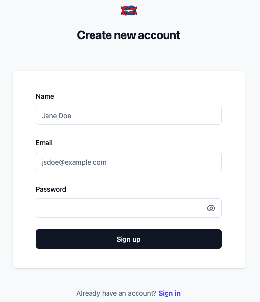
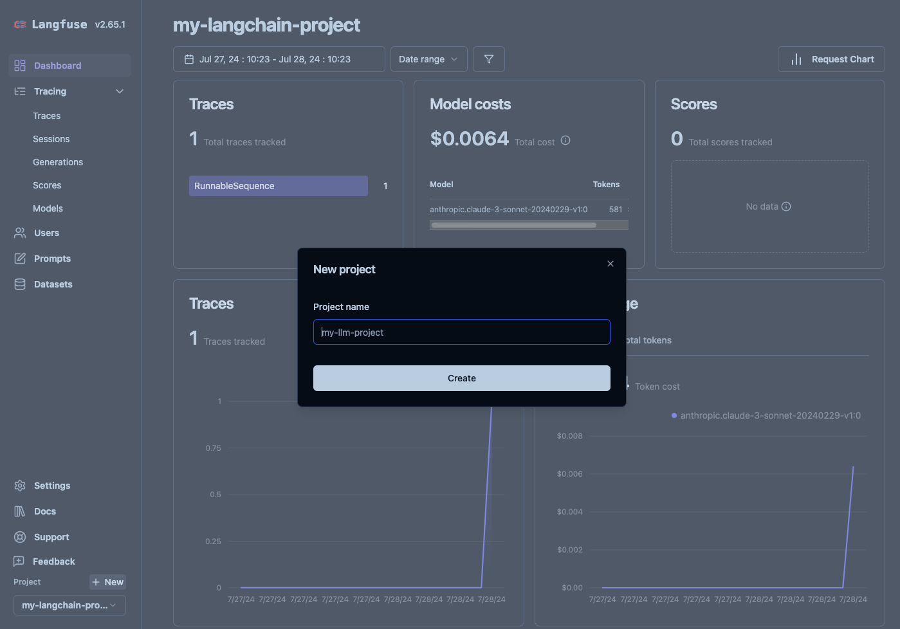
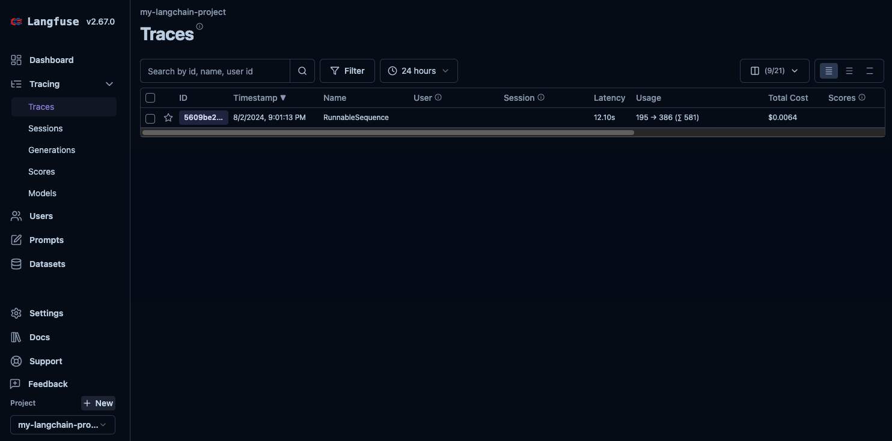

# Hosting Langfuse V3 on Amazon ECS with Fargate using CDK Python

This repository contains the AWS CDK Python code for deploying the [Langfuse](https://langfuse.com/) application using Amazon Elastic Container Registry (ECR) and Amazon Elastic Container Service (ECS).

Langfuse is an open-source LLM engineering platform that helps teams collaboratively debug, analyze, and iterate on their LLM applications.


> :information_source: For more information on Langfuse's architecture, please check [the official documentation](https://langfuse.com/self-hosting#architecture)

The `cdk.json` file tells the CDK Toolkit how to execute your app.

This project is set up like a standard Python project.  The initialization
process also creates a virtualenv within this project, stored under the `.venv`
directory.  To create the virtualenv it assumes that there is a `python3`
(or `python` for Windows) executable in your path with access to the `venv`
package. If for any reason the automatic creation of the virtualenv fails,
you can create the virtualenv manually.

To manually create a virtualenv on MacOS and Linux:

```
$ git clone --depth=1 https://github.com/aws-samples/amazon-bedrock-samples.git
$ cd evaluation-observe/deploy-langfuse-on-ecs-with-fargate
$ git sparse-checkout init --cone
$ git sparse-checkout set langfuse-v3
$ cd langfuse-v3

$ python3 -m venv .venv
```

After the init process completes and the virtualenv is created, you can use the following
step to activate your virtualenv.

```
$ source .venv/bin/activate
```

If you are a Windows platform, you would activate the virtualenv like this:

```
% .venv\Scripts\activate.bat
```

Once the virtualenv is activated, you can install the required dependencies.

```
(.venv) $ pip install -r requirements.txt
```
> To add additional dependencies, for example other CDK libraries, just add
them to your `setup.py` file and rerun the `pip install -r requirements.txt`
command.

## Prerequisites

**Set up `cdk.context.json`**

Then, we need to set approperly the cdk context configuration file, `cdk.context.json`.

For example,

```
{
  "private_dns_namespace_name": "langfuse.local",
  "db_cluster_name": "langfuse-db",
  "ecr": [
    {
      "repository_name": "langfuse-web",
      "docker_image_name": "langfuse/langfuse",
      "tag": "3"
    },
    {
      "repository_name": "langfuse-worker",
      "docker_image_name": "langfuse/langfuse-worker",
      "tag": "3"
    },
    {
      "repository_name": "clickhouse",
      "docker_image_name": "clickhouse",
      "tag": "24.12.3.47"
    }
  ],
  "ecs_cluster_name": "langfuse",
  "langfuse_worker_desired_count": 1,
  "langfuse_worker_env": {
    "NODE_ENV": "production",
    "SALT": "salt (generate by running 'openssl rand -base64 32')",
    "ENCRYPTION_KEY": "encryption key (generate by running 'openssl rand -hex 32')",
    "TELEMETRY_ENABLED": "true",
    "LANGFUSE_ENABLE_EXPERIMENTAL_FEATURES": "true"
  },
  "langfuse_web_env": {
    "NODE_ENV": "production",
    "NEXTAUTH_SECRET": "secret (generate by running 'openssl rand -base64 32')",
    "SALT": "salt (generate by running 'openssl rand -base64 32')",
    "ENCRYPTION_KEY": "encryption key (generate by running 'openssl rand -hex 32')",
    "HOSTNAME": "0.0.0.0",
    "LANGFUSE_S3_MEDIA_DOWNLOAD_URL_EXPIRY_SECONDS": "604800",
    "TELEMETRY_ENABLED": "true",
    "LANGFUSE_ENABLE_EXPERIMENTAL_FEATURES": "true",
    "LANGFUSE_SDK_CI_SYNC_PROCESSING_ENABLED": "false",
    "LANGFUSE_READ_FROM_POSTGRES_ONLY": "false",
    "LANGFUSE_READ_FROM_CLICKHOUSE_ONLY": "true",
    "LANGFUSE_RETURN_FROM_CLICKHOUSE": "true"
  }
}
```

:information_source: This guide covers Langfuse v3. The docker image version (`tag`) of `langfuse-web` and `langfuse-worker` should be set to `3`.

:information_source: For more details on environment variables for the Langfuse Web (`langfuse_web_env`) and Langfuse Worker (`langfuse_worker_env`) containers, please refer to the [official configuration guide](https://langfuse.com/self-hosting/configuration#environment-variables).

**Bootstrap AWS environment for AWS CDK app**

Also, before any AWS CDK app can be deployed, you have to bootstrap your AWS environment to create certain AWS resources that the AWS CDK CLI (Command Line Interface) uses to deploy your AWS CDK app.

Run the `cdk bootstrap` command to bootstrap the AWS environment.

```
(.venv) $ cdk bootstrap
```

### Deploy

At this point you can now synthesize the CloudFormation template for this code.

```
(.venv) $ export CDK_DEFAULT_ACCOUNT=$(aws sts get-caller-identity --query Account --output text)
(.venv) $ export CDK_DEFAULT_REGION=$(aws configure get region)
(.venv) $ cdk synth --all
```

Use `cdk deploy` command to create the stack shown above.

```
(.venv) $ cdk deploy --require-approval never --all
```

We can list all the CDK stacks by using the `cdk list` command prior to deployment.

```
(.venv) $ cdk list
LangfuseECRStack
LangfuseVpcStack
LangfuseWebALBStack
LangfuseCacheStack
LangfuseAuroraPostgreSQLStack
LangfuseS3BucketStack
LangfuseServiceDiscoveryStack
LangfuseECSClusterStack
LangfuseClickhouseEFSStack
LangfuseClickhouseECSTaskStack
LangfuseClickhouseECSServiceStack
LangfuseWorkerECSTaskStack
LangfuseWorkerECSServiceStack
LangfuseWebECSTaskStack
LangfuseWebECSServiceStack
```

## Clean Up

Delete the CloudFormation stack by running the below command.

```
(.venv) $ cdk destroy --force --all
```

## Useful commands

 * `cdk ls`          list all stacks in the app
 * `cdk synth`       emits the synthesized CloudFormation template
 * `cdk deploy`      deploy this stack to your default AWS account/region
 * `cdk diff`        compare deployed stack with current state
 * `cdk docs`        open CDK documentation

Enjoy!

## Tracing for your LLM Application with Langfuse

After deploying all CDK stacks, you can find the **Langfuse URL** using the following command:

```bash
aws cloudformation describe-stacks --stack-name LangfuseWebECSServiceStack --region ${CDK_DEFAULT_REGION} | \
  jq -r '.Stacks[0].Outputs | map(select(.OutputKey == "LoadBalancerDNS")) | .[0].OutputValue'
```

Next, open the **Langfuse URL** in your browser to create a new project for tracking your LLM application with Langfuse.

### Create a New Project in Langfuse

1. Create a Langfuse Account

    

    
2. Create a New Project
    
3. Create New API Credentials in the Project Settings
    

### Log Your First LLM Call to Langfuse

Open the `tracing_for_langchain_bedrock` notebook in the `examples` folder and run it. (See [here](./examples/tracing_for_langchain_bedrock.ipynb) for more information)

You will the see the list of traces as follows:


You will also see the details of the selected trace as follows:


## References

#### General

 * [(Official) Self-host Langfuse](https://langfuse.com/self-hosting)
 * [(Official) Langfuse configuration guide](https://langfuse.com/self-hosting/configuration)
 * [(GitHub) langfuse](https://github.com/langfuse/langfuse/)
 * [(GitHub) Langfuse v3 Terraform Module Sample](https://github.com/tubone24/langfuse-v3-terraform/)
 * [AWS CDK Reference Documentation](https://docs.aws.amazon.com/cdk/api/v2/)
 * [cdk-ecr-deployment](https://github.com/cdklabs/cdk-ecr-deployment) - A CDK construct to deploy docker image to Amazon ECR.
 * [Terraform - AWS Provider Docs](https://registry.terraform.io/providers/hashicorp/aws/latest/docs)

#### Langfuse User Guide

  * [(Workshop) GenAIOps - Observability for GenAI applications with Amazon Bedrock and Langfuse](https://catalog.workshops.aws/genaiops-langfuse)
  * [Get Started with Langfuse Tracing](https://langfuse.com/docs/get-started)
  * [Observability & Tracing for Langchain (Python & JS/TS)](https://langfuse.com/docs/integrations/langchain/tracing)

#### Amazon ElastiCache

 * [Amazon ElastiCache Supported node types](https://docs.aws.amazon.com/AmazonElastiCache/latest/dg/CacheNodes.SupportedTypes.html#CacheNodes.CurrentGen)
 * [Amazon ElastiCache Supported engines and versions](https://docs.aws.amazon.com/AmazonElastiCache/latest/dg/supported-engine-versions.html)
 * [Comparing Valkey, Memcached, and Redis OSS self-designed caches](https://docs.aws.amazon.com/AmazonElastiCache/latest/dg/SelectEngine.html)

#### Amazon Aurora PostgreSQL

 * [Working with Amazon Aurora PostgreSQL](https://docs.aws.amazon.com/AmazonRDS/latest/AuroraUserGuide/Aurora.AuroraPostgreSQL.html)

#### Clickhouse

 * [Clickhouse for self-hosting Langfuse v3](https://langfuse.com/self-hosting/infrastructure/clickhouse)
 * [(DockerHub) Clickhouse Docker Official Image](https://hub.docker.com/_/clickhouse)
 * [Clickhouse CLI](https://clickhouse.com/docs/en/integrations/sql-clients/clickhouse-client-local)

## Security

See [CONTRIBUTING](../CONTRIBUTING.md#security-issue-notifications) for more information.

## License

This library is licensed under the MIT-0 License. See the LICENSE file.
