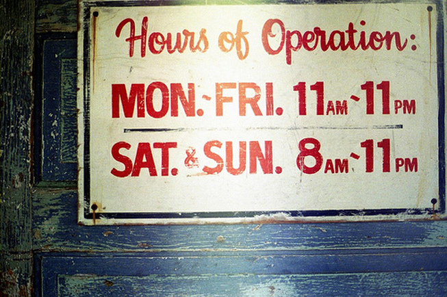

# AWS Serverless Multi-Modal Image Text Validation
Repository hosting sample AWS CDK code for the AWS Serverless Multi-Modal Image Text Validation sample code. 

# Use Case
There are scenarios when delivery drivers take the picture of restaurant operating hours as a proof to show that its closed. However, given the wide variety of store operating hours signs, it can be challenging to validate the driver's claim, leading to potential fraud.

We aim to solve this use case in this sample solution. We demonstrate the use of Amazon AI service (Rekognition) and LLM (Large Language Models) hosted on Amazon Bedrock to determine whether the restaurant open or based on the picture of storefront's hours sign and the timestamp when the picture was taken. The LLM also provides detailed reasoning that led to the decision. The result is stored in DynamoDB along with metadata which can be used for further analysis.

We use single shot prompting technique to enable complex reasoning capabilities of the large language model (LLM).

The diagram below shows the overall architecture. Once images are dropped into an S3 bucket, an event triggers a Lambda function (rek-bedrock.py). The function then orchestrates the calls to AWS Rekognition, Amazon Bedrock and then finally stores the outcome in an Amazon DynamoDB table.

## Example

### Input:
Current timestamp: Tuesday 01/23/2024 19:02:00

Image with hours of operation:

### Output:
Outcome: Not Closed

Reason: The current day is Tuesday and the current time is 19:02. Since the restaurant is open Monday-Friday 11AM-11PM and Saturday-Sunday 8AM-11PM, the restaurant is not closed at the current day and time.   

## Instructions to Use/Deploy this solution 

### Pre-requisites
1. Install [NPM](https://docs.npmjs.com/downloading-and-installing-node-js-and-npm)
2. Install [CDK](https://docs.aws.amazon.com/cdk/v2/guide/getting_started.html)
3. Configure your AWS CLI with the necessary permissions to deploy the resources in the architecture diagram above (Lambda, Rekognition, Bedrock, S3, DynamoDB, CloudWatch Logs, CloudWatch Events, IAM, etc). We strongly recommend following principle of least privileges.

### Steps to deploy
1. Clone this repository
2. `cd` into the `cdk` directory
3. Run `sudo npm install --legacy-peer-deps` to install dependencies
4. If necessary  run `cdk bootstrap` to bootstrap your environment
5. Run `cdk deploy` to deploy the stack

### Running the Solution

1. Choose any image from the `images` folder under `bedrock-rekognition-sample`
2. Drop the image in the S3 bucket named `multi-modal-landing-bucket`
3. An event is generated that triggers the Lambda function 
4. The Lambda function processes the image text and stores the final outcome in 
   DynamoDB table called `restaurant-results-table`

### Cleanup

1. `cd` into `cdk` directory
2. Run `sudo cdk destroy` to delete all the deployed resources

## Authors

This solution was co-developed by Swagat Kulkarni and Tony Howell.

