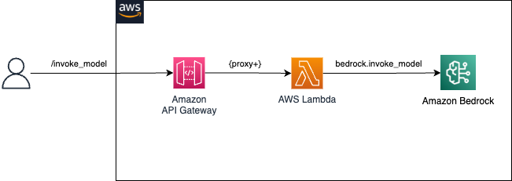

## Call the Bedrock APIs from your API Gateway, using a Amazon API Gateway, AWS Lambda layer with Boto3

The Cloudformation template [cfn-template.yaml](./setup/cfn-template.yaml) deploys:
* a Lambda Layer containing the Python Boto3 SDK updated to support Bedrock
* a Lambda function for consuming Bedrock **invoke_model** API
* a REST Api for invoking LLMs through Bedrock using `invoke_model`

The template defines a CloudFormation custom resource function that dynamically downloads and uses the latest published Bedrock SDK files to build the Lambda Layer when you deploy the stack.
* The default path to the bedrock-python-sdk.zip is automatically populated in the template. To use a different zip file, change the value for BedrockPreviewSdkUrl

You can test the solution through the following notebooks:
1. [01_bedrock_api.ipynb](./01_bedrock_api.ipynb): Consume REST Api through `requests`
2. [02_bedrock_api_langchain.ipynb](./02_bedrock_api_langchain.ipynb): Integrate APIGateway with Langchain