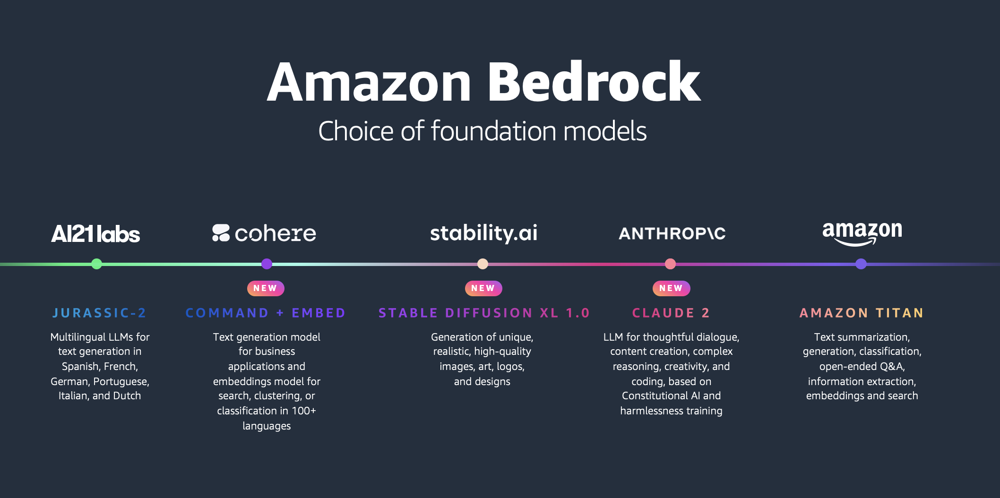

# Getting Started with Bedrock

 With the Amazon Bedrock serverless experience, you can quickly get started, easily experiment with FMs, privately customize FMs with your own data, and seamlessly integrate and deploy them into your applications using AWS tools and capabilities.

This repository contains examples to get you started with the core Amazon Bedrock APIs for each of the foundational model providers.

## Contents

- [Getting Started with Bedrock Converse API - Notebook](Getting_started_with_Converse_API.ipynb) - Example notebook to illustrate the basics of the Converse API
- [Getting Started with Bedrock Converse API - Streamlit demo](getting_started_converse_bedrock_streamlit.py) - Streamlit demo to illustrate the basics of the Converse API
- [Model Choice with Bedrock Converse API - Streamlit demo](model_choice_converse_bedrock_streamlit.py) - Streamlit demo to illustrate the model choice with the Converse API
- [Model Choice with Bedrock Converse API - Demo script](model-choice-demo-converse-api.py) - Script demo to illustrate the model choice with the Converse API
- [Getting Started with the API](bedrock_api.py) - Simple example using the REST API
- [Example using the Python SDK](bedrock_sdk.py) - Simple example using the Python SDK
- [Streaming your responses](bedrock_streaming.py) - Example that streams your response from Bedrock
- [Using Embeddings models from Amazon](bedrock_amazon_titan_embeddings.py) - Syntax for using Amazon Titan Embeddings
- [Using Text models from Amazon](bedrock_amazon_titan_text.py) - Syntax for using Amazon Titan Text  
- [Using models from Anthropic](bedrock_anthropic.py) - Syntax for using models from Anthropic - Claude 
- [Using models from Stability](bedrock_stability.py) - Syntax for using models from Stability - Stable Diffusion 
- [Using models from AI21 Labs](bedrock_ai21.py) - Syntax for using models from AI21 Labs - Jurassic
- [Using models from Cohere](bedrock_cohere.py) - Syntax for using models from Cohere - Command
- [Anthropic Multi-Modal Models](bedrock_anthropic_claude3.py) - Syntax Multi-Modal models from Anthropic Claude v3 Models
- [Single and Mult-turn text generation with Messages API](./Claude-MessagesAPI-Examples.ipynb) - Examples to illustrate the new Claude Messages API

## Contributing

We welcome community contributions! Please ensure your sample aligns with AWS [best practices](https://aws.amazon.com/architecture/well-architected/), and please update the **Contents** section of this README file with a link to your sample, along with a description.
