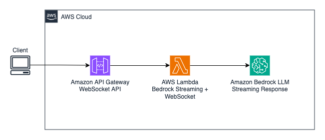
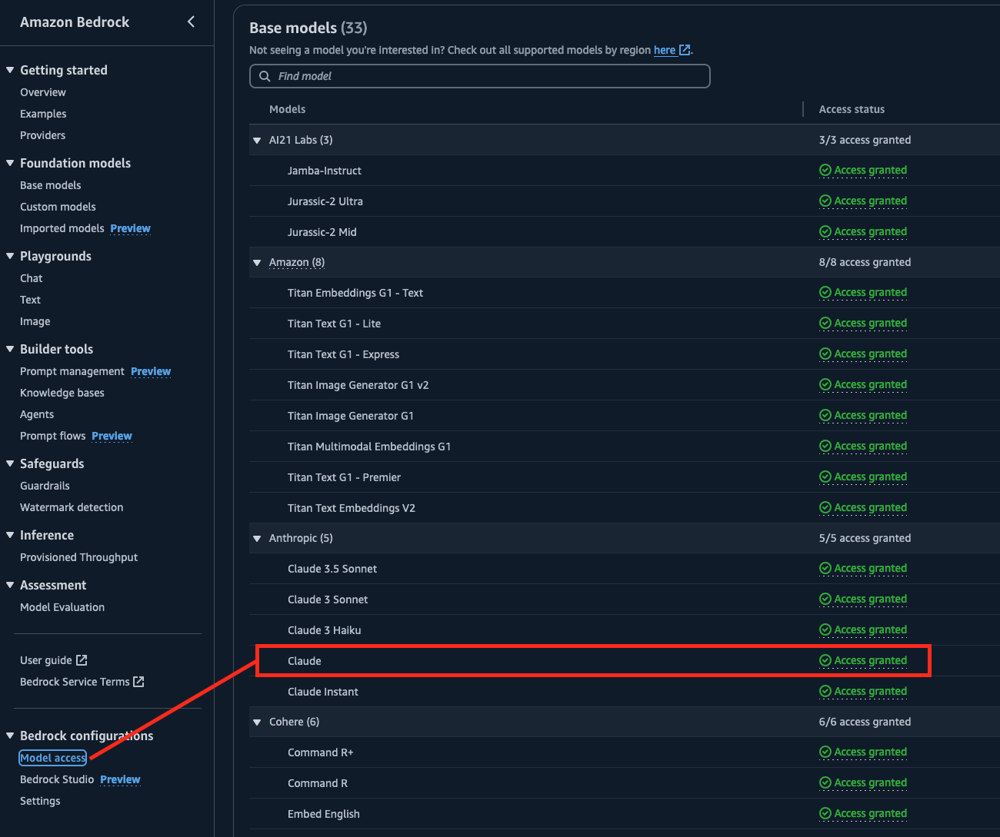

# Bedrock Lambda API Gateway Streamer

Bedrock Lambda API Gateway Streamer demonstrates a simple, serverless approach to integrating Amazon Bedrock with AWS Lambda and Amazon API Gateway. Written in Rust 🦀, it showcases how to efficiently stream responses from Amazon Bedrock to a client via WebSocket connections. The example serves as a practical illustration of implementing real-time, serverless communication between Bedrock's GenAI capabilities and end-users through AWS infrastructure.

Once you've successfully built and deployed the application, you'll be able to:

1. Establish a WebSocket connection with Amazon API Gateway.
2. Use the connection to interact with Amazon Bedrock for simple story generation.
3. Receive real-time streaming of the generated story content directly to your client via the established WebSocket.

This setup allows for immediate, continuous delivery of the story as it's being created, providing an interactive experience for users.

## Architecture

<p align="center">
  
</p>

## Prerequisites (Local)

* [npm](https://docs.npmjs.com/downloading-and-installing-node-js-and-npm)
* [Node.js](https://nodejs.org/en/download/package-manager) v18.20.4 or higher
* [CDK](https://docs.aws.amazon.com/cdk/v2/guide/getting_started.html) latest version
* [Docker](https://docs.docker.com/engine/install/) is running locally (needed for Rust cross-complilation Lambda build)
* [Rust 🦀](https://www.rust-lang.org/) v1.79.0 or higher
* [Cargo Lambda](https://www.cargo-lambda.info/)
* [cross](https://crates.io/crates/cross) for Rust cross-compilation
* [wscat](https://docs.aws.amazon.com/apigateway/latest/developerguide/apigateway-how-to-call-websocket-api-wscat.html) for CLI WebSocket capabilities

## Prerequisites (AWS Accounts)

* Access to Amazon Bedrock
* Access to the Amazon Bedrock model used in this example - currently `Claude` as listed in the Bedrock console. In you AWS account, make sure you have `Access granted` to this model. Make sure you have access in the same region where you're deploying the application.

<p align="center">
  
</p>


## Deployment

You can use the following commands at the root of this repository to build and deploy the application:

```bash
# Everything lives here
cd cdk

# Install Node.js dependencies
npm install

# Synthesize the CDK app to produce a cloud assembly for deployment
cdk synth

# Deploy the CDK stack into your AWS environment
cdk deploy
```
After you run the `cdk deploy` command, under the `Outputs` section at the end, you'll see the `BedrockStreamerStack.WebSocketURL` followed by the WebSocket URL you'll use to connect to API Gateway. It should look something like `wss://{YOUR_API_ID_HERE}.execute-api.{YOUR_REGION_HERE}.amazonaws.com/prod`

## Run It

Now that you've sucessfully built and deployed the application, it's time to run it! You can use `wscat` to connect via WebSocket to API Gateway and send it commands. The commands you send will allow a Bedrock LLM to generate a short story based on the type of story you'd like to produce.

```bash
# Connect to the API Gateway URL via WebSocket
wscat -c wss://{YOUR_API_ID_HERE}.execute-api.{YOUR_REGION_HERE}.amazonaws.com/prod

Connected (press CTRL+C to quit)
> {"storyType": "FICTION"}
< {"type":"completion","completion":" Here","stop_reason":null,"stop":null}
< {"type":"completion","completion":" is","stop_reason":null,"stop":null}
< {"type":"completion","completion":" a","stop_reason":null,"stop":null}
< {"type":"completion","completion":" very","stop_reason":null,"stop":null}
< {"type":"completion","completion":" short","stop_reason":null,"stop":null}
< {"type":"completion","completion":" fictional","stop_reason":null,"stop":null}
< {"type":"completion","completion":" story","stop_reason":null,"stop":null}
< {"type":"completion","completion":":","stop_reason":null,"stop":null}
.
.
.
< {"type":"completion","completion":"","stop_reason":"stop_sequence","stop":"\n\nHuman:"}
```
As the `wscat` CLI says, press `CTRL+C` to disconnect 