# Processing an Amazon DynamoDB table with Amazon Bedrock

This repo contains an [AWS CDK](https://aws.amazon.com/cdk/) solution for automatically process an [Amazon DynamoDB](https://aws.amazon.com/dynamodb/) table using [Amazon Bedrock](https://aws.amazon.com/bedrock/) via an [AWS Lambda](https://aws.amazon.com/lambda/) function.

The following architecture is deployed with this repository


## Pre-requisites
This repository assumes that Amazon Bedrock has `Antropic Claude-V2` enabled.
Check the [Model Access](https://docs.aws.amazon.com/bedrock/latest/userguide/model-access.html) documentation for more details.

## Deploying Solution
Follow the next steps to deploy this solution

### Navigate to the app
```
cd process-dynamodb-table-bedrock
```

### Install dependencies
The `cdk.json` file tells the CDK Toolkit how to execute your app.

This project is set up like a standard Python project.  The initialization
process also creates a virtualenv within this project, stored under the `.venv`
directory.  To create the virtualenv it assumes that there is a `python3`
(or `python` for Windows) executable in your path with access to the `venv`
package. If for any reason the automatic creation of the virtualenv fails,
you can create the virtualenv manually.

To manually create a virtualenv on MacOS and Linux:

```
python3 -m venv .venv
```

After the init process completes and the virtualenv is created, you can use the following
step to activate your virtualenv.

```
source .venv/bin/activate
```

If you are a Windows platform, you would activate the virtualenv like this:

```
% .venv\Scripts\activate.bat
```

Once the virtualenv is activated, you can install the required dependencies.

```
pip install -r requirements.txt
```

Initialize the account and region for the CDK. This will create the S3 buckets and roles for the CDK tool to store artifacts and to be able to deploy infrastructure.
```
cdk bootstrap
```

At this point you can now synthesize the CloudFormation template for this code.
```
cdk synth
```

### Deploy Stack
Deploy the stack:
```
cdk deploy
```

## Validating Deployment
To validate that your deployment was successful, navigate to Amazon DynamoDB and ensure that test email data has been populated to the `EmailsData` table 

* Search for DynamoDB on the AWS console
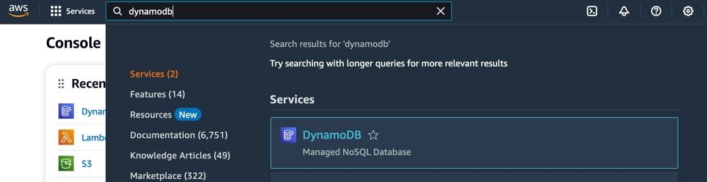

* Click on `Tables` on the left menu
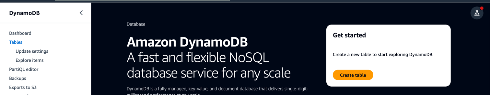

* Click on the `EmailData` table
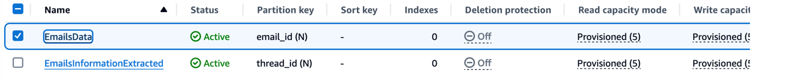

* Click on `Explore Table Items` button


* Check the default emails data that is automatically populated on your table
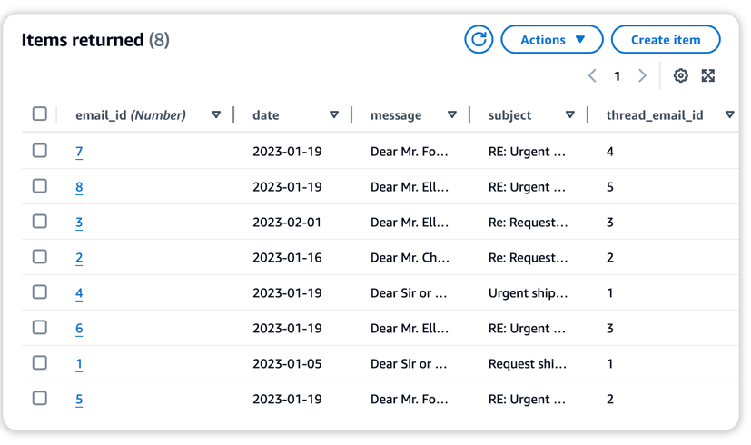


## Processing Emails
To process the emails stored in the Amazon DynamoDB table, you should use the `emails-processing-app` lambda function

* Search for Lambda on the AWS console
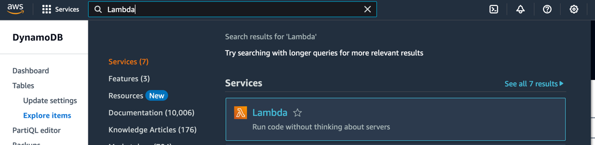


* Click on the `emails-processing-app` lambda function
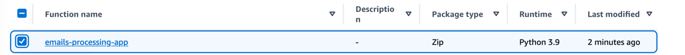


* Click on the `Test` button
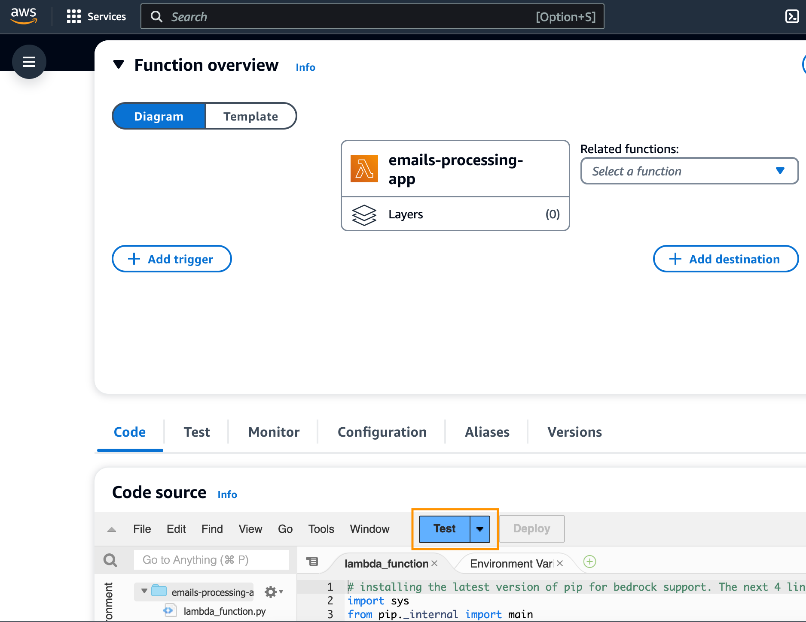

* Create your test event
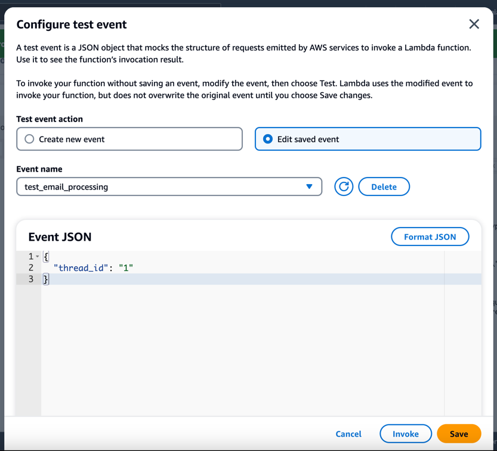


* Click on the `Test` button again for testing the application
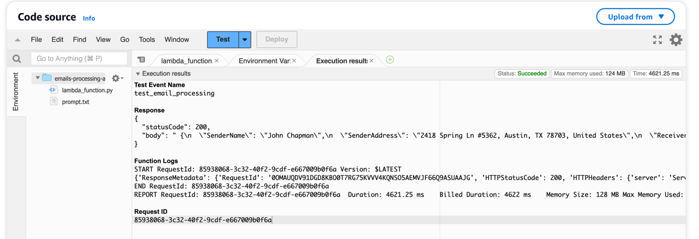

## Validate Extracted Information
You can now navigate to the `EmailsInformationExtracted` DynamoDB table and `Explore Table Items` to validate your extracted information

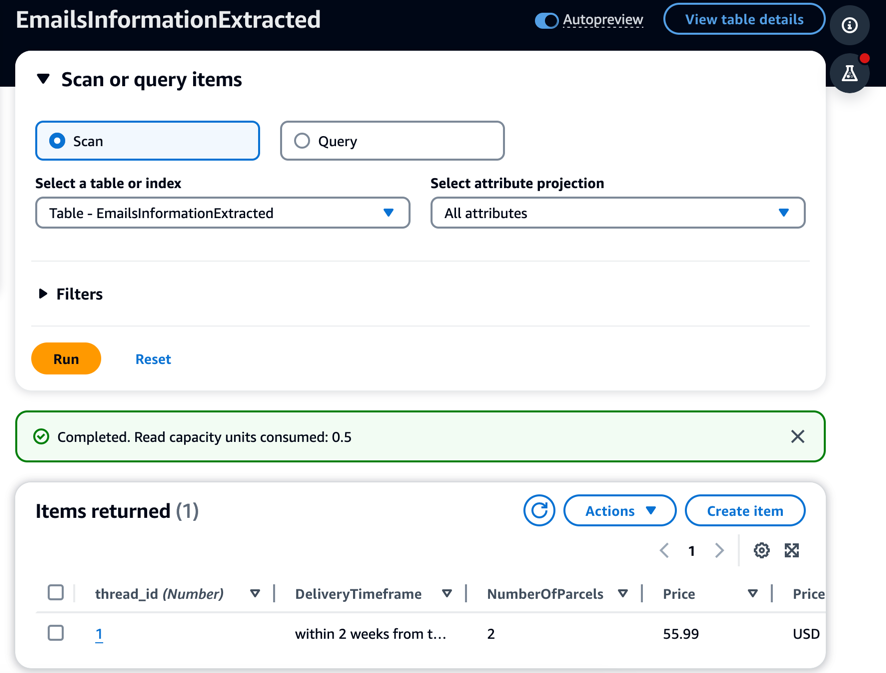

Click on the item to check the details
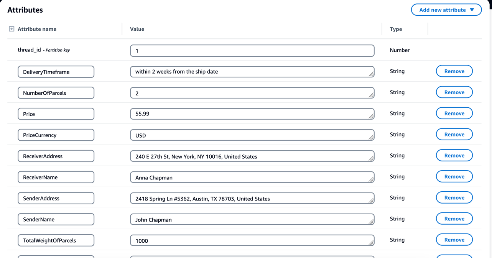