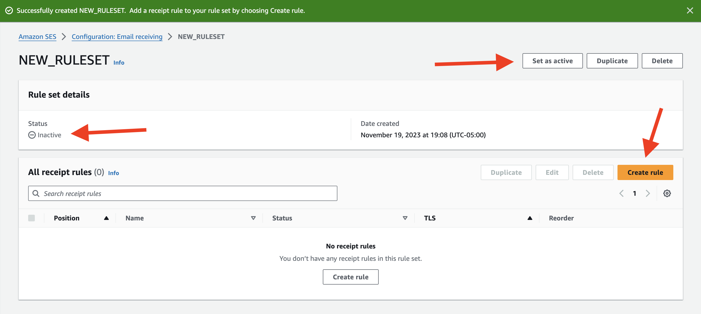
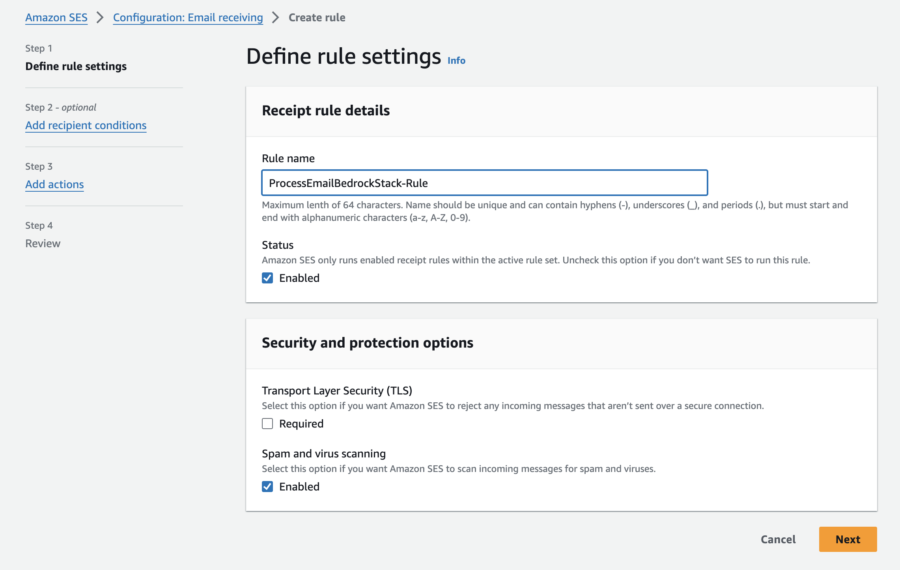
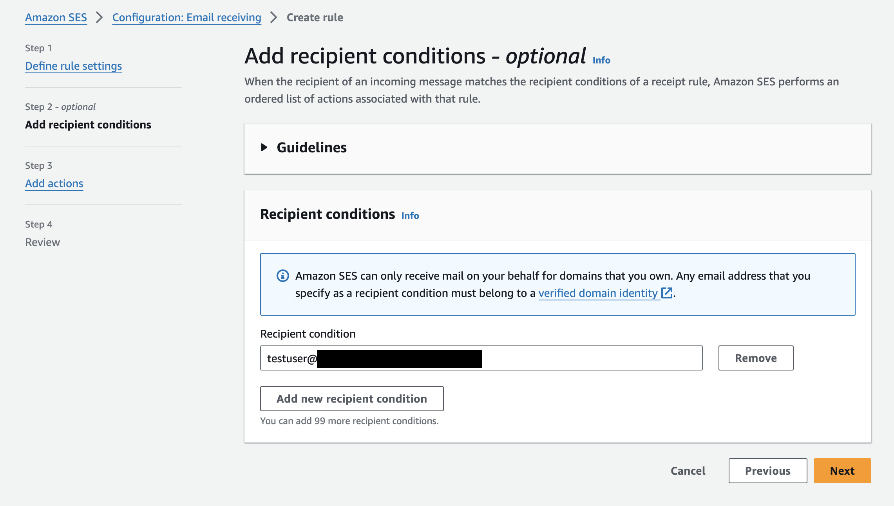
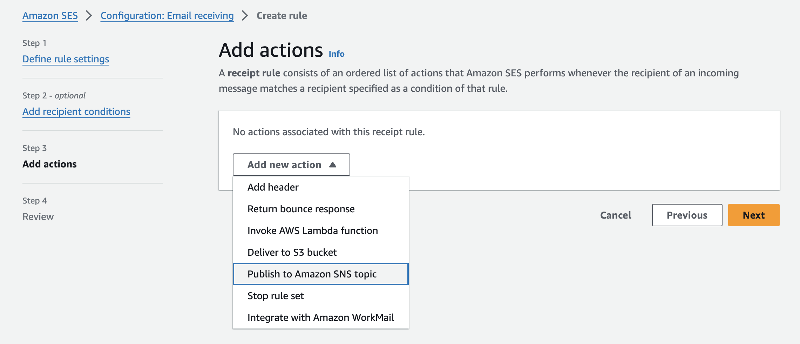
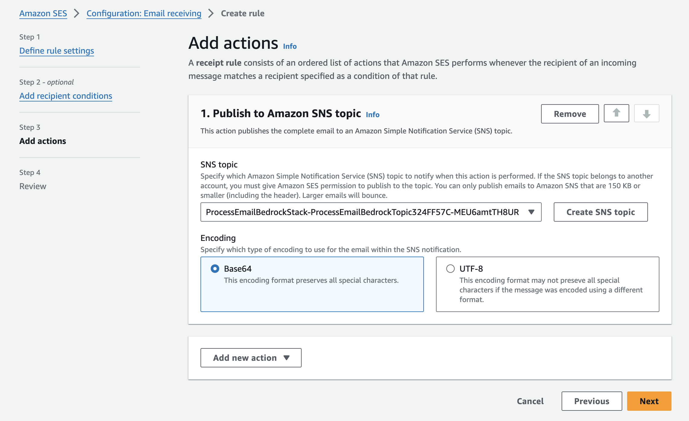
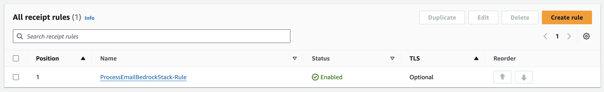

# Processing Emails with Amazon Bedrock

Sample Authors: Aditi Rajnish, Maíra Ladeira Tanke, Raj Pathak

This repo contains an [AWS CDK](https://aws.amazon.com/cdk/) solution for automatically processing emails using [Amazon Bedrock](https://aws.amazon.com/bedrock/), [Simple Email Service (SES)](https://aws.amazon.com/ses/), [Amazon Simple Notification Service (SNS)](https://aws.amazon.com/sns/), [AWS Lambda](https://aws.amazon.com/lambda/), and [Amazon DynamoDB](https://aws.amazon.com/dynamodb/).

To get start and set up your environment:

## Navigate to the cdk-app
```
cd process-email-bedrock/cdk-app
```

## Install dependencies
The `cdk.json` file tells the CDK Toolkit how to execute your app.

This project is set up like a standard Python project.  The initialization
process also creates a virtualenv within this project, stored under the `.venv`
directory.  To create the virtualenv it assumes that there is a `python3`
(or `python` for Windows) executable in your path with access to the `venv`
package. If for any reason the automatic creation of the virtualenv fails,
you can create the virtualenv manually.

To manually create a virtualenv on MacOS and Linux:

```
python3 -m venv .venv
```

After the init process completes and the virtualenv is created, you can use the following
step to activate your virtualenv.

```
source .venv/bin/activate
```

If you are a Windows platform, you would activate the virtualenv like this:

```
% .venv\Scripts\activate.bat
```

Once the virtualenv is activated, you can install the required dependencies.

```
pip install -r requirements.txt
```

Initialize the account and region for the CDK. This will create the S3 buckets and roles for the CDK tool to store artifacts and to be able to deploy infrastructure.
```
cdk bootstrap
```

At this point you can now synthesize the CloudFormation template for this code.
```
cdk synth
```

## Deploy Stack
Deploy the stack:
```
cdk deploy ProcessEmailBedrockStack --require-approval never
```

## Manual Actions to connect Amazon SES to Amazon SNS
Verify that the stack is fully deployed.

### Create Rule Set
Navigate to Amazon SES and go to the "Email receiving" section. Either create a rule set and make it active, or use an already active rule set. In our example, we create a new rule set.


### Activate Rule Set and Create Rule
Within that rule set, make it active (if it isn't already) and create a rule.




### Create Rule - Steps 1 & 2
Name the rule and (optionally) set the recipient conditions, such as only using a test user.





### Create Rule - Step 3: Add Action
Add a new action using the "Publish to Amazon SNS topic" option.




### Create Rule - Step 3: Select SNS Topic
Select the SNS topic created by the CDK stack ("ProcessEmailBedrockStack.ProcessEmailBedrockTopicName" in the Stack outputs) and keep the Base64 Encoding option selected.




### Rule Created
After reviewing this rule, create it, and you should see it in your rule set. Based on the conditions you set, emails that are received will be automatically processed using Amazon SNS and Lambda, leveraging Amazon Bedrock and storing results in the Amazon DynamoDB table.


