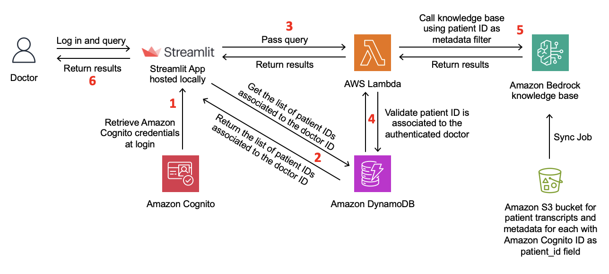

# Access Controls for Knowledge Bases on Amazon Bedrock

This notebook guides users on creating access controls for Knowledge Bases on Amazon Bedrock.

Metadata filtering in knowledge bases enables access control for your data. By defining metadata fields based on attributes such as user roles, departments, or data sensitivity levels, you can ensure that the retrieval only fetches and uses information that a particular user or application is authorized to access. This helps maintain data privacy and security, preventing sensitive or restricted information from being inadvertently surfaced or used in generated responses. With this access control capability, you can safely use retrieval across different user groups or scenarios while complying with company specific data governance policies and regulations.

This example demonstrates the access control capabilities enabled by metadata filtering in Knowledge Bases, using a use case where a healthcare provider has a Knowledge Base containing conversation transcripts between doctors and patients.

The workflow for the solution is as follows:

1. The doctor interacts with the Streamlit frontend, which serves as the application interface. Amazon Cognito handles user authentication and access control, ensuring only authorized doctors can access the application. For production use, it is recommended to use a more robust frontend framework such as AWS Amplify, which provides a comprehensive set of tools and services for building scalable and secure web applications.
2. After the doctor has successfully signed in, the application retrieves the list of patients associated with the doctor's ID from the Amazon DynamoDB database. The doctor is then presented with this list of patients, from which they can select one or more patients to filter their search.
3. When the doctor interacts with the Streamlit frontend, it sends a request to an AWS Lambda function, which acts as the application backend. The request includes the doctor's ID, a list of patient IDs to filter by, and the text query.
4. Before querying the knowledge base, the Lambda function retrieves data from the DynamoDB database, which stores doctor-patient associations. This step validates that the doctor is authorized to access the requested patient or list of patient's information.
5. If the validation is successful, the Lambda function queries the knowledge base using the provided patient or list of patient's IDs. The knowledge base is pre-populated with transcript and metadata files stored in Amazon Simple Storage Service (Amazon S3).
6. The knowledge base returns the relevant results, which are then sent back to the Streamlit application and displayed to the doctor.

## Prerequisites

- AWS account

## Deployment

The deployment steps for this solution are provided in the **kb-end-to-end-acl.ipynb** notebook.

## Contributing

We welcome community contributions! Please ensure your sample aligns with AWS best practices, and please update the Contents section of this README file with a link to your sample, along with a description.