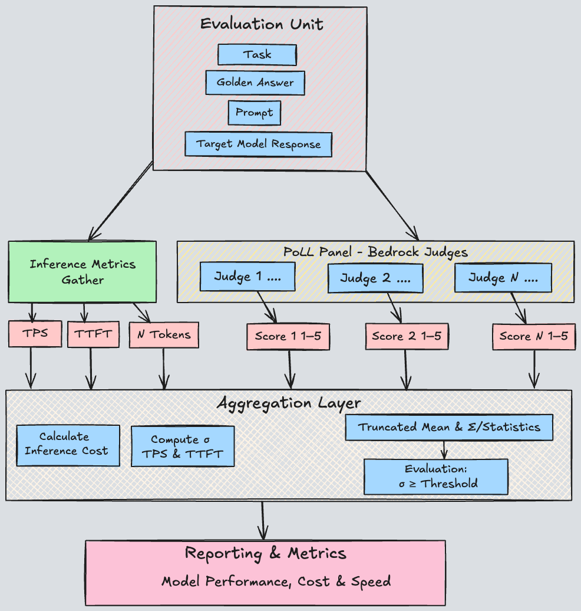

# LLM Benchmarking Framework with LLM-as-a-JURY

A comprehensive framework for benchmarking and evaluating Large Language Models (LLMs) with a specific focus on Amazon Bedrock models.

## Design Introduction

This framework implements a "LLM-as-a-Jury" methodology based on research from [Replacing Judges with Juries:
Evaluating LLM Generations with a Panel of Diverse Models](https://arxiv.org/pdf/2404.18796), each evaluation is composed of an ascending ranking score of 1-5 and, where the total LLMs evaluate responses are tallied and their mean calculated, this becomes the final score (if an average of the evaluation fails to achieve a score of 3+ across any evaluation dimension is deemed to have failed, value can be changed). This technique provides more reliable and balanced evaluations compared to single-judge, PASS | FAIL methods.

Our benchmarking system evaluates model outputs across six core dimensions:
- **Correctness**: Accuracy of information provided
- **Completeness**: Thoroughness of the response
- **Relevance**: How well the response addresses the prompt
- **Format**: Appropriate structure and presentation
- **Coherence**: Logical flow and consistency
- **Following instructions**: Adherence to prompt requirements

Additionally, the framework supports **user-defined** evaluation metrics tailored to specific use cases such as branding style or tone.

The system is designed for scalability, automatically aggregating results from multiple benchmark runs into comprehensive reports, providing an increasingly complete picture of model latency and performance over time.





## Overview

This project provides tools for:

- Running performance benchmarks across multiple LLM models (Amazon Bedrock and third-party models)
- Using LLM-as-judge methodology where models evaluate other models' responses
- Measuring key performance metrics (latency, throughput, cost, response quality)
- Visualizing results and generating interactive reports

## Features

- **Multi-model benchmarking**: Compare different models side-by-side, including third-party models
- **LLM-as-judge evaluation**: Leverage LLMs to evaluate other models' responses
- **Comprehensive metrics**: Track latency, throughput, cost, and quality of responses
- **Interactive visualizations**: Generate holistic HTML reports

## Installation

```bash
git clone https://github.com/aws-samples/amazon-bedrock-samples/poc-to-prod/360-eval.git
cd 360-eval
```
```bash
pip install -r requirements.txt
```

### Third Party API Setup

To use third-party models in the benchmarking process:

1. Create a `.env` file in the project root directory
2. Add your 3P API key in the following format:

```
OPENAI_API='your_openai_api_key_here'
GCP_KEY='your_gpc_api_key_here'
```


## Evaluation Unit Data Format

The benchmarking tool requires input data in JSONL format, with each line containing a scenario to evaluate. Each scenario must follow this schema:

### Field Descriptions

- `text_prompt`: The prompt to send to the model (in the example: "Summarize the principles of edge computing in one sentence.")
  - Should be clear, specific, and aligned with the task type
  - Can include context, instructions, and any formatting requirements

- `expected_output_tokens`: Maximum expected output token count (example: 250)
  - Used for cost calculation and response size estimation

- `task`: Object containing task metadata that guides the evaluation process
  - `task_type`: Category of the task (example: "Summarization")
    - Common types include: Summarization, Question-Answering, Translation, Creative Writing, Code Generation, etc.
    - This categorization helps organize results by task type in the final report
  
  - `task_criteria`: Specific evaluation criteria for this task (example: "Summarize the text provided ensuring that the main message is not diluted nor changed")
    - Provides detailed instructions on how the response should be evaluated
    - Used by judge models to assess quality along specified dimensions
    - Should align with the core evaluation dimensions (Correctness, Completeness, etc.)

- `golden_answer`: Reference answer for evaluation (example: "Edge computing is a distributed computing paradigm that brings computation and data storage closer to the location where it is needed, improving response times and saving bandwidth by processing data near the source rather than relying on a central data center.")
  - Serves as the ground truth or ideal response
  - Used by judge models to compare model outputs
  - Critical for objective evaluation metrics
  - Should represent a high-quality answer that meets all task criteria

- `url_image` (optional): URL or path to an image for vision-enabled evaluations
  - Required when using `--vision_enabled true`
  - Can be a web URL or local file path
  - Supports JPG, PNG, GIF, WebP, and BMP formats

Example:
```json
{
  "text_prompt": "Summarize the principles of edge computing in one sentence.",
  "expected_output_tokens": 250,
  "task": {
    "task_type": "Summarization", 
    "task_criteria": "Summarize the text provided ensuring that the main message is not diluted nor changed"
  },
  "golden_answer": "Edge computing is a distributed computing paradigm that brings computation and data storage closer to the location where it is needed, improving response times and saving bandwidth by processing data near the source rather than relying on a central data center."
}
```

Example with vision:
```json
{
  "text_prompt": "Describe what you see in this image.",
  "expected_output_tokens": 250,
  "task": {
    "task_type": "Image Description", 
    "task_criteria": "Provide a detailed description of the image content"
  },
  "golden_answer": "A detailed description of the expected image content.",
  "url_image": "https://example.com/image.jpg"
}
```

## Model Profiles Data Format

The benchmarking tool requires to input the model profiles in JSONL format, with each line containing a Model name, region, inference profile and cost data. Each evaluation profile must follow this schema:

### Field Descriptions


- `model_id`: Target model identifier (example: "amazon.nova-pro-v1:0")
  - Specifies which model will process the prompt
  - For Bedrock models, use the full model ID and provider (e.g., "bedrock/us.amazon.nova-pro-v1:0")
  - For third-party models, use identifiers like "openai/gpt-4" or "openai/gpt-3.5-turbo"

- `region`: AWS region for Bedrock models (example: "us-east-1")
  - Region where the Bedrock model is available
  - Not required for third-party models

- `input_token_cost` or `input_cost_per_1k`: Cost per 1,000 input tokens (example: 0.0008)
  - Used for cost calculation and reporting
  - Both field names are supported

- `output_token_cost` or `output_cost_per_1k`: Cost per 1,000 output tokens (example: 0.0032)
  - Used for cost calculation and reporting
  - Both field names are supported

Example:
```json
{
  "model_id": "bedrock/us.amazon.nova-pro-v1:0",
  "region": "us-east-1",
  "input_token_cost": 0.0008,
  "output_token_cost": 0.0032
}
```

Sample evaluation files are provided in the `prompt-evaluations/` directory.

## Judge Configuration

Judges are a required input data in JSONL format, with each line containing a judge used to evaluate the models' response. Each judge configuration must follow this schema:

### Field Descriptions

- `model_id`: Judge model identifier (example: "amazon.nova-pro-v1:0")
  - Currently only supporting Bedrock Model Judges

- `region`: AWS region for Bedrock models (example: "us-east-1")
  - Region where the Bedrock model is available

- `input_cost_per_1k`: Input cost per one thousand tokens
  - Used for input pricing calculations
  
- `output_cost_per_1k`: Output cost per one thousand tokens
  - Used for output pricing calculations

Example:
```json
{
  "model_id": "us.amazon.nova-premier-v1:0", 
  "region": "us-east-2", 
  "input_cost_per_1k": 0.0025, 
  "output_cost_per_1k": 0.0125  
}
```

### 📝 Vision Model Compatibility Important Notes

When using the vision functionality (`--vision_enabled true` flag or enabling "Vision Model" in the dashboard), ensure you're using a model that supports image inputs. Vision mode allows models to process both text prompts and images together. 


1. **Error Handling**: If you send image content to a non-vision model, the evaluation will continue but the incorrectly configured evaluations will be stored in the logs as: "Model 'model_name' does not support vision capabilities"

2. **Image Formats**: Supported formats include JPG, PNG, GIF, WebP, and BMP

3. **Image Sources**: You can use either:
   - Local image files (will be automatically base64 encoded)
   - Web URLs pointing to images

4. **Model Selection**: Always verify your chosen model supports vision before enabling vision mode in your evaluation


## Usage

### File Path Resolution

- **Input evaluation files**: Should be placed in the `prompt-evaluations/` directory. The tool will automatically look for input files in this directory.
- **Model profiles**: If not specified, defaults to `default-config/models_profiles.jsonl`
- **Judge profiles**: If not specified, defaults to `default-config/judge_profiles.jsonl`
- **Output files**: Saved to the directory specified by `--output_dir` (default: `benchmark-results/`)

### Running Benchmarks

```bash
# Basic usage
# Note: Input files should be placed in the prompt-evaluations/ directory
python src/benchmarks_run.py input_file.jsonl
```
```bash
# Advanced usage with all options
python src/benchmarks_run.py input_file.jsonl \
    --output_dir benchmark_results \
    --parallel_calls 4 \
    --invocations_per_scenario 2 \
    --sleep_between_invocations 3 \
    --experiment_counts 2 \
    --experiment_name "My-Benchmark" \
    --experiment_wait_time 0 \
    --temperature_variations 2 \
    --user_defined_metrics "business writing style, brand adherence" \
    --model_file_name "name of the jsonl file containing the models to evaluate" \
    --judge_file_name "name of the jsonl file containing the judges used to evaluate" \
    --evaluation_pass_threshold 3 \
    --report true \
    --vision_enabled false
```

#### Command Line Arguments

- `input_file`: JSONL file with benchmark scenarios (required) - should be placed in `prompt-evaluations/` directory
- `--output_dir`: Directory to save results (default: "benchmark-results")
- `--parallel_calls`: Number of parallel API calls (default: 4)
- `--invocations_per_scenario`: Invocations per scenario (default: 2)
- `--sleep_between_invocations`: Sleep time in seconds between invocations (default: 3)
- `--experiment_counts`: Number of experiment repetitions (default: 2)
- `--experiment_name`: Name for this benchmark run (default: "Benchmark-YYYYMMDD")
- `--experiment_wait_time`: Wait time in seconds between experiments (default: 0, no wait)
- `--temperature_variations`: Number of pct variations in the evaluation dataset default temperature ( + - 25th percentile)
- `--user_defined_metrics`:  Comma delimited user-defined evaluation metrics tailored to specific use cases 
- `--model_file_name`: Name of the jsonl file containing the models to evaluate (defaults to `default-config/models_profiles.jsonl`)
- `--judge_file_name`: Name of the jsonl file containing the judges used to evaluate (defaults to `default-config/judge_profiles.jsonl`)
- `--evaluation_pass_threshold`: Number used by in the evaluation to determine Pass|Fails (default: 3)
- `--report`: Generate HTML report after benchmarking (default: true)
- `--vision_enabled`: Enable vision model capabilities for image inputs (default: false)

### Visualizing Results

The benchmarking tool automatically generates interactive HTML reports when it completes. These reports can be found in the output directory specified (default: `benchmark_results/`).

**⚠️ Report Generation Requirement:**
HTML report generation requires access to the `us.amazon.nova-premier-v1:0` model in your AWS account. This model is used to analyze evaluation results and create the report content. If this model is not accessible, evaluations will complete successfully but HTML reports will not be generated.

The reports include:
- Performance comparisons across models
- Latency and throughput metrics
- Success rates and error analysis
- Quality assessments when using LLM judge


## Project Structure
- `assets/html_template.txt`: Web report template
- `logs`: Logs of the evaluation session are stored here
- `benchmark_results/unprocessed`: Records that failed to be evaluated are stored here
- `src/benchmarks_run.py`: Main benchmarking engine
- `src/utils.py`: Utility functions for API interactions and data processing
- `src/visualize_results.py`: Data visualization and reporting tools

## Requirements

- Python 3.12+
- Boto3
- Plotly
- Pandas
- LiteLLM
- Jinja2
- Dotenv
- Streamlit
- Scipy
- AWS account, Amazon Bedrock access & credentials stored
- Access to `us.amazon.nova-premier-v1:0` model (required for HTML report generation)

## License

This project is licensed under the MIT License - see the LICENSE file for details.

## Contributing

Contributions are welcome! Please feel free to submit a Pull Request.
