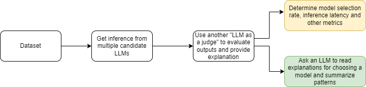

# Get inferences and model evaluations using an _LLM as a judge_

This examples demonstrates how to evaluate LLM responses with another LLM acting as a judge. Responses are generated from multiple LLMs and then another LLM is asked to evaluate the responses based on a rubric (conciseness, clarity, correctness) and pick a response that best matches this criteria, additionally we also ask the judge LLM to provide an explanation why a particular model's response was selected and why responses from other models were not selected.



In this solution we take a dataset of prompts and generate inferences using multiple LLMs (configurable) and then run these responses through an evaluation solution. An LLM is used to act as a judge that goes through each user question, context and model completions, and gives the model response that best matches/answers the question in terms of _conciseness, clarity, correctness_. As a final step, all the explanations provided by the LLM as a judge is run through another final layer of analysis through an LLM to get overall patterns and trends as to why a particular model was selected more times than the other models for the given dataset.

*All the parameters can be configured in the [config.yaml](config.yaml) file. The dataset used for this sample is synthetically generated, and the pre existing responses are standard definitions or human generated answers*.

## Prerequisites

### Set up the environment

1. Run this code on an AWS platform so as to not include internet latency in the inference latency for the response.

1. Setup a Python3.11 `conda` environment for running this code.

    ```{.bash}
    conda create --name llm_as_a_judge_eval_py311 -y python=3.11 ipykernel
    source activate llm_as_a_judge_eval_py311;
    pip install -r requirements.txt
    ```

## Bring your own dataset

This repo contains a sample dataset file [`data.csv`](./data/source_data/data.csv) that has synthetic data for questions about physics and chemistry concepts. The task for the model is to provide answers to these questions.

Follow the steps below to replace the same dataset provided with your own dataset.

 The dataset is provided by the user, which contains a _user question_, _system prompt_ (optional), and a _pre existing response_ (optional).

1. Configure your parameters in the `config.yaml` file.

    1. Set the `dataset_file_name` in `dir_info` section to the name of your file. We currently support `xlsx`/`xls`/`csv` formats. Place your file in the `data/source_data` folder.

        ```{.yaml}
        dataset_file_name: data.xlsx
        ```

    1. Your dataset should either contain the complete prompt with context as a _user prompt_ in the or it should contain the _user prompt_ and _system prompt_ separately.

        1. If your dataset only contains the user prompt then set the name of the column containing the user prompt in the `user_question_col` file in the `dataset_info` section. If your dataset also contains an output from another model that you want to compare against then set that column name via `pre_existing_response_col`. Set the `system_prompt_col` to empty.

            ```{.yaml}
            dataset_info:
              user_question_col: user_input
              system_prompt_col:
              pre_existing_response_col: model_1
            ```

        1. If your dataset has a user prompt and system prompt both then set the column names via `user_question_col` and `system_prompt_col`.

            ```{.yaml}
            dataset_info:
              user_question_col: user_input
              system_prompt: system_prompt
            ```

## Steps to run

1. Setup the Python 3.11 `conda` environment, activate it as described in the [Prerequisites](#prerequisites) section.

1. Open the `1_get_inference.ipynb` notebook, select the `llm_as_a_judge_eval_py311` kernel and do a `Run All` to run all the cells. This notebook runs inferences on models (specified in the config file) against your custom dataset. This creates the following files:
    1. `all_results.csv`: This file contains the results/responses from all the models that ran inferences, original question, target responses (if any) and their associated metrics.

1. Open the `2_run_llm_as_a_judge_eval.ipynb` notebook, select the `llm_as_a_judge_eval_py311` kernel and do a `Run All` to run all the cells. This notebook implements the evaluation solution using an LLM as a judge and a final analysis summarizer:
    1. The following output files are created in the `data` folder.
        1. `llm_as_a_judge_comparisons.csv`: This file contains the best_match_answer, selected_model and explanation in JSON format. It contains information on which model had an answer that best matched to the task that was provided, along with an explanation of why it was selected and why others weren’t.
        1. `llm_as_a_judge_comparisons.txt`: a text file to read all the comparison responses from the LLM as a judge.
        1. `inference_latency_summary.txt`: a text file that contains the `p50` and `p95` of the inference latency for each model.
        1. `llm_as_a_judge_pick_rate.csv`: Shows the LLM as a judge pick rate.
        1. `final_analysis.txt`: Shows the final analysis report generated by Claude 3 Sonnet based on all evaluations done by the LLM as a judge
        1. `all_explanations.csv`: All selected models and respective explanations generated by the LLM as a judge in a text file.

### Run the LLM as a judge solution via a single command

Run the following command which will run all the notebooks included in this repo in the correct order.

```{.bash}
python main.py
```

**_Here is an example final analysis that is generated on the evaluations done on the synthetic data ([`data.csv`](./data/source_data/data.csv)) by the LLM as a judge_**.

_Based on the context provided, the model anthropic.claude-3-haiku-20240307-v1:0 was selected more frequently than the other models. The key reasons for its selection appear to be its ability to provide clear, concise, and comprehensive explanations on various scientific concepts and phenomena_.

_This model's responses were often praised for their clarity, directly addressing the questions and covering the essential points without extraneous information. For instance, its explanation of the Heisenberg uncertainty principle was described as 'complete and accurate,' while its description of the difference between nuclear fission and fusion was deemed 'clear and concise.'_

_Furthermore, the anthropic.claude-3-haiku-20240307-v1:0 model was commended for its ability to provide comprehensive overviews and explanations, such as its coverage of the development of atomic models and the significance of the photoelectric effect in the context of quantum mechanics_.

_In contrast, the other models were often criticized for providing incomplete, inaccurate, or vague responses, lacking the clarity and comprehensiveness of the anthropic.claude-3-haiku-20240307-v1:0 model. For example, model_1's answer on catalysts was deemed incomplete, while anthropic.claude-3-sonnet-20240229-v1:0's explanation on classical and quantum mechanics lacked clarity_.

_Overall, the anthropic.claude-3-haiku-20240307-v1:0 model was consistently praised for its ability to provide clear, concise, and comprehensive explanations on various scientific topics, making it the preferred choice for this specific dataset_.

### LLM as a judge prompts

There is a prompt template directory in this sample with prompts for different purposes as follows. Change them as appropriate for your use case (for example to add additional evaluation criteria)

1. [`llama3_eval_prompt.txt`](./data/prompt_template/llama3_eval_prompt.txt): This is the LLM as a judge prompt for the `Llama3-70b Instruct` model. This is used to parse through all the model responses, user questions, and inference results to give the best selected model for each question and a corresponding explanation as to why it chose that model.

1. [`claude_eval_prompt.txt`](./data/prompt_template/claude_eval_prompt.txt): This is the LLM as a judge prompt for `Claude 3` in case you would like to use Claude 3 as a judge.

1. [`claude_final_summary_prompt.txt`](./data/prompt_template/claude_final_summary_prompt.txt): This is the prompt template used by `Claude 3` to generate a final analysis summary of the evaluations and explanations from LLM as a judge.

1. Change the LLM as a judge/final summarizer models and their respective prompt templates in the `config.yaml` file under the `llm_as_a_judge_info` and `final_analysis_summarizer` sections.

## License

This library is licensed under the MIT-0 License. See the [LICENSE](./LICENSE) file.
