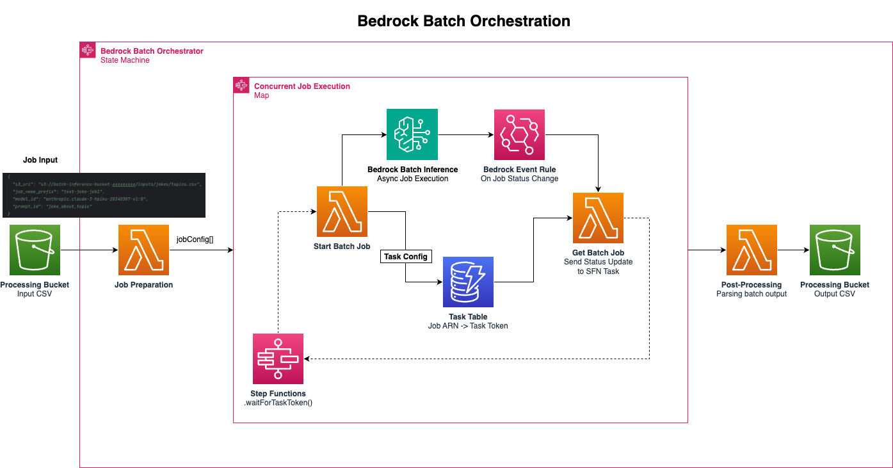
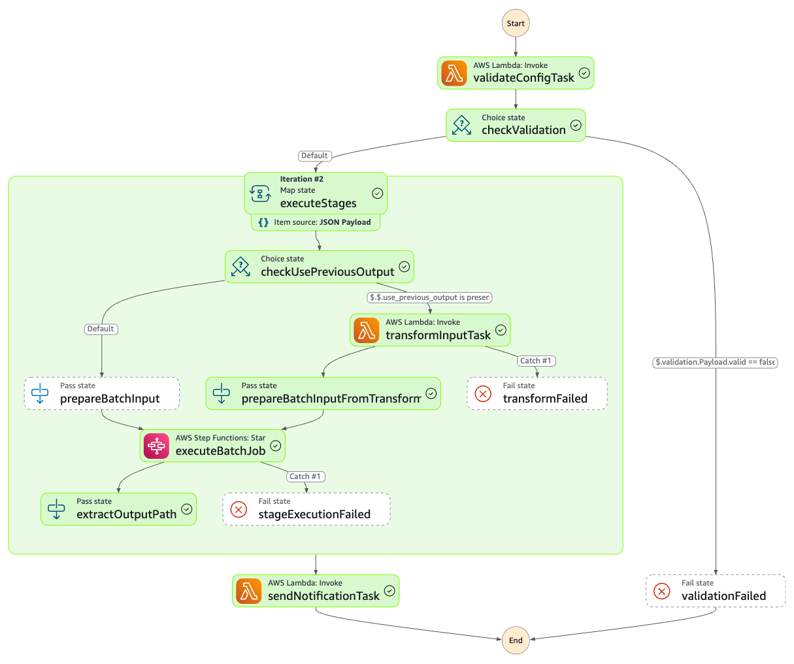

# Bedrock Batch Job Orchestration with Multi-Stage Pipelines

A flexible, scalable framework for orchestration of [**Bedrock Batch Inference**](https://docs.aws.amazon.com/bedrock/latest/userguide/batch-inference.html) via AWS Step Functions, with support for multi-stage pipelines that chain batch inference jobs together.

## Acknowledgments

This project builds upon the foundational work from:
- [Build a serverless Amazon Bedrock batch job orchestration workflow using AWS Step Functions](https://aws.amazon.com/blogs/machine-learning/build-a-serverless-amazon-bedrock-batch-job-orchestration-workflow-using-aws-step-functions/) - AWS Machine Learning Blog
- [Amazon Bedrock Batch Orchestrator Sample](https://github.com/aws-samples/amazon-bedrock-samples/tree/main/poc-to-prod/bedrock-batch-orchestrator) - Original implementation

The sample clothing dataset used in examples is from:
- [Clothing Dataset](https://github.com/alexeygrigorev/clothing-dataset) - Open source clothing images dataset by Alexey Grigorev

## Overview

For very large-scale (>>1,000 records), time-insensitive foundation model-based processing (including LLMs and embedding models), [**Bedrock Batch Inference**](https://docs.aws.amazon.com/bedrock/latest/userguide/batch-inference.html) is a cost-effective alternative to on-demand Bedrock endpoints. It allows you to submit large batches of prompts/input records into asynchronous model invocation jobs, which process requests at a 50% discount compared to on-demand. Jobs are queued first-come-first-serve, and while there is no guaranteed SLA, they typically complete within hours depending on batch size and model demand.

### Key Features

- **Single-Stage Batch Processing**: Process large datasets with automatic chunking, concurrent job management, and result aggregation
- **Multi-Stage Pipelines**: Chain multiple batch inference stages together, where each stage can use the output of previous stages
- **Flexible Prompt Modes**: Support for single prompts, mapped prompts (different prompt per record), and expansion rules (multiple prompts per record)
- **Multimodal Support**: Process text, images, or combinations of both
- **Structured Output Extraction**: Automatically extract structured fields from JSON responses using output schemas
- **Event-Driven Orchestration**: Efficient job management using Step Functions and EventBridge
- **Automated Email Notifications**: Optional email alerts with S3 presigned URL links for easy result downloads when pipelines complete
- **Cost Optimization**: 50% discount vs on-demand, with intelligent batching and concurrency control

### Architecture

**Single-Stage Processing:**



- Pre-processing Lambda prepares JSONL inputs for Bedrock
- Step Functions orchestrates concurrent batch jobs with capacity management
- Post-processing Lambda parses outputs and joins with original data

**Multi-Stage Pipelines:**

- Transform Lambda chains stages by reading previous outputs and preparing next inputs
- Supports category-based prompt routing (e.g., different prompts per product category)
- Preserves data across stages for final aggregation

## Quickstart

### Prerequisites

- `node` & `npm`
- AWS CDK (`npm install -g aws-cdk`)
- AWS CLI configured with appropriate credentials

### Installation

1. Clone this repository:
```bash
git clone https://github.com/aws-samples/amazon-bedrock-samples.git
cd amazon-bedrock-samples/poc-to-prod/bedrock-batch-orchestrator
```

2. Install dependencies:
```bash
npm install
```

3. (Optional) Configure settings in `cdk.json`:
```json
{
  "context": {
    "maxSubmittedAndInProgressJobs": 5,
    "bedrockBatchInferenceTimeoutHours": 24,
    "notificationEmails": ["your-email@example.com"]  // Optional: for pipeline completion emails
  }
}
```

**Note:** Email notifications are optional. If you don't configure `notificationEmails`, pipelines will still run successfully but won't send completion notifications. The `presigned_url_expiry_days` in pipeline configs controls how long download links remain valid in notification emails.

4. Deploy the stack:
```bash
npm run cdk deploy
```

Note the outputs:
```
Outputs:
BedrockBatchOrchestratorStack.bucketName = batch-inference-bucket-<YOUR_ACCOUNT_ID>
BedrockBatchOrchestratorStack.stepFunctionName = bedrockBatchOrchestratorSfn...
BedrockBatchOrchestratorStack.pipelineStepFunctionName = bedrock-pipeline-orchestrator-<YOUR_ACCOUNT_ID>
```

## Usage

### Single-Stage Batch Processing

#### Example 1: Text Generation

1. Create a prompt template in [`lambda/prompt_templates.py`](lambda/prompt_templates.py):
```python
prompt_id_to_template = {
    'joke_about_topic': 'Tell me a joke about {topic} in less than 50 words.'
}
```

2. Upload your input data:
```bash
aws s3 cp topics.csv s3://batch-inference-bucket-<YOUR_ACCOUNT_ID>/inputs/jokes/
```

3. Execute the batch orchestrator step function with:
```json
{
  "s3_uri": "s3://batch-inference-bucket-<YOUR_ACCOUNT_ID>/inputs/jokes/topics.csv",
  "job_name_prefix": "joke-generation",
  "model_id": "anthropic.claude-3-haiku-20240307-v1:0",
  "prompt_id": "joke_about_topic"
}
```

#### Example 2: Image Analysis

1. Create a prompt template for image analysis:
```python
prompt_id_to_template = {
    'describe_image': 'Describe what you see in this image in detail.'
}
```

2. Upload your images:
```bash
aws s3 cp ./images/ s3://batch-inference-bucket-<YOUR_ACCOUNT_ID>/inputs/images/ --recursive
```

3. Execute with image input:
```json
{
  "s3_uri": "s3://batch-inference-bucket-<YOUR_ACCOUNT_ID>/inputs/images/",
  "job_name_prefix": "image-description",
  "model_id": "anthropic.claude-3-haiku-20240307-v1:0",
  "prompt_id": "describe_image",
  "input_type": "image"
}
```

Note: Input directory should contain images (JPEG, PNG, GIF, WEBP) or a CSV with an `image_path` column.

#### Example 3: Embeddings

```json
{
  "s3_uri": "s3://batch-inference-bucket-<YOUR_ACCOUNT_ID>/inputs/embeddings/texts.csv",
  "job_name_prefix": "text-embeddings",
  "model_id": "amazon.titan-embed-text-v2:0"
}
```

Note: Input CSV must have an `input_text` column.

#### Example 4: Hugging Face Dataset

```json
{
  "dataset_id": "w601sxs/simpleCoT",
  "split": "train",
  "job_name_prefix": "cot-analysis",
  "model_id": "us.anthropic.claude-3-5-haiku-20241022-v1:0",
  "prompt_id": "question_answering",
  "max_num_jobs": 1
}
```

### Multi-Stage Pipelines

For complex workflows that require multiple processing stages, use the pipeline orchestrator. See the [Clothing Analysis Pipeline Example](#clothing-analysis-pipeline-example) below.


#### Pipeline Configuration Structure

```json
{
  "pipeline_name": "my-pipeline",
  "presigned_url_expiry_days": 7,
  "stages": [
    {
      "stage_name": "stage1",
      "model_id": "anthropic.claude-3-haiku-20240307-v1:0",
      "input_s3_uri": "s3://bucket/inputs/",
      "input_type": "image",
      "job_name_prefix": "stage1-job",
      "prompt_config": {
        "mode": "single",
        "prompt_id": "my_prompt"
      },
      "max_num_jobs": 1,
      "max_records_per_job": 100
    },
    {
      "stage_name": "stage2",
      "model_id": "anthropic.claude-3-5-sonnet-20241022-v2:0",
      "use_previous_output": true,
      "input_type": "image",
      "job_name_prefix": "stage2-job",
      "prompt_config": {
        "mode": "mapped",
        "column_name": "prompt_column"
      },
      "category_to_prompt_mapping": {
        "category1": "prompt_id_1",
        "category2": "prompt_id_2"
      },
      "max_num_jobs": 1,
      "max_records_per_job": 100
    }
  ]
}
```

#### Prompt Modes

**Single Mode**: Same prompt for all records
```json
{
  "prompt_config": {
    "mode": "single",
    "prompt_id": "my_prompt"
  }
}
```

**Mapped Mode**: Different prompt per record based on column value
```json
{
  "prompt_config": {
    "mode": "mapped",
    "column_name": "category"
  },
  "category_to_prompt_mapping": {
    "type_a": "prompt_for_type_a",
    "type_b": "prompt_for_type_b"
  }
}
```

**Expanded Mode**: Multiple prompts per record (creates multiple outputs)
```json
{
  "prompt_config": {
    "mode": "expanded",
    "category_column": "type",
    "expansion_mapping": {
      "product": "multi_aspect_analysis"
    }
  }
}
```

Where `multi_aspect_analysis` is defined as:
```python
'multi_aspect_analysis': {
    'expansion_rule': True,
    'prompts': ['extract_color', 'extract_size', 'extract_brand']
}
```

## Clothing Analysis Pipeline Example

A complete 3-stage pipeline for analyzing clothing images and generating product listings.

### Pipeline Stages

1. **Stage 1: Category Classification**
   - Classifies images into categories (shorts, shoes, pants, dress, t-shirt)
   - Model: Claude 3 Haiku
   - Output: Category and confidence score

2. **Stage 2: Metadata Extraction**
   - Extracts category-specific metadata (color, material, style, etc.)
   - Model: Claude 3.5 Sonnet
   - Uses mapped mode with category-specific prompts
   - Output: Structured metadata fields

3. **Stage 3: Product Listing Generation**
   - Generates product titles and descriptions
   - Model: Claude 3 Haiku
   - Input: Category + metadata (text only, no images)
   - Output: Title, description, keywords

### Setup

1. Upload clothing images:
```bash
aws s3 cp ./clothing-images/ s3://batch-inference-bucket-<YOUR_ACCOUNT_ID>/inputs/clothing-images/ --recursive
```

2. Update pipeline configurations in `pipeline-configs/*.json` with your AWS account ID (replace `YOUR_ACCOUNT_ID` placeholders with your actual account ID from the CDK deployment outputs)

3. Execute the pipeline:
```bash
aws stepfunctions start-execution \
  --state-machine-arn arn:aws:states:REGION:ACCOUNT:stateMachine:bedrock-pipeline-orchestrator-ACCOUNT \
  --input file://pipeline-configs/clothing-analysis-full.json \
  --name clothing-analysis-$(date +%s)
```

### Expected Output

Final parquet file will contain:
- Original image metadata (`record_id`, `image_path`, `file_name`)
- Stage 1: `category`, `confidence`
- Stage 2: `color`, `material`, `style`, `pattern`, `fit`, etc.
- Stage 3: `title`, `description`, `keywords`

Example:
| category | color | material | style | title | description |
|----------|-------|----------|-------|-------|-------------|
| pants | blue | denim | casual | Slim Fit Blue Denim Jeans | Classic slim fit jeans in durable blue denim... |
| t-shirt | white | cotton | casual | Classic White Cotton T-Shirt | Comfortable regular fit cotton tee... |

## Output Schema Extraction

Automatically extract structured fields from JSON responses:

```python
'my_prompt': {
    'template': '''Analyze this image and return JSON:
{{
    "color": "primary color",
    "style": "casual|formal|athletic"
}}''',
    'output_schema': {
        'type': 'json',
        'fields': {
            'color': '$.color',
            'style': '$.style'
        }
    }
}
```

The postprocess Lambda will automatically extract these fields into separate columns.

## Monitoring

Monitor execution in AWS Console:
1. Navigate to Step Functions
2. Find your state machine execution
3. View execution graph and logs
4. Check CloudWatch Logs for detailed Lambda output

## Configuration Reference

### CDK Context Variables (`cdk.json`)

- `maxSubmittedAndInProgressJobs`: Maximum concurrent batch jobs (default: 5)
- `bedrockBatchInferenceTimeoutHours`: Job timeout in hours (default: 24)
- `notificationEmails`: Array of emails for pipeline completion notifications

### Supported Models

Currently supported:
- Anthropic Claude family (all versions)
- Amazon Titan Embed Text v2

To add support for other models, extend the `BaseProcessor` class in [`lambda/processor.py`](lambda/processor.py) and implement `process_input` and `process_output` methods.


## File Formats

### Why JSONL and Parquet?

**JSONL (JSON Lines)**
- Required by Bedrock Batch Inference API
- One JSON object per line for streaming processing
- Human-readable for debugging
- Used for: Bedrock input/output

**Parquet**
- Columnar storage format optimized for analytics
- 5-10x smaller than JSON with compression
- Fast column-based operations (filtering, joining)
- Schema enforcement and type safety
- Used for: Internal processing, stage-to-stage data passing, final results

The framework automatically converts between formats as needed.

## Troubleshooting

### Pipeline Validation Fails
- Verify all `prompt_id` values exist in `lambda/prompt_templates.py`
- Check that category mapping keys match exactly (case-sensitive)
- Ensure all required fields are present in configuration

### Images Not Processing
- Supported formats: JPEG, PNG, GIF, WEBP
- Size limits: < 3.75 MB, dimensions < 8000px
- Verify S3 bucket permissions

### Stage Chaining Issues
- Confirm `use_previous_output: true` for dependent stages
- Check Transform Lambda logs for category mapping issues
- Verify previous stage completed successfully

### Empty JSONL Files
- For mapped mode: Ensure the prompt column exists and has valid values
- For image mode: Verify `image_path` column exists in input data
- Check preprocess Lambda logs for skipped records

## Cost Optimization

1. **Use appropriate models**: Haiku for simple tasks, Sonnet for complex analysis
2. **Batch size**: Larger batches (up to 50K records) are more efficient
3. **Test first**: Use `max_num_jobs: 1` to validate before full runs
4. **Stage ordering**: Put cheaper models (classification) before expensive ones (detailed analysis)
5. **Text vs Image**: Stage 3 uses text-only to avoid re-encoding images

## Contributing

Contributions are welcome! Please see [CONTRIBUTING.md](CONTRIBUTING.md) for guidelines.

## License

This library is licensed under the MIT-0 License. See the LICENSE file.

## Security

See [CONTRIBUTING](CONTRIBUTING.md#security-issue-notifications) for more information.

