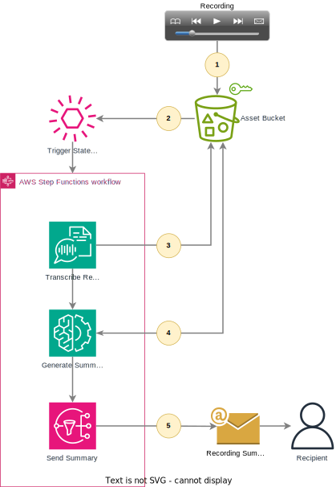

# Recordings Summary Generator

## Summary

This solution will automatically transcribe a recording that you upload and then create a summary of the recording and then send it to you. The solution uses Amazon Transcribe for the transcription and Amazon Bedrock for the generative summary creation.

## Architecture

The solution is orchestrated using a Step Functions state machine that is triggered when you upload a recording to the S3 bucket:

1. Store recording in asset bucket
2. Trigger state machine
3. Transcribe recording and store transcription in asset bucket
4. Retrieve transcription and generate summary
5. Send summary to recipient

The state machine orchestrates the steps to perform the specific tasks. The detailed process is:

## Deployment

### Prerequisites

**Important!** In order to use Bedrock models, you must first enable model access as a one-time action. For this solution, you’ll need to enable access to the **Anthropic Claude** (*not* Claude Instant) model. You can enable access following the guidance [here](https://docs.aws.amazon.com/bedrock/latest/userguide/model-access.html).

### Supported Regions

This solution is supported in regions where the Bedrock Anthropic Claude model is available.

The solution is deployed using a CloudFormation template to automatically deploy the necessary resources in your AWS account. The template requires the following parameter values:

|Parameter|Purpose|
|---|---|
|Email Address Used to Send Summary |The summary will be sent to this address. ***You must acknowledge the initial SNS confirmation email before receiving additional notifications.*** |
|Summary Instructions               |These are the instructions given to the Bedrock model to generate the summary.|

## Running the Solution

After you deploy the solution using CloudFormation, follow these steps:
1. Be sure to acknowledge the SNS email confirmation that you should receive a few moments after creating the CloudFormation stack.
2. On the CloudFormation console for the stack you just created, navigate to the Outputs tab and look for the value associated with **AssetBucketName**; it will look something like `summary-generator-assetbucket-xxxxxxxxxxxxx`.
3. Navigate to the S3 console and locate the bucket from step #2. This is where you'll upload your recordings. Valid file formats are **MP3**, **MP4**, **WAV**, **FLAC**, **AMR**, **OGG**, and **WebM**.
4. Upload your recording to the `recordings` folder. Uploading recordings will automatically trigger the Step Functions state machine. There's a sample team meeting recording in the `sample-recording` directory of the repository.
5. Navigate to the Step Functions console and select the `summary-generator` state machine.
6. Click on the name of the `Running` execution. Here, you can watch the progress of the state machine as it processes the recording.
7. After it reaches its `Success` state, you should receive an emailed summary of the recording.
   - Alternatively, navigate to the S3 assets bucket and view the transcript there in the `transcripts` folder.

### Viewing the Summary

You will get the recording summary emailed to the address you provided when you created the CloudFormation stack. If you don't receive the email in a few moments, make sure that you acknowledged the SNS confirmation email that you should have received after you created the stack and then upload the recording again, which will trigger the summary process.

#### Using the Sample Recording

This solution includes a [mock team meeting recording](sample-recording/sample-team-meeting-recording.mp4) that you can use to test the solution. The summary will look similar to the folowing. Because of the nature of generative AI, however, your output will look a bit different, but the content should be close:

> Here are the key points and next steps from the standup:
>
> * Joe finished reviewing the current state for task EDU1 and created a new task to develop the future state. That new task is in the backlog to be prioritized. He's now starting EDU2 but is blocked on resource selection.
>
>* Rob created a tagging strategy for SLG1 based on best practices, but may need to coordinate with other teams who have created their own strategies, to align on a uniform approach. A new task was created to coordinate tagging strategies.
>
>* Rob has made progress debugging for SLG2 but may need additional help. This task will be moved to Sprint 2 to allow time to get extra resources.
>
>Next Steps:
>
>* Joe to continue working on EDU2 as able until resource selection is decided
>* New task to be prioritized to coordinate tagging strategies across teams
>* SLG2 moved to Sprint 2
>* Standups moving to Mondays starting next week

## Next Steps

* Instead of using SNS to notify recipients, you can use it to send the output to a different endpoint, such as a team collaboration site, or to the team’s chat channel.
* Try changing the summary instructions provided to Bedrock to produce outputs specific to your needs.
    * For example, if you were using this to summarize a company’s earnings call, could you have the model focus on potential promising opportunities, areas of concern, and things that you should continue to monitor?
    * If you are using this to summarize a course lecture, could you have the model identify upcoming assignments, summarize key concepts, list facts, and filter out any small talk from the recording?
    * For longer recordings, can you generate summaries for different levels of interest and time commitment? For example, single sentence, single paragraph, single page, or in-depth summaries?
    * For the same recording, could you create different summaries for different audiences? For example:
        * Engineers summaries focus on design decisions, technical challenges, and upcoming deliverables
        * Project managers’ summaries focus on timelines, costs, deliverables, and action items
        * Project sponsors get a brief update on project status and escalations
* For situations where transcripts are available, create an alternate Step Functions flow to ingest existing text-based or PDF-based transcriptions

## Cleanup

To clean up the solution, delete the CloudFormation stack that you created earlier. Deleting the stack will *not* delete the asset bucket. If you no longer need the recordings or transcripts, you can delete this bucket separately. Amazon Transcribe will automatically delete transcription jobs after 90 days, but you can delete these manually before then.

## Authors and acknowledgment

This solution was created by Rob Barnes.

Special thanks to Anna Banwell and Joe Langreo for recording the mock team meeting and to Sergiy Shevchenko for being my testing guinea pig.
