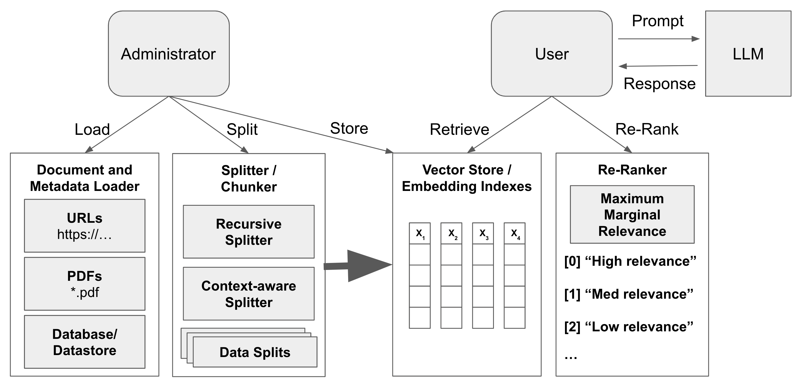

# Amazon Bedrock Retrieval-Augmented Generation (RAG) Workshop

The goal of this workshop is to give you hands-on experience leveraging foundation models (FMs) and retrieval-augmented generation (RAG) with Amazon Bedrock. Amazon Bedrock is a fully managed service that provides access to FMs from third-party providers and Amazon; available via an API. With Bedrock, you can choose from a variety of models to find the one that’s best suited for your use case.

Within this series of labs, you will be taken through some of the most common RAG usage patterns we are seeing with our customers for Generative AI. We will explore RAG techniques for generating text, creating value for organizations by improving productivity. This is achieved by leveraging foundation models to help in retrieving and searching documents. You will gain hands-on experience using Bedrock APIs, SDKs, and open-source software for example LangChain and FAISS to implement these usage patterns.

This workshop is intended for developers and solution builders.

# Workshop Overview

There are two primary types of knowledge for LLMs:
* **Parametric knowledge**: refers to everything the LLM learned during training and acts as a frozen snapshot of the world for the LLM.
* **Source (external) knowledge**: covers any information fed into the LLM via the input prompt.

Fine-tuning, explored in other workshops, improves the LLM's parametric knowledge through fine-tuning. Since fine-tuning is a resouce intensive operation, this option is well suited for infusing static domain-specific information like domain-specific langauage/writing styles (medical domain, science domain, ...) or optimizing performance towards a very specific task (classification, sentiment analysis, RLHF, instruction-finetuning, ...). 

Retrieval-augmented generation (RAG) uses source (external) knowledge dynamically from domain-specific data stores to ingest up-to-date and relevnt information into the LLM through the prompt. This is often called prompt augmentation. RAG is particularily well suited for dynamic data which is updated relatively-frequently. 

This workshop is focused on retrieval-augmented generation (RAG) to ingest domain-specific information through the source knowledge and augment the prompt which is passed to the LLM. 

# Abstractions

The key abstractions used in this workshop are as follows:

* **LLM (Large Language Model)**: Anthropic Claude V2 available through Amazon Bedrock

  This model will be used to understand the document chunks and provide an answer in human friendly manner.

* **Embeddings Model**: Amazon Titan Embeddings available through Amazon Bedrock

  This model will be used to generate a numerical representation of the textual documents

* **Document Loader**: 
    - PDF Loader available through LangChain for PDFs
    - TextLoader available through LangChain for txts

  These are loaders that can load the documents from a source, for the sake of this notebook we are loading the sample files from a local path. This could easily be replaced with a loader to load documents from enterprise internal systems.

* **Vector Store**: FAISS, LlamaIndex, ChromaDB - available through LangChain

  Most labs use an in-memory vector-store to store both the docuemnts and their embeddings. In an enterprise context this could be replaced with a persistent store such as AWS OpenSearch, RDS Postgres with pgVector, ChromaDB, Pinecone or Weaviate.

* **Chunking**: Splits of data

  The original data is split into smaller chunks of text for more fine-grained relevancy searching. The chunk size is something that needs to be determined based on your dataset and use case.

* **Index**: VectorIndex

  The index helps to compare the input embedding and the document embeddings to find relevant document.

* **Wrapper**: wraps index, vector store, embeddings model and the LLM to abstract away the logic from the user.

* **Retrieval and Search**: Retrieval Question-Answer (QA), Semantic Similarity Search

* **Orchestrator**: LangChain, LlamaIndex
 The orchestrator coordinates all parts of the RAG workflow.

# Labs
Each lab handles its own data ingestion (PDFs, text, etc), vector storage (FAISS, LlamaIndex, ChromaDB, etc), and RAG orchestration (LangChain, LlamaIndex). As such, each lab can be run independently - and does not depend on a previous lab.

Below is a high-level overview of the labs in this workshop which follow the RAG workflow as shown in the figure below:

## [Introduction](01_Intro/) [5 mins]
Introduction to the lab environment which includes prerequisites.

## [Semantic Similarity Search](02_Semantic_Search/) [30 mins]
Semantic search uses vector embedding representations of documents to perform searches in higher-dimensional vector spaces. Semantic Similarity Search often out performs basic keyword search which simply compares the number of keywords and phrases shared between documents.

## [Semantic Similarity Search with Metadata Filtering](03_Semantic_Search_with_Metadata_Filtering/) [30 mins]
When ingesting data into your system, you can add optional metadata such as "year" or "department".  This metadata can be used to filter your queries when retrieving documents through Semantic Similarity Search, for example. This reduces the data used to augment the prompt - and ultimately helps to improve the relevancy of the results from the LLM.

## [Semantic Similarity Search with Document Summaries](04_Semantic_Search_with_Document_Summaries/) [30 mins]
When ingesting your documents, you can build an index of document summaries along with the document. These summaries can be used by the Semantic Similarity Search algorithm (e.g. K-Nearest Neighbor) to improve retrieval results and reduce retrieval latency.

## [Semantic Similarity Search with Re-Ranking](05_Semantic_Search_with_Reranking/) [30 mins]
You can improve result relevancy by adding an extra re-rank step in the retrieval process. The re-ranking often includes a diversification factor to introduce a bit of diversity in the results. This allows for some results to rank higher - even if they're not scored highest by the Semantic Similarity Search algorithm.
