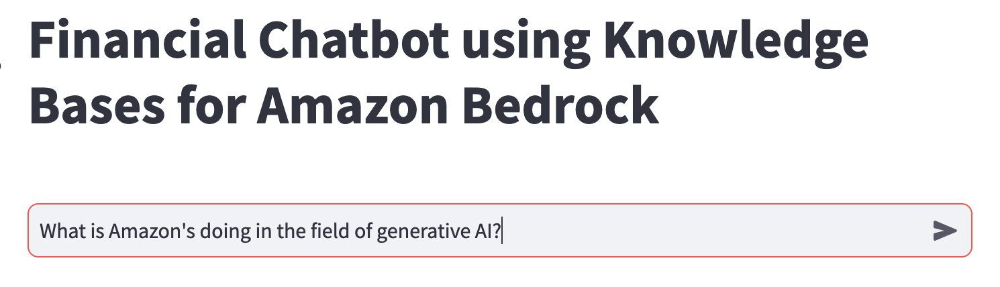

# Build Contextual Chatbots using Amazon Bedrock Knowledge Bases

Modern chatbots as digital agents provide a new avenue for delivering 24/7 customer service and support across many industries. Their popularity stems from the ability to respond to customer inquiries in real-time and handle multiple queries simultaneously in different languages. Chatbots also offer valuable data-driven insights into customer behavior while scaling effortlessly as the user base grows hence they present a cost-effective solution for engaging customers.

This sample illustrates contextually enhancing a chatbot by leveraging [Knowledge Bases for Amazon Bedrock](https://docs.aws.amazon.com/bedrock/latest/userguide/knowledge-base.html), a fully managed serverless solution. The Knowledge Bases for Bedrock integration will allow our chatbot to provide more relevant, personalized responses by linking user queries to related information data points. Internally, Bedrock uses vector database embeddings to augment user query context at runtime and enable managed [Retrieval Augmented Generation](https://docs.aws.amazon.com/sagemaker/latest/dg/jumpstart-foundation-models-customize-rag.html) (RAG) solution. We will utilize the [Amazon letters to share holders](https://ir.aboutamazon.com/annual-reports-proxies-and-shareholder-letters/default.aspx) dataset to develop this solution.

## Knowledge Augmented Chatbots

Chatbots utilize the advanced natural language capabilities of large language models (LLMs) to respond to customer questions expressed in everyday speech. While chatbots can answer questions using available data sources, by integrating relevant market and product information enables them to become trusted advisors that provide tailored, personalized recommendations across diverse use cases. By linking chatbots to internal knowledge base and recommendation systems, they can contextualize responses to individual user needs. Thus, chatbots programmed to comprehend natural language can engage customers in human-like dialogue to deliver business value. Their ability to access information, understand context, and provide customized replies in conversational interactions makes these AI agents versatile assets for enhancing customer engagement.

Contextual Chatbots rely on integrations with internal information set and recommendation systems to provide more personalized user responses. Often a popular architecture pattern RAG is used and there are two workflows involve in this architecture - data pre-processing through ingestion and text generation using enhanced context. Data ingestion workflow builds on the capacity of LLMs to create a rich, internal representation of the semantic meaning of a text condensed into so called embedding vectors. Embedding vectors can be created on both the documents we want to use for answering the question, as well as the question asked by the user. To store, we split them up into chunks and use the document embedding vectors we compute on them as indices in a vector store. To answer a given question, the text generation workflow then use the question embedding vector to retrieve the document chunks most closely related based on vector similarity, and use the clear text in these chunks to augment the prompts and generate the answer using LLM model. 

The following diagrams illustrates the high-level RAG architecture.

</br></br>

## Knowledge Bases for Amazon Bedrock

Knowledge Bases for Amazon Bedrock is a serverless option to build sophisticated RAG systems. It provides fully managed data ingestion and text generation workflow options. For data ingestion workflow, it takes care of creating, storing, managing, and updating text embeddings of your document data in the vector database. It splits the documents into manageable chunks for efficient retrieval. The chunks are then converted to embeddings and written to a vector index, while maintaining a mapping to the original document. For text generation workflow, [Amazon Bedrock](https://aws.amazon.com/bedrock/) provides [RetrieveAndGenerate](https://docs.aws.amazon.com/bedrock/latest/APIReference/API_agent-runtime_RetrieveAndGenerate.html) APIs to create embeddings of your user query, and retrieves relevant chunks from vector database to generate accurate response. It also supports source attribution and short-term memory needed for RAG applications. This allows AWS customers to spend their time on their core business applications and remove all the undifferentiated heavy lifting.

## Architecture

The solution presented in this blogpost uses a chatbot created using Streamlit application and includes following AWS services -

* [Amazon S3](https://aws.amazon.com/s3/) as source
* Knowledge Bases for Amazon Bedrock for data ingestion
* [Amazon OpenSearch Serverless](https://aws.amazon.com/opensearch-service/features/serverless/) Vector Store to save text embeddings
* [AWS Lambda](https://aws.amazon.com/lambda/) as API function to invoke Knowledge Bases API


The following diagram is a common solution architecture pattern you can use to integrate any chatbot application to Knowledge Bases for Amazon Bedrock.

At a high level, the solution architecture includes the following steps:
* A User interacts with **Streamlit chatbot interface** and submits a query in natural language
* This triggers a AWS lambda function, which invokes Knowledge Bases **RetrieveAndGenerate** API. Internally, Knowledge Bases uses Amazon Titan embedding model and converts the user query to a vector and find chunks that are semantically similar to the user query. The user prompt is than augmented with the chunks that are retrieved from the knowledge base. The prompt alongside the additional context is then sent to a LLM for response generation. In this solution, we will Anthropic Claude Instant as LLM to generate user response using additional context. **Note:** This solution is supported in Regions where Anthropic Claude on Amazon Bedrock is available.
* A contextually relevant response is sent back to chatbot application and user.


</br></br>


## Prerequisites
1. Python
2. AWS CLI
3. Access to the Titan Embeddings G1 - Text
4. Access to Claude Instant - v1.2 


## Solution Implementation

Open a terminal window, ```git clone``` this repository. Once you git repo cloned, follow these steps -

### Upload knowledge dataset to S3

1. Navigate to [Amazon Annual reports, proxies and shareholder letters data repository](https://ir.aboutamazon.com/annual-reports-proxies-and-shareholder-letters/default.aspx) and download last few years of **Amazon Shareholder letters** on your local machine.


</br></br>


2. Navigate to [S3 Service](https://s3.console.aws.amazon.com/s3/home) home page in AWS console.

3. Click **Create bucket** to create a new S3 bucket. Name it **knowledgebase-<your-account-number>**. Leave all other bucket settings as default values and click **Create**.

4. Navigate into **knowledgebase-<your-account-number>** bucket. Click **Create folder** and name it **dataset**. Leave all other folder settings as default values and click Create.

5. Navigate into **dataset** folder. Drag and drop data files you have downloaded earlier into this bucket and click **Upload**. 

6. Navigate back to bucket home and click **Create folder** to create a new folder and name it **lambdalayer**. Leave all other settings as default values. 

</br></br>

7. Navigate into **lambdalayer** folder. Drag and drop **knowledgebase-lambdalayer.zip** from the Github repo we cloned earlier and click **Upload**. We will use this lambda layer code later to create the Lambda function.


</br></br>

### Create a Knowledge Base

In this step we will create Knowledge Base using Amazon Shareholder letters dataset we uploaded to our S3 bucket in the previous step.

1. To get started, Navigate to [Bedrock Service](https://console.aws.amazon.com/bedrock/home) home page, and from the left navigation pane, expand **Orchestration** and select **Knowledge base**.

</br></br>

2. In the **Knowledge base** section, click **Create knowledge base**.

</br></br>

3. On the **Provide knowledge base details** page - 

    * Leave default options for **Knowledge base name**, **IAM Permissions**, and **Tags**. Optionally enter Knowledge base description
    * Click **Next**.

</br></br>

4. On the **Set up data source** page - 

    * Leave default **Data source** name.
    * For **S3 URI**, click **Browse S3** to select S3 bucket **knowledgebase-<your-account-number>/dataset/**. You need to point to the bucket and dataset folder we created in previous step.
    * For **Advance settings**, leave them as default values, and click **Next**. (Note, if you want, you can change the default **Chunking strategy** and specify the chunk size and overlay in percentage.)

</br></br>

5. On the **Configure vector store** page -

    * For **Embedding model**, currently, we support **Titan Embedding G1 - Text** model by default.
    * For Vector database section, you can either choose the **Quick create a new vector store - Recommended** option or **Choose a vector store you have created** option. Note, to use vector store of your choice, you need have a vector store pre-configured to use. We currently support 3 vector engine types - **Vector engine for Amazon OpenSearch Serverless**, **Pinecone**, and **Redis Enterprise Cloud** options. 
    * Select **Quick create a new vector store - Recommended** which by default create a new Amazon OpenSearch Serverless vector store in your account.
    * Click **Next**.

</br></br>

6. On the **Review and create** page, review all the information, and click **Previous** to modify any options. Once done reviewing, click **Create Knowledge Base**. 

</br></br>

7. Note that the knowledge base creation process begins and the **Status** of it is **In progress**. It will take a few minutes to create the vector store and knowledge base. 

8. Once the knowledge base status is in **Ready** state, note down the **Knowledge base ID**. We will use it in next few steps to configure the Lambda function. 

</br></br>

9. Now that Knowledge Base is ready, we need to sync out Amazon Shareholders letter data to it. Under the **Data Source** section, click **Sync** to trigger the data ingestion process from S3 bucket into Knowledge base. 

</br></br>

10. This sync process will split the documents files into smaller chunks of chunk size specified earlier, generating vector embeddings using the selected text embedding model, and stores them in the vector store managed by Knowledge Bases.

</br></br>

11. Once dataset sync is complete, status of the data source will change to **Ready** state. **Note**, if you would add any additional documents into the S3 data folder, you will need to re-sync the knowledge base. 

</br></br>

12. **Congratulations**, your Knowledge base is ready. 


**Note** you can also create the Knowledge Base using  **Bedrock Service APIs** and **AWS CLI**. For example to create the Knowledge Base we created earlier, you can use the notebook available in **/notebook** folder by running various section.

### Create AWS Lambda function

This lambda function is deployed using a Cloudformation template. The template requires two parameters - the S3 bucket name, and Knowledgebase ID. 

1. Navigate to [Cloud formation](https://console.aws.amazon.com/cloudformation/home) service home page. 

2. Click on **Create stack** to create a new stack.

</br></br>

3. Select **Template is ready** option under **Prerequisite - Prepare template** section. 

4. Select **Upload the template file** option under **Specify template** section. Click on **Choose file** and navigate to Github directory we cloned earlier and select .yaml file under **/cfn** folder. Click **Next**.

</br></br>

5. Provide **Stack name**, and KnowledgeBaseID and S3 bucket name we noted down earlier. Click **Next**.

</br></br>

6. Leave all default option as is, and click **Next**, and **Submit**.

7. Verify that it cloudformation template runs successfully, and there are no errors.

8. **Congratulations**, you created Lambda function, related roles, and execution policies successfully.


### Test Contextual Chatbot Application

1. Open a new **Terminal** or a **Command Line** window on your machine.

2. Run following command to install boto3 - the Amazon Web Services (AWS) Software Development Kit (SDK) for Python. Boto3 makes it easy to integrate Python application, library, or script with AWS services.

```pip install boto3```

3. Run following command to install and setup local python development environment to run Streamlit application.

```pip install streamlit```

4. Navigate to **/streamlit** folder into Github repository folder we cloned earlier.

5. Run following command to instantiate the chatbot application.

```python -m streamlit run chatbot.py```

6. This should open a web based chat application powered by Streamlit in your default web browser.

</br></br>

7. Use this Streamlit chatbot application to post natural language questions to start the conversations powered by Bedrock Knowledge base. 

</br></br>

8. Upon user prompt submission, Streamlit app triggers the Lambda function which is invokes the Knowledge Bases for Bedrock ```RetrieveAndGenerate``` API to search and generate responses.

9. Following table includes some sample question and related Knowledge Base responses. Try out some of these questions by sending in these prompts. 

| Questions | Answers |
| --------- | ------- |
| What is Amazon's doing in the field of generative AI? |	Amazon has been working on their own large language models (LLMs) for generative AI and believes it will transform and improve every customer experience. They plan to continue investing substantially in these models across all their consumer, seller, brand, and creator experiences. |
| What is AWS year-over-year revenue in 2022? | AWS revenue grew 29% year-over-year in 2022 on a $62 billion revenue base in 2021.
How many days has Amazon asked employees to come to work in office? | Amazon has asked corporate employees to come back to office at least three days a week beginning May 2022. |
| By what percentage did AWS revenue grow year-over-year in 2022? | AWS had a 29% year-over-year ('YoY') revenue in 2022. |
| Compared to Graviton2 processors, what performance improvement did Graviton3 chips deliver according to the passage? | In 2022, AWS delivered their Graviton3 chips, providing 25% better performance than the Graviton2 processors. |
| Which was the first inference chip launched by AWS according to the passage? | AWS launched their first inference chips (“Inferentia”) in 2019, and they have saved companies like Amazon over a hundred million dollars in capital expense. | 
| According to the context, in what year did Amazon's annual revenue increase from $245B to $434B?	| Amazon's annual revenue increased from $245B in 2019 to $434B in 2022. |

10. During first call to the lambda function ```RetrieveAndGenerate``` API returns a ```sessionId```, which is then passed by the streamlit app along with subsequent user prompt as an input to the  ```RetrieveAndGenerate```  API to continue the conversation in the same session.

11.  ```RetrieveAndGenerate``` API manages the short term memory and uses the chat history as long as the same ```sessionId``` is passed as an input in the successive calls.

**Congratulations**, you have successfully created and testing a chatbot application using Knowledge Bases for Amazon Bedrock in few minutes and it is augmented using Knowledge Base to provide contextually accurate responses.

### Clean Up

To clean up, you need to delete the S3 bucket including any document folder and files stored in that bucket, delete the OpenSearch serverless collection, delete the Bedrock Knowledge Base, and any roles, policies and permission that you created earlier. Failing to delete S3 bucket, OpenSearch collection, and Knowledge Base will incur charges


## License

This library is licensed under the MIT-0 License. See the [LICENSE](LICENSE) file.
