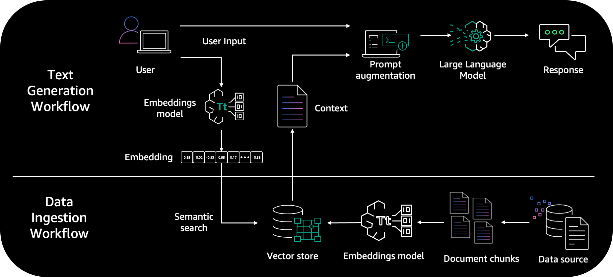
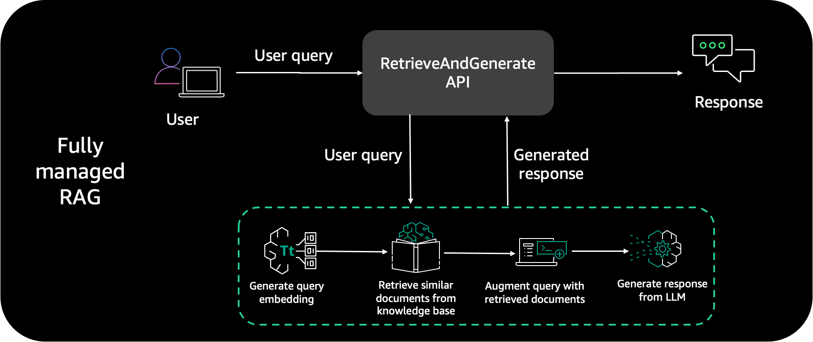
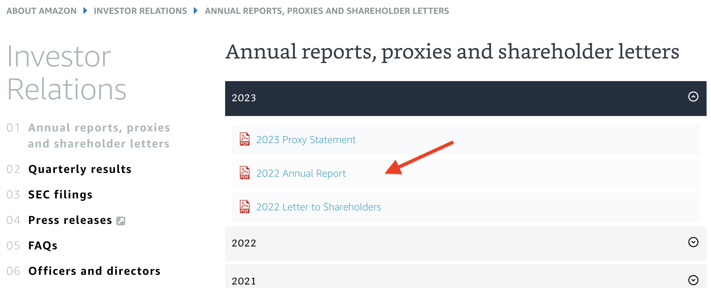
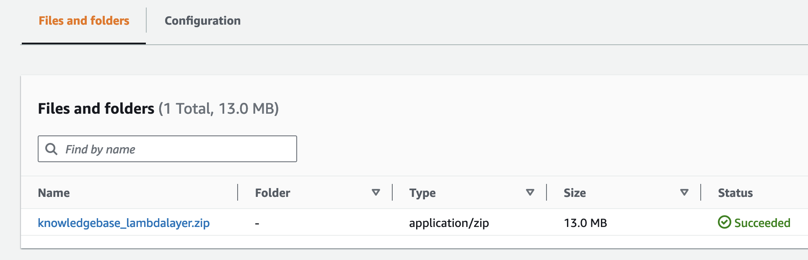
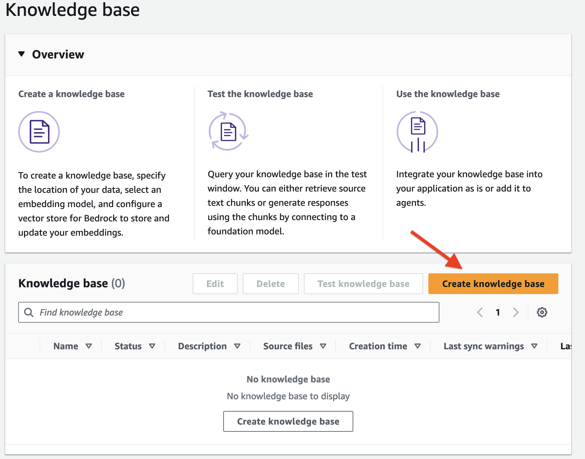
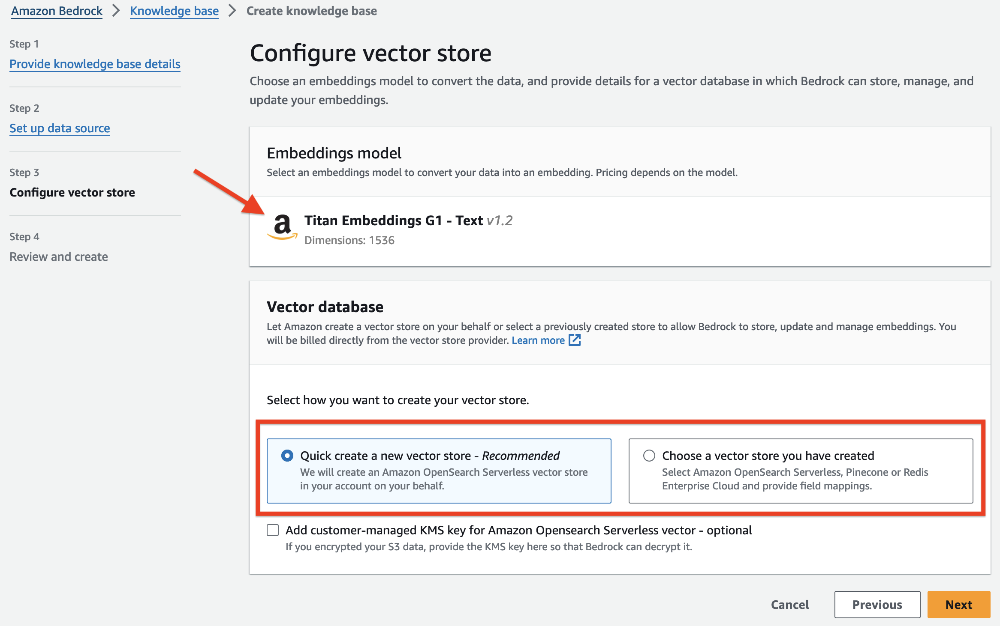
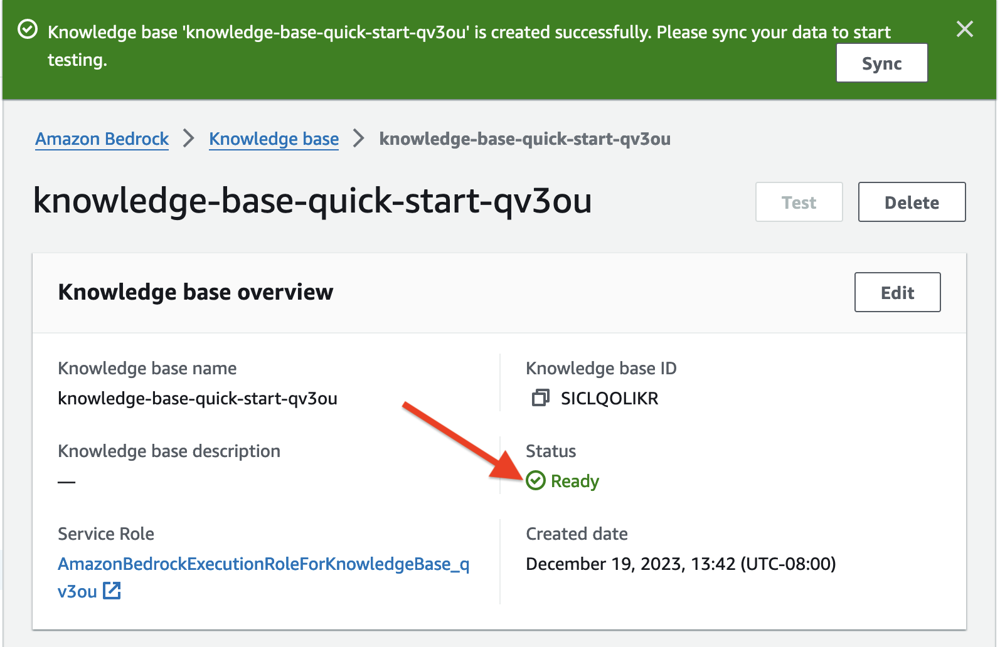
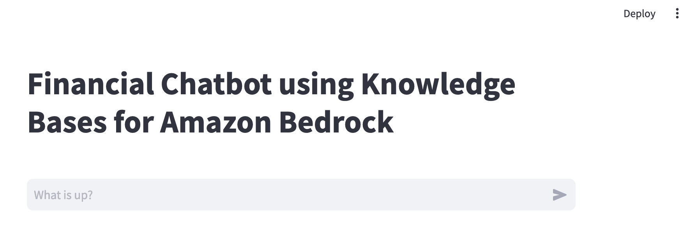
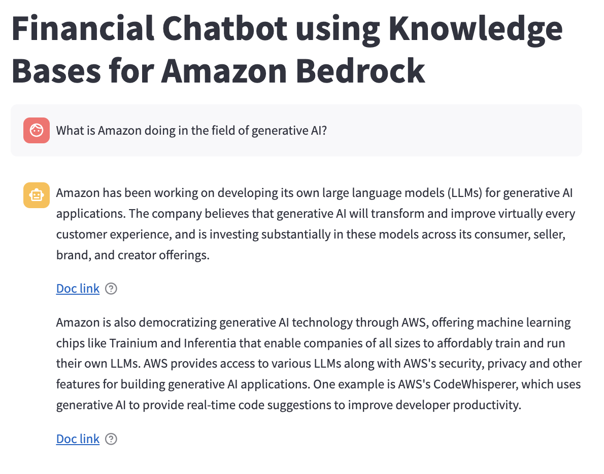

# Build Contextual Chatbots using Amazon Bedrock Knowledge Bases

Modern chatbots can serve as digital agents, providing a new avenue for delivering 24/7 customer service and support across many industries. Their popularity stems from the ability to respond to customer inquiries in real time and handle multiple queries simultaneously in different languages. Chatbots also offer valuable data-driven insights into customer behavior while scaling effortlessly as the user base grows; therefore, they present a cost-effective solution for engaging customers. Chatbots use the advanced natural language capabilities of large language models (LLMs) to respond to customer questions. They can understand conversational language and respond naturally. However, chatbots that merely answer basic questions have limited utility. To become trusted advisors, chatbots need to provide thoughtful, tailored responses.

One way to enable more contextual conversations is by linking the chatbot to internal knowledge bases and information systems. Integrating proprietary enterprise data from internal knowledge bases enables chatbots to contextualize their responses to each user's individual needs and interests. For example, a chatbot could suggest products that match a shopper's preferences and past purchases, explain details in language adapted to the user's level of expertise, or provide account support by accessing the customer's specific records. The ability to intelligently incorporate information, understand natural language, and provide customized replies in a conversational flow allows chatbots to deliver real business value across diverse use cases.

The popular architecture pattern of [Retrieval Augmented Generation](https://docs.aws.amazon.com/sagemaker/latest/dg/jumpstart-foundation-models-customize-rag.html) (RAG) is often used to augment user query context and responses. RAG combines the capabilities of LLMs with the grounding in facts and real-world knowledge that comes from retrieving relevant texts and passages from corpus of data. These retrieved texts are then used to inform and ground the output, reducing hallucination and improving relevance.

This sample illustrates contextually enhancing a chatbot by using [Knowledge Bases for Amazon Bedrock](https://docs.aws.amazon.com/bedrock/latest/userguide/knowledge-base.html), aa fully managed serverless service. The Knowledge Bases for Amazon Bedrock integration allows our chatbot to provide more relevant, personalized responses by linking user queries to related information data points. Internally, [Amazon Bedrock](https://aws.amazon.com/bedrock/) uses embeddings stored in a vector database to augment user query context at runtime and enable a managed RAG architecture solution. We use the [Amazon letters to share holders](https://ir.aboutamazon.com/annual-reports-proxies-and-shareholder-letters/default.aspx) dataset to develop this solution.

## Retrieval Augmented Generation

RAG is an approach to natural language generation that incorporates information retrieval into the generation process. RAG architecture involves two key workflows: data preprocessing through ingestion, and text generation using enhanced context. 

The data ingestion workflow uses LLMs to create embedding vectors that represent semantic meaning of texts. Embeddings are created for documents and user questions. The document embeddings are split into chunks and stored as indexes in a vector database. The text generation workflow then takes a question's embedding vector and uses it to retrieve the most similar document chunks based on vector similarity. It augments prompts with these relevant chunks to generate an answer using the LLM. For more details, refer to the Primer on Retrieval Augmented Generation, Embeddings, and Vector Databases section in [Preview – Connect Foundation Models to Your Company Data Sources with Agents for Amazon Bedrock](https://aws.amazon.com/blogs/aws/preview-connect-foundation-models-to-your-company-data-sources-with-agents-for-amazon-bedrock/).

The following diagram illustrates the high-level RAG architecture.

</br></br>

Although the RAG architecture has many advantages, it involves multiple components, including a database, retrieval mechanism, prompt, and generative model. Managing these interdependent parts can introduce complexities in system development and deployment. The integration of retrieval and generation also requires additional engineering effort and computational resources. Some open source libraries provide wrappers to reduce this overhead; however, changes to libraries can introduce errors and add additional overhead of versioning. Even with open source libraries, significant effort is required to write code, determine optimal chunk size, generate embeddings, and more. This setup work alone can take weeks depending on data volume. 

Therefore, a managed solution that handles these undifferentiated tasks could streamline and accelerate the process of implementing and managing RAG applications.

## Knowledge Bases for Amazon Bedrock

Knowledge Bases for Amazon Bedrock is a serverless option to build powerful conversational AI systems using RAG. It offers fully managed data ingestion and text generation workflows. 

For data ingestion, it handles creating, storing, managing, and updating text embeddings of document data in the vector database automatically. It splits the documents into manageable chunks for efficient retrieval. The chunks are then converted to embeddings and written to a vector index, while allowing you to see the source documents when answering a question. 

For text generation, Amazon Bedrock provides the [RetrieveAndGenerate](https://docs.aws.amazon.com/bedrock/latest/APIReference/API_agent-runtime_RetrieveAndGenerate.html) API to create embeddings of user queries, and retrieves relevant chunks from the vector database to generate accurate responses. It also supports source attribution and short-term memory needed for RAG applications. 

This enables you to focus on your core business applications and removes the undifferentiated heavy lifting.

## Solution overview

The solution presented in this example uses a chatbot created using a [Streamlit](http://streamlit/) application and includes the following AWS services:

* [Amazon Simple Storage Service)](https://aws.amazon.com/s3/) (Amazon S3) as source
* Knowledge Bases for Amazon Bedrock for data ingestion
* An [Amazon OpenSearch Serverless](https://aws.amazon.com/opensearch-service/features/serverless/) vector store to save text embeddings
* [AWS Lambda](https://aws.amazon.com/lambda/) as API function to invoke Knowledge Bases API

The following diagram is a common solution architecture pattern you can use to integrate any chatbot application to Knowledge Bases for Amazon Bedrock.

</br></br>

This architecture includes the following steps:
* A user interacts with the Streamlit chatbot interface and submits a query in natural language
* This triggers a Lambda function, which invokes the Knowledge Bases ```RetrieveAndGenerate``` API. Internally, Knowledge Bases uses an [Amazon Titan](https://aws.amazon.com/bedrock/titan/) embedding model and converts the user query to a vector and finds chunks that are semantically similar to the user query. The user prompt is than augmented with the chunks that are retrieved from the knowledge base. The prompt alongside the additional context is then sent to a LLM for response generation. In this solution, we use [Anthropic Claude Instant](https://aws.amazon.com/bedrock/claude/) as our LLM to generate user responses using additional context. Note that this solution is supported in Regions where Anthropic Claude on Amazon Bedrock is [available](https://docs.aws.amazon.com/bedrock/latest/userguide/what-is-bedrock.html#bedrock-regions).
* A contextually relevant response is sent back to the chatbot application and user.

## Prerequisites
Amazon Bedrock users need to request access to foundation models before they are available for use. This is a one-time action and takes less than a minute. For this solution, you’ll need to enable access to the Titan Embeddings G1 - Text and Claude Instant - v1.2 model in Amazon Bedrock. For more information, refer to [Model access](https://docs.aws.amazon.com/bedrock/latest/userguide/model-access.html). 

## Clone the GitHub repo

To clone this GitHub repository run the following command. Note this is one single ```git clone``` command.

```git clone --depth 2 --filter=blob:none --no-checkout https://github.com/aws-samples/amazon-bedrock-samples && cd amazon-bedrock-samples && git checkout main rag-solutions/contextual-chatbot-using-knowledgebase```

### Upload your knowledge dataset to Amazon S3
Now download the dataset for knowledge base and upload it into a S3 bucket. This dataset will feed and power knowledge base. Complete the following steps:

1. Navigate to [Amazon Annual reports, proxies and shareholder letters data repository](https://ir.aboutamazon.com/annual-reports-proxies-and-shareholder-letters/default.aspx) data repository and download the last few years of Amazon shareholder letters.

</br></br>

2. On the Amazon S3 console, choose **Buckets** in the navigation pane.
3. Click **Create bucket**.
4. Name the bucket ```knowledgebase-<*your-account-number*>```.
5. Leave all other bucket settings as default and choose **Create**. 
6. Navigate to the ```knowledgebase-<*your-account-number*>``` bucket. 
7. Choose Create folder and name it ```dataset```.
8. Leave all other folder settings as default and choose **Create**.
9. Navigate to the ```dataset``` folder
10. Drag and drop the Amazon annual reports, proxies and shareholder letters data files you downloaded earlier to this bucket and choose **Upload**.
11. Navigate back to the bucket home and choose **Create folder** to create a new folder and name it ```lambdalayer```.
12. Leave all other settings as default and create the folder.

</br></br>

13. Navigate to the ```lambdalayer``` folder.
14. Upload the ```knowledgebase-lambdalayer.zip``` file available under the ```/lambda/layer``` folder in the code base you cloned earlier and choose **Upload**. You will use this Lambda layer code later to create the Lambda function.

</br></br>

### Create a Knowledge Base
In this step, create a knowledge base using the Amazon shareholder letters dataset we uploaded to S3 bucket in the previous step.

1. On the Amazon Bedrock console, under **Orchestration** in the navigation pane, choose **Knowledge base**.

</br></br>

2. Choose **Create knowledge base**.

</br></br>

3. In the **Knowledge base details** section, enter a name and optional description
4. In the IAM permissions section, select Create and use a new service role and enter a name for the role.
5.	Add tags as needed.
6.	Choose Next.

</br></br>

7. In the **Data source** section, leave **Data source name** as the default name.
8.	For **S3 URI**, choose **Browse S3** to choose the S3 bucket ```knowledgebase-<*your-account-number*>/dataset/```. You need to point to the bucket and dataset folder you created in the previous steps.
9.	In the **Advanced settings** section, leave the default values (if you want, you can change the default chunking strategy and specify the chunk size and overlay in percentage).
10.	Choose **Next**.
    
</br></br>

11.	In the **Embeddings model** section, select **Titan Embedding G1 – Text** for embedding model.
12.	For **Vector database** section, you can either select **Quick create a new vector store**, or **Choose a vector store you have created**. Note that, to use the vector store of your choice, you need have a vector store preconfigured to use. We currently support four vector engine types: the vector engine for [Amazon OpenSearch Serverless](https://aws.amazon.com/opensearch-service/features/serverless/), [Amazon Aurora](https://aws.amazon.com/rds/aurora/), Pinecone, and Redis Enterprise Cloud. For this post, we select **Quick create a new vector store**, which by default creates a new OpenSearch Serverless vector store in your account.
13.	Choose Next.

</br></br>

14.   On the Review and create page, review all the information, or choose Previous to modify any options
15.   Choose Create knowledge base. Note the knowledge base creation process begins and the status is **In progress**. It will take a few minutes to create the vector store and knowledge base. Don’t navigate away from the page, otherwise creation will fail.

</br></br>

16.   When the knowledge base status is in the Ready state, note down the knowledge base ID. You will use it in the next steps to configure the Lambda function

</br></br>

17.   Now that knowledge base is ready, we need to sync our Amazon shareholders letter data to it. In the Data Source section of the knowledge base details page, choose Sync to trigger the data ingestion process from the S3 bucket to the knowledge base.

</br></br>

18.   This sync process splits the document files into smaller chunks of the chunk size specified earlier, generates vector embeddings using the selected text embedding model, and stores them in the vector store managed by Knowledge Bases for Amazon Bedrock.

</br></br>

19.   When the dataset sync is complete, the status of the data source will change to the Ready state. Note that, if you add any additional documents in the S3 data folder, you need to re-sync the knowledge base.

</br></br>

Congratulations, your Knowledge base is ready. 

Note that you can also use Knowledge Bases for Amazon Bedrock service APIs and the [AWS Command Line Interface](http://aws.amazon.com/cli) (AWS CLI) to programmatically create a knowledge base. You will need to run various sections of the Jupyter notebook provided under the /notebook folder in the code base you cloned earlier.

### Create AWS Lambda function
This Lambda function is deployed using an [AWS CloudFormation](http://aws.amazon.com/cloudformation) template available under the ```/cfn``` folder. The template requires two parameters: the S3 bucket name and the knowledge base ID.

1. On the AWS CloudFormation service home page, choose Create stack to create a new stack.
   
</br></br>

2.	Select **Template is ready** for **Prepare template**. 
3.	Select **Upload the template** file for **Template source**. 
4.	Choose **Choose file**, navigate to the code base you cloned earlier, and choose the .yaml file under the ```/cfn``` folder. 
5.	Choose **Next**.

</br></br>

6.	For **Stack name**, enter a name.
7.	In the **Parameters** section, enter the knowledge base ID and S3 bucket name you noted down earlier. 
8.	Choose **Next**.

</br></br>

9.	Leave all default options as is, choose **Next**, and choose **Submit**.
10.	Verify that the CloudFormation template ran successfully, and there are no errors.

Congratulations, you have created a Lambda function, related roles, and policies successfully.

### Test the Contextual Chatbot Application
To test the chatbot application, complete the following steps:

1. Open a new terminal or a command line window on your machine.
2.	Run the following command to install the [AWS SDK for Python](https://aws.amazon.com/sdk-for-python/) (Boto3). Boto3 makes it straightforward to integrate a Python application, library, or script with AWS services.

```pip install boto3```

3.	Run the following command to install and set up a local Python development environment to run the Streamlit application:

```pip install streamlit```

4.	Navigate to the /streamlit folder in the code base you cloned earlier.
5.	Run the following command to instantiate the chatbot application:

```python -m streamlit run chatbot.py```

6. This should open a web based chat application powered by Streamlit in your default web browser.

</br></br>

7. Use this Streamlit chatbot application to post natural language questions to start the conversations powered by Bedrock Knowledge base. 

</br></br>

When you submit a prompt, the Streamlit app triggers the Lambda function, which invokes the Knowledge Bases RetrieveAndGenerate API to search and generate responses.

The following table includes some sample questions and related knowledge base responses. Try out some of these questions by using prompts. 

| Questions | Answers |
| --------- | ------- |
| What is Amazon's doing in the field of generative AI? |	Amazon has been working on their own large language models (LLMs) for generative AI and believes it will transform and improve every customer experience. They plan to continue investing substantially in these models across all their consumer, seller, brand, and creator experiences. |
| What is AWS year-over-year revenue in 2022? | AWS revenue grew 29% year-over-year in 2022 on a $62 billion revenue base in 2021.
How many days has Amazon asked employees to come to work in office? | Amazon has asked corporate employees to come back to office at least three days a week beginning May 2022. |
| By what percentage did AWS revenue grow year-over-year in 2022? | AWS had a 29% year-over-year ('YoY') revenue in 2022. |
| Compared to Graviton2 processors, what performance improvement did Graviton3 chips deliver according to the passage? | In 2022, AWS delivered their Graviton3 chips, providing 25% better performance than the Graviton2 processors. |
| Which was the first inference chip launched by AWS according to the passage? | AWS launched their first inference chips (“Inferentia”) in 2019, and they have saved companies like Amazon over a hundred million dollars in capital expense. | 
| According to the context, in what year did Amazon's annual revenue increase from $245B to $434B?	| Amazon's annual revenue increased from $245B in 2019 to $434B in 2022. |

During the first call to the Lambda function, the ```RetrieveAndGenerate``` API returns a ```sessionId```, which is then passed by the Streamlit app along with the subsequent user prompt as an input to the ```RetrieveAndGenerate``` API to continue the conversation in the same session. The ```RetrieveAndGenerate``` API manages the short-term memory and uses the chat history as long as the same ```sessionId``` is passed as an input in the successive calls.

Congratulations, you have successfully created and tested a chatbot application using Knowledge Bases for Amazon Bedrock.

### Clean Up

Failing to delete resources such as the S3 bucket, OpenSearch Serverless collection, and knowledge base will incur charges. To clean up these resources, delete the CloudFormation stack, delete the S3 bucket (including any document folders and files stored in that bucket), delete the OpenSearch Serverless collection, delete the knowledge base, and delete any roles, policies, and permissions that you created earlier.

### Conclusion

This example provided an overview of contextual chatbots and explained why they’re important. It described the complexities involved in data ingestion and text generation workflows for a RAG architecture. It then introduced how Knowledge Bases for Amazon Bedrock creates a fully managed serverless RAG system, including a vector store. Finally, it provided a solution architecture and sample code in this GitHub repo to retrieve and generate contextual responses for a chatbot application using a knowledge base. 

By explaining the value of contextual chatbots, the challenges of RAG systems, and how Knowledge Bases for Amazon Bedrock addresses those challenges, this example aimed to showcase how Amazon Bedrock enables you to build sophisticated conversational AI applications with minimal effort.

For more information, see the Amazon Bedrock Developer Guide and Knowledge Base APIs.

## License

This library is licensed under the MIT-0 License. See the [LICENSE](LICENSE) file.
