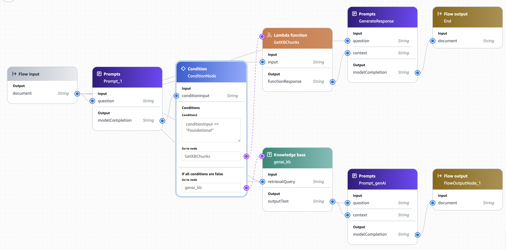

## Prompt flow RAG example
---

Amazon Bedrock Flows accelerates the creation, testing, and deployment of user-defined workflows for generative AI applications through an intuitive visual builder. Using Bedrock prompt flows, users can drag, drop and link Prompts, existing Agents, Knowledge Bases, Guardrails and other AWS services. This enables generative AI teams to build a business logic via workflow creations. 

In this example, we will be building a simple RAG application. We will follow the following steps:

## Overview

This example focuses on building a basic **RAG (Retrieval-Augmented Generation)** application. The high-level steps are:

1. **Create a RAG prompt** and store it in **Bedrock prompt management**.  
   - Bedrock prompt management simplifies the creation, evaluation, versioning, and sharing of prompts, ensuring you can easily reuse and maintain them.
   - In this example we create two prompts, one for RAG and one as a router prompt. The router prompt is powered by an SLM (`haiku`) to route requests and figure
   out whether a question is of one type versus another
   
1. **Apply a condition** via the router, to route requests to different Knowledge Bases based on different user questions.

1. **Create two knowledge bases** that contains sample information about AWS services. One of the knowledge bases contains information about basic AWS services and the other contains information about specific generative AI services.

3. **Create a prompt flow** that:
   - Takes a user-provided question.
   - Routes the request to the right KB based on the condition.
   - Retrieve relevant chunks from the knowledge base.
   - Sends the retrieved context and user question to a foundation model for an answer along with a RAG prompt stored in the prompt management library.
   - Return the final output to the user.


[Amazon Bedrock Prompt Management](https://docs.aws.amazon.com/bedrock/latest/userguide/prompt-management.html) streamlines the creation, evaluation, deployment, and sharing of prompts in the Amazon Bedrock console and via APIs in the SDK. This feature helps developers and business users obtain the best responses from foundation models for their specific use cases.

[Amazon Bedrock Prompt Flows](https://docs.aws.amazon.com/bedrock/latest/userguide/flows.html) allows you to easily link multiple foundation models (FMs), prompts, and other AWS services, reducing development time and effort. It introduces a visual builder in the Amazon Bedrock console and a new set of APIs in the SDK, that simplifies the creation of complex generative AI workflows.

Let's start by making sure we have the lastest version of the Amazon Bedrock SDK, importing the libraries, and setting-up the client.


```python
# Only run this the first time...
!pip3 install boto3 botocore matplotlib -qU
```


```python
import os
import json
import boto3
import logging
import requests
from datetime import datetime
from typing import List, Optional, Dict
```


```python
# Set a logger
logging.basicConfig(format='[%(asctime)s] p%(process)s {%(filename)s:%(lineno)d} %(levelname)s - %(message)s', level=logging.INFO)
logger = logging.getLogger(__name__)
```

#### Prerequisites
---

1. Make sure you have enabled model access for Claude 3 Sonnet and Haiku for this notebook.

1. Make sure to create the `FOUNDATIONAL_S3_INPUT_BUCKET` that points to the s3 bucket containing foundational AWS information and `GENAI_S3_INPUT_BUCKET` that will contain generative AI specific information.


```python
# Define constants

# This is the model that will be used for standard text generation for our
# RAG application use case
TEXT_GEN_MODEL: str = "anthropic.claude-3-sonnet-20240229-v1:0" # Change to any other model of choice
# Router model
ROUTER_MODEL: str = "anthropic.claude-3-haiku-20240307-v1:0" # Change to any other model of choice
# S3 bucket that contains information on the PDF file that is stored within the Knowledge base
FOUNDATIONAL_S3_INPUT_BUCKET: str = "<your-bucket-containing-foundational-data>"
GENAI_S3_INPUT_BUCKET: str = "<your-bucket-containing-genai-data>"
# These are the links of the PDF files that will stored within the Knowledge bases
URLs: List[str] = ['https://d0.awsstatic.com/whitepapers/aws-overview.pdf', 'https://docs.aws.amazon.com/pdfs/decision-guides/latest/generative-ai-on-aws-how-to-choose/generative-ai-on-aws-how-to-choose.pdf']
# Local directory where the data is saved
DATA_DIR: str = "data"
# PDF file name to be saved and put in S3
PDF_FILE_NAME: str = "aws-overview.pdf"
PDF_FILE_NAME2: str = "aws-overview-genai.pdf"
# This is the name of the Knowledge base that will be created
KB_NAME_1: str = "aws-overview-kb"
KB_DESC_1: str = """Use this KB to retrieve information about AWS services that the user is asking about."""

# This is the second knowledge base that we will add a routing condition to
KB_NAME_2: str = "aws-genai-kb-2039"
KB_DESC_2: str = """Use this KB to retrieve information about specifically the genAI AWS services that the user is asking about."""

# This is the lambda function that will be used to fetch the top 5 chunks from the knowledge base
KB_LAMBDA_FUNCTION_NAME: str = 'demo-lambda-function'
KB_LAMBDA_FUNCTION: str = 'kb-lambda-function.py'
```

#### Save the file locally, put it in S3, and then sync it with the Knowledge base


```python
# Create a dictionary to map URLs to their corresponding file names and buckets
url_to_file_and_bucket = {
    URLs[0]: {"filename": PDF_FILE_NAME, "bucket": FOUNDATIONAL_S3_INPUT_BUCKET},
    URLs[1]: {"filename": PDF_FILE_NAME2, "bucket": GENAI_S3_INPUT_BUCKET}
}

# Download the files
for url, file_info in url_to_file_and_bucket.items():
    filename = file_info["filename"]
    logger.info(f"Downloading file from {url}")
    try:
        if not os.path.exists(DATA_DIR):
            os.makedirs(DATA_DIR)
        
        response = requests.get(url)
        response.raise_for_status()
        
        # Save the file with its corresponding name
        file_path = os.path.join(DATA_DIR, filename)
        with open(file_path, 'wb') as f:
            f.write(response.content)
        logger.info(f"File successfully downloaded to {file_path}")
    except requests.exceptions.RequestException as e:
        logger.error(f"Error downloading file: {e}")

# Upload files to their respective S3 buckets
s3_client = boto3.client('s3')

for url, file_info in url_to_file_and_bucket.items():
    filename = file_info["filename"]
    bucket = file_info["bucket"]
    try:
        file_path = os.path.join(DATA_DIR, filename)
        
        s3_client.upload_file(
            file_path,           
            bucket,     # Use the corresponding bucket for each file
            filename   # Upload to root of bucket
        )
        logger.info(f"Successfully uploaded {filename} to {bucket}")
    except Exception as e:
        logger.error(f"Error uploading to S3: {e}")
```


```python
# fetch the current AWS region
region = boto3.client('sts').meta.region_name # change to another region if you do not want
# the region to be dynamically fetched
logger.info(f"Current AWS region: {region}")
```


```python
bedrock_agent = boto3.client(service_name = "bedrock-agent", region_name = region)
```

### RAG Application Prompt

Let's create our sample RAG application prompt by leveraging on Prompt Management for Amazon Bedrock. Here, you can adjust the sample prompt template.


```python
response = bedrock_agent.create_prompt(
    name = f"aws-expert-assistant",
    description = "Prompt template for AWS expert assistant to analyze content and answer user questions",
    variants = [
        {
            "inferenceConfiguration": {
            "text": {
                "maxTokens": 2000,
                "temperature": 0,
            }
            },
            "modelId": TEXT_GEN_MODEL,
            "name": "variantOne",
            "templateConfiguration": {
                "text": {
                    "inputVariables": [
                        {
                            "name": "question"
                        },
                        {
                            "name": "context"
                        }
                    ],
                    "text": """
<system>You are an expert AWS assistant with deep knowledge of AWS services, architectures, and best practices. Your role is to carefully analyze provided content and answer user questions with accurate, detailed, and technically precise information.</system>

Refer to the user question below in the user_question xml tags:
<user_question>
{{question}}
</user_question>

Here is the content to analyze to answer the user question in the content xml tags:
<content>xw
{{context}}
</content>

<assistant>I'll help you by analyzing the content provided and answering your specific question about AWS. Let me break this down systematically:

1. First, I'll carefully examine your question and the provided content
2. Then, I'll provide a detailed, technically accurate answer
3. I'll ensure to include relevant AWS-specific details and best practices
4. If any information is unclear or missing, I'll note that in my response

Here's my answer:</assistant>
                    """
                }
            },
            "templateType": "TEXT"
        }
    ],
    defaultVariant = "variantOne"
)
logger.info(json.dumps(response, indent=2, default=str))
promptTextGenId = response["id"]
promptTextGenArn = response["arn"]
promptTextGenName = response["name"]
logger.info(f"Prompt ID: {promptTextGenId}\nPrompt ARN: {promptTextGenArn}\nPrompt Name: {promptTextGenName}")
```

Now that we have a draft prompt, we can create a version from it.


```python
response = bedrock_agent.create_prompt_version(
    promptIdentifier = promptTextGenId
)
print(json.dumps(response, indent=2, default=str))
```

### Create a prompt router. This prompt is powered by an SLM and assists in giving a condition to the type of question asked
---

This prompt is invoked using `llama3.2 1b` and it determines whether the question is about foundational AWS services or generative AI services. Based on either, a condition will be applied that routes the request to the respective KB to retrieve and generate the answer.


```python
response = bedrock_agent.create_prompt(
    name = f"aws-router-assistant",
    description = "Prompt template for routing user questions based on foundational and AI aws services",
    variants = [
        {
            "inferenceConfiguration": {
            "text": {
                "maxTokens": 2000,
                "temperature": 0,
            }
            },
            "modelId": ROUTER_MODEL,
            "name": "variantOne",
            "templateConfiguration": {
                "text": {
                    "inputVariables": [
                        {
                            "name": "question"
                        },
                        {
                            "name": "context"
                        }
                    ],
                    "text": """
Based on the user question, determine if the question is more related to foundational AWS knowledge, 
or more tailored to ai/ml or generative ai. If it is tailored to foundational knowledge, answer with only one word: "foundational". 
If it is tailored to AI, then answer with only one word: "ai". Regardless of the question, you have to answer with one word of the two. 

Refer to the question below:
{{question}}

If your response is "foundational", it should be in lower case only and same for "ai". Only respond with "ai" if the question is about SageMaker, Bedrock, 
or any compute question for machine learning workloads.
                    """
                }
            },
            "templateType": "TEXT"
        }
    ],
    defaultVariant = "variantOne"
)
logger.info(json.dumps(response, indent=2, default=str))
promptRouterId = response["id"]
promptRouterArn = response["arn"]
promptRouterName = response["name"]
logger.info(f"Prompt ID: {promptRouterId}\nPrompt ARN: {promptRouterArn}\nPrompt Name: {promptRouterName}")
```


```python
response = bedrock_agent.create_prompt_version(
    promptIdentifier = promptRouterId
)
print(json.dumps(response, indent=2, default=str))
```

### Create a Knowledge Base
---

In this portion of the notebook, we will create a knowledge base and store information about AWS services.


```python
import sys
sys.path.insert(0, ".")
from utils import *
from utils.knowledge_base_helper import (
    KnowledgeBasesForAmazonBedrock
)
from utils.lambda_utils import *

# Initialize the KB class
kb = KnowledgeBasesForAmazonBedrock()
```

#### Create a generic knowledge base for all the basic AWS information
---

This is the first knowledge base which will answer basic user questions on foundational AWS questions.


```python
%%time
try:
    generic_aws_kb_id, generic_aws_ds_id = kb.create_or_retrieve_knowledge_base(
        KB_NAME_1,
        KB_DESC_1,
        FOUNDATIONAL_S3_INPUT_BUCKET,
    )
    logger.info(f"Knowledge Base ID: {generic_aws_kb_id}")
    logger.info(f"Data Source ID: {generic_aws_ds_id}")
except Exception as e:
    logger.error(f"An error occurred while creating the KB: {e}")

```

#### Create a specific GenAI knowledge base for all the advanced, generative AI related questions
---

This is the second knowledge base which will answer 300-400 level type questions on Generative AI services at AWS.


```python
%%time
try:
    genai_kb_id, genai_ds_id = kb.create_or_retrieve_knowledge_base(
        KB_NAME_2,
        KB_DESC_2,
        GENAI_S3_INPUT_BUCKET,
        "amazon.titan-embed-text-v2:0",
        # adding a parameter to make new policies for the new kb
        'newpolicy'
    )
    logger.info(f"Knowledge Base ID: {genai_kb_id}")
    logger.info(f"Data Source ID: {genai_ds_id}")
except Exception as e:
    logger.error(f"An error occurred while creating the KB: {e}")


```

### Synchronize the Knowledge Base with Data in `S3`
---

Now we will sync the data from the S3 bucket into the AWS expert knowledge base


```python
# sync knowledge base for both knowledge bases
kb.synchronize_data(generic_aws_kb_id, generic_aws_ds_id)
```


```python
kb.synchronize_data(genai_kb_id, genai_ds_id)
```

### Wrap the knowledge base in a lambda function
---

Next, we will wrap the function above in a lambda function and then invoke the lambda function to get the responses


```python
# Deploy the Lambda. This lambda will return the top 5 chunks 
# from the knowledge base that contains information on the data that
# is inputted
function_arn = create_kb_lambda(
    lambda_function_name=KB_LAMBDA_FUNCTION_NAME,
    source_code_file=os.path.join('utils', KB_LAMBDA_FUNCTION),
    region=region,
    kb_id=generic_aws_kb_id
)

logger.info(f"Lambda function ARN: {function_arn}")
```

### RAG Application Flow
---

Now, we have created a RAG Application prompt, a knowledge base that contains information about AWS services, and have wrapped the knowledge base in a lambda function so that when the user asks a question, the top 5 chunks from the knowledge base are retrieved. Once that is done, the chunks and the user question are fed into a customized prompt and the answer is given back to the user.


We'll need an AWS IAM role for creating the Prompt Flow in Amazon Bedrock. If you already have a role with your permissions you can directly replace the ```flowRole``` variable with your role's ARN.

For simplicity in this example we'll create a new role and attach the ```AmazonBedrockFullAccess``` policy to it. In general, it's recommended that you further limit the policies with conditions.

You can check further details in the [How Prompt Flows for Amazon Bedrock works](https://docs.aws.amazon.com/bedrock/latest/userguide/flows-how-it-works.html) documentation.


```python
import boto3
import json

iam = boto3.client('iam')

# Create the role if it doesn't exist
try:
    response = iam.create_role(
        RoleName='MyBedrockFlowsRole',
        AssumeRolePolicyDocument=json.dumps({
            "Version": "2012-10-17",
            "Statement": [
                {
                    "Effect": "Allow",
                    "Principal": {
                        "Service": [
                            "bedrock.amazonaws.com",
                            "lambda.amazonaws.com"
                        ]
                    },
                    "Action": "sts:AssumeRole"
                }
            ]
        })
    )
    flowRole = response['Role']['Arn']
except iam.exceptions.EntityAlreadyExistsException:
    flowRole = f"arn:aws:iam::{boto3.client('sts').get_caller_identity()['Account']}:role/MyBedrockFlowsRole"

# Attach necessary policies
policies_to_attach = [
    'arn:aws:iam::aws:policy/AmazonBedrockFullAccess',
    'arn:aws:iam::aws:policy/service-role/AWSLambdaBasicExecutionRole'
]

for policy in policies_to_attach:
    try:
        iam.attach_role_policy(
            RoleName='MyBedrockFlowsRole',
            PolicyArn=policy
        )
    except iam.exceptions.NoSuchEntityException:
        print(f"Role doesn't exist for policy: {policy}")
    except iam.exceptions.LimitExceededException:
        print(f"Policy already attached: {policy}")

# Create inline policy for Lambda invocation
lambda_policy = {
    "Version": "2012-10-17",
    "Statement": [
        {
            "Effect": "Allow",
            "Action": [
                "lambda:InvokeFunction"
            ],
            "Resource": [
                function_arn
            ]
        }
    ]
}

try:
    iam.put_role_policy(
        RoleName='MyBedrockFlowsRole',
        PolicyName='LambdaInvokePolicy',
        PolicyDocument=json.dumps(lambda_policy)
    )
except Exception as e:
    print(f"Error attaching Lambda invoke policy: {e}")

logger.info(f'Using flowRole: {flowRole}')

```


```python

# if you have already created a flow in the bedrock console, you can call the ".get_flow" API to fetch the json using your FlowId
response = bedrock_agent.create_flow(
    name=f"RAGFlow-{datetime.now().strftime('%Y%m%d-%H%M%S')}",
    description="RAG Application Flow that uses KB and custom prompt to answer questions",
    executionRoleArn=flowRole,
    definition={
        "nodes": [
            {
                "name": "FlowInputNode",
                "type": "Input",
                "configuration": {"input": {}},
                "outputs": [
                    {"name": "document", "type": "String"}
                ]
            },
            {
                "name": "GetKBChunks",
                "type": "LambdaFunction",
                "configuration": {
                    "lambdaFunction": {
                        "lambdaArn": function_arn
                    }
                },
                "inputs": [
                    {
                        "expression": "$.data",
                        "name": "input",
                        "type": "String"
                    }
                ],
                "outputs": [
                    {"name": "functionResponse", "type": "String"}
                ]
            },
            {
                "name": "GenerateResponse",
                "type": "Prompt",
                "configuration": {
                    "prompt": {
                        "sourceConfiguration": {
                            "resource": {
                                "promptArn": promptTextGenArn
                            }
                        }
                    }
                },
                "inputs": [
                    {"expression": "$.data", "name": "question", "type": "String"},
                    {"expression": "$.data", "name": "context", "type": "String"}
                ],
                "outputs": [
                    {"name": "modelCompletion", "type": "String"}
                ]
            },
            {
                "name": "Prompt_1",
                "type": "Prompt",
                "configuration": {
                    "prompt": {
                        "sourceConfiguration": {
                            "resource": {
                                "promptArn": promptRouterArn
                            }
                        }
                    }
                },
                "inputs": [
                    {"expression": "$.data", "name": "question", "type": "String"}
                ],
                "outputs": [
                    {"name": "modelCompletion", "type": "String"}
                ]
            },
            {
                "name": "genai_kb",
                "type": "KnowledgeBase",
                "configuration": {
                    "knowledgeBase": {
                        "knowledgeBaseId": genai_kb_id,
                        "modelId": TEXT_GEN_MODEL
                    }
                },
                "inputs": [
                    {"expression": "$.data", "name": "retrievalQuery", "type": "String"}
                ],
                "outputs": [
                    {"name": "outputText", "type": "String"}
                ]
            },
            {
                "name": "Prompt_genAI",
                "type": "Prompt",
                "configuration": {
                    "prompt": {
                        "sourceConfiguration": {
                            "resource": {
                                "promptArn": promptTextGenArn
                            }
                        }
                    }
                },
                "inputs": [
                    {"expression": "$.data", "name": "question", "type": "String"},
                    {"expression": "$.data", "name": "context", "type": "String"}
                ],
                "outputs": [
                    {"name": "modelCompletion", "type": "String"}
                ]
            },
            {
                "name": "ConditionNode",
                "type": "Condition",
                "configuration": {
                    "condition": {
                        "conditions": [
                            {
                                "expression": "conditionInput == \"foundational\"",
                                "name": "Condition2"
                            },
                            {"name": "default"}
                        ]
                    }
                },
                "inputs": [
                    {"expression": "$.data", "name": "conditionInput", "type": "String"}
                ]
            },
            {
                "name": "End",
                "type": "Output",
                "configuration": {"output": {}},
                "inputs": [
                    {"expression": "$.data", "name": "document", "type": "String"}
                ]
            },
            {
                "name": "FlowOutputNode_1",
                "type": "Output",
                "configuration": {"output": {}},
                "inputs": [
                    {"expression": "$.data", "name": "document", "type": "String"}
                ]
            }
        ],
        "connections": [
            {
                "name": "FlowInputNodeToGetKBChunks",
                "source": "FlowInputNode",
                "target": "GetKBChunks",
                "type": "Data",
                "configuration": {
                    "data": {
                        "sourceOutput": "document",
                        "targetInput": "input"
                    }
                }
            },
            {
                "name": "FlowInputNodeToGenerateResponse",
                "source": "FlowInputNode",
                "target": "GenerateResponse",
                "type": "Data",
                "configuration": {
                    "data": {
                        "sourceOutput": "document",
                        "targetInput": "question"
                    }
                }
            },
            {
                "name": "GetKBChunksToGenerateResponse",
                "source": "GetKBChunks",
                "target": "GenerateResponse",
                "type": "Data",
                "configuration": {
                    "data": {
                        "sourceOutput": "functionResponse",
                        "targetInput": "context"
                    }
                }
            },
            {
                "name": "GenerateResponseToEnd",
                "source": "GenerateResponse",
                "target": "End",
                "type": "Data",
                "configuration": {
                    "data": {
                        "sourceOutput": "modelCompletion",
                        "targetInput": "document"
                    }
                }
            },
            {
                "name": "FlowInputNodeToPrompt_1",
                "source": "FlowInputNode",
                "target": "Prompt_1",
                "type": "Data",
                "configuration": {
                    "data": {
                        "sourceOutput": "document",
                        "targetInput": "question"
                    }
                }
            },
            {
                "name": "Prompt_1ToConditionNode",
                "source": "Prompt_1",
                "target": "ConditionNode",
                "type": "Data",
                "configuration": {
                    "data": {
                        "sourceOutput": "modelCompletion",
                        "targetInput": "conditionInput"
                    }
                }
            },
            {
                "name": "FlowInputNodeTogenai_kb",
                "source": "FlowInputNode",
                "target": "genai_kb",
                "type": "Data",
                "configuration": {
                    "data": {
                        "sourceOutput": "document",
                        "targetInput": "retrievalQuery"
                    }
                }
            },
            {
                "name": "genai_kbToPrompt_genAI",
                "source": "genai_kb",
                "target": "Prompt_genAI",
                "type": "Data",
                "configuration": {
                    "data": {
                        "sourceOutput": "outputText",
                        "targetInput": "context"
                    }
                }
            },
            {
                "name": "FlowInputNodeToPrompt_genAI",
                "source": "FlowInputNode",
                "target": "Prompt_genAI",
                "type": "Data",
                "configuration": {
                    "data": {
                        "sourceOutput": "document",
                        "targetInput": "question"
                    }
                }
            },
            {
                "name": "Prompt_genAIToFlowOutputNode_1",
                "source": "Prompt_genAI",
                "target": "FlowOutputNode_1",
                "type": "Data",
                "configuration": {
                    "data": {
                        "sourceOutput": "modelCompletion",
                        "targetInput": "document"
                    }
                }
            },
            {
                "name": "ConditionNodeDefaultToGenai_kb",
                "source": "ConditionNode",
                "target": "genai_kb",
                "type": "Conditional",
                "configuration": {
                    "conditional": {
                        "condition": "default"
                    }
                }
            },
            {
                "name": "ConditionNodeCondition2ToGetKBChunks",
                "source": "ConditionNode",
                "target": "GetKBChunks",
                "type": "Conditional",
                "configuration": {
                    "conditional": {
                        "condition": "Condition2"
                    }
                }
            }
        ]
    }
)

flowId = response["id"]
flowArn = response["arn"]
flowName = response["name"]

logger.info(json.dumps(response, indent=2, default=str))
logger.info(f"Flow ID: {flowId}\nFlow ARN: {flowArn}\nFlow Name: {flowName}")

```

This is what your Bedrock prompt flow should look like on the console:




```python
# prepare teh flow, so that it builds and validates our flow creation
response = bedrock_agent.prepare_flow(
    flowIdentifier = flowId
)
logger.info(json.dumps(response, indent=2, default=str))
```


```python
response = bedrock_agent.get_flow(
    flowIdentifier = flowId
)
logger.info(json.dumps(response, indent=2, default=str))
```


```python
response = bedrock_agent.create_flow_version(
    flowIdentifier = flowId
)
logger.info(json.dumps(response, indent=2, default=str))
```


```python
# We can also create flow alises, so that we can point our application front-ends and any other integrations to these. 
# This allows creating new versions without impacting our service.
response = bedrock_agent.create_flow_alias(
    flowIdentifier = flowId,
    name = flowName,
    description = "Alias for my test flow in the customer service use case",
    routingConfiguration = [
        {
            "flowVersion": "1"
        }
    ]
)
logger.info(json.dumps(response, indent=2, default=str))
flowAliasId = response['id']
```

### Invoke a Flow
---

Now that we have learned how to create and manage flows, we can test these with invocations.

**Note**: You can invoke flows from any application front-end or your own systems as required. It effectively exposes all the logic of your flow through an Agent Endpoint API.


```python
bedrock_agent_runtime = boto3.client(service_name = 'bedrock-agent-runtime', region_name = region)
```


```python
response = bedrock_agent_runtime.invoke_flow(
    flowIdentifier = flowId,
    flowAliasIdentifier = flowAliasId,
    inputs = [
        { 
            "content": { 
                "document": "Hi, What is Amazon SageMaker?"
            },
            "nodeName": "FlowInputNode",
            "nodeOutputName": "document"
        }
    ]
)

# Process the event stream
for event in response["responseStream"]:
    if "flowOutputEvent" in event:
        # Extract just the answer content
        answer = event["flowOutputEvent"]["content"]["document"]
        # Remove the <answer> tags if present
        answer = answer.replace("<answer>", "").replace("</answer>", "").strip()
        print(answer)
```


```python
response = bedrock_agent_runtime.invoke_flow(
    flowIdentifier = flowId,
    flowAliasIdentifier = flowAliasId,
    inputs = [
        { 
            "content": { 
                "document": "I have no idea what Amazon SNS is for. Could you tell me?"
            },
            "nodeName": "FlowInputNode",
            "nodeOutputName": "document"
        }
    ]
)

# Process the event stream
for event in response["responseStream"]:
    if "flowOutputEvent" in event:
        # Extract just the answer content
        answer = event["flowOutputEvent"]["content"]["document"]
        # Remove the <answer> tags if present
        answer = answer.replace("<answer>", "").replace("</answer>", "").strip()
        print(answer)
```
