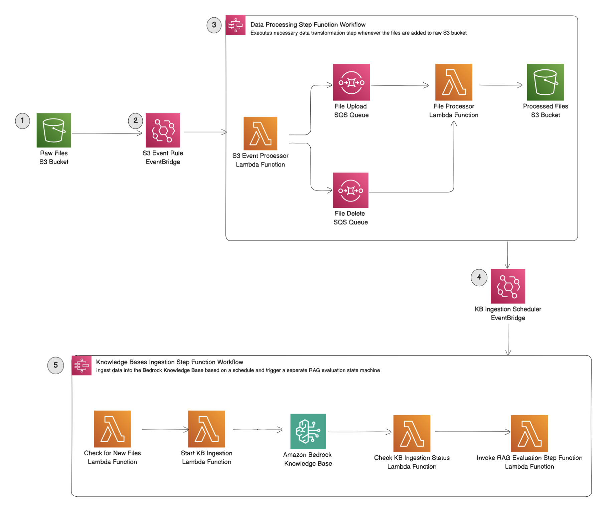
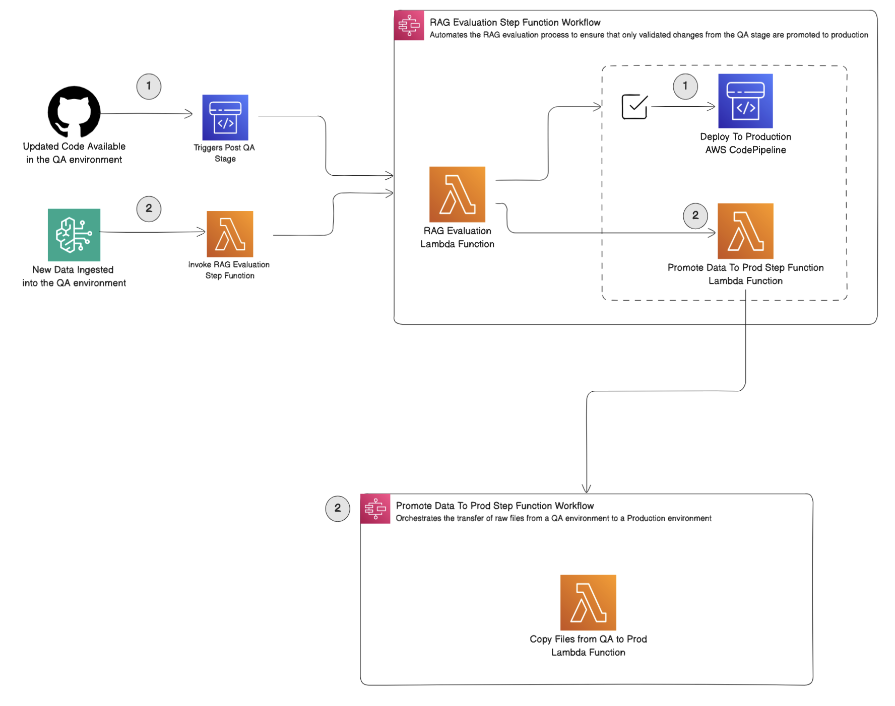

# **RAG Pipeline with CI/CD**

This project implements a comprehensive **CI/CD pipeline** for an end-to-end **Retrieval-Augmented Generation (RAG)** system powered by **Amazon Bedrock Knowledge Bases** and **AWS CDK**. The pipeline automates the deployment and management of key AWS resources critical for the RAG architecture. At its core, the solution integrates **Amazon Bedrock's foundation models and Knowledge Bases** with essential AWS services such as S3, Lambda, DynamoDB, and Step Functions to manage data ingestion, transformation, and retrieval. Through predefined stages spanning **QA and Production environments**, raw data flows through transformation pipelines, where it is processed, evaluated, and optimized for enhanced knowledge retrieval.

The solution leverages **AWS CodePipeline** to streamline multi-stage deployments, automating infrastructure updates from code commits to production rollouts. RAG evaluations act as critical checkpoints to ensure system integrity by validating both **data and code changes**. Promotions from QA to Production are only allowed after successful RAG evaluations, ensuring that only validated changes make it to production. The architecture offers **fine-grained control** over the deployment lifecycle, with **manual/automatic approvals** and **state machine-driven workflows** managing critical decisions. By combining **CI/CD best practices with RAG workflows**, the project provides a scalable and automated framework to continuously deploy GenAI-powered applications, leveraging real-time external knowledge. This solution accelerates time-to-market by providing a production-ready framework for enterprises building AI-powered applications with Amazon Bedrock.

## **Accessing the Example Streamlit App**

The **Streamlit app** deployed as part of this project serves as an **example interface** to demonstrate the capabilities of the **RAG pipeline**. 

1. **Go to the AWS CloudFormation Console**:
   - In the list of stacks, locate the **Web App Stack** (e.g., `Prod-WebAppStack`).

2. **Find the Web App Endpoint**:
   - Click on the **`Prod-WebAppStack`**.
   - In the **"Outputs" tab**, look for the key labeled **`AlbDnsName`**.
   - This value provides the **DNS name** of the Application Load Balancer (ALB) hosting the example Streamlit app.

3. **Access the App**:
   - Click on the **AlbDnsName** or copy the link and open it in a browser.
   - The Streamlit app should load, allowing you to explore the chat functionality.


## Solution Architecture

### Data Ingestion Workflow
**Data Ingestion Workflow** is designed to handle and process raw data files uploaded to the QA environment, transforming them into a format ready for ingestion into the Knowledge Base. This workflow is highly adaptable, enabling customers to integrate their own data transformation and validation processes based on their unique requirements. **_Note_**: The data transformation step is provided as a flexible component, allowing customers to apply any necessary data processing, such as file format conversions, text extraction, or data normalization, before ingestion. This approach ensures that the Knowledge Base receives high-quality, structured data suitable for retrieval and analysis.



1. **Raw Files Upload (Starting Point)**
    - **Raw Files S3 bucket** is the starting point where raw files are uploaded. Each file upload or deletion in this bucket triggers an S3 event, setting off the data ingestion process.

2. **Event Capture and Workflow Triggering**
    - **EventBridge rule** captures specific S3 events (file upload or delete) and triggers an AWS Step Function, which is responsible for coordinating the data transformation workflow. This rule ensures that each file upload or deletion event invokes the data transformation step function to handle the event.

3. **Data Transformation Process (AWS Step Function Workflow)**
    - **AWS Step Function** orchestrates the data transformation process with the following steps:
        - **S3 Event Processor Lambda function** extracts relevant details from each S3 event. Based on the event type (upload or deletion), it sends a message to one of two **Amazon SQS queues**:
            - **File Upload Queue**: For upload events, a message is added to signal that a new file requires processing.
            - **File Deletion Queue**: For delete events, a message is added to signal that a file has been removed.
        - **File Processor Lambda function** is triggered whenever a message appears in either SQS queue:
            - **For upload events**: The function processes the raw file, applies necessary transformations, and saves the output in the **Processed Files S3 bucket**. Transformation requirements may vary depending on specific use cases. For instance, if you use the advanced parsing feature of the Knowledge Base, which currently supports only PDF format, files must be converted to PDF before ingesting the file. 
            - **For deletion events**: The function deletes the corresponding transformed file from the **Processed Files S3 bucket** to maintain consistency and keep the processed data aligned with the raw data.

4. **Scheduled Knowledge Base Ingestion**
    - **Amazon EventBridge Scheduler** is configured to run every 2 minutes, triggering the **Knowledge Base Ingestion Step Function** workflow. This schedule ensures that data ingestion into the Knowledge Base is consistent and near real-time, though the interval can be adjusted based on customer requirements (e.g., every hour, several times a day, etc.).

5. **Knowledge Base Ingestion Workflow (Step Functions)**
    - **Knowledge Base Ingestion Step Function** orchestrates the data ingestion process into the Amazon Bedrock Knowledge Base with the following steps:
        - **Check For New Files Lambda function** scans the **Metadata Table** for newly processed files that need ingestion.
        - If new files are identified, the **Start KB Ingestion Lambda function** initiates the ingestion process by calling Amazon Bedrock’s **StartIngestionJob** API.
        - **Check KB Ingestion Status Lambda function** periodically checks the status of the ingestion job via the **GetIngestionJobStatus** API.
        - **Retry Logic**: If the ingestion job is still in progress, the workflow waits for a specified interval before checking again. This ensures that the ingestion process completes successfully without unnecessary resource consumption.
        - Upon successful completion of the ingestion job, the **Trigger RAG Evaluation Lambda function** is invoked to launch a **RAG Evaluation Step Function** workflow. This separate workflow validates the ingested data as part of the QA process.
        - Finally, the workflow updates the **Metadata Table** with the final status of the ingestion job, ensuring that the table always reflects the most current state of each file and ingestion job.

6. **File Metadata Table for Tracking and Status**
    - **File Metadata Table** (Amazon DynamoDB) stores metadata and ingestion status for each file. This table is essential for tracking files through the entire ingestion pipeline—from their raw state in the S3 bucket, through processing, and finally to ingestion in the Knowledge Base.


### **RAG Evaluation Workflow**

---
**RAG Evaluation Workflow** is designed to evaluate code and data changes in the QA environment to ensure that only high-quality, validated updates are promoted to production. This workflow is flexible, allowing customers to integrate their own RAG evaluation processes based on their specific requirements. **_Note_**: The RAG evaluation step is provided as a **placeholder** without a prescribed methodology, allowing customers to define and integrate any RAG evaluation approach that fits their needs


### **1. Handling Code Changes**

- **Code Changes Detection and CodePipeline Execution**:
  - When **code changes** are detected (e.g., new features, bug fixes, or infrastructure updates), **AWS CodePipeline** is triggered automatically. CodePipeline manages the deployment of code changes across different environments, including QA and Production.

- **Post-QA Stage and RAG Evaluation**:
  - As part of the CodePipeline workflow, there is a **Post-QA Stage** where the RAG Evaluation takes place. This stage runs the **RAG Evaluation Step Function** to assess the quality of code changes.
  - The **RAG Evaluation Lambda function** is invoked as part of this process, which can be customized to implement any evaluation logic. A placeholder example evaluates based on a defined success rate threshold (e.g., 80%).

- **Automated Approval Process in CodePipeline**:
  - If the RAG Evaluation is **successful** (e.g., meets the required success threshold), the Step Function automatically triggers the **approval process** within CodePipeline.
  - This automatic approval allows the CodePipeline to proceed with deploying the code changes from QA to Production.
  - If the evaluation **fails**, the pipeline halts, requiring intervention to resolve issues before reattempting deployment.

#### **Example Placeholder Implementation for Code Changes**
```typescript
// Example Lambda function that simulates a RAG evaluation process
const ingestionResult = { successRate: 85 };  // Simulating a success rate
const threshold = 80;  // Threshold for passing
const ragStatus = ingestionResult.successRate >= threshold ? 'PASSED' : 'FAILED';
```
This example checks if the success rate meets the threshold. Customers can replace this logic with their own evaluation methodology.

---

### **2. Handling Data Changes**

- **Data Changes Detection and RAG Evaluation Trigger**:
  - When **data changes** occur (new or updated data becomes available in the QA environment), the **Knowledge Base Ingestion Step Function Workflow** detects these changes and triggers the **Invoke RAG Evaluation Step Function** as part of the ingestion pipeline.

- **RAG Evaluation for Data Changes**:
  - The **RAG Evaluation Step Function** assesses the new data to ensure quality and compliance. This may include checks such as schema validation, data consistency, and adherence to business rules.
  - Customers can customize this evaluation to fit their data validation needs, using the placeholder as a baseline or replacing it entirely with their own logic.

- **Automatic Data Promotion to Production**:
  - **No Manual Approval Required**: Unlike code changes, data changes do not require manual approval, enabling faster and automated propagation of data updates.
  - **Invoke QA to Prod Step Function**: Upon a successful RAG evaluation, the Step Function triggers the **Invoke QA to Prod Step Function**, which initiates the **Move Files State Machine**.
  - **Data Transfer Execution**: This state machine orchestrates the transfer of validated data from the QA S3 bucket to the Production S3 bucket, completing the data promotion process.

---

## **cdk.json: Configuration for Your CDK Project**

The **`cdk.json`** file defines the configuration settings and context values for the CDK project. It ensures the CDK framework knows how to execute the app and what environment-specific settings to apply. Below is the content of the `cdk.json` file:

```json
{
    "app": "npx ts-node bin/main.ts",
    "context": {
        "defaultProject": "rag-project",
        "defaultRegion": "us-east-1",
        "defaultAccount": "xxxxxxx",
        "defaultEnvironment": "QA",
        "prodAccount": "xxxxxxx",
        "prodRegion": "us-west-2",
        "bedrockModelID": "anthropic.claude-3-haiku-20240307-v1:0",
        "@aws-cdk/customresources:installLatestAwsSdkDefault": false
    }
}
```

### **Explanation of Key Fields in `cdk.json`:**

- **`app`**: Specifies the command to run the CDK app. Here, **`npx ts-node bin/main.ts`** runs the TypeScript entry point directly using `ts-node`.
- **`context`**: Stores environment-specific configurations and variables:
  - **`defaultProject`**: Name of the project
  - **`defaultRegion`**: The AWS region for QA deployments 
  - **`defaultAccount`**: The AWS account ID used for deployments.
  - **`defaultEnvironment`**: Indicates the default environment as **QA**.
  - **`prodAccount`** and **`prodRegion`**: AWS account and region for production 
  - **`bedrockModelID`**: The foundation model ID used in Amazon Bedrock.
  - **`installLatestAwsSdkDefault`**: Controls whether the latest AWS SDK is installed for custom resources.

The `cdk.json` file ensures the CDK app deploys correctly across different stages by centralizing environment variables and configurations. This makes the pipeline flexible and easy to extend for multiple environments (e.g., QA, Prod).

---

## **Prerequisites**

Ensure the following tools are installed:

1. **Node.js**: [Download here](https://nodejs.org).
2. **AWS CDK CLI**: Install the AWS CDK CLI globally:
   ```bash
   npm install -g aws-cdk
   ```
3. **AWS CLI**: [Install and configure](https://aws.amazon.com/cli/) the AWS CLI.

---

## **Installation**

1. **Navigate to the Project Folder**:
   ```bash
   cd path/to/RAG-PIPELINE-WITH-CICD
   ```

2. **Install Dependencies**:
   ```bash
   npm install
   ```

3. **Build the Project**:
   ```bash
   npm run build
   ```

4. **Synthesize the CDK App**:
   ```bash
   npx cdk synth
   ```

5. **Deploy the CDK App**:
   ```bash
   npx cdk deploy --all
   ```

---

## **Project Structure**

- **`bin/`**: Contains the entry point for the CDK app.
- **`lib/`**: Contains the core CDK stack definitions.
  - **`constructs/`**: Custom reusable components.
  - **`stacks/`**: Defines the various AWS resources.
  - **`stages/`**: Pipeline stages (e.g., QA, Prod).
- **`src/`**: Lambda function source code.
- **`cdk.json`**: CDK configuration file.
- **`package.json`**: Node.js dependencies and scripts.
- **`tsconfig.json`**: TypeScript configuration.

---

## **Troubleshooting Tips**

- **AWS CLI Credentials**: Ensure AWS credentials are configured:
   ```bash
   aws configure
   ```
- **TypeScript Issues**: Install TypeScript if needed:
   ```bash
   npm install -D typescript
   ```
- **CDK CLI Version**: If issues persist, try updating the CDK CLI:
   ```bash 
   npm install -g aws-cdk@latest
   ```


---

## **Useful Commands**

- **Build**: `npm run build`
- **Synthesize**: `npx cdk synth`
- **Deploy**: `npx cdk deploy`
- **Destroy**: `npx cdk destroy`


---

This RAG pipeline enables fast and efficient management of GenAI applications, ensuring smooth integration of data and code changes into production with the power of **Amazon Bedrock** and AWS CDK.
