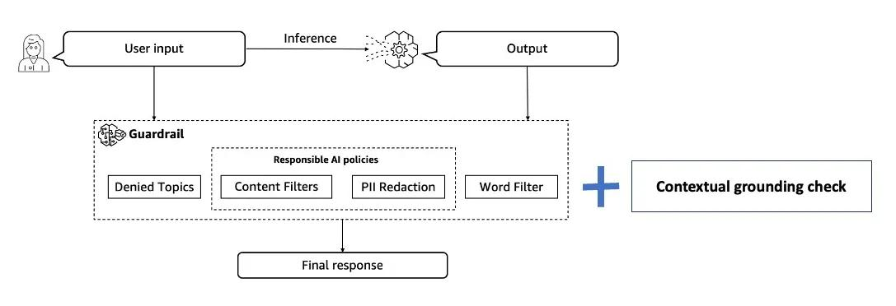
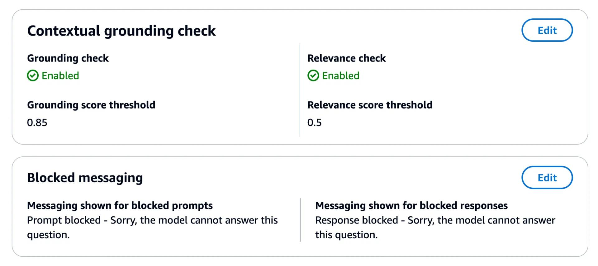
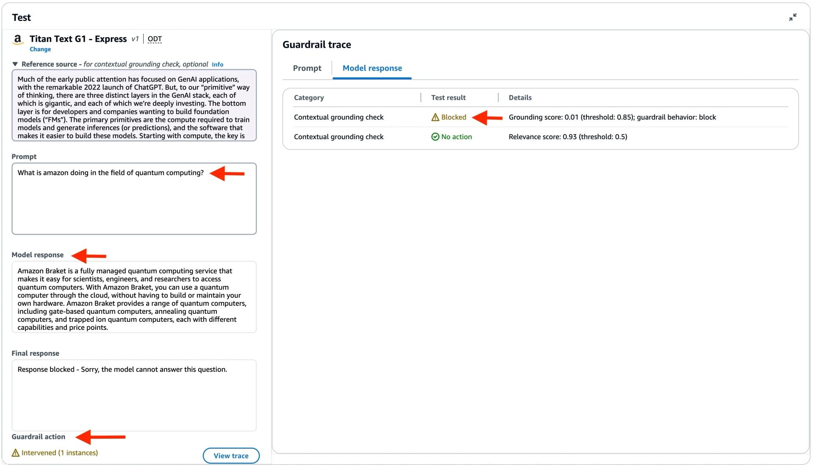
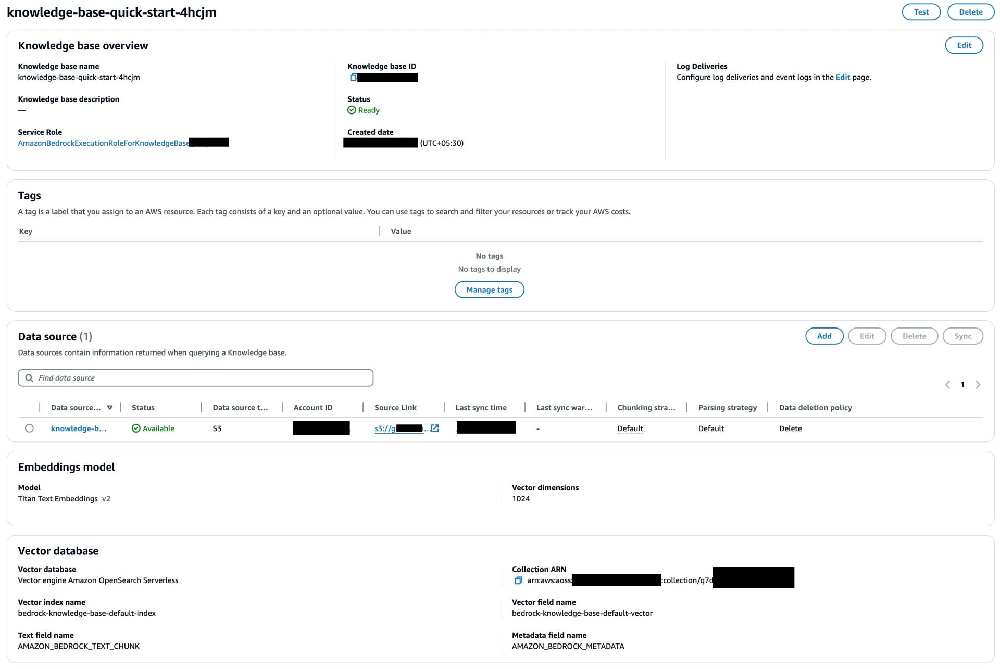
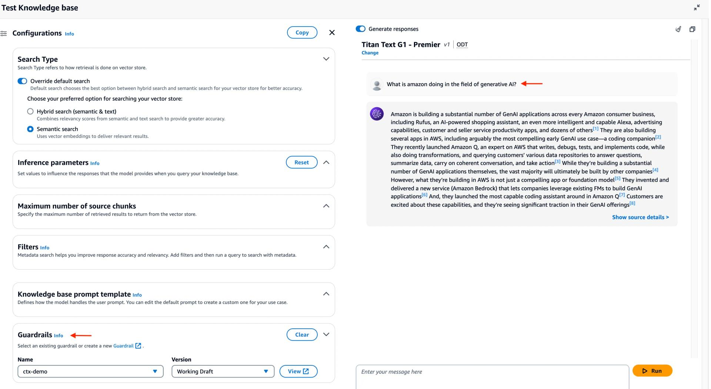
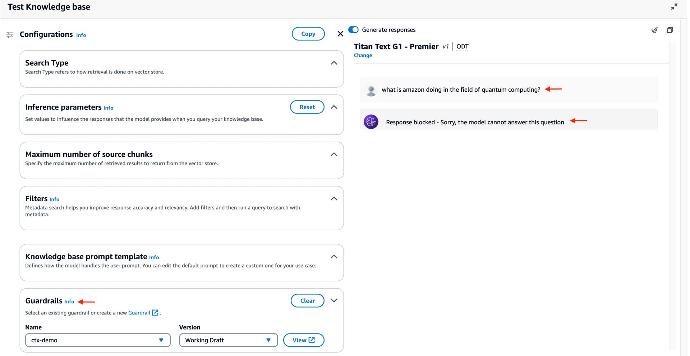

# Responsible AI

This folder contains examples related to Responsible AI on Bedrock

## Contents

[Guardrails for Amazon Bedrock Samples](guardrails-for-amazon-bedrock-samples) - Examples of Building, Updating, Versioning and Testing your Guardrails
[Using the ApplyGuardrail API with Boto3 and Self Managed RAG](guardrails-for-amazon-bedrock-samples/bedrock_guardrails_apply_guardrail_api.ipynb) - Examples of using the ApplyGuardrail API for Self-Hosted Models + RAG


## AWS Bedrock Guardrails for GenAI Hallucinations

Guardrails for Amazon Bedrock enables you to implement safeguards for your generative AI applications based on your use cases and responsible AI policies. You can create multiple guardrails tailored to different use cases and apply them across multiple foundation models (FM), providing a consistent user experience and standardizing safety and privacy controls across generative AI applications.
Until now, Guardrails supported four policies - denied topics, content filters, sensitive information filters, and word filters. The Contextual grounding check policy (the latest one added at the time of writing) can detect and filter hallucination in model responses that are not grounded in enterprise data or are irrelevant to the users’ query.

### Contextual grounding to prevent hallucinations

The generative AI applications that we build depend on LLMs to provide accurate responses. This might be based on LLM inherent capabilities or using techniques such as RAG (Retrieval Augmented Generation). However, its a known fact that LLMs are prone to hallucination and can end up responding with inaccurate information which impacts application reliability.



The Contextual grounding check policy evaluates hallucinations using two parameters:

1. Grounding – This checks if the model response is factually accurate based on the source and is grounded in the source. Any new information introduced in the response will be considered un-grounded.
2. Relevance – This checks if the model response is relevant to the user query.

The result of the contextual grounding check is a set of confidence scores corresponding to grounding and relevance for each model response processed based on the source and user query provided. You can configure thresholds to filter (block) model responses based on the generated scores. These thresholds determine the minimum confidence score for the model response to be considered as grounded and relevant.
For example, if your grounding threshold and relevance threshold are each set at 0.6, all model responses with a grounding or relevance score of less than that will be detected as hallucinations and blocked.
You may need to adjust the threshold scores based on the accuracy tolerance for your specific use case. For example, a customer-facing application in the finance domain may need a high threshold due to lower tolerance for inaccurate content. Keep in mind that a higher threshold for the grounding and relevance scores will result in more responses being blocked.

### Getting started with contextual grounding

To get an understanding of how contextual grounding check works, I would recommend using the Amazon Bedrock Console since it makes it easy to test your Guardrail policies with different combinations of source data and prompts.
Start by creating a Guardrails configuration. For this example, I have set the grounding check threshold to 0.85, relevance score threshold to 0.5 and configured the messages for blocked prompt and responses:



As an example, I used this snippet of text from the 2023 Amazon shareholder letter PDF and used it as the Reference source. For the Prompt, I used: What is amazon doing in the field of quantum computing?


The nice part about using the AWS console is that not only can you see the final response (pre-configured in the Guardrail), but also the actual model response (that was blocked).

In this case, the model response was relevant since it it came back with information about Amazon Braket. But the response was un-grounded, since it wasn't based on the source information, which had no data about quantum computing, or Amazon Braket. Hence the grounding score was 0.01 - much lower than the configured threshold of 0.85, which resulted in the model response getting blocked.

### Use contextual grounding check for RAG applications with Knowledge Bases
Remember, Contextual grounding check is yet another policy and it can be leveraged anywhere Guardrails can be used. One of the key use cases is combining it with RAG applications built with Knowledge Bases for Amazon Bedrock.

To do this, create a Knowledge Base. I created it using the 2023 Amazon shareholder letter PDF as the source data (loaded from Amazon S3) and the default vector database (OpenSearch Serverless collection).

After the Knowledge Base has been created, sync the data source, and you should be ready to go!




Lets start with a question which I know can be answered accurately: What is amazon doing in the field of generative AI?


This went well, as expected - we got a relevant and grounded response.

Lets try another one: What is amazon doing in the field of quantum computing?


As you can see, the model response got blocked, and the pre-configured response (in Guardrails) was returned instead. This is because the source data does not actually contain information about quantum computing (or Amazon Braket), and a hallucinated response was prevented by the Guardrails.

### Combine contextual grounding check with RetrieveAndGenerate API
Let's go beyond the AWS console and see how to apply the same approach in a programmatic way.
Here is an example using the RetrieveAndGenerate API, that queries a knowledge base and generates responses based on the retrieved results. I have used the AWS SDK for Python (boto3), but it will work with any of the SDKs.
Before trying out the example, make sure you have configured and set up Amazon Bedrock, including requesting access to the Foundation Model(s).

```
import boto3

guardrailId = "ENTER_GUARDRAIL_ID"
guardrailVersion= "ENTER_GUARDRAIL_VERSION"
knowledgeBaseId = "ENTER_KB_ID"

modelArn = 'arn:aws:bedrock:us-east-1::foundation-model/anthropic.claude-instant-v1'

def main():
    
    client = boto3.client('bedrock-agent-runtime')
    response = client.retrieve_and_generate(
        input={
            'text': 'what is amazon doing in the field of quantum computing?'
        },
        retrieveAndGenerateConfiguration={
            'knowledgeBaseConfiguration': {
                'generationConfiguration': {
                    'guardrailConfiguration': {
                        'guardrailId': guardrailId,
                        'guardrailVersion': guardrailVersion
                    }
                },
                'knowledgeBaseId': knowledgeBaseId,
                'modelArn': modelArn,
                'retrievalConfiguration': {
                    'vectorSearchConfiguration': {
                        'overrideSearchType': 'SEMANTIC'
                    }
                }
            },
            'type': 'KNOWLEDGE_BASE'
        },
    )

    action = response["guardrailAction"]
    print(f'Guardrail action: {action}')
    
    finalResponse = response["output"]["text"]
    print(f'Final response:\n{finalResponse}')

if __name__ == "__main__":
    main()
    
```
Run the example (don't forget to enter the Guardrail ID, version, Knowledge Base ID):

```angular2html
pip install boto3
python grounding.py
```

You should get an output as such:
```angular2html
Guardrail action: INTERVENED
Final response:
Response blocked - Sorry, the model cannot answer this question.
```

### Conclusion
Contextual grounding check is a simple yet powerful technique to improve response quality in application based on RAG, summarization, or information extraction. It can help detect and filter hallucinations in model responses if they are not grounded (factually inaccurate or add new information) in the source information or are irrelevant to the user’s query. Contextual grounding check is made available to you as a policy/configuration in Guardrails for Amazon Bedrock, and can be plugged in anywhere you maybe using Guardrails to enforce responsible AI for your applications.

For more details, refer to the Amazon Bedrock documentation for Contextual grounding.


This blog post is referenced from this article: []()