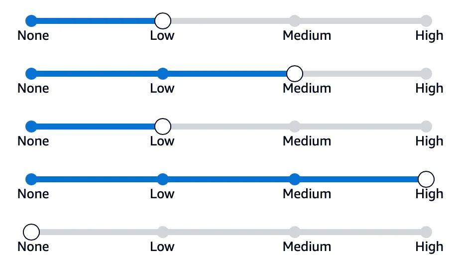
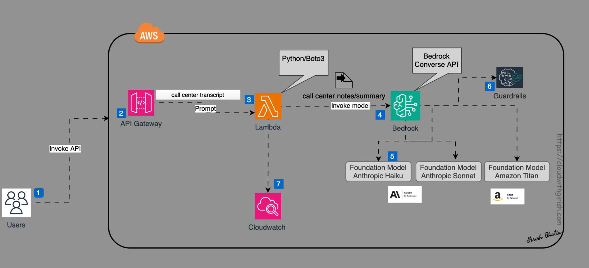
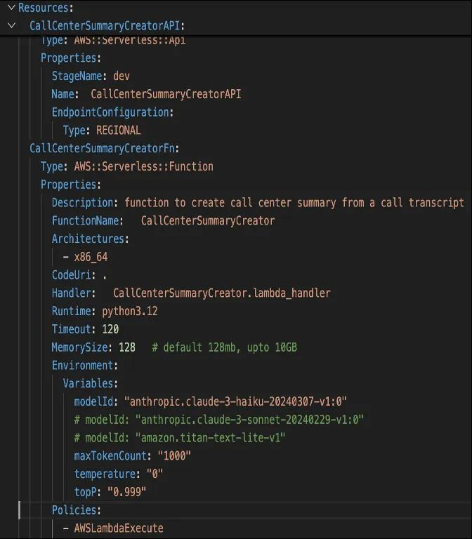
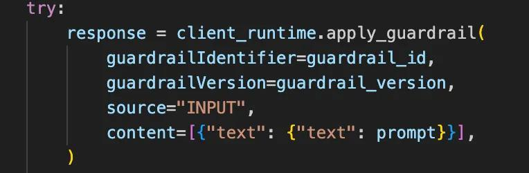
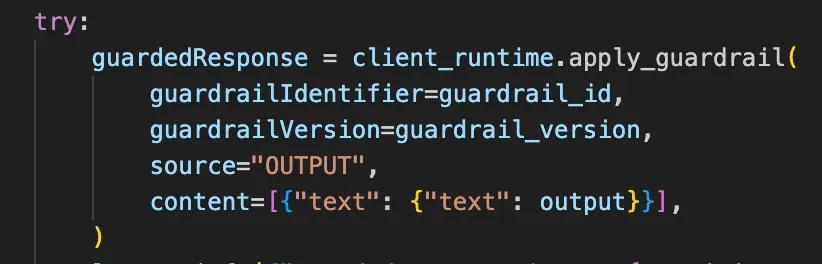
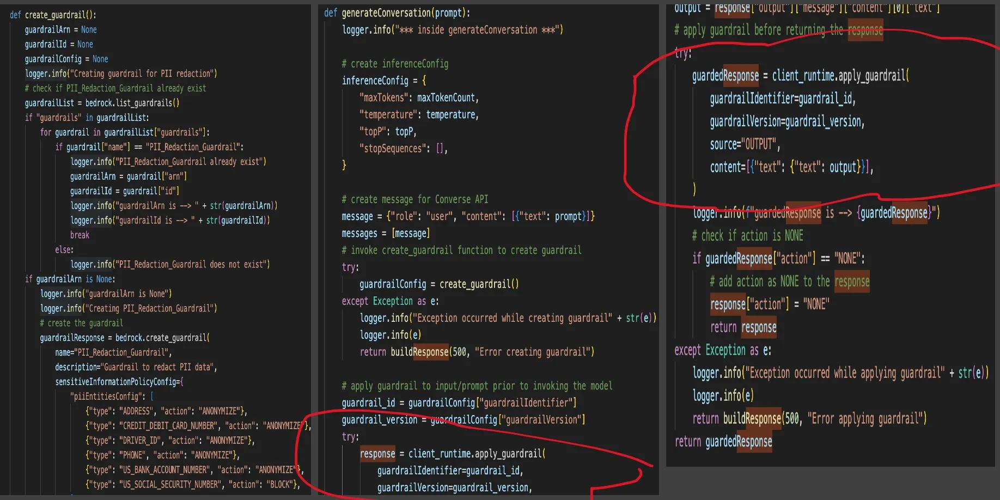

# Responsible AI

This folder contains examples related to Responsible AI on Bedrock

## Contents

[Guardrails for Amazon Bedrock Samples](guardrails-for-amazon-bedrock-samples) - Examples of Building, Updating, Versioning and Testing your Guardrails
[Using the ApplyGuardrail API with Boto3 and Self Managed RAG](guardrails-for-amazon-bedrock-samples/bedrock_guardrails_apply_guardrail_api.ipynb) - Examples of using the ApplyGuardrail API for Self-Hosted Models + RAG

In June 2024, AWS added support for guardrails via the Converse API. However, a challenge encountered was that guardrail policies were being applied to both input and response. With additional code for guard content, the desired result was accomplished; however, it required additional lines of code to meet the use case requirements.

The newly announced Apply Guardrail function empowers developers with more control over how best to implement guardrails when invoking the Bedrock API. This feature ensures that based on the guardrail policy, if an input is blocked, developers can return a response prior to receiving a response from the LLM. This approach not only enhances security but also optimizes efficiency by saving unnecessary calls to the foundational model.

This enhancement marks a significant step forward in the customization and control developers have over their AI applications, ensuring safer and more efficient interactions with generative AI models.

This article will demonstrate how the Apply Guardrail feature can be used to protect PII information from a transcript summary generated using Amazon Bedrock, Lambda, and API.

Examples of PII (Personal Identifiable Information) include SSN, Account Number, Phone, Email, Address, etc.

Let's revisit the Guardrail Policies supported by AWS.
Guardrail Policies
The Amazon Bedrock Guardrail feature allows for the configuration of various filters, providing responsible boundaries for the responses generated by AI solutions. These guardrails help ensure that the outputs are appropriate and align with requirements and standards.

#### Content Filters
Content Filters are categorized into six types:
* Hate
* Insults
* Sexual
* Violence
* Misconduct
* Prompt Attack

Filters can be set to None, Low, Medium, or High.

**Denied Topics**
Filters can specify topics that the API should not respond to.

**Word Filter**
Specific words can be designated for filtering before providing a response.

**Sensitive Information Filter**
This filter can either block or mask Personal Identifiable Information.

Amazon Bedrock provides a way to configure the message returned to the user if the input or response violates the configured guardrail policies. For example, if the Sensitive Information filter is configured to block a request with an account number, a customized response can inform the user that the request cannot be processed due to the presence of a forbidden data element.

Let's review the Use Cases
* There transcript is available for a case resolution and conversation between a customer and a support/call center team member.
* A call summary needs to be created based on this resolution/conversation transcript.
* An automated solution is required to create the call summary.
* The automated solution will provide a repeatable way to create these call summary notes.
* Increased productivity, as team members usually tasked with documenting these notes can focus on other tasks.
* Guardrails should be configured so that PII information is not displayed in the response.
* Guardrails will also be applied to input. If the input contains a blocked data element like an account number, the API will not invoke the LLM and will return the initial response to the consumer.

A Lambda function is generated using AWS SAM; however, a similar function can be created using the AWS Console. AWS SAM is preferred as it provides the flexibility to test the function without first deploying it to the AWS cloud.

A SAM template will be created for the Lambda function that contains the code to invoke the Bedrock Converse API along with required parameters and a prompt. While the Lambda function can be created without the SAM template, using an Infrastructure as Code approach allows for easy recreation of cloud resources.

#### Create a Lambda Function
The Lambda function serves as the core of this automated solution. It contains the code necessary to fulfill the business requirement of creating a summary of the call center transcript using the Amazon Bedrock Converse API. This Lambda function accepts a prompt, which is then forwarded to the Bedrock Converse API to generate a response using the Anthropic Haiku foundation model.
Example of Apply Guardrail in the Function
python

##### Example of guardrail implementation

input_guardrail

output_guardrail

AWS Lambda

#### Build function locally using AWS SAM

Next, the function is built and validated using AWS SAM before deploying the Lambda function in the AWS cloud. Some SAM commands used include:
* SAM Build
* SAM local invoke
* SAM deploy

**Bedrock Invoke Model vs. Bedrock Converse API**
 

Prompt engineering is an essential component of any Generative AI solution. Crafting an effective prompt is crucial for obtaining the desired response from the foundation model. It often requires multiple attempts and adjustments to achieve the desired outcome.
Given that the solution is deployed to AWS API Gateway, an API endpoint will be available post-deployment. Postman can be utilized for passing the prompt in the request and reviewing the response. Additionally, the response can be posted to an AWS S3 bucket for later review.
Review the Guarded/Masked Response Returned by the Generative AI Foundation Model
As noted in the response above, the GenAI response has masked the PII information.
Here is the response when the policy is updated to block if PII contains an account number. Since the Apply Guardrail feature provides the flexibility of applying to input or response independently, the result of applying the guardrail to input with a blocked data element is shown.
With these steps, a serverless GenAI solution to create a call center transcript summary via a REST API, Lambda, and AWS Bedrock Converse API has been successfully completed. Amazon Bedrock Guardrail has been configured to protect PII information. The Apply Guardrail feature was applied to demonstrate how both input and response data can be protected using the guardrail. Python/Boto3 were used to invoke the Bedrock Converse API with Anthropic Haiku.

The Converse API was used to implement a policy to control the GenAI response and abstract and block the PII data. A guardrail was created to remove the PII information from the response, and the guardrail configuration was updated to ensure that the account number, when configured for blocking, will be blocked.

Here is a simple footnote[^1].

[^1]: My reference, with further explanation and a [supporting link](https://dev.to/bhatiagirish/how-to-use-guardrail-to-protect-pii-information-with-aws-bedrock-converse-api-lambda-and-python-anthropic-haiku-1323).