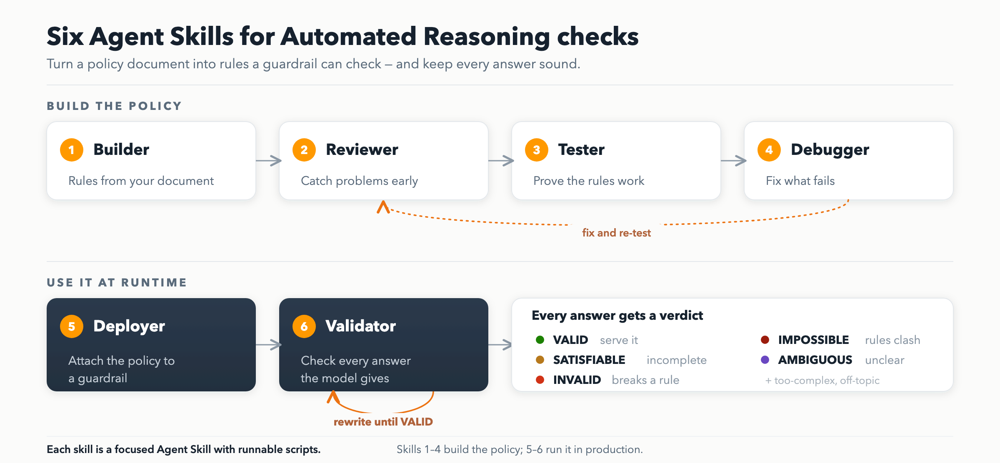
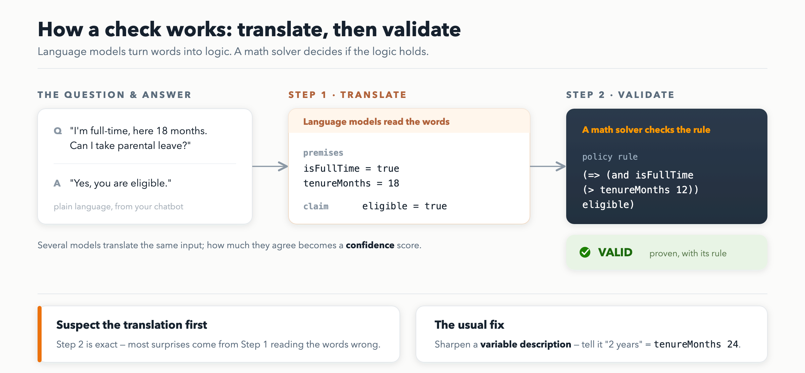
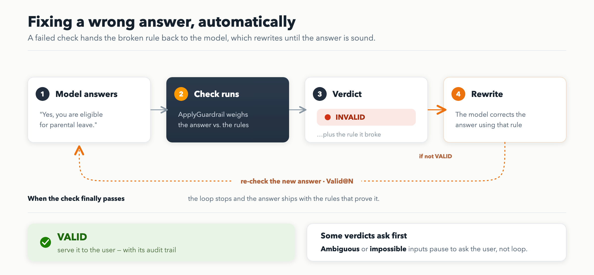
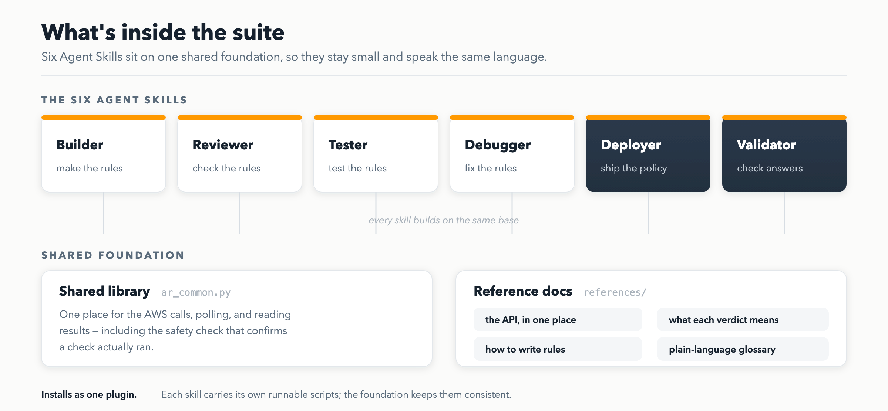

# Automated Reasoning Checks — Agent Skills

A suite of [Agent Skills](https://docs.claude.com/en/docs/claude-code/skills) for **Amazon Bedrock
Automated Reasoning (AR) checks** — the Bedrock Guardrails feature that uses formal logic + SMT solvers
to mathematically verify LLM outputs against an encoded policy.



The six skills cover the full AR lifecycle, in order:

| Skill | What it does |
|---|---|
| **ar-policy-builder** | Create a policy from a source document (`INGEST_CONTENT`), optionally LLM-preprocessing prose into rules first. |
| **ar-policy-reviewer** | Inspect the quality + fidelity reports; flag conflicting rules, bare assertions, unused/duplicate variables, low scores. |
| **ar-policy-tester** | Generate scenarios (rule correctness) and run QnA tests (translation accuracy). |
| **ar-policy-debugger** | Diagnose failures with the translate-vs-validate triage and repair via annotations / refinement. |
| **ar-guardrail-deployer** | Version the policy and attach it to a Bedrock Guardrail (with the required cross-region profile). |
| **ar-runtime-validator** | Validate answers with `ApplyGuardrail`/`Converse` and run an iterative rewrite loop (Valid@N). |

## How a check works

Every check runs in two steps: language models **translate** the question and answer into formal logic,
then an SMT solver **validates** that logic against your rules. The validation step is exact — so when a
result looks wrong, the translation is almost always the thing to fix.



## Fixing wrong answers at runtime

When a check fails, the rule the answer broke is handed back to the model, which rewrites and is
re-checked — repeating until the answer is `VALID` (this is the "Valid@N" loop).



## What's inside the suite



## Install

The portable core is the same everywhere — `skills/<skill>/SKILL.md` + its `scripts/`. Only the
manifest a host reads differs, so the suite ships several:

| Host | Manifest | Notes |
|---|---|---|
| **Claude Code** | `.claude-plugin/marketplace.json` | `/plugin marketplace add <repo>` then install. |
| **Codex** | `.codex-plugin/plugin.json` | Points at `skills/`. |
| **Cursor** | `.cursor-plugin/marketplace.json` + `plugin.json` | Points at `skills/`. |
| **Kiro** | `powers/<skill>/POWER.md` | Six Kiro Powers, generated from the skills. See below. |

**Using with Kiro (Powers).** Kiro consumes [Powers](https://kiro.dev/blog/introducing-powers/) — a
`POWER.md` per capability, keyword-activated, with bundled `steering/` files loaded on demand. The
`powers/` tree is **generated from the `SKILL.md` files** (the skills stay the source of truth):

```bash
uv run scripts/sync_powers.py        # regenerate powers/ from skills/ (run after editing a SKILL.md)
./install-powers.sh --global         # copy into ~/.kiro/powers  (or --local for ./.kiro/powers)
```

Then trigger by intent in Kiro, e.g. *"create an automated reasoning policy from this doc"* or *"my AR
test is failing."* Each Power's `references/` are copied to `steering/` and loaded via `readSteering`.
Use a large model (e.g. Sonnet 4.5) — AR reasoning needs it.

## Layout

```
.claude-plugin/marketplace.json   # Claude Code plugin manifest
.codex-plugin/plugin.json         # Codex manifest (same skills/ folder)
.cursor-plugin/                   # Cursor manifest (marketplace.json + plugin.json)
powers/<skill>/POWER.md           # Kiro Powers, generated from skills/ by scripts/sync_powers.py
install-powers.sh                 # copy powers/ into ~/.kiro/powers (or ./.kiro/powers)
shared/
  ar_common.py                    # boto3 clients, build poller, asset fetch, finding parser,
  references/                     #   the automatedReasoningPolicyUnits>0 guard, retry
    ar-api-context.md             # the authoritative API surface (every skill points here)
    findings-reference.md         # 7 result types: fields + recommended actions + severity
    smtlib-rules.md               # rule syntax, bare-assertion trap, modeling patterns
    glossary.md
skills/<skill>/SKILL.md           # one skill per lifecycle job
skills/<skill>/scripts/*.py       # runnable PEP-723 boto3 scripts (uv run; --help; --dry-run)
skills/<skill>/references/*.md     # skill-specific deep dives
RESEARCH_SUMMARY.md               # docs-authoritative AR reference (background)
SKILLS_PLAN.md                    # the design
```

## Using the scripts

Every script is a standalone [PEP 723](https://peps.python.org/pep-0723/) file — run with `uv`:

```bash
uv run skills/ar-policy-builder/scripts/create_policy.py --help
uv run skills/ar-policy-builder/scripts/create_policy.py --name MyPolicy --dry-run   # prints the request
```

- **`--dry-run`** prints the API request instead of calling AWS — use it to preview/validate offline.
- **`--region`** defaults to `us-east-1` (or `$AWS_REGION`).
- Live calls require AWS credentials with the relevant `bedrock:*` permissions (see `ar-api-context.md`).
- LLM-backed scripts (rule extraction, rewrite loop) use the **Converse** API.

## Typical end-to-end flow

```bash
P=skills/ar-policy-builder/scripts
R=skills/ar-policy-reviewer/scripts
T=skills/ar-policy-tester/scripts
D=skills/ar-guardrail-deployer/scripts
V=skills/ar-runtime-validator/scripts

uv run $P/create_policy.py --name MyHRPolicy --description "Leave eligibility"
uv run $P/build_from_document.py --policy-arn <ARN> --file leave.pdf --doc-name "Leave" --instructions "..."
uv run $R/audit_policy.py --policy-arn <ARN>
uv run $T/generate_scenarios.py --policy-arn <ARN>
uv run $T/run_tests.py --policy-arn <ARN>
uv run $D/create_version.py --policy-arn <ARN>
uv run $D/deploy_guardrail.py --policy-arn <ARN> --policy-version 1 --guardrail-name my-ar-guardrail
uv run $V/rewrite_loop.py --guardrail-id <ID> --guardrail-version 1 --question "..." --answer "..." --model-id <id>
```

## Status & caveats

**Live-tested** end-to-end against Amazon Bedrock in `us-east-1` (boto3 1.40.x): create → build →
review → version → deploy guardrail → `ApplyGuardrail` → rewrite loop, then full cleanup. Test cases
came back with correct `VALID`/`INVALID` verdicts. Lessons baked into the code:

- **`document` is a blob → pass raw bytes in boto3** (not base64; the CLI wants base64). A base64 string
  double-encodes and the build silently extracts **0 rules**.
- **Result assets nest under `response["buildWorkflowAssets"][<camelCaseKey>]`**, and not every asset
  exists for every build type (e.g. no `FIDELITY_REPORT` on `INGEST`/`REFINE` — run
  `GENERATE_FIDELITY_REPORT`). Helpers use `try_get_result_asset` + `asset_payload` to handle this.
- **API model varies by boto3 version.** Older models expose only 3 `buildWorkflowType`s and may name
  the test-case question param `query` (not `queryContent`), require `policies:[<versioned-arn>]` in the
  guardrail AR config, and reject `--force` on policy delete. Pin a recent `boto3` (the PEP-723 headers
  request `>=1.35`); on an older one, delete a policy's build workflows + versions before the policy.
- **Runtime translation ≠ test translation.** `ApplyGuardrail` may return `VALID` with the input sitting
  in `untranslatedPremises`/`untranslatedClaims` if the phrasing doesn't map to policy variables — i.e.
  nothing was actually checked. Treat untranslated content as a warning and tune variable descriptions.
- AR is GA in select Regions, **English (US) only**. Source documents: **≤ 5 MB / 50,000 characters**.
- Not for char-by-char validation (e.g. password rules) — use deterministic code there.
