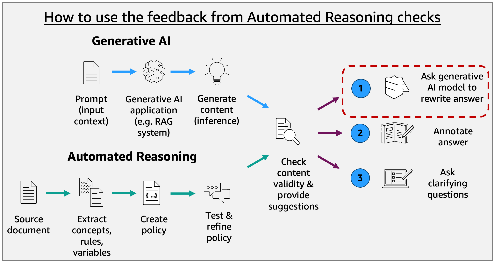

# Amazon Bedrock Automated Reasoning checks

## Introduction

Organizations deploying generative AI applications face a critical challenge in ensuring factual accuracy and preventing hallucinations in foundation model outputs. Unlike traditional testing approaches that sample outputs for quality, enterprises in regulated industries often need mathematical certainty that AI responses comply with established policies and domain knowledge.

Amazon Bedrock Automated Reasoning checks applies formal verification techniques to systematically validate AI outputs against encoded business rules and domain knowledge. This provides enterprises with high assurance and unambiguous validation of AI outputs through a framework that brings formal verification techniques to generative AI deployments.

This repository provides tools and utilities for working with Automated Reasoning checks in Amazon Bedrock Guardrails capabilities, helping you create, test, validate, and leverage logical reasoning in your guardrail policies to ensure LLM responses adhere to business rules and policies.


Automated Reasoning checks does not block content like a traditional guardrail. Instead, it provides feedback to steer an LLM towards a correct answer. Developers can use the feedback to iterate with an LLM to rewrite answers. **To implement feedback rewriting, see [Automated Reasoning Rewrite Playground](automated_reasoning_rewrite_playground.ipynb).**

## Overview

The tools in this repository demonstrate how to:

- Extract and interpret automated reasoning findings from guardrail responses
- Automatically rewrite non-compliant responses using different strategies based on finding types
- Test policies with real-world examples and use cases
- Run "Valid at N" experiments to determine how many iterations are needed to get valid responses

The sample medical policy included in the repository provides a concrete example of implementing automated reasoning checks in a healthcare context, showing how to encode medical guidelines as logical rules and validate LLM outputs against these constraints.

## Repository Structure

```
bedrock-automated-reasoning-checks/
├── response_rewriting_prompts/    # Templates for rewriting non-compliant responses
│   ├── ambiguity.md               # Template for handling ambiguous translations
│   ├── impossible.md              # Template for handling impossible statements
│   ├── invalid.md                 # Template for handling invalid responses
│   ├── no-translations.md         # Template for handling untranslatable content
│   └── satisfiable.md             # Template for handling satisfiable scenarios
├── uploads/                       # Sample policies and reference files
│   └── sample_medical_policy.pdf  # Example medical policy document
├── findings_utils.py              # Utilities to extract and format reasoning findings
├── policy_definition.py           # Tools for retrieving policy definitions
├── rewrite.py                     # Core response rewriting functionality
├── requirements.txt               # Python dependencies
└── Jupyter Notebooks:
    ├── automated_reasoning_guardrail_validation_playground.ipynb
    ├── automated_reasoning_policy_creator_playground.ipynb
    ├── automated_reasoning_rewrite_playground.ipynb
    ├── automated_reasoning_test_creator_playground.ipynb
    ├── automated_reasoning_valid_at_n_playground.ipynb
    └── automated_reasoning_policy_refinement.ipynb
```

## Interactive Notebooks

The repository includes five Jupyter notebooks that demonstrate different aspects of working with Automated Reasoning checks:

### automated_reasoning_guardrail_validation_playground.ipynb

**Primary notebook for testing and validating existing policies.** This notebook allows you to validate LLM responses against policies created either programmatically or through the AWS console. Key features:

- Connect to policies you've already created in your AWS account
- Test user query and LLM response pairs against your policies
- Visualize and interpret the automated reasoning findings
- Understand why specific responses pass or fail validation
- Works seamlessly with console-created policies

### automated_reasoning_policy_creator_playground.ipynb

Demonstrates how to programmatically create Automated Reasoning policies from source documents. Features:

- Extract logical rules and constraints from policy documents
- Define variables, types, and logical expressions
- Create and deploy policies programmatically
- Test policy creation with the sample medical document

### automated_reasoning_policy_refinement.ipynb

Demonstrates how to programmatically refine Automated Reasoning policies. Features:

- Analyse rules, variables and types and create an annotation to update them
- Generate scenarios from a created Automated Reasoning policy and test the scenario
- Apply annotations to the Automated Reasoning policy through the Policy Repair Asset
- Update the Automated Reasoning Policy with the updated one created through annotations

### automated_reasoning_rewrite_playground.ipynb

Shows how to automatically rewrite non-compliant LLM responses to align with policy requirements. Features:

- Process different types of reasoning findings
- Use specialized templates for each finding type
- Leverage foundation models to generate policy-compliant rewrites
- Compare original and rewritten responses

### automated_reasoning_test_creator_playground.ipynb

Helps you create comprehensive test suites for your policies. Features:

- Define test cases with expected outcomes
- Generate test scenarios from policy rules
- Create boundary condition tests
- Build regression test suites

### automated_reasoning_valid_at_n_playground.ipynb

Demonstrates how to measure policy effectiveness through iterative validation. Features:

- Track how many iterations are needed to get valid responses
- Compare different models and rewriting strategies
- Evaluate policy coverage and effectiveness
- Generate metrics for policy performance

## Finding Types and Rewriting Strategies

The repository includes tools to process the seven distinct finding types produced by Automated Reasoning checks:

1. **VALID**: Confirms that the output fully aligns with policy rules
2. **SATISFIABLE**: Recognizes responses that could be true or false depending on specific assumptions
3. **INVALID**: Identifies outputs with policy inaccuracies or factual errors
4. **IMPOSSIBLE**: Indicates when no valid claims can be generated due to logical contradictions
5. **NO_TRANSLATIONS**: Occurs when content cannot be translated into relevant data for policy evaluation
6. **TRANSLATION_AMBIGUOUS**: Identifies when ambiguity prevents definitive translation into logical structures
7. **TOO_COMPLEX**: Signals that the content contains too much information to process within limits

For each non-valid finding type, the rewriting system uses specialized prompt templates to guide foundation models in correcting responses to align with policy requirements.

## Getting Started

### Prerequisites

- AWS account with access to Amazon Bedrock
- Python 3.10 or higher
- AWS CLI configured
- Amazon Bedrock Guardrails enabled in your AWS account

### Installation

1. Clone this repository:
   ```
   git clone https://github.com/yourusername/bedrock-automated-reasoning-checks.git
   cd bedrock-automated-reasoning-checks
   ```

2. Install required dependencies:
   ```
   pip install -r requirements.txt
   ```

3. Set up your AWS credentials:
   ```
   aws configure
   ```

## Using the Medical Policy Example

The repository includes a sample medical policy document (`uploads/sample_medical_policy.pdf`) that demonstrates how to apply automated reasoning in a healthcare context. This example shows how to:

1. Extract medical guidelines and protocols from the policy document
2. Encode these as logical rules in an automated reasoning policy
3. Validate LLM responses against these medical guidelines
4. Automatically rewrite responses that don't align with medical best practices

To experiment with this example:

1. Open the `automated_reasoning_policy_creator_playground.ipynb` notebook
2. Follow the step-by-step guide to create a policy based on the sample medical document
3. Use the `automated_reasoning_policy_refinement.ipynb` notebook to edit definitions in the Automated Reasoning Policy
4. Use the `automated_reasoning_test_creator_playground.ipynb` notebook to create test cases
5. Use the `automated_reasoning_guardrail_validation_playground.ipynb` to validate responses against your policy
6. Explore the `automated_reasoning_rewrite_playground.ipynb` to see how non-compliant responses are rewritten

## Key Components

### findings_utils.py

This module extracts and formats automated reasoning findings from guardrail responses, providing human-readable explanations of logical evaluations. It handles all seven finding types and produces structured output for analysis or display.

### rewrite.py

Contains the core functionality for rewriting non-compliant responses based on different finding types using specialized templates from the `response_rewriting_prompts` directory.

### policy_definition.py

Provides utilities to retrieve policy definitions from your AWS account, making it easier to work with existing policies.

## Valid at N Experiments

The `automated_reasoning_valid_at_n_playground.ipynb` notebook demonstrates how to conduct "Valid at N" experiments, which:

1. Start with an initial LLM response
2. Apply automated reasoning checks
3. If not valid, rewrite the response
4. Repeat until a valid response is obtained
5. Track how many iterations (N) were required

This methodology helps measure the effectiveness of your policies and rewriting strategies across different models and domains.

## Workflow Integration

You can integrate these tools into your existing AI application workflows:

1. **Console-Created Policies**: Create policies through the AWS console and use the validation notebook to test them
2. **Programmatic Creation**: Use the policy creator notebook to programmatically build policies
3. **Validation Pipeline**: Incorporate the validation logic into your application's response generation pipeline
4. **Automated Rewriting**: Add automated rewriting to ensure responses always comply with your policies

## Resources

- [Amazon Bedrock Documentation](https://docs.aws.amazon.com/bedrock/)
- [Guardrails Documentation](https://docs.aws.amazon.com/bedrock/latest/userguide/guardrails.html)
- [Automated Reasoning in Guardrails](https://docs.aws.amazon.com/bedrock/latest/userguide/guardrails-automated-reasoning-checks.html)

## 📄 License

This project is licensed under the Apache License 2.0

## 🔄 Updates

This repository is actively maintained and updated with new capabilities and examples. Watch the repository to stay updated with the latest additions.