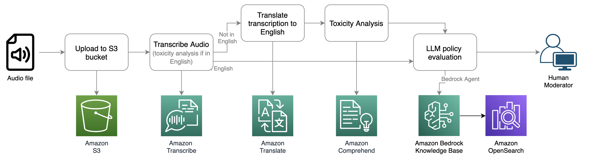
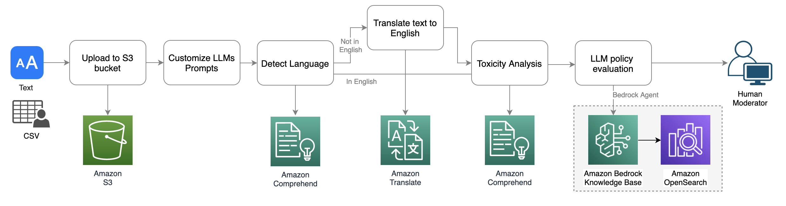

## Moderate Audio and Text Chats Using AWS AI Services and LLMs

!!! tip inline end "[Open in github](https://github.com/aws-samples/amazon-bedrock-samples/chat-moderation-example){:target="_blank"}"

## Overview

This runbook post explores how to implement real-time content moderation for audio and text chats using AWS AI services and Large Language Models (LLMs). We'll demonstrate a solution that can help maintain a safe and respectful online environment by detecting and moderating inappropriate content in both audio and text formats.

## Context

### The Challenge of Content Moderation

As online communication platforms continue to grow, ensuring a safe and respectful environment for users has become increasingly important. Content moderation is crucial for protecting users from harmful or inappropriate content, maintaining community standards, and complying with regulations.

### AWS AI Services for Content Moderation

AWS offers a range of AI services that can be leveraged for content moderation:

1. Amazon Transcribe: Converts speech to text
2. Amazon Comprehend: Analyzes text for sentiment and key phrases
3. Amazon Rekognition: Detects inappropriate imagery
4. Large Language Models (LLMs): Provide context-aware analysis and moderation

<h3>Solution Architecture</h3>

The proposed solution combines these services to create a comprehensive content moderation pipeline:

1. Audio input is transcribed using Amazon Transcribe
2. Transcribed text and original text chat are analyzed by Amazon Comprehend
3. LLMs are used for context-aware moderation
4. Results are aggregated and actions are taken based on predefined policies

### Audio moderation workflow
An audio moderation workflow could be initiated by a user reporting other users on a gaming platform for policy violations such as profanity, hate speech, or harassment. This represents a passive approach to audio moderation. A human moderator receives the report and must spend time investigating the conversation to determine if it violates platform policy. Alternatively, the workflow could be triggered proactively. For instance, in a social audio chat room, the system could record all conversations and apply analysis with low latency. Both passive and proactive approaches can trigger the pipeline below for audio analysis.

### Text moderation workflow
The text chat moderation workflow follows a similar pattern to audio moderation, but it utilizes Amazon Comprehend Toxicity Analysis, which is tailored for text moderation. The sample app supports an interface for uploading bulk text files in CSV or TXT format and provides a single-message interface for quick testing.

<h4>Benefits of this Approach</h4>
- Real-time moderation for both audio and text
- Scalable and customizable solution
- Leverages the strengths of multiple AI services
- Adaptable to different use cases and content policies

## Prerequisites

!!! info ""
    - AWS account with access to Amazon Transcribe, Amazon Comprehend, and Amazon Bedrock
    - Basic understanding of AWS services and serverless architecture
    - Familiarity with Python programming
    - Access to an LLM through Amazon Bedrock or another provider

## Setup

To implement this solution, follow these steps:

1. Set up an AWS account and configure the necessary permissions
2. Create an S3 bucket for storing audio files and transcripts
3. Set up an Amazon Comprehend custom classification model (optional)
4. Configure Amazon Bedrock or another LLM provider
5. Deploy the Lambda functions for processing audio and text

!!! tip "Security Best Practices"
    Ensure that you follow AWS security best practices, including the principle of least privilege when setting up IAM roles

## Notebook/Code with comments

Here's a simplified example of how to use Amazon Transcribe and Amazon Comprehend in a Lambda function:

The sample code for this post is available in this [Github](https://aws.amazon.com/blogs/machine-learning/moderate-audio-and-text-chats-using-aws-ai-services-and-llms/) repository

## Other Considerations / Advanced section / Best Practices

### Handling Multiple Languages

To support multiple languages, consider using Amazon Translate in your pipeline to first translate content to a common language for analysis.

### Customizing Moderation Policies

Use Amazon SageMaker to train custom models for more specific content moderation needs that go beyond the capabilities of pre-built services.

### Real-time vs. Batch Processing

Depending on your use case, you may need to implement both real-time moderation for live chats and batch processing for historical data or large volumes of content.

### Privacy and Data Handling

Ensure that your solution complies with relevant data protection regulations and implement appropriate data retention and deletion policies.

## Next Steps

1. Implement a front-end interface for your moderation system
2. Integrate the solution with your existing chat or communication platform
3. Set up monitoring and alerting for your moderation pipeline
4. Continuously refine and update your moderation policies based on user feedback and emerging trends

## Cleanup

To avoid ongoing charges, remember to clean up your AWS resources:

1. Delete any S3 buckets created for this solution
2. Terminate EC2 instances if any were used
3. Delete Lambda functions and API Gateway endpoints
4. Remove any custom models created in Amazon Comprehend or SageMaker

Read more about adding admonitions **[click here](https://squidfunk.github.io/mkdocs-material/reference/admonitions/)**

---

This blog post is referenced from this article: [Moderate audio and text chats using AWS AI services and LLMs](https://aws.amazon.com/blogs/machine-learning/moderate-audio-and-text-chats-using-aws-ai-services-and-llms/)
