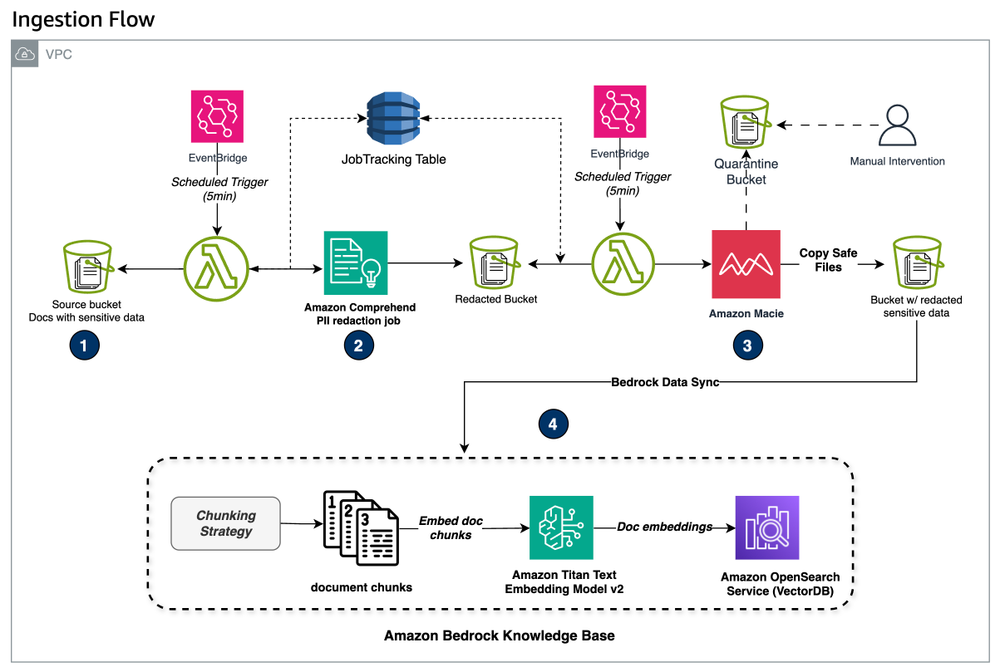

# Scenario 1 - Data identification and redaction before Ingestion to KnowledgeBase



In Scenario 1, documents flow through a series of carefully orchestrated steps:

1. Initial Document Upload (Step 1):
    - Users upload source documents containing sensitive data to an S3 bucket's "_inputs/_" folder
    - This triggers an automated data identification and redaction pipeline
2. Comprehend PII Redaction Process (Step 2):
    - ComprehendLambda, triggered by an EventBridge rule every 5 minutes:
      - Scans for new files in the "_inputs/_" folder
      - Moves detected files to a "processing/" folder
      - Initiates an async _Comprehend PII redaction analysis job_
      - Records the job ID and status in a DynamoDB JobTracking table
    - Comprehend automatically redacts sensitive elements like:
      - Names, addresses, phone numbers
      - Social security numbers, driver's license IDs
      - Banking information and credit card details
      - Comprehend replaces identified PlI entities with placeholder tokens (e.g., [NAME], [SSN])
      - Once complete, redacted files move to "for_macie_scan/" folder
3. Secondary Verification with Amazon Macie - Sensitive Data Detection (Step 3):
    - MacieLambda monitors Comprehend job completion
    - Upon successful completion, triggers a Macie one-time sensitive data detection job
    - Macie scans all files in the "for_macie_scan/" folder
    - Based on Macie findings:
       - Files with severity >= 3 (HIGH) move to "quarantine/" folder for human review
       - Files with severity < 3 (LOW) transfer to a "safe" bucket
4. Amazon Bedrock Knowledge Base Integration (Step 4):
   - Files in the "safe" bucket trigger an Amazon Bedrock knowledge base data ingestion job
   - Documents are securely indexed in the vector store
   - Ready for use in RAG applications

## Augmented Retrieval Flow


## Usage

### Step 1: Deploying CDK stack

#### Prerequisites

- Ensure you have completed all steps listed in the [Pre-requisites](../README.md#pre-requisites) section of the main [README.md](../README.md) file.
- **IMPORTANT:** Ensure [`synthetic_data.py`](./synthetic_data.py) script is run before this step. Refer to [Synthetic Data Generation Tool](../README.md#synthetic-data-generation-tool) section for info.
- Ensure Amazon Macie is enabled. Refer to [getting-started](https://docs.aws.amazon.com/macie/latest/user/getting-started.html) guide for more info.
- Install Docker desktop for custom CDK constructs.
  - [Install Docker desktop for windows](https://docs.docker.com/desktop/setup/install/windows-install/)
  - [Install Docker desktop for Mac](https://docs.docker.com/desktop/setup/install/mac-install/)
  - [Install Docker desktop for Linux](https://docs.docker.com/desktop/setup/install/linux/)

### Run shell script to deploy CDK app

Execute the `run_app.sh` script by switching into `scenario_1/` directory as root.

```shell
cd scenario_1/
chmod +x run_app.sh
./run_app.sh
```

Wait for the script to complete. After the script completes it should automatically launch the streamlit app at <http://localhost:8501/>

- Login using `jane@example.com` with password reset earlier.
- From the sidebar, select a model from the drop-down.
- Optionally, set model params like `temperature` and `top_p` values.
- Ask questions based on your data files in [data](../data/) folder.

Here are a few sample questions:

- What medications were recommended for _Chronic migraines_
- Typically what are recommended medications for _shortness of breath_
- List all patients with _Obesity_ as Symptom and the recommended medications
- What is the home address of _Nikhil Jayashankar_
- List all patients under _Institution Flores Group Medical Center_

>**NOTE:** The above questions are just for reference your datafiles may or may not contain information on the questions. Check your datafiles in [data](../data/) folder.

## Cleanup (Scenario 1)

Delete the stack.

>**NOTE:** The below command deletes all deployed resources including S3 buckets.

```shell
cd cdk
cdk destroy
```
