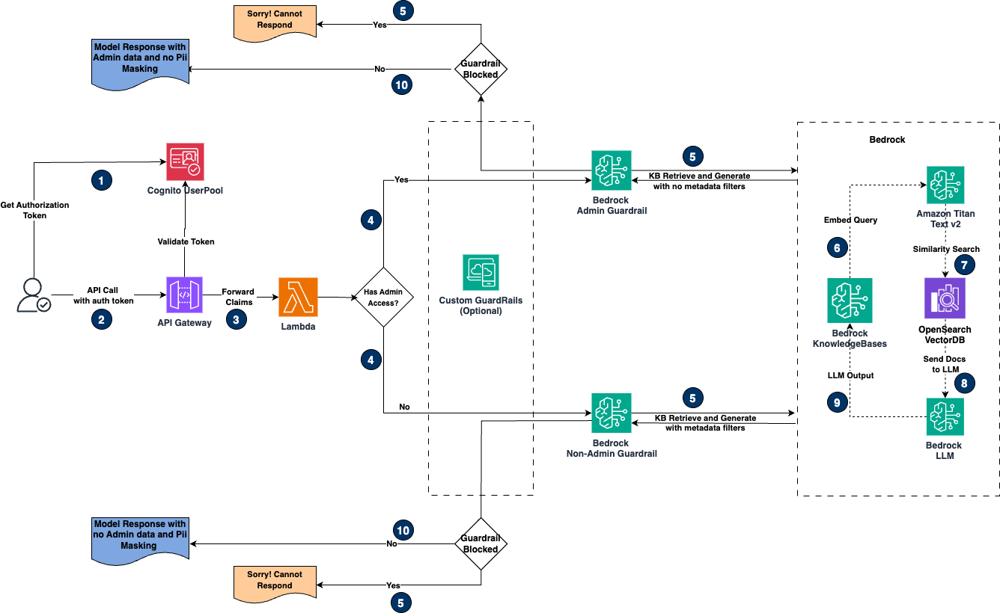

# Scenario 2 - Role-Based access to PII data during retrieval



## Architecture break-down

* Authentication Flow (Steps 1-3)
  * User initiates request by obtaining authorization token from Cognito User Pool
  * API call is made with authentication token to API Gateway
  * API Gateway forwards claims to AWS Lambda for processing
* Access Control Validation (Step 4)
  * System checks for admin access privileges
  * Request is routed to one of two paths based on user role:
    * Admin path: Uses admin-specific guardrails
    * Non-admin path: Implements stricter PII controls
* Knowledge Base Processing (Steps 5-8)
  * Query processing through Bedrock Knowledge Base includes:
    * Embedding generation using Amazon Titan
    * Similarity search via OpenSearch Vector DB
    * Application of metadata filters based on user role
  * Two distinct guardrail configurations process requests:
    * Admin Guardrail: Minimal PII restrictions
    * Non-Admin Guardrail: Enhanced PII protection
* Response Generation (Steps 9-10)
  * Bedrock LLM generates appropriate response
  * Guardrail validation check:
    * If blocked: Returns "Sorry! Cannot Respond" message
    * If passed: Returns role-appropriate response
      * Admin users receive full information
      * Non-admin users receive PII-masked information

---

## Usage

### Deploying CDK stack

Before running the next step:

- Ensure you have completed all steps listed in the [Pre-requisites](../README.md#pre-requisites) section of the main [README.md](../README.md) file.
- **IMPORTANT:** Ensure [`synthetic_data.py`](./synthetic_data.py) script is run before this step. Refer to [Synthetic Data Generation Tool](../README.md#synthetic-data-generation-tool) section for info.
- Install Docker desktop for custom CDK constructs.
  - [Install Docker desktop for windows](https://docs.docker.com/desktop/setup/install/windows-install/)
  - [Install Docker desktop for Mac](https://docs.docker.com/desktop/setup/install/mac-install/)
  - [Install Docker desktop for Linux](https://docs.docker.com/desktop/setup/install/linux/)
- Ensure Docker desktop is up and running.

#### Run shell script to deploy CDK app

Execute the [`run_app.sh`](./run_app.sh) bash script by switching into `scenario_2/` directory.

```shell
[ "${PWD##*/}" = "scenario_1" ] && cd ..
cd scenario_2/
chmod +x run_app.sh
./run_app.sh
```

Wait for the script to complete. After the script completes it should automatically launch the streamlit app at <http://localhost:8501/>

- Login using `jane@example.com` for Admin access or `john@example.com` for Non-Admin access with password reset earlier.
- From the sidebar, select a model from the drop-down.
- Optionally, set model params like `temperature` and `top_p` values.
- Ask questions based on your data files in [data](../data/) folder.

Here are a few sample questions:

```text
- List all patients with Obesity as Symptom and the recommended medications
- Which patients are currently taking Furosemide and Atorvastatin medications
- Generate a list of all patient names and a summary of their symptoms
- List all patients under Institution Flores Group Medical Center
```

>**NOTE:** The above questions are just for reference your datafiles may or may not contain information on the questions. Check your datafiles in [data](../data/) folder.

### Scenario 2 Cleanup

Delete all cdk deployed resources.

>**NOTE:** The below command deletes all deployed resources including S3 buckets.

```shell
cd cdk
cdk destroy
```
